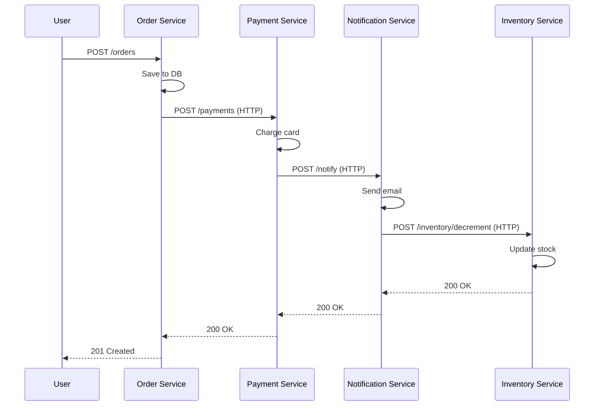
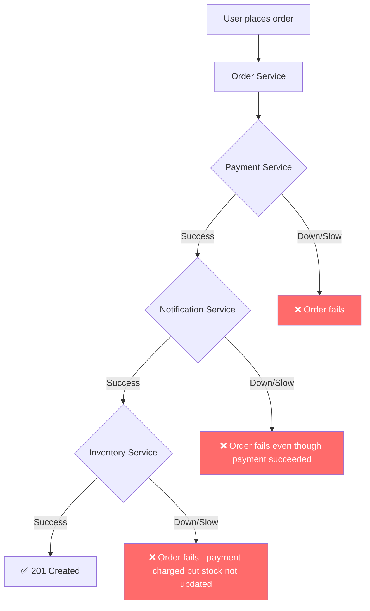

# Phase 0 — The Pre-Kafka Pain

## The Problem

You have an order processing system. When a user places an order:

1. The **Order Service** saves the order to a database
2. It calls the **Payment Service** synchronously over HTTP
3. The Payment Service calls the **Notification Service** to send a confirmation email
4. The Notification Service calls the **Inventory Service** to decrement stock

Everything is synchronous. Every service call blocks. The user waits for the entire chain to complete.

## Why We're Building This First

You can't appreciate Kafka until you feel the pain of not having it. This phase builds the naive version so you can watch it fail.

## Architecture (The Naive Way)

The user waits for the **entire chain** to finish. Every service is a single point of failure.

## What Breaks

### Failure Scenario 1: Notification Service is Down

The payment already went through. The user got charged. But because the notification service is down, the entire chain fails. The order API returns 500. The user tries again. Gets charged twice.

### Failure Scenario 2: Inventory Service is Slow

The inventory database is under heavy load. Response time goes from 50ms to 5 seconds. The entire order flow now takes 5+ seconds because every call is synchronous and blocking.

### Failure Scenario 3: Cascading Failures

Payment Service is slow. Order Service starts queuing up requests. Thread pool fills up. New orders start timing out. The entire system is down — because one downstream service was slow.

### Failure Scenario 4: Deployment Breaks the Chain

You deploy a new version of the Notification Service that changes its API contract. Payment Service doesn't know. Calls fail. Orders fail.

## The Fundamental Issues

| Issue | Why It Hurts |
|-------|-------------|
| **Temporal coupling** | Every service must be up *right now* |
| **Cascading latency** | Total latency = sum of all service latencies |
| **Cascading failure** | One slow service kills the whole chain |
| **No retry safety** | Retrying means duplicate payments |
| **No replay** | If Notification was down, those events are lost forever |
| **Tight API coupling** | Changing one service's API breaks the caller |

## Code

Build this yourself. Feel the pain.

- [TypeScript Implementation](ts-implementation.md)
- [Go Implementation](go-implementation.md)

## What's Next

In [Phase 1](../phase-01-log-basics/README.md), we break this chain. Instead of services calling each other directly, the Order Service writes an event to Kafka. Other services consume it whenever they're ready.

No more temporal coupling. No more cascading failures. Just an append-only log.
