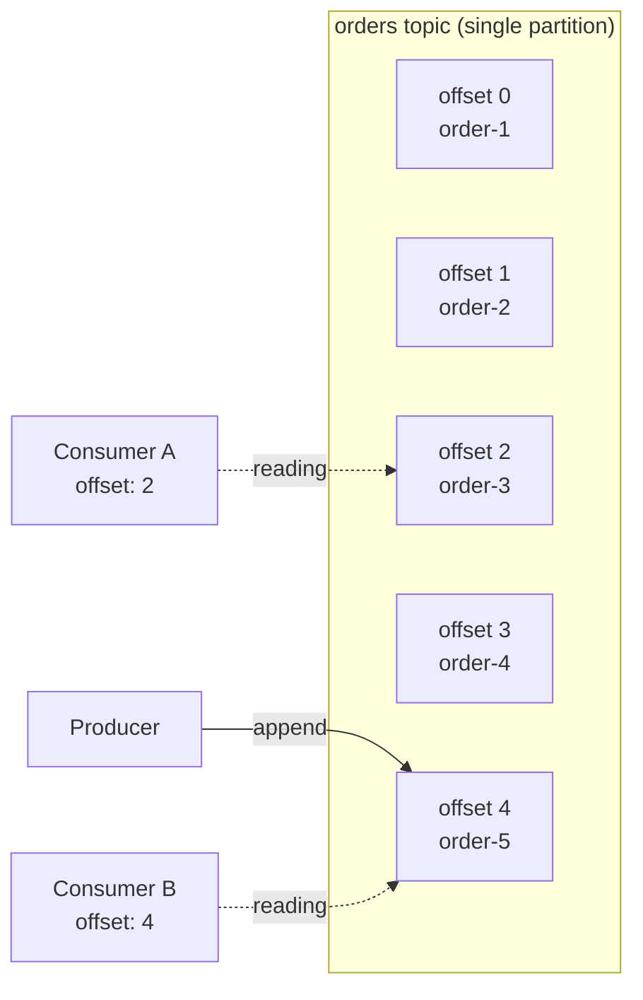
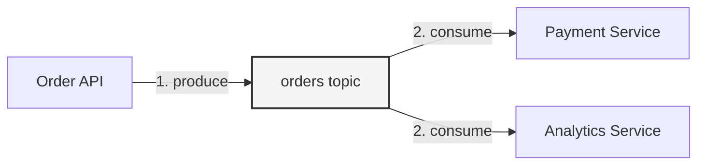
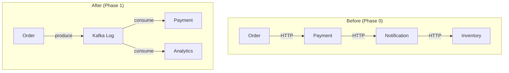

# Phase 1 — Kafka as a Log

## The Problem We're Solving

In Phase 0, we built a synchronous chain: Order → Payment → Notification → Inventory. Every service had to be up, fast, and compatible for the chain to work.

The core issue: **temporal coupling**. The Order Service needs the Payment Service to be alive *right now*.

## The Shift

What if the Order Service didn't call the Payment Service at all?

What if it just wrote down: *"An order happened"* — and the Payment Service picked it up whenever it was ready?

That's Kafka. It's not a message queue. It's an **append-only log**.

## Kafka Concepts Introduced

### The Append-Only Log

Kafka stores messages in an ordered, immutable, append-only log. Think of it like a file you can only append to, and anyone can read from any position.



Key properties:
- **Messages are never deleted** (until retention expires)
- **Messages are ordered** within a partition
- **Each message gets an offset** — a sequential ID
- **Consumers track their own position** — they choose where to read from
- **Multiple consumers can read the same data** independently

### Topics

A topic is a named log. Think of it as a category of events.

```
orders     → all order events go here
payments   → all payment events go here
```

### Offsets

An offset is just a number. It's the position of a message in the log.

- **Offset 0** is the first message ever written
- **Offset 47** is the 48th message
- Each consumer tracks which offset it has processed

This is why Kafka enables **replay**: you can always set a consumer back to offset 0 and reprocess everything.

## New Architecture



The Order Service doesn't know (or care) who is listening. It writes to the log. Done.

The Payment Service reads from the log at its own pace. If it's down for 5 minutes, it catches up when it comes back.

## What Changed (Before vs After)



Notice:
- **No direct service-to-service calls** for the initial event
- **Adding a new consumer** doesn't require changing the producer
- **Services are decoupled in time** — they don't need to be alive simultaneously

## Code

- [TypeScript Implementation](ts-implementation.md)
- [Go Implementation](go-implementation.md)

## What Breaks If Misused

| Mistake | What Happens |
|---------|-------------|
| Treating Kafka like a queue | You delete messages after reading. Kafka doesn't work that way. Messages stay. |
| Producing without a key | Messages go to random partitions. Ordering per entity is lost. (We fix this in Phase 2.) |
| Ignoring offsets | Consumer restarts and re-reads everything from the beginning. Duplicate processing. |
| Assuming delivery order = production order | With multiple partitions, ordering is only guaranteed *within* a partition. (Phase 2.) |

## What's Next

In [Phase 2](../phase-02-partitions/README.md), we add partitions — because a single log doesn't scale.
