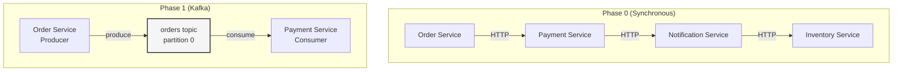

# Phase 1 — Go Implementation

## Setup

```bash
mkdir -p phase-01-log-basics/go
cd phase-01-log-basics/go
go mod init order-pipeline
go get github.com/segmentio/kafka-go
```

### File Structure

```
go/
├── cmd/
│   ├── producer/main.go
│   ├── consumer/main.go
│   └── replay/main.go
├── go.mod
└── go.sum
```

We use `segmentio/kafka-go` — a pure Go Kafka client with no CGo dependencies. Clean, idiomatic, well-maintained.

---

## `cmd/producer/main.go` — The Order Service

```go
package main

import (
	"bufio"
	"context"
	"encoding/json"
	"fmt"
	"log"
	"os"
	"strconv"
	"strings"
	"time"

	"github.com/google/uuid"
	"github.com/segmentio/kafka-go"
)

type OrderEvent struct {
	OrderID   string  `json:"orderId"`
	UserID    string  `json:"userId"`
	ItemID    string  `json:"itemId"`
	Quantity  int     `json:"quantity"`
	Amount    float64 `json:"amount"`
	Timestamp string  `json:"timestamp"`
}

func main() {
	// Create a writer (producer)
	writer := &kafka.Writer{
		Addr:     kafka.TCP("localhost:9092"),
		Topic:    "orders",
		Balancer: &kafka.LeastBytes{},
	}
	defer writer.Close()

	log.Println("[Producer] Connected to Kafka")
	log.Println("[Producer] Type orders in format: userId itemId quantity amount")
	log.Println("[Producer] Example: user-1 ITEM-001 2 49.99")
	log.Println("[Producer] Press Ctrl+C to exit")
	fmt.Println()

	scanner := bufio.NewScanner(os.Stdin)
	for scanner.Scan() {
		line := strings.TrimSpace(scanner.Text())
		parts := strings.Fields(line)
		if len(parts) != 4 {
			log.Println("Usage: userId itemId quantity amount")
			continue
		}

		quantity, err := strconv.Atoi(parts[2])
		if err != nil {
			log.Printf("Invalid quantity: %s", parts[2])
			continue
		}

		amount, err := strconv.ParseFloat(parts[3], 64)
		if err != nil {
			log.Printf("Invalid amount: %s", parts[3])
			continue
		}

		order := OrderEvent{
			OrderID:   fmt.Sprintf("ORD-%s", uuid.New().String()[:8]),
			UserID:    parts[0],
			ItemID:    parts[1],
			Quantity:  quantity,
			Amount:    amount,
			Timestamp: time.Now().UTC().Format(time.RFC3339),
		}

		value, _ := json.Marshal(order)

		log.Printf("[Producer] Producing order: %s", string(value))

		err = writer.WriteMessages(context.Background(), kafka.Message{
			// No key yet — we add keys in Phase 2
			Value: value,
		})
		if err != nil {
			log.Printf("[Producer] ❌ Failed to produce: %v", err)
			continue
		}

		log.Printf("[Producer] ✅ Order %s sent", order.OrderID)
	}
}
```

### Differences from TypeScript

- **No `send()` result with partition/offset.** The `kafka-go` Writer doesn't return offset metadata by default. For simple cases, the write succeeds or fails. (The Reader-based approach can give you more control.)
- **`kafka.Writer` vs `kafka.Producer`.** `kafka-go` calls it a `Writer`, not a `Producer`. Same concept.
- **Blocking I/O in a goroutine-per-line model.** Go's scanner blocks on each line naturally — no need for readline callbacks.

---

## `cmd/consumer/main.go` — The Payment Service

```go
package main

import (
	"context"
	"encoding/json"
	"fmt"
	"log"
	"os"
	"os/signal"
	"strings"
	"syscall"
	"time"

	"github.com/segmentio/kafka-go"
)

type OrderEvent struct {
	OrderID   string  `json:"orderId"`
	UserID    string  `json:"userId"`
	ItemID    string  `json:"itemId"`
	Quantity  int     `json:"quantity"`
	Amount    float64 `json:"amount"`
	Timestamp string  `json:"timestamp"`
}

func main() {
	// Create a reader (consumer) with a consumer group
	reader := kafka.NewReader(kafka.ReaderConfig{
		Brokers:  []string{"localhost:9092"},
		Topic:    "orders",
		GroupID:  "payment-group", // Consumer group — more in Phase 3
		MinBytes: 1,              // Fetch as soon as 1 byte is available
		MaxBytes: 10e6,           // 10 MB max per fetch
	})
	defer reader.Close()

	log.Println("[Consumer] Connected to Kafka")
	log.Println("[Consumer] Subscribed to 'orders' topic (group: payment-group)")
	log.Println("[Consumer] Waiting for messages...")
	fmt.Println()

	// Graceful shutdown
	ctx, cancel := context.WithCancel(context.Background())
	sigChan := make(chan os.Signal, 1)
	signal.Notify(sigChan, syscall.SIGINT, syscall.SIGTERM)
	go func() {
		<-sigChan
		log.Println("\n[Consumer] Shutting down...")
		cancel()
	}()

	for {
		msg, err := reader.ReadMessage(ctx)
		if err != nil {
			if ctx.Err() != nil {
				break // Context cancelled — clean shutdown
			}
			log.Printf("[Consumer] ❌ Error reading message: %v", err)
			continue
		}

		var order OrderEvent
		if err := json.Unmarshal(msg.Value, &order); err != nil {
			log.Printf("[Consumer] ❌ Failed to parse message at offset %d: %v", msg.Offset, err)
			continue
		}

		fmt.Println(strings.Repeat("─", 50))
		log.Println("[Consumer] Processing message:")
		log.Printf("  Topic:     %s", msg.Topic)
		log.Printf("  Partition: %d", msg.Partition)
		log.Printf("  Offset:    %d", msg.Offset)
		log.Printf("  Order:     %s", order.OrderID)
		log.Printf("  User:      %s", order.UserID)
		log.Printf("  Item:      %s x%d", order.ItemID, order.Quantity)
		log.Printf("  Amount:    $%.2f", order.Amount)
		log.Printf("  Time:      %s", order.Timestamp)

		// Simulate payment processing
		time.Sleep(200 * time.Millisecond)

		log.Printf("[Consumer] 💳 Payment processed for order %s", order.OrderID)
		fmt.Println(strings.Repeat("─", 50))
	}

	log.Println("[Consumer] Shutdown complete")
}
```

### Key Design Decisions

- **`reader.ReadMessage(ctx)`** — This reads AND commits the offset in one call. Simple but has implications: if your process crashes after the offset is committed but before you finish processing, you lose that message. We address this in Phase 3 with manual commits.
- **Graceful shutdown** — We catch SIGINT/SIGTERM and cancel the context. This lets the reader close cleanly and commit its final offset.
- **`GroupID: "payment-group"`** — This assigns the consumer to a group. Kafka tracks the committed offset for this group. Restart the consumer and it picks up where it left off.

---

## `cmd/replay/main.go` — The Replay Demo

```go
package main

import (
	"context"
	"encoding/json"
	"fmt"
	"log"
	"os"
	"os/signal"
	"syscall"

	"github.com/segmentio/kafka-go"
)

type OrderEvent struct {
	OrderID   string  `json:"orderId"`
	UserID    string  `json:"userId"`
	ItemID    string  `json:"itemId"`
	Quantity  int     `json:"quantity"`
	Amount    float64 `json:"amount"`
	Timestamp string  `json:"timestamp"`
}

func main() {
	// Use a DIFFERENT group ID — so it has its own offset tracking
	// Or use no GroupID and set explicit offsets
	reader := kafka.NewReader(kafka.ReaderConfig{
		Brokers:  []string{"localhost:9092"},
		Topic:    "orders",
		GroupID:  "replay-group", // Different group = independent offsets
		MinBytes: 1,
		MaxBytes: 10e6,
	})
	defer reader.Close()

	log.Println("[Replay] Starting replay from the beginning of the log...")
	fmt.Println()

	ctx, cancel := context.WithCancel(context.Background())
	sigChan := make(chan os.Signal, 1)
	signal.Notify(sigChan, syscall.SIGINT, syscall.SIGTERM)
	go func() {
		<-sigChan
		cancel()
	}()

	count := 0
	for {
		msg, err := reader.ReadMessage(ctx)
		if err != nil {
			if ctx.Err() != nil {
				break
			}
			log.Printf("[Replay] Error: %v", err)
			continue
		}

		count++
		var order OrderEvent
		json.Unmarshal(msg.Value, &order)

		log.Printf("[Replay] #%d | offset=%d | order=%s | user=%s | $%.2f | %s",
			count, msg.Offset, order.OrderID, order.UserID, order.Amount, order.Timestamp)
	}

	log.Printf("[Replay] Replayed %d messages", count)
}
```

---

## Idiomatic Differences: TypeScript vs Go

| Aspect | TypeScript (kafkajs) | Go (kafka-go) |
|--------|---------------------|---------------|
| **Producer** | `producer.send()` returns metadata (partition, offset) | `writer.WriteMessages()` returns only error |
| **Consumer** | Callback-based: `consumer.run({ eachMessage })` | Loop-based: `reader.ReadMessage(ctx)` in a for loop |
| **Concurrency** | Single-threaded event loop. Async/await. | Goroutines. Blocking I/O is fine. |
| **Offset commit** | Automatic by default (configurable) | `ReadMessage` commits. `FetchMessage` doesn't. |
| **Shutdown** | Process exit. Disconnect in `finally`. | Context cancellation + signal handling. |
| **Error model** | Exceptions / Promise rejections | Return values: `msg, err := ...` |

The Go version is more explicit about lifecycle management. You handle signals, cancel contexts, and close readers. In TypeScript, the event loop and `kafkajs` handle much of this implicitly.

Both approaches are valid. Go's explicitness makes it easier to reason about in production — you know exactly what's happening.

---

## Running the Demo

Same as the TypeScript version, but with `go run`:

```bash
# Terminal 1: Consumer
go run cmd/consumer/main.go

# Terminal 2: Producer
go run cmd/producer/main.go
# Type: user-1 ITEM-001 2 49.99

# Terminal 3: Replay
go run cmd/replay/main.go
```

### Test Crash Recovery

1. Kill the consumer (Ctrl+C — it commits offsets on shutdown)
2. Produce 3 more orders
3. Restart the consumer
4. It processes ONLY the 3 new orders

### Test Replay

1. After the consumer has processed everything
2. Start the replay consumer
3. It reads ALL messages from offset 0

---

## What We've Built So Far



We've decoupled the Order Service from the Payment Service. But we only have 1 partition — which means we can only have 1 active consumer. That doesn't scale.

→ Next: [Phase 2 — Partitioning & Scale](../phase-02-partitions/README.md)
