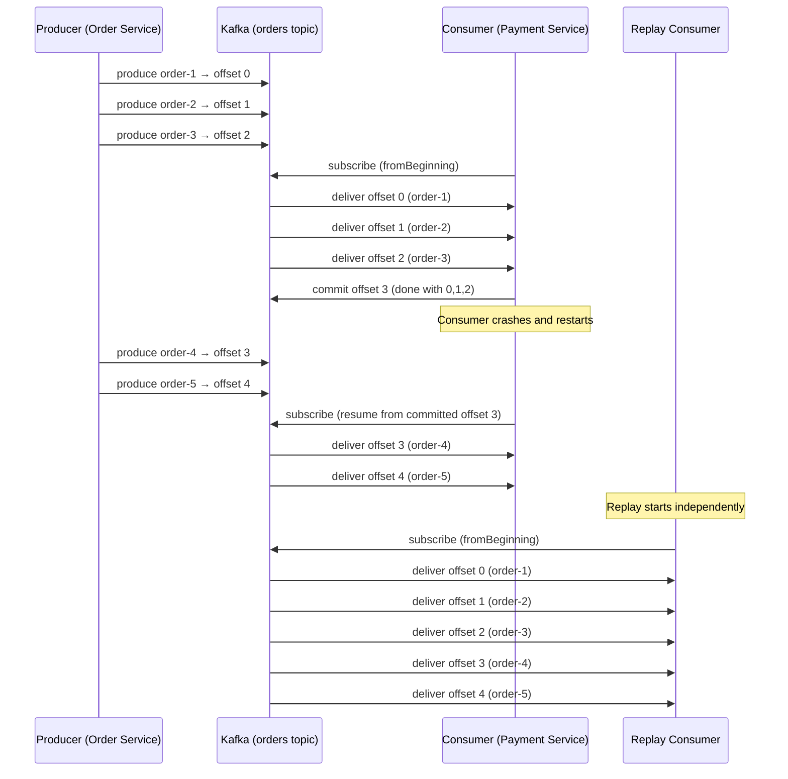

# Phase 1 — TypeScript Implementation

## Setup

```bash
mkdir -p phase-01-log-basics/ts
cd phase-01-log-basics/ts
npm init -y
npm install kafkajs
npm install -D typescript @types/node ts-node
npx tsc --init
```

`tsconfig.json`:
```json
{
  "compilerOptions": {
    "target": "ES2022",
    "module": "commonjs",
    "outDir": "./dist",
    "rootDir": "./src",
    "strict": true,
    "esModuleInterop": true
  }
}
```

### File Structure

```
ts/
├── src/
│   ├── producer.ts        ← Order Service (writes to Kafka)
│   ├── consumer.ts        ← Payment Service (reads from Kafka)
│   └── replay-consumer.ts ← Demonstrates replay from any offset
├── package.json
└── tsconfig.json
```

---

## Start Kafka

Make sure your Kafka cluster is running (from the root `docker-compose.yml`):

```bash
cd /path/to/Kafka
docker compose up -d
```

Create the topic:

```bash
docker exec -it kafka kafka-topics \
  --bootstrap-server localhost:9092 \
  --create --topic orders \
  --partitions 1 --replication-factor 1
```

We use **1 partition** intentionally. This keeps ordering simple. We add partitions in Phase 2.

---

## `src/producer.ts` — The Order Service

The Order Service is now just a producer. It saves the order to a local store and writes an event to Kafka. No HTTP calls to downstream services.

```typescript
import { Kafka, CompressionTypes } from "kafkajs";
import crypto from "crypto";
import readline from "readline";

const kafka = new Kafka({
  clientId: "order-service",
  brokers: ["localhost:9092"],
});

const producer = kafka.producer();

interface OrderEvent {
  orderId: string;
  userId: string;
  itemId: string;
  quantity: number;
  amount: number;
  timestamp: string;
}

async function produceOrder(order: OrderEvent): Promise<void> {
  const result = await producer.send({
    topic: "orders",
    messages: [
      {
        // No key yet — messages go to partition 0 (we only have 1)
        // We'll add keys in Phase 2
        value: JSON.stringify(order),
      },
    ],
  });

  const metadata = result[0];
  console.log(
    `[Producer] ✅ Order ${order.orderId} sent to partition ${metadata.partition}, offset ${metadata.baseOffset}`
  );
}

async function main(): Promise<void> {
  await producer.connect();
  console.log("[Producer] Connected to Kafka");
  console.log("[Producer] Type orders in format: userId itemId quantity amount");
  console.log("[Producer] Example: user-1 ITEM-001 2 49.99");
  console.log("[Producer] Press Ctrl+C to exit\n");

  const rl = readline.createInterface({
    input: process.stdin,
    output: process.stdout,
  });

  rl.on("line", async (line: string) => {
    const parts = line.trim().split(/\s+/);
    if (parts.length !== 4) {
      console.log("Usage: userId itemId quantity amount");
      return;
    }

    const [userId, itemId, quantityStr, amountStr] = parts;
    const order: OrderEvent = {
      orderId: `ORD-${crypto.randomUUID().slice(0, 8)}`,
      userId,
      itemId,
      quantity: parseInt(quantityStr, 10),
      amount: parseFloat(amountStr),
      timestamp: new Date().toISOString(),
    };

    console.log(`[Producer] Producing order: ${JSON.stringify(order)}`);
    await produceOrder(order);
  });

  rl.on("close", async () => {
    await producer.disconnect();
    process.exit(0);
  });
}

main().catch(console.error);
```

---

## `src/consumer.ts` — The Payment Service

The Payment Service is now a consumer. It reads from the `orders` topic and processes each order independently. No HTTP server. No waiting for downstream services.

```typescript
import { Kafka, EachMessagePayload } from "kafkajs";

const kafka = new Kafka({
  clientId: "payment-service",
  brokers: ["localhost:9092"],
});

// We use a consumer group — more on this in Phase 3
const consumer = kafka.consumer({ groupId: "payment-group" });

async function processOrder(payload: EachMessagePayload): Promise<void> {
  const { topic, partition, message } = payload;
  const offset = message.offset;
  const value = message.value?.toString();

  if (!value) {
    console.log(`[Consumer] Empty message at offset ${offset}, skipping`);
    return;
  }

  const order = JSON.parse(value);

  console.log(`\n${"─".repeat(50)}`);
  console.log(`[Consumer] Processing message:`);
  console.log(`  Topic:     ${topic}`);
  console.log(`  Partition: ${partition}`);
  console.log(`  Offset:    ${offset}`);
  console.log(`  Order:     ${order.orderId}`);
  console.log(`  User:      ${order.userId}`);
  console.log(`  Item:      ${order.itemId} x${order.quantity}`);
  console.log(`  Amount:    $${order.amount}`);
  console.log(`  Time:      ${order.timestamp}`);

  // Simulate payment processing
  await new Promise((resolve) => setTimeout(resolve, 200));

  console.log(`[Consumer] 💳 Payment processed for order ${order.orderId}`);
  console.log(`${"─".repeat(50)}`);
}

async function main(): Promise<void> {
  await consumer.connect();
  console.log("[Consumer] Connected to Kafka");

  await consumer.subscribe({ topic: "orders", fromBeginning: true });
  console.log("[Consumer] Subscribed to 'orders' topic");
  console.log("[Consumer] Waiting for messages...\n");

  await consumer.run({
    eachMessage: processOrder,
  });
}

main().catch(console.error);
```

### Key Observation: `fromBeginning: true`

When this consumer starts for the first time, it reads from offset 0 — the very beginning of the log. If you've already produced 10 orders, it will process all 10 when it first starts.

On subsequent restarts (with the same `groupId`), it picks up where it left off. This is offset tracking — Kafka remembers where each consumer group has read to.

---

## `src/replay-consumer.ts` — The Replay Demo

This is the killer feature. A consumer that can jump to any point in the log and re-read messages.

```typescript
import { Kafka } from "kafkajs";

const kafka = new Kafka({
  clientId: "replay-consumer",
  brokers: ["localhost:9092"],
});

// Different group ID — so it has its own offset tracking
const consumer = kafka.consumer({ groupId: "replay-group" });

async function main(): Promise<void> {
  await consumer.connect();

  // Subscribe from the beginning — replay everything
  await consumer.subscribe({ topic: "orders", fromBeginning: true });

  console.log("[Replay] Starting replay from the beginning of the log...\n");

  let count = 0;

  await consumer.run({
    eachMessage: async ({ topic, partition, message }) => {
      count++;
      const order = JSON.parse(message.value!.toString());

      console.log(
        `[Replay] #${count} | offset=${message.offset} | ` +
        `order=${order.orderId} | user=${order.userId} | ` +
        `$${order.amount} | ${order.timestamp}`
      );
    },
  });
}

main().catch(console.error);
```

### What This Demonstrates

1. **Messages are not deleted after consumption.** The `payment-group` consumer already read these messages, but `replay-group` can read them again.
2. **Each consumer group has independent offsets.** They don't interfere with each other.
3. **You can always go back.** Set `fromBeginning: true` and you get the entire history.

This is why Kafka is *not* a queue. In a queue (like RabbitMQ), once a message is consumed, it's gone. In Kafka, messages persist until retention expires.

---

## Running the Demo

### Terminal 1: Start the Consumer

```bash
npx ts-node src/consumer.ts
```

You should see:
```
[Consumer] Connected to Kafka
[Consumer] Subscribed to 'orders' topic
[Consumer] Waiting for messages...
```

### Terminal 2: Start the Producer

```bash
npx ts-node src/producer.ts
```

Type some orders:
```
user-1 ITEM-001 2 49.99
user-2 ITEM-002 1 29.99
user-3 ITEM-001 5 124.95
```

Watch the consumer terminal — each order appears with its partition and offset.

### Terminal 3: Replay

```bash
npx ts-node src/replay-consumer.ts
```

This consumer replays ALL messages from offset 0. Even though the payment consumer already processed them.

### The Killer Test: Consumer Crash Recovery

1. Stop the consumer (Ctrl+C)
2. Produce 3 more orders in the producer
3. Restart the consumer

The consumer **picks up exactly where it left off**. It processes only the 3 new orders, not the ones it already handled.

This is the fundamental shift: consumers are **pull-based** and **track their own position**.

---

## Verify with CLI

```bash
# See the topic
docker exec -it kafka kafka-topics \
  --bootstrap-server localhost:9092 \
  --describe --topic orders

# Read all messages
docker exec -it kafka kafka-console-consumer \
  --bootstrap-server localhost:9092 \
  --topic orders --from-beginning \
  --property print.offset=true \
  --property print.timestamp=true

# Check consumer group status
docker exec -it kafka kafka-consumer-groups \
  --bootstrap-server localhost:9092 \
  --describe --group payment-group
```

The `--describe --group` output shows you:
- Which partition each consumer is assigned to
- Current offset (where the consumer has read to)
- Log end offset (latest message in the partition)
- **Lag** (how far behind the consumer is)

---

## Message Flow Diagram



→ Next: [Phase 1 — Go Implementation](go-implementation.md)
