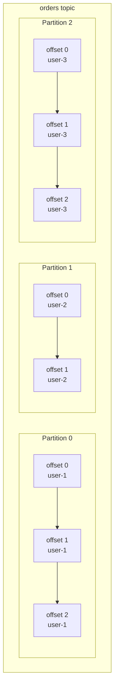
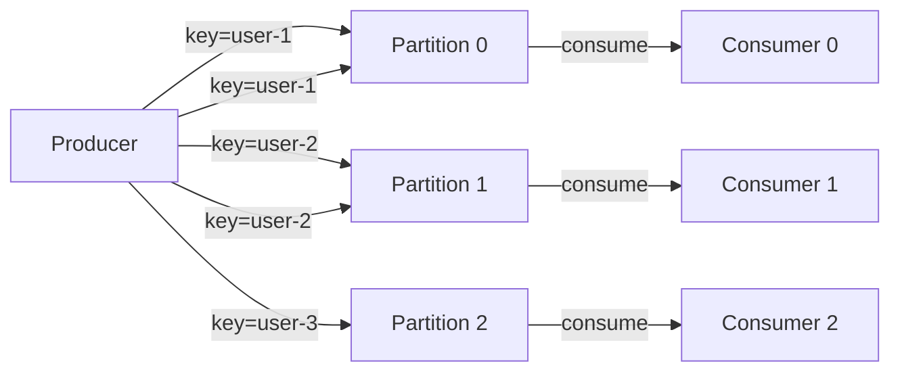
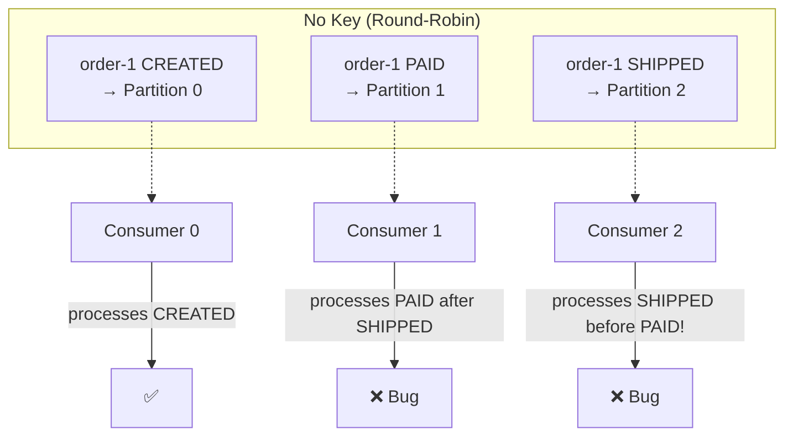

# Phase 2 — Partitioning & Scale

## The Problem We're Solving

In Phase 1, we have one topic with one partition. One consumer reads everything sequentially. This works for low throughput, but what happens when we need to process 10,000 orders per second?

A single consumer can't keep up. We need parallelism.

But we also need **ordering guarantees**: all events for the same order must be processed in sequence. Order-created before order-paid before order-shipped.

These two requirements are in tension. Parallelism breaks ordering. Partitioning is the mechanism that resolves this tension.

## Kafka Concepts Introduced

### Partitions

A topic is split into one or more partitions. Each partition is an independent, ordered, append-only log.

Key properties:
- **Ordering is guaranteed within a partition**, not across partitions
- **Each partition can be consumed by a different consumer** — this is how you parallelize
- **Partitions are the unit of parallelism** — you can't have more active consumers than partitions

### Message Keys

How does Kafka decide which partition a message goes to?

- **No key:** Round-robin across partitions (no ordering guarantee per entity)
- **With key:** `hash(key) % numPartitions` → same key always goes to the same partition

This is the critical insight: **the key determines which partition a message lands in**.

If you use `userId` as the key, all events for `user-1` go to the same partition. This guarantees ordering per user.

### Why Not Just Add More Partitions?

- Partitions are fixed at topic creation (can increase but not decrease)
- More partitions = more open file handles on brokers
- More partitions = longer leader election during failures
- More partitions = more memory for consumer group coordination

**Rule of thumb**: start with `max(expected_throughput / consumer_throughput, num_consumers)`. You can always add more. You can never remove them.

## Key-Based Ordering In Our System

For our order pipeline, what's the right key?

| Key Choice | Effect | Good For |
|-----------|--------|----------|
| `orderId` | All events for one order go to one partition | Order lifecycle events (created → paid → shipped) |
| `userId` | All events for one user go to one partition | Per-user ordering, user activity streams |
| No key | Round-robin | Maximum throughput, no ordering needed |

We'll use `orderId` as the key. This means:
- `order-created`, `order-paid`, and `order-shipped` for the same order always land on the same partition
- They're always processed in order by the same consumer

## What Breaks If You Get This Wrong

Without a key, events for the same order can land on different partitions and be consumed out of order. A payment might be processed before the order is created. An order might be shipped before it's paid.

## Code

- [TypeScript Implementation](ts-implementation.md)
- [Go Implementation](go-implementation.md)

## What's Next

We have partitioned producers and multiple consumers. But right now, we started each consumer manually and told it which partition to read. That doesn't scale operationally.

In [Phase 3](../phase-03-consumer-groups/README.md), Kafka assigns partitions to consumers automatically through **consumer groups**.
