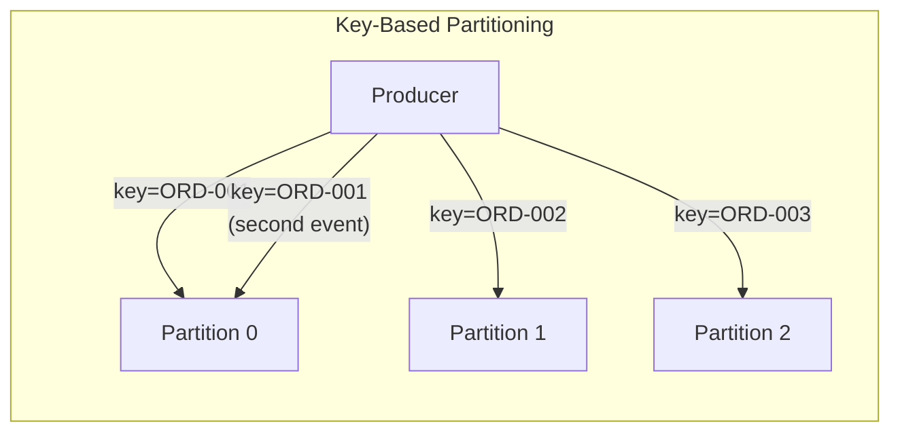

# Phase 2 — Go Implementation

## Setup

Same topic with 3 partitions.

### File Structure

```
go/
├── cmd/
│   ├── keyed-producer/main.go
│   ├── partition-consumer/main.go
│   └── observe-partitions/main.go
├── go.mod
└── go.sum
```

---

## `cmd/keyed-producer/main.go` — Producer with Keys

```go
package main

import (
	"bufio"
	"context"
	"encoding/json"
	"fmt"
	"log"
	"os"
	"strconv"
	"strings"
	"time"

	"github.com/google/uuid"
	"github.com/segmentio/kafka-go"
)

type OrderEvent struct {
	EventType string  `json:"eventType"`
	OrderID   string  `json:"orderId"`
	UserID    string  `json:"userId"`
	ItemID    string  `json:"itemId"`
	Quantity  int     `json:"quantity"`
	Amount    float64 `json:"amount"`
	Timestamp string  `json:"timestamp"`
}

func main() {
	writer := &kafka.Writer{
		Addr:     kafka.TCP("localhost:9092"),
		Topic:    "orders",
		Balancer: &kafka.Hash{}, // Hash-based partitioning on the message key
	}
	defer writer.Close()

	log.Println("[Producer] Connected to Kafka (3 partitions, hash partitioner)")
	log.Println("[Producer] Type: userId itemId quantity amount")
	log.Println("[Producer] Each order produces CREATED + PAYMENT_PENDING events")
	fmt.Println()

	scanner := bufio.NewScanner(os.Stdin)
	for scanner.Scan() {
		line := strings.TrimSpace(scanner.Text())
		parts := strings.Fields(line)
		if len(parts) != 4 {
			log.Println("Usage: userId itemId quantity amount")
			continue
		}

		quantity, _ := strconv.Atoi(parts[2])
		amount, _ := strconv.ParseFloat(parts[3], 64)
		orderID := fmt.Sprintf("ORD-%s", uuid.New().String()[:8])

		baseEvent := OrderEvent{
			OrderID:   orderID,
			UserID:    parts[0],
			ItemID:    parts[1],
			Quantity:  quantity,
			Amount:    amount,
			Timestamp: time.Now().UTC().Format(time.RFC3339),
		}

		// Event 1: Order Created
		baseEvent.EventType = "ORDER_CREATED"
		val1, _ := json.Marshal(baseEvent)
		err := writer.WriteMessages(context.Background(), kafka.Message{
			Key:   []byte(orderID), // KEY: same orderId → same partition
			Value: val1,
		})
		if err != nil {
			log.Printf("[Producer] ❌ Failed: %v", err)
			continue
		}
		log.Printf("[Producer] ✅ ORDER_CREATED for %s sent", orderID)

		// Event 2: Payment Pending (same key → same partition)
		baseEvent.EventType = "PAYMENT_PENDING"
		val2, _ := json.Marshal(baseEvent)
		err = writer.WriteMessages(context.Background(), kafka.Message{
			Key:   []byte(orderID),
			Value: val2,
		})
		if err != nil {
			log.Printf("[Producer] ❌ Failed: %v", err)
			continue
		}
		log.Printf("[Producer] ✅ PAYMENT_PENDING for %s sent", orderID)

		log.Printf("[Producer] Both events for %s used key=%s → same partition\n", orderID, orderID)
	}
}
```

### Differences from TypeScript

- **Balancer:** `&kafka.Hash{}` in Go vs `kafkajs` default (which is already murmur2-based). Both hash the key to determine the partition, but the hash algorithms differ — so the same key may map to a *different* partition between the two implementations. This doesn't matter in practice (you don't cross-read between TS and Go consumers in the same group).
- **No metadata returned:** `writer.WriteMessages` doesn't tell you which partition the message went to. If you need that, you'd use a `kafka.Conn` directly or inspect via CLI.

---

## `cmd/partition-consumer/main.go` — Multi-Partition Consumer

```go
package main

import (
	"context"
	"encoding/json"
	"fmt"
	"log"
	"os"
	"os/signal"
	"syscall"

	"github.com/segmentio/kafka-go"
)

type OrderEvent struct {
	EventType string  `json:"eventType"`
	OrderID   string  `json:"orderId"`
	UserID    string  `json:"userId"`
	ItemID    string  `json:"itemId"`
	Quantity  int     `json:"quantity"`
	Amount    float64 `json:"amount"`
	Timestamp string  `json:"timestamp"`
}

// ANSI colors for partition-based coloring
var partitionColors = map[int]string{
	0: "\033[36m", // Cyan
	1: "\033[33m", // Yellow
	2: "\033[35m", // Magenta
}

const resetColor = "\033[0m"

func main() {
	reader := kafka.NewReader(kafka.ReaderConfig{
		Brokers:  []string{"localhost:9092"},
		Topic:    "orders",
		GroupID:  "payment-group-v2",
		MinBytes: 1,
		MaxBytes: 10e6,
	})
	defer reader.Close()

	log.Println("[Consumer] Subscribed to 'orders' (3 partitions)")
	log.Println("[Consumer] Events are color-coded by partition:")
	fmt.Println("  \033[36m■ Partition 0\033[0m")
	fmt.Println("  \033[33m■ Partition 1\033[0m")
	fmt.Println("  \033[35m■ Partition 2\033[0m")
	fmt.Println()

	ctx, cancel := context.WithCancel(context.Background())
	sigChan := make(chan os.Signal, 1)
	signal.Notify(sigChan, syscall.SIGINT, syscall.SIGTERM)
	go func() {
		<-sigChan
		cancel()
	}()

	for {
		msg, err := reader.ReadMessage(ctx)
		if err != nil {
			if ctx.Err() != nil {
				break
			}
			log.Printf("Error: %v", err)
			continue
		}

		var order OrderEvent
		json.Unmarshal(msg.Value, &order)

		color := partitionColors[msg.Partition]

		fmt.Printf(
			"%s[P%d]%s offset=%d key=%s | %s | order=%s | user=%s | $%.2f\n",
			color, msg.Partition, resetColor,
			msg.Offset, string(msg.Key),
			order.EventType, order.OrderID,
			order.UserID, order.Amount,
		)
	}

	log.Println("[Consumer] Shutdown complete")
}
```

---

## `cmd/observe-partitions/main.go` — Partition Distribution Tool

```go
package main

import (
	"context"
	"encoding/json"
	"fmt"
	"log"
	"strings"
	"time"

	"github.com/segmentio/kafka-go"
)

func main() {
	writer := &kafka.Writer{
		Addr:     kafka.TCP("localhost:9092"),
		Topic:    "orders",
		Balancer: &kafka.Hash{},
	}
	defer writer.Close()

	log.Println("[Observer] Producing 30 orders across 10 unique order IDs...")
	fmt.Println()

	// We need a reader to see which partition messages went to
	// Since kafka-go Writer doesn't return partition info,
	// we'll use a direct connection to check partition offsets before/after

	partitionCounts := map[int]int{0: 0, 1: 0, 2: 0}
	keyToPartition := map[string]int{}

	// Produce 10 unique orders, each with 3 events
	for i := 0; i < 10; i++ {
		orderID := fmt.Sprintf("ORD-%04d", i)

		for _, eventType := range []string{"CREATED", "PAYMENT_PENDING", "CONFIRMED"} {
			event := map[string]interface{}{
				"eventType": eventType,
				"orderId":   orderID,
				"userId":    fmt.Sprintf("user-%d", i%3),
				"timestamp": time.Now().UTC().Format(time.RFC3339),
			}
			value, _ := json.Marshal(event)

			err := writer.WriteMessages(context.Background(), kafka.Message{
				Key:   []byte(orderID),
				Value: value,
			})
			if err != nil {
				log.Printf("Failed to write: %v", err)
			}
		}
	}

	// Read back to see partition distribution
	for partition := 0; partition < 3; partition++ {
		conn, err := kafka.DialLeader(context.Background(), "tcp", "localhost:9092", "orders", partition)
		if err != nil {
			log.Printf("Failed to connect to partition %d: %v", partition, err)
			continue
		}

		first, last, _ := conn.ReadOffsets()
		count := int(last - first)
		partitionCounts[partition] = count

		// Read messages to see which keys are on this partition
		conn.Seek(first, kafka.SeekAbsolute)
		batch := conn.ReadBatch(1, 10e6)
		for {
			msg, err := batch.ReadMessage()
			if err != nil {
				break
			}
			key := string(msg.Key)
			if key != "" {
				keyToPartition[key] = partition
			}
		}
		batch.Close()
		conn.Close()
	}

	fmt.Println("Partition Distribution:")
	fmt.Println("───────────────────────")
	for p := 0; p < 3; p++ {
		count := partitionCounts[p]
		bar := strings.Repeat("█", count)
		fmt.Printf("  Partition %d: %s (%d messages)\n", p, bar, count)
	}

	fmt.Println("\nKey → Partition Mapping:")
	fmt.Println("───────────────────────")
	for key, partition := range keyToPartition {
		fmt.Printf("  %s → Partition %d\n", key, partition)
	}

	fmt.Println("\n✅ All events for the same orderId went to the same partition.")
	fmt.Println("   Ordering within each order is guaranteed.")
}
```

---

## Idiomatic Differences: TypeScript vs Go

| Aspect | TypeScript (kafkajs) | Go (kafka-go) |
|--------|---------------------|---------------|
| **Partitioner** | Default: murmur2 hash (Java-compatible) | `&kafka.Hash{}` (Go default hash) |
| **Key type** | `string` or `Buffer` | `[]byte` |
| **Metadata on send** | Returns `{ partition, baseOffset }` | No return value — fire-and-forget |
| **Partition inspection** | Via send return value | Requires `DialLeader` + `ReadOffsets` |
| **Multiple messages** | `messages: [...]` array in single `send()` | `WriteMessages(...msgs)` variadic |

The biggest practical difference: `kafkajs` tells you which partition a message went to immediately. `kafka-go`'s Writer does not. In production, this rarely matters — you trust the partitioner. But for learning, it means the TypeScript version gives better feedback.

---

## What We've Proven



- Same key → same partition → guaranteed ordering
- Different keys → distributed across partitions → parallelism
- You choose the key based on your ordering requirements

→ Next: [Phase 3 — Consumer Groups & Coordination](../phase-03-consumer-groups/README.md)
