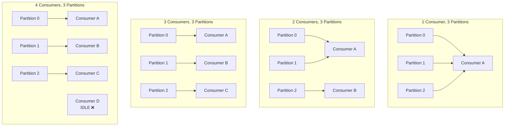

# Phase 2 — TypeScript Implementation

## Setup

We're extending the Phase 1 codebase. The topic now has 3 partitions, and our producer uses keys.

### Create the Partitioned Topic

```bash
# Delete the old topic
docker exec -it kafka kafka-topics \
  --bootstrap-server localhost:9092 \
  --delete --topic orders

# Create with 3 partitions
docker exec -it kafka kafka-topics \
  --bootstrap-server localhost:9092 \
  --create --topic orders \
  --partitions 3 --replication-factor 1

# Verify
docker exec -it kafka kafka-topics \
  --bootstrap-server localhost:9092 \
  --describe --topic orders
```

You should see:
```
Topic: orders   PartitionCount: 3   ReplicationFactor: 1
    Topic: orders   Partition: 0   Leader: 1   Replicas: 1   Isr: 1
    Topic: orders   Partition: 1   Leader: 1   Replicas: 1   Isr: 1
    Topic: orders   Partition: 2   Leader: 1   Replicas: 1   Isr: 1
```

### File Structure

```
ts/
├── src/
│   ├── keyed-producer.ts     ← Producer with message keys
│   ├── partition-consumer.ts  ← Consumer that shows partition assignment
│   └── observe-partitions.ts  ← Tool to see which key maps to which partition
├── package.json
└── tsconfig.json
```

---

## `src/keyed-producer.ts` — Producer with Keys

The only change from Phase 1: we now set a **key** on every message.

```typescript
import { Kafka } from "kafkajs";
import crypto from "crypto";
import readline from "readline";

const kafka = new Kafka({
  clientId: "order-service",
  brokers: ["localhost:9092"],
});

const producer = kafka.producer();

interface OrderEvent {
  eventType: string;
  orderId: string;
  userId: string;
  itemId: string;
  quantity: number;
  amount: number;
  timestamp: string;
}

async function produceOrder(order: OrderEvent): Promise<void> {
  const result = await producer.send({
    topic: "orders",
    messages: [
      {
        // KEY: orderId → same order always goes to the same partition
        key: order.orderId,
        value: JSON.stringify(order),
      },
    ],
  });

  const metadata = result[0];
  console.log(
    `[Producer] ✅ ${order.eventType} for ${order.orderId} → ` +
    `partition ${metadata.partition}, offset ${metadata.baseOffset}`
  );
}

async function main(): Promise<void> {
  await producer.connect();
  console.log("[Producer] Connected to Kafka (3 partitions)");
  console.log("[Producer] Type: userId itemId quantity amount");
  console.log("[Producer] Each order produces CREATED + PAYMENT_PENDING events");
  console.log("[Producer] Watch how the same orderId always goes to the same partition\n");

  const rl = readline.createInterface({
    input: process.stdin,
    output: process.stdout,
  });

  rl.on("line", async (line: string) => {
    const parts = line.trim().split(/\s+/);
    if (parts.length !== 4) {
      console.log("Usage: userId itemId quantity amount");
      return;
    }

    const [userId, itemId, quantityStr, amountStr] = parts;
    const orderId = `ORD-${crypto.randomUUID().slice(0, 8)}`;

    // Produce two events for the same order — both use the same key
    const baseEvent = {
      orderId,
      userId,
      itemId,
      quantity: parseInt(quantityStr, 10),
      amount: parseFloat(amountStr),
      timestamp: new Date().toISOString(),
    };

    // Event 1: Order Created
    await produceOrder({ ...baseEvent, eventType: "ORDER_CREATED" });

    // Event 2: Payment Pending (same key = same partition = guaranteed ordering)
    await produceOrder({ ...baseEvent, eventType: "PAYMENT_PENDING" });

    console.log(`[Producer] Both events for ${orderId} went to the SAME partition\n`);
  });

  rl.on("close", async () => {
    await producer.disconnect();
    process.exit(0);
  });
}

main().catch(console.error);
```

### What to Observe

When you produce multiple events for the same `orderId`, they always go to the same partition. The partition number is determined by `hash(orderId) % 3`. Different order IDs will likely land on different partitions.

---

## `src/partition-consumer.ts` — Multi-Partition Consumer

```typescript
import { Kafka, EachMessagePayload } from "kafkajs";

const kafka = new Kafka({
  clientId: "payment-service",
  brokers: ["localhost:9092"],
});

const consumer = kafka.consumer({ groupId: "payment-group-v2" });

async function processMessage(payload: EachMessagePayload): Promise<void> {
  const { topic, partition, message } = payload;
  const key = message.key?.toString() ?? "null";
  const value = message.value?.toString();

  if (!value) return;

  const order = JSON.parse(value);

  // Color-code by partition for visual clarity
  const colors: Record<number, string> = {
    0: "\x1b[36m", // Cyan
    1: "\x1b[33m", // Yellow
    2: "\x1b[35m", // Magenta
  };
  const reset = "\x1b[0m";
  const color = colors[partition] ?? "";

  console.log(
    `${color}[P${partition}]${reset} offset=${message.offset} ` +
    `key=${key} | ${order.eventType} | order=${order.orderId} | ` +
    `user=${order.userId} | $${order.amount}`
  );
}

async function main(): Promise<void> {
  await consumer.connect();
  await consumer.subscribe({ topic: "orders", fromBeginning: true });

  console.log("[Consumer] Subscribed to 'orders' (3 partitions)");
  console.log("[Consumer] Events are color-coded by partition:");
  console.log("  \x1b[36m■ Partition 0\x1b[0m");
  console.log("  \x1b[33m■ Partition 1\x1b[0m");
  console.log("  \x1b[35m■ Partition 2\x1b[0m");
  console.log();

  await consumer.run({
    eachMessage: processMessage,
  });
}

main().catch(console.error);
```

---

## `src/observe-partitions.ts` — Partition Distribution Tool

This utility sends many messages and shows the partition distribution. Useful for understanding how keys map.

```typescript
import { Kafka } from "kafkajs";
import crypto from "crypto";

const kafka = new Kafka({
  clientId: "partition-observer",
  brokers: ["localhost:9092"],
});

const producer = kafka.producer();

async function main(): Promise<void> {
  await producer.connect();

  const partitionCounts: Record<number, number> = { 0: 0, 1: 0, 2: 0 };
  const keyToPartition: Record<string, number> = {};

  console.log("[Observer] Producing 30 orders across 10 unique order IDs...\n");

  // Create 10 unique orders, each with 3 events
  for (let i = 0; i < 10; i++) {
    const orderId = `ORD-${String(i).padStart(4, "0")}`;

    for (const eventType of ["CREATED", "PAYMENT_PENDING", "CONFIRMED"]) {
      const result = await producer.send({
        topic: "orders",
        messages: [
          {
            key: orderId,
            value: JSON.stringify({
              eventType,
              orderId,
              userId: `user-${i % 3}`,
              timestamp: new Date().toISOString(),
            }),
          },
        ],
      });

      const partition = result[0].partition;
      partitionCounts[partition]++;

      if (!keyToPartition[orderId]) {
        keyToPartition[orderId] = partition;
      } else if (keyToPartition[orderId] !== partition) {
        // This should NEVER happen — same key must always go to same partition
        console.error(`❌ KEY VIOLATION: ${orderId} went to partitions ${keyToPartition[orderId]} AND ${partition}`);
      }
    }
  }

  console.log("Partition Distribution:");
  console.log("───────────────────────");
  for (const [partition, count] of Object.entries(partitionCounts)) {
    const bar = "█".repeat(count);
    console.log(`  Partition ${partition}: ${bar} (${count} messages)`);
  }

  console.log("\nKey → Partition Mapping:");
  console.log("───────────────────────");
  for (const [key, partition] of Object.entries(keyToPartition)) {
    console.log(`  ${key} → Partition ${partition}`);
  }

  console.log("\n✅ All events for the same orderId went to the same partition.");
  console.log("   Ordering within each order is guaranteed.\n");

  await producer.disconnect();
}

main().catch(console.error);
```

---

## Running the Demo

### Step 1: Start the Consumer

```bash
npx ts-node src/partition-consumer.ts
```

### Step 2: Produce Keyed Messages

```bash
npx ts-node src/keyed-producer.ts
```

Type several orders:
```
user-1 ITEM-001 2 49.99
user-2 ITEM-002 1 29.99
user-3 ITEM-001 3 74.97
user-1 ITEM-003 1 19.99
```

Watch the consumer output. Notice:
- Events for the same order are always on the same partition
- `ORDER_CREATED` always comes before `PAYMENT_PENDING` for the same order
- Different orders may land on different partitions

### Step 3: Run the Distribution Observer

```bash
npx ts-node src/observe-partitions.ts
```

This shows you exactly how keys map to partitions.

---

## Verify with CLI

```bash
# Read from a specific partition
docker exec -it kafka kafka-console-consumer \
  --bootstrap-server localhost:9092 \
  --topic orders --partition 0 --from-beginning \
  --property print.key=true \
  --property print.partition=true

# See partition distribution
docker exec -it kafka kafka-get-offsets \
  --bootstrap-server localhost:9092 \
  --topic orders
```

The `kafka-get-offsets` output shows `topic:partition:offset` — you can see how many messages are in each partition.

---

## What Happens with Multiple Consumers



Rule: **consumers in a group > partitions = wasted consumers.** The extra consumers sit idle.

This is why partition count matters. It's the upper bound on your parallelism within a single consumer group.

→ Next: [Phase 2 — Go Implementation](go-implementation.md)
