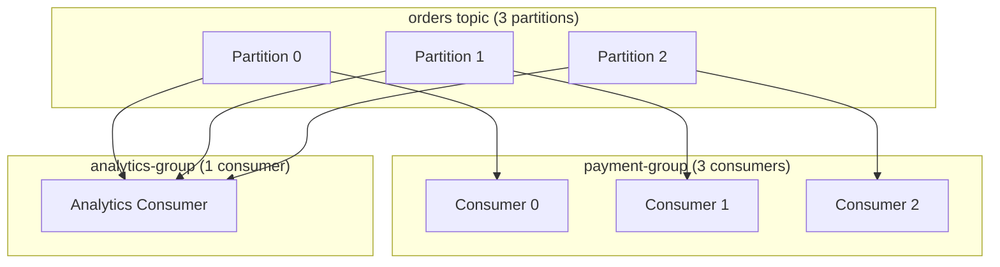
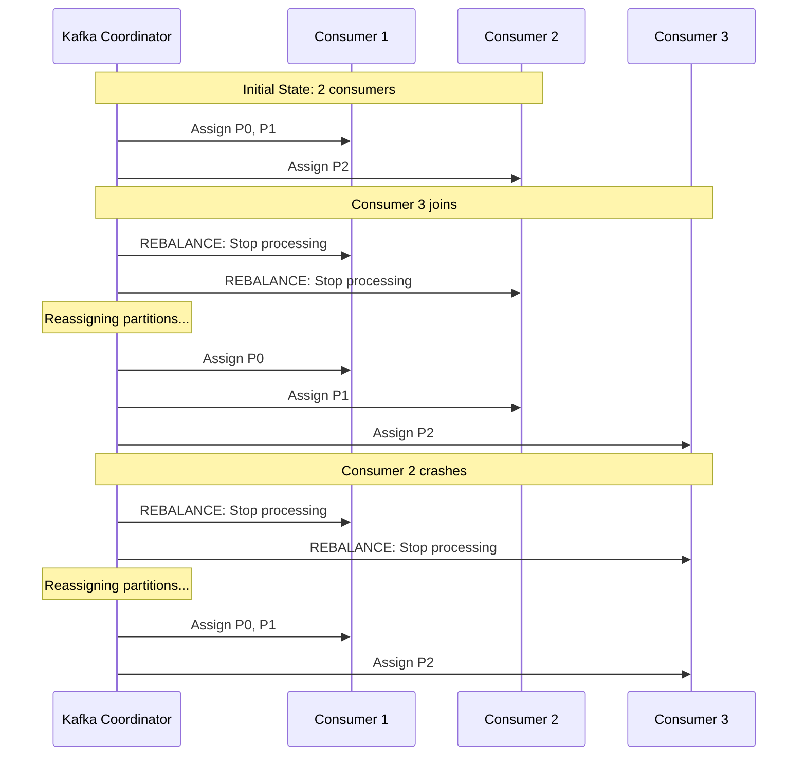
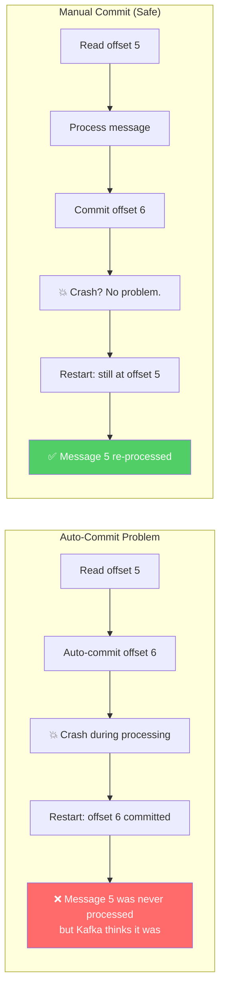

# Phase 3 — Consumer Groups & Coordination

## The Problem We're Solving

In Phase 2, we produced to 3 partitions. But we ran a single consumer that reads from all 3. That's not scaling — it's the same throughput with extra complexity.

To scale, we want **multiple consumer instances**, each processing a subset of partitions. But who decides which consumer gets which partition? What happens when a consumer crashes? What happens when we add a new consumer?

This is where **consumer groups** come in.

## Kafka Concepts Introduced

### Consumer Groups

A consumer group is a set of consumers that cooperate to consume a topic. Kafka ensures:

1. **Each partition is assigned to exactly one consumer** in the group
2. **A consumer can handle multiple partitions** (if there are fewer consumers than partitions)
3. **Adding/removing consumers triggers a rebalance** — partitions are reassigned

Key insight: **different consumer groups are completely independent**. The `payment-group` and `analytics-group` both receive *all* messages. Within each group, messages are divided among the consumers.

### Rebalancing

When consumers join or leave a group, Kafka **rebalances** — it reassigns partitions across the remaining consumers.

### Why Rebalances Hurt

During a rebalance:
1. **All consumers in the group stop processing** (even healthy ones)
2. **Partitions are redistributed** — a consumer might get a different partition than before
3. **In-flight messages may be reprocessed** — if offsets weren't committed before the rebalance

Rebalances are the #1 operational pain point with Kafka consumer groups. They're necessary, but they cause pauses and potential duplicate processing.

### Offset Commits

Consumers track their progress by **committing offsets** — telling Kafka "I've processed everything up to offset N."

Two strategies:

| Strategy | How It Works | Risk |
|----------|-------------|------|
| **Auto-commit** | Kafka commits offsets periodically (every 5s by default) | Crash between commit and processing → lost messages |
| **Manual commit** | You commit after processing | More code, but you control exactly when |

Manual commits give you **at-least-once semantics**: you might process a message twice (if you crash after processing but before committing), but you'll never miss one.

## Code

- [TypeScript Implementation](ts-implementation.md)
- [Go Implementation](go-implementation.md)

## What Breaks If Misused

| Mistake | What Happens |
|---------|-------------|
| More consumers than partitions | Extra consumers sit idle, wasting resources |
| Auto-commit with slow processing | Messages "committed" before actually processed. Crash = data loss. |
| Long processing time per message | Consumer heartbeat times out → Kafka thinks it's dead → rebalance storm |
| Not handling rebalances | Consumer gets new partition but starts from wrong offset → duplicates or gaps |
| Multiple consumer groups for same service | Each group gets all messages → duplicate processing |

## What's Next

We now have scaled consumers with proper offset management. But what happens when processing *fails*? In [Phase 4](../phase-04-failure-retries/README.md), we deal with retries, idempotency, and the reality that messages sometimes can't be processed.
