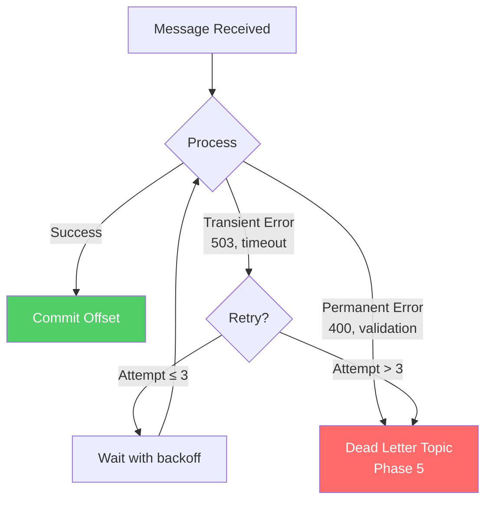

# Phase 4 — Failure, Retries & Idempotency

## The Problem We're Solving

Our consumers can now process messages in parallel and survive crashes by resuming from committed offsets. But what happens when processing *fails*?

A payment charge fails. A database is temporarily down. A downstream API returns 500. The message can't be processed right now — but it might work if we try again later.

We need a strategy for retries. And retries mean duplicates. And duplicates mean we need idempotency.

## Why This Matters

In our order pipeline:
1. Consumer reads an order event
2. Tries to charge the payment
3. Payment gateway returns 503 (temporary error)
4. Consumer... does what?

If we don't commit the offset, Kafka redelivers the message. Good — we get a retry. But if the payment *actually went through* and the 503 was just from a timeout, we charge the user twice.

This is the fundamental tension in distributed systems: **you can't have exactly-once delivery in the general case**. You can have:

- **At-most-once**: Process, then commit. If you crash after processing, you skip the message. No duplicates, but possible data loss.
- **At-least-once**: Commit after processing. If you crash before commit, you reprocess. No data loss, but possible duplicates.
- **Exactly-once (semantics, not delivery)**: At-least-once delivery + idempotent processing. Technically still delivered multiple times, but the effect is as if it was processed once.

## Kafka Concepts Introduced

### Delivery Semantics

### Idempotent Producers

Kafka supports idempotent producers at the protocol level:
- The producer assigns a sequence number to each message
- The broker deduplicates messages with the same producer ID + sequence number
- This eliminates duplicates caused by producer retries (network timeouts, etc.)

This is a producer-side guarantee. It doesn't help with consumer-side duplicates.

### Consumer Idempotency

Consumer idempotency is **your responsibility**. Kafka doesn't solve it for you. Common strategies:

| Strategy | How It Works | Example |
|----------|-------------|---------|
| **Idempotency key** | Store a unique ID for each processed message. Skip if seen before. | `INSERT ... ON CONFLICT DO NOTHING` |
| **Conditional update** | Only update if the current state matches expectations | `UPDATE orders SET status='paid' WHERE status='pending'` |
| **Version/offset tracking** | Store the last processed offset. Skip if offset ≤ stored. | `WHERE processed_offset < $new_offset` |

## Retry Strategies

### Transient vs Permanent Errors

| Error Type | Examples | Strategy |
|-----------|---------|----------|
| **Transient** | 503, timeout, connection refused, deadlock | Retry with exponential backoff |
| **Permanent** | 400, validation failure, malformed data | Send to dead letter topic (Phase 5) |
| **Unknown** | 500, unexpected exception | Retry a few times, then dead letter |

## Code

- [TypeScript Implementation](ts-implementation.md)
- [Go Implementation](go-implementation.md)

## What Breaks If Misused

| Mistake | What Happens |
|---------|-------------|
| Retry without backoff | Thundering herd — all consumers hammer a recovering service simultaneously |
| Retry permanent errors | Infinite retry loop, consumer stops making progress |
| No idempotency on retries | Duplicate payments, double-counted events |
| Blocking retries on the consumer | Consumer stops processing other messages, lag builds up |
| Relying on Kafka "exactly-once" | Kafka's transactional API is for Kafka-to-Kafka only, not for external side effects |

## What's Next

Some messages will fail even after retries. In [Phase 5](../phase-05-dead-letter/README.md), we build a dead letter topic to isolate these poison messages so they don't block the rest of the pipeline.
