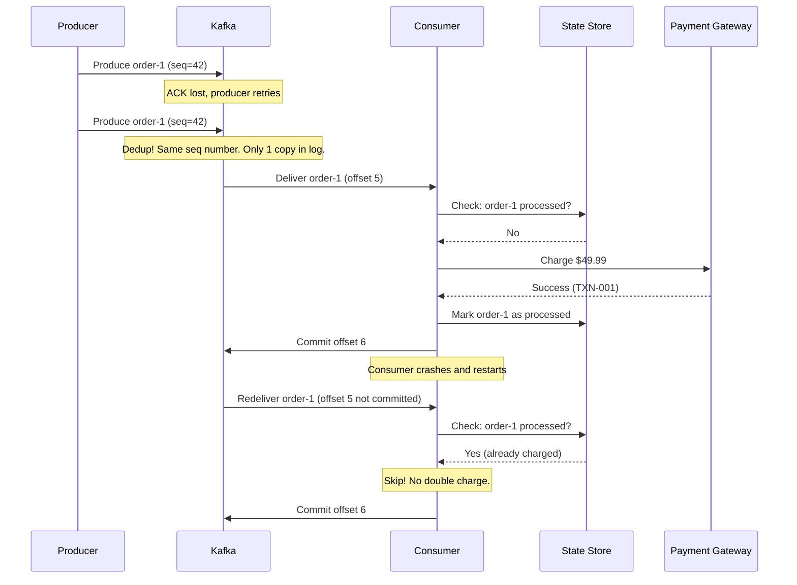

# Phase 4 — TypeScript Implementation

## Setup

We're extending the Phase 3 consumer to handle failures with retries and idempotency.

### File Structure

```
ts/
├── src/
│   ├── idempotent-consumer.ts  ← Consumer with retry + idempotency
│   ├── idempotent-producer.ts  ← Producer with idempotency enabled
│   ├── payment-simulator.ts    ← Simulates flaky payment gateway
│   └── retry-utils.ts          ← Retry with exponential backoff
├── package.json
└── tsconfig.json
```

### Additional Dependencies

```bash
npm install kafkajs
```

---

## `src/retry-utils.ts` — Retry with Exponential Backoff

A clean utility that separates retry logic from business logic.

```typescript
export interface RetryOptions {
  maxRetries: number;
  baseDelayMs: number;
  maxDelayMs: number;
}

export class TransientError extends Error {
  constructor(message: string) {
    super(message);
    this.name = "TransientError";
  }
}

export class PermanentError extends Error {
  constructor(message: string) {
    super(message);
    this.name = "PermanentError";
  }
}

export async function withRetry<T>(
  fn: () => Promise<T>,
  options: RetryOptions
): Promise<{ result: T | null; attempts: number; error: Error | null }> {
  const { maxRetries, baseDelayMs, maxDelayMs } = options;

  for (let attempt = 1; attempt <= maxRetries; attempt++) {
    try {
      const result = await fn();
      return { result, attempts: attempt, error: null };
    } catch (err) {
      const error = err as Error;

      // Permanent errors: don't retry
      if (error instanceof PermanentError) {
        console.log(`  [Retry] Permanent error on attempt ${attempt}: ${error.message}`);
        return { result: null, attempts: attempt, error };
      }

      // Transient errors: retry with backoff
      if (attempt < maxRetries) {
        const delay = Math.min(
          baseDelayMs * Math.pow(2, attempt - 1) + Math.random() * 100,
          maxDelayMs
        );
        console.log(
          `  [Retry] Attempt ${attempt}/${maxRetries} failed: ${error.message}. ` +
          `Retrying in ${Math.round(delay)}ms...`
        );
        await new Promise((resolve) => setTimeout(resolve, delay));
      } else {
        console.log(`  [Retry] All ${maxRetries} attempts exhausted: ${error.message}`);
        return { result: null, attempts: attempt, error };
      }
    }
  }

  return { result: null, attempts: maxRetries, error: new Error("Unreachable") };
}
```

---

## `src/payment-simulator.ts` — Flaky Payment Gateway

Simulates a real-world payment service with transient and permanent errors.

```typescript
import { TransientError, PermanentError } from "./retry-utils";

// Track which orders have been charged — for idempotency detection
const chargedOrders = new Set<string>();

export interface PaymentResult {
  orderId: string;
  status: "charged" | "already_charged";
  transactionId: string;
}

export async function chargePayment(
  orderId: string,
  amount: number
): Promise<PaymentResult> {
  // Simulate network latency
  await new Promise((resolve) => setTimeout(resolve, 50 + Math.random() * 100));

  // IDEMPOTENCY CHECK: If already charged, return success without re-charging
  if (chargedOrders.has(orderId)) {
    console.log(`  [Payment] Order ${orderId} already charged — skipping (idempotent)`);
    return {
      orderId,
      status: "already_charged",
      transactionId: `TXN-${orderId}-DUP`,
    };
  }

  // Simulate ~30% transient failure rate (high for demo purposes)
  if (Math.random() < 0.3) {
    throw new TransientError(`Payment gateway timeout for order ${orderId}`);
  }

  // Simulate ~5% permanent failure (invalid card, insufficient funds)
  if (Math.random() < 0.05) {
    throw new PermanentError(`Card declined for order ${orderId}: insufficient funds`);
  }

  // Success — mark as charged
  chargedOrders.add(orderId);

  return {
    orderId,
    status: "charged",
    transactionId: `TXN-${orderId}-${Date.now()}`,
  };
}
```

---

## `src/idempotent-producer.ts` — Producer with Idempotency

```typescript
import { Kafka } from "kafkajs";
import crypto from "crypto";
import readline from "readline";

const kafka = new Kafka({
  clientId: "order-service-idempotent",
  brokers: ["localhost:9092"],
});

// Enable idempotent producer
// This ensures that retried produces don't create duplicate messages in Kafka
const producer = kafka.producer({
  idempotent: true,
  maxInFlightRequests: 1, // Required for idempotent mode
});

async function main(): Promise<void> {
  await producer.connect();
  console.log("[Producer] Connected (idempotent mode enabled)");
  console.log("[Producer] Duplicate produces due to retries will be deduplicated by Kafka");
  console.log("[Producer] Type: userId itemId quantity amount\n");

  const rl = readline.createInterface({
    input: process.stdin,
    output: process.stdout,
  });

  rl.on("line", async (line: string) => {
    const parts = line.trim().split(/\s+/);
    if (parts.length !== 4) {
      console.log("Usage: userId itemId quantity amount");
      return;
    }

    const [userId, itemId, quantityStr, amountStr] = parts;
    const orderId = `ORD-${crypto.randomUUID().slice(0, 8)}`;

    const order = {
      eventType: "ORDER_CREATED",
      orderId,
      userId,
      itemId,
      quantity: parseInt(quantityStr, 10),
      amount: parseFloat(amountStr),
      timestamp: new Date().toISOString(),
    };

    const result = await producer.send({
      topic: "orders",
      messages: [
        {
          key: orderId,
          value: JSON.stringify(order),
        },
      ],
    });

    console.log(
      `[Producer] ✅ ${orderId} → P${result[0].partition}:${result[0].baseOffset} (idempotent)`
    );
  });

  rl.on("close", async () => {
    await producer.disconnect();
    process.exit(0);
  });
}

main().catch(console.error);
```

### What Idempotent Producer Gives You

Without idempotent mode:
1. Producer sends message to broker
2. Broker receives and writes it
3. ACK is lost due to network issue
4. Producer retries → **duplicate message in the log**

With idempotent mode:
1. Producer sends message with sequence number 42
2. Broker writes it
3. ACK is lost
4. Producer retries with same sequence number 42
5. Broker sees it's a duplicate → **skips it, returns ACK**

This is transparent — you don't change any code besides `idempotent: true`.

---

## `src/idempotent-consumer.ts` — Consumer with Retry + Idempotency

```typescript
import { Kafka, EachMessagePayload } from "kafkajs";
import { withRetry, PermanentError } from "./retry-utils";
import { chargePayment } from "./payment-simulator";

const consumerId = process.argv[2] || `consumer-${process.pid}`;

const kafka = new Kafka({
  clientId: `payment-service-${consumerId}`,
  brokers: ["localhost:9092"],
});

const consumer = kafka.consumer({ groupId: "payment-retry-group" });

// In production, this would be a database table
// Key: orderId, Value: processing result
const processedOrders = new Map<string, { status: string; processedAt: string }>();

async function processMessage(payload: EachMessagePayload): Promise<void> {
  const { partition, message, heartbeat } = payload;
  const value = message.value?.toString();
  if (!value) return;

  const order = JSON.parse(value);
  const { orderId, amount } = order;

  console.log(
    `\n[${consumerId}] P${partition}:${message.offset} | ${order.eventType} | ${orderId} | $${amount}`
  );

  // IDEMPOTENCY CHECK #1: Application-level dedup
  // In production, this would be a database lookup
  if (processedOrders.has(orderId)) {
    const prev = processedOrders.get(orderId)!;
    console.log(
      `[${consumerId}] ⏭️ Skipping ${orderId} — already processed (${prev.status} at ${prev.processedAt})`
    );
    return; // Skip processing, but let Kafka commit the offset
  }

  // RETRY with exponential backoff
  const { result, attempts, error } = await withRetry(
    () => chargePayment(orderId, amount),
    {
      maxRetries: 3,
      baseDelayMs: 200,
      maxDelayMs: 2000,
    }
  );

  // Send heartbeat after potentially long retry sequence
  await heartbeat();

  if (error) {
    if (error instanceof PermanentError) {
      console.log(
        `[${consumerId}] ❌ PERMANENT FAILURE for ${orderId}: ${error.message}`
      );
      console.log(
        `[${consumerId}] 📤 Should send to dead-letter topic (Phase 5)`
      );
      // Mark as processed with "failed" status — don't retry again
      processedOrders.set(orderId, {
        status: "permanently_failed",
        processedAt: new Date().toISOString(),
      });
    } else {
      console.log(
        `[${consumerId}] ❌ TRANSIENT FAILURE for ${orderId} after ${attempts} attempts`
      );
      console.log(
        `[${consumerId}] 📤 Should send to dead-letter topic for later retry`
      );
      processedOrders.set(orderId, {
        status: "retry_exhausted",
        processedAt: new Date().toISOString(),
      });
    }
    return;
  }

  // Success
  console.log(
    `[${consumerId}] ✅ ${orderId} charged (${result!.status}) in ${attempts} attempt(s) — TXN: ${result!.transactionId}`
  );
  processedOrders.set(orderId, {
    status: "success",
    processedAt: new Date().toISOString(),
  });
}

async function main(): Promise<void> {
  await consumer.connect();
  await consumer.subscribe({ topic: "orders", fromBeginning: false });

  console.log(`[${consumerId}] Payment consumer with retry + idempotency`);
  console.log(`[${consumerId}] Max retries: 3, Backoff: 200ms-2000ms`);
  console.log(`[${consumerId}] Waiting for messages...\n`);

  await consumer.run({
    autoCommitThreshold: 1,
    eachMessage: processMessage,
  });
}

process.on("SIGINT", async () => {
  console.log(`\n[${consumerId}] Shutting down...`);

  // Print processing summary
  console.log(`\n${"═".repeat(50)}`);
  console.log("Processing Summary:");
  let success = 0, failed = 0, skipped = 0;
  for (const [orderId, info] of processedOrders) {
    if (info.status === "success") success++;
    else if (info.status.includes("failed") || info.status.includes("exhausted")) failed++;
    console.log(`  ${orderId}: ${info.status}`);
  }
  console.log(`\nTotal: ${processedOrders.size} (✅ ${success} | ❌ ${failed})`);
  console.log(`${"═".repeat(50)}\n`);

  await consumer.disconnect();
  process.exit(0);
});

main().catch(console.error);
```

---

## How Idempotency Works End-to-End



Two layers of protection:
1. **Producer idempotency** — Kafka deduplicates producer retries at the broker level
2. **Consumer idempotency** — Your application checks if the message was already processed

---

## Running the Demo

### Terminal 1: Start the Consumer

```bash
npx ts-node src/idempotent-consumer.ts consumer-A
```

### Terminal 2: Produce Orders

```bash
npx ts-node src/idempotent-producer.ts
```

Type orders and watch:
```
user-1 ITEM-001 2 49.99
user-2 ITEM-002 1 29.99
user-3 ITEM-001 3 74.97
```

You'll see:
- Some messages succeed on first attempt
- Some fail with transient errors and retry (with backoff delays)
- Occasionally a permanent error occurs
- If you kill and restart the consumer, reprocessed messages are caught by the idempotency check

### Experiment: Force Duplicate Processing

1. Start the consumer
2. Produce an order
3. Kill the consumer immediately after "charged" but before "committed"
4. Restart the consumer
5. Watch it reprocess the same order — but the payment simulator detects the duplicate

---

## Key Takeaways

1. **At-least-once is the default.** Duplicates will happen. Plan for them.
2. **Producer idempotency is free.** Just enable `idempotent: true`. No reason not to.
3. **Consumer idempotency is your problem.** Use a database, Redis, or in-memory set to track processed messages.
4. **Separate transient from permanent errors.** Retry the former, dead-letter the latter.
5. **Exponential backoff is mandatory.** Without it, retries become a DDoS on your own systems.

→ Next: [Phase 4 — Go Implementation](go-implementation.md)
