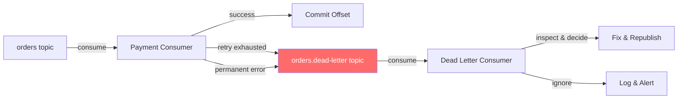
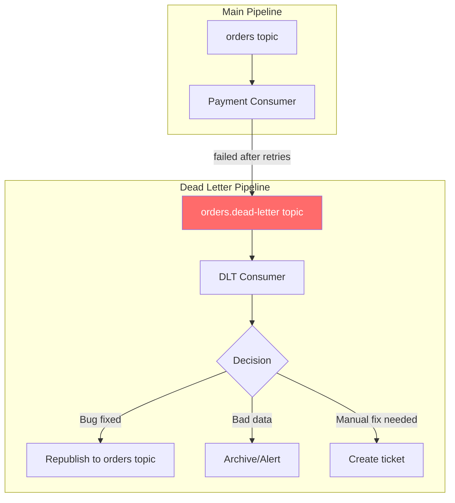

# Phase 5 — Dead Letters & Poison Messages

## The Problem We're Solving

In Phase 4, we added retries. But some messages will never succeed — no matter how many times you retry. A malformed JSON payload. A reference to a non-existent user. A card that's been canceled.

If we keep retrying these messages, the consumer gets stuck. It can't move past the bad message. Newer messages pile up behind it. Lag grows. Alerts fire. The whole pipeline stops making progress.

We need a way to **isolate** bad messages without losing them and without blocking good messages.

## What Is a Poison Message?

A poison message is any message that your consumer cannot process, ever. Examples:

- Malformed or corrupt data
- Reference to a deleted entity
- Schema mismatch (expected v2, got v1)
- Business logic violation (negative quantity, zero amount)

The message isn't wrong from Kafka's perspective — Kafka stored it correctly. It's wrong from your *application's* perspective.

## Kafka Concept Introduced: Dead Letter Topics

A Dead Letter Topic (DLT) is a regular Kafka topic where you send messages that failed processing. It's not a Kafka feature — it's a pattern you implement yourself.



### Why Not Just Log and Skip?

You could. But:

1. **Logs are ephemeral.** Good luck finding that one failed message from 3 days ago in your log aggregator.
2. **No replay.** You can't reprocess a log line after fixing the bug.
3. **No visibility.** How many messages are failing? What pattern do they have? A DLT makes this queryable.
4. **Operational recovery.** Fix the bug, deploy, then replay the DLT → back into the main topic.

### DLT Design



### What to Store in Dead Letter Messages

When you send a message to the DLT, include metadata about *why* it failed:

```json
{
  "originalTopic": "orders",
  "originalPartition": 2,
  "originalOffset": 1547,
  "originalKey": "ORD-abc123",
  "originalValue": "{...the original message...}",
  "error": "Card declined: insufficient funds",
  "errorType": "PermanentError",
  "attempts": 3,
  "consumerGroup": "payment-group",
  "consumerId": "consumer-A",
  "failedAt": "2025-01-15T14:23:45Z"
}
```

This makes debugging trivial. You can see exactly what failed, why, and where.

## Code

- [TypeScript Implementation](ts-implementation.md)
- [Go Implementation](go-implementation.md)

## What Breaks If Misused

| Mistake | What Happens |
|---------|-------------|
| No DLT at all | Consumer gets stuck on a bad message → pipeline stops |
| Retrying DLT messages immediately | Same error, infinite loop between main topic and DLT |
| No metadata in DLT messages | Can't debug why messages failed |
| DLT with no monitoring | Bad messages pile up silently for weeks |
| DLT consumer that just re-publishes blindly | Creates a cycle — same bad message bounces forever |

## What's Next

Dead letters handle broken messages. But what about messages whose *format* changes? In [Phase 6](../phase-06-schemas/README.md), we add schema contracts so producers and consumers can evolve independently without breaking each other.
