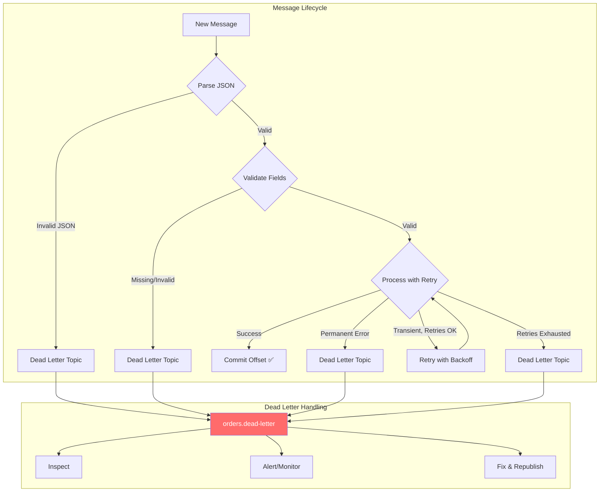

# Phase 5 — TypeScript Implementation

## Setup

We add a dead letter topic and modify our consumer to route failures there.

### Create the Dead Letter Topic

```bash
docker exec -it kafka kafka-topics \
  --bootstrap-server localhost:9092 \
  --create --topic orders.dead-letter \
  --partitions 1 --replication-factor 1
```

One partition is fine for a DLT — it's not high-throughput by design.

### File Structure

```
ts/
├── src/
│   ├── consumer-with-dlt.ts   ← Main consumer → routes failures to DLT
│   ├── dlt-consumer.ts        ← Inspects dead letter messages
│   ├── dlt-republisher.ts     ← Republishes fixed messages back to main topic
│   ├── poison-producer.ts     ← Produces intentionally bad messages
│   ├── retry-utils.ts         ← From Phase 4
│   └── payment-simulator.ts   ← From Phase 4
├── package.json
└── tsconfig.json
```

---

## `src/consumer-with-dlt.ts` — Consumer with Dead Letter Routing

```typescript
import { Kafka, EachMessagePayload, Producer } from "kafkajs";
import { withRetry, PermanentError, TransientError } from "./retry-utils";
import { chargePayment } from "./payment-simulator";

const consumerId = process.argv[2] || `consumer-${process.pid}`;

const kafka = new Kafka({
  clientId: `payment-service-${consumerId}`,
  brokers: ["localhost:9092"],
});

const consumer = kafka.consumer({ groupId: "payment-dlt-group" });
const dlqProducer = kafka.producer(); // Separate producer for dead letters

async function sendToDeadLetter(
  dlqProducer: Producer,
  originalMessage: {
    topic: string;
    partition: number;
    offset: string;
    key: Buffer | null;
    value: Buffer | null;
  },
  error: Error,
  attempts: number
): Promise<void> {
  const deadLetterMessage = {
    originalTopic: originalMessage.topic,
    originalPartition: originalMessage.partition,
    originalOffset: originalMessage.offset,
    originalKey: originalMessage.key?.toString() ?? null,
    originalValue: originalMessage.value?.toString() ?? null,
    error: error.message,
    errorType: error.constructor.name,
    attempts,
    consumerGroup: "payment-dlt-group",
    consumerId,
    failedAt: new Date().toISOString(),
  };

  await dlqProducer.send({
    topic: "orders.dead-letter",
    messages: [
      {
        // Use the same key as the original — preserves ordering context
        key: originalMessage.key,
        value: JSON.stringify(deadLetterMessage),
        headers: {
          "x-original-topic": originalMessage.topic,
          "x-error-type": error.constructor.name,
          "x-failed-at": new Date().toISOString(),
        },
      },
    ],
  });

  console.log(
    `[${consumerId}] 📤 Sent to dead-letter: ${originalMessage.key?.toString()} (${error.constructor.name})`
  );
}

async function processMessage(payload: EachMessagePayload): Promise<void> {
  const { topic, partition, message, heartbeat } = payload;
  const key = message.key?.toString() ?? "null";
  const value = message.value?.toString();

  console.log(
    `\n[${consumerId}] P${partition}:${message.offset} | key=${key}`
  );

  // Step 1: Parse the message
  let order: any;
  try {
    if (!value) throw new Error("Empty message body");
    order = JSON.parse(value);
  } catch (err) {
    // Malformed message → permanent failure → dead letter immediately
    console.log(`[${consumerId}] ❌ Malformed message — sending to DLT`);
    await sendToDeadLetter(dlqProducer, { topic, partition, offset: message.offset, key: message.key, value: message.value }, err as Error, 0);
    return; // Commit offset (kafkajs commits after eachMessage returns)
  }

  // Step 2: Validate the message
  if (!order.orderId || !order.amount || order.amount <= 0) {
    const validationError = new PermanentError(
      `Invalid order data: orderId=${order.orderId}, amount=${order.amount}`
    );
    console.log(`[${consumerId}] ❌ Validation failed — sending to DLT`);
    await sendToDeadLetter(dlqProducer, { topic, partition, offset: message.offset, key: message.key, value: message.value }, validationError, 0);
    return;
  }

  console.log(
    `[${consumerId}] Processing ${order.orderId} | $${order.amount}`
  );

  // Step 3: Process with retries
  const { result, attempts, error } = await withRetry(
    () => chargePayment(order.orderId, order.amount),
    { maxRetries: 3, baseDelayMs: 200, maxDelayMs: 2000 }
  );

  await heartbeat();

  if (error) {
    // All retries exhausted OR permanent error → dead letter
    await sendToDeadLetter(dlqProducer, { topic, partition, offset: message.offset, key: message.key, value: message.value }, error, attempts);
    return;
  }

  console.log(
    `[${consumerId}] ✅ ${order.orderId} charged (${result!.status}) — ${attempts} attempt(s)`
  );
}

async function main(): Promise<void> {
  await Promise.all([consumer.connect(), dlqProducer.connect()]);

  await consumer.subscribe({ topic: "orders", fromBeginning: false });

  console.log(`[${consumerId}] Payment consumer with Dead Letter Topic`);
  console.log(`[${consumerId}] Failed messages → orders.dead-letter`);
  console.log(`[${consumerId}] Waiting for messages...\n`);

  await consumer.run({
    autoCommitThreshold: 1,
    eachMessage: processMessage,
  });
}

process.on("SIGINT", async () => {
  await Promise.all([consumer.disconnect(), dlqProducer.disconnect()]);
  process.exit(0);
});

main().catch(console.error);
```

---

## `src/poison-producer.ts` — Intentionally Bad Messages

Produces a mix of valid and invalid messages so you can watch the DLT in action.

```typescript
import { Kafka } from "kafkajs";
import crypto from "crypto";

const kafka = new Kafka({
  clientId: "poison-producer",
  brokers: ["localhost:9092"],
});

const producer = kafka.producer();

async function main(): Promise<void> {
  await producer.connect();

  const messages = [
    // Good messages
    {
      key: "ORD-good-001",
      value: JSON.stringify({
        eventType: "ORDER_CREATED",
        orderId: "ORD-good-001",
        userId: "user-1",
        amount: 49.99,
        timestamp: new Date().toISOString(),
      }),
      label: "✅ Valid order",
    },
    {
      key: "ORD-good-002",
      value: JSON.stringify({
        eventType: "ORDER_CREATED",
        orderId: "ORD-good-002",
        userId: "user-2",
        amount: 29.99,
        timestamp: new Date().toISOString(),
      }),
      label: "✅ Valid order",
    },

    // Poison: Malformed JSON
    {
      key: "ORD-poison-001",
      value: "{this is not valid json!!!",
      label: "💀 Malformed JSON",
    },

    // Poison: Missing required fields
    {
      key: "ORD-poison-002",
      value: JSON.stringify({ eventType: "ORDER_CREATED" }),
      label: "💀 Missing orderId and amount",
    },

    // Poison: Invalid amount
    {
      key: "ORD-poison-003",
      value: JSON.stringify({
        eventType: "ORDER_CREATED",
        orderId: "ORD-poison-003",
        userId: "user-3",
        amount: -50,
        timestamp: new Date().toISOString(),
      }),
      label: "💀 Negative amount",
    },

    // Good message after poison
    {
      key: "ORD-good-003",
      value: JSON.stringify({
        eventType: "ORDER_CREATED",
        orderId: "ORD-good-003",
        userId: "user-3",
        amount: 99.99,
        timestamp: new Date().toISOString(),
      }),
      label: "✅ Valid order (after poison)",
    },

    // Poison: Empty body
    {
      key: "ORD-poison-004",
      value: "",
      label: "💀 Empty body",
    },
  ];

  console.log("[Poison Producer] Sending mix of valid and invalid messages:\n");

  for (const msg of messages) {
    await producer.send({
      topic: "orders",
      messages: [{ key: msg.key, value: msg.value }],
    });
    console.log(`  Sent: ${msg.label} (key=${msg.key})`);
  }

  console.log(`\n[Poison Producer] Done. ${messages.length} messages sent.`);
  console.log("[Poison Producer] Watch the consumer route bad ones to dead-letter\n");

  await producer.disconnect();
}

main().catch(console.error);
```

---

## `src/dlt-consumer.ts` — Dead Letter Inspector

Monitors the dead letter topic and shows what failed and why.

```typescript
import { Kafka } from "kafkajs";

const kafka = new Kafka({
  clientId: "dlt-inspector",
  brokers: ["localhost:9092"],
});

const consumer = kafka.consumer({ groupId: "dlt-inspector-group" });

async function main(): Promise<void> {
  await consumer.connect();
  await consumer.subscribe({ topic: "orders.dead-letter", fromBeginning: true });

  console.log("[DLT Inspector] Monitoring orders.dead-letter...\n");

  await consumer.run({
    eachMessage: async ({ partition, message }) => {
      const value = message.value?.toString();
      if (!value) return;

      const deadLetter = JSON.parse(value);

      console.log("╔══════════════════════════════════════════════");
      console.log("║ DEAD LETTER MESSAGE");
      console.log("╠──────────────────────────────────────────────");
      console.log(`║ Key:            ${message.key?.toString()}`);
      console.log(`║ Error Type:     ${deadLetter.errorType}`);
      console.log(`║ Error:          ${deadLetter.error}`);
      console.log(`║ Attempts:       ${deadLetter.attempts}`);
      console.log(`║ Consumer:       ${deadLetter.consumerId}`);
      console.log(`║ Failed At:      ${deadLetter.failedAt}`);
      console.log(`║ Original Topic: ${deadLetter.originalTopic}`);
      console.log(`║ Original P:O:   ${deadLetter.originalPartition}:${deadLetter.originalOffset}`);
      console.log("║");

      // Try to parse the original message
      if (deadLetter.originalValue) {
        try {
          const original = JSON.parse(deadLetter.originalValue);
          console.log(`║ Original Msg:   ${JSON.stringify(original, null, 2).split("\n").join("\n║                 ")}`);
        } catch {
          console.log(`║ Original Msg:   ${deadLetter.originalValue.slice(0, 100)}...`);
        }
      }

      console.log("╚══════════════════════════════════════════════\n");
    },
  });
}

process.on("SIGINT", async () => {
  await consumer.disconnect();
  process.exit(0);
});

main().catch(console.error);
```

---

## `src/dlt-republisher.ts` — Republish Fixed Messages

After fixing a bug, use this to replay dead letter messages back to the main topic.

```typescript
import { Kafka } from "kafkajs";

const kafka = new Kafka({
  clientId: "dlt-republisher",
  brokers: ["localhost:9092"],
});

const consumer = kafka.consumer({ groupId: "dlt-republisher-group" });
const producer = kafka.producer();

async function main(): Promise<void> {
  await Promise.all([consumer.connect(), producer.connect()]);
  await consumer.subscribe({ topic: "orders.dead-letter", fromBeginning: true });

  console.log("[Republisher] Reading dead letter messages...");
  console.log("[Republisher] Will republish original messages back to 'orders' topic\n");

  let republished = 0;

  await consumer.run({
    eachMessage: async ({ message }) => {
      const value = message.value?.toString();
      if (!value) return;

      const deadLetter = JSON.parse(value);

      // Only republish if the original value looks valid
      if (!deadLetter.originalValue) {
        console.log(`[Republisher] ⏭️ Skipping — no original value`);
        return;
      }

      // Attempt to republish
      try {
        await producer.send({
          topic: deadLetter.originalTopic || "orders",
          messages: [
            {
              key: deadLetter.originalKey,
              value: deadLetter.originalValue,
              headers: {
                "x-republished": "true",
                "x-original-error": deadLetter.error,
                "x-republished-at": new Date().toISOString(),
              },
            },
          ],
        });

        republished++;
        console.log(
          `[Republisher] ✅ Republished ${deadLetter.originalKey} → ${deadLetter.originalTopic} (#${republished})`
        );
      } catch (err) {
        console.log(
          `[Republisher] ❌ Failed to republish ${deadLetter.originalKey}: ${(err as Error).message}`
        );
      }
    },
  });
}

process.on("SIGINT", async () => {
  await Promise.all([consumer.disconnect(), producer.disconnect()]);
  process.exit(0);
});

main().catch(console.error);
```

---

## Running the Demo

### Step 1: Start the Dead Letter Inspector

```bash
npx ts-node src/dlt-consumer.ts
```

### Step 2: Start the Main Consumer

```bash
npx ts-node src/consumer-with-dlt.ts consumer-A
```

### Step 3: Send Poison Messages

```bash
npx ts-node src/poison-producer.ts
```

Watch:
- Good messages get processed normally
- **Malformed JSON** → immediately dead-lettered (no retries)
- **Missing fields** → immediately dead-lettered (validation failure)
- **Negative amount** → immediately dead-lettered (business rule)
- **The consumer continues processing** — it doesn't get stuck on bad messages

### Step 4: Inspect the Dead Letters

Check the DLT inspector terminal. You'll see detailed information about each failure.

### Step 5: Verify via CLI

```bash
# Count dead letter messages
docker exec -it kafka kafka-console-consumer \
  --bootstrap-server localhost:9092 \
  --topic orders.dead-letter --from-beginning \
  --property print.key=true | wc -l

# Read them
docker exec -it kafka kafka-console-consumer \
  --bootstrap-server localhost:9092 \
  --topic orders.dead-letter --from-beginning
```

---

## The Complete Flow



→ Next: [Phase 5 — Go Implementation](go-implementation.md)
