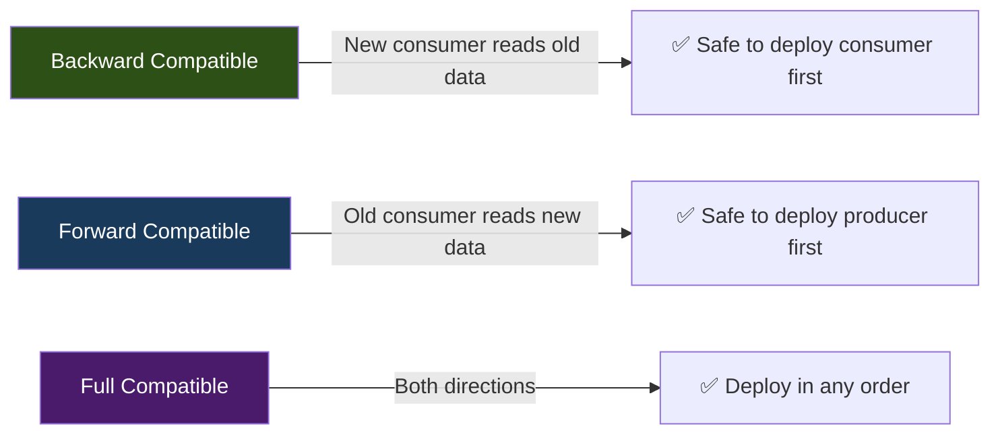
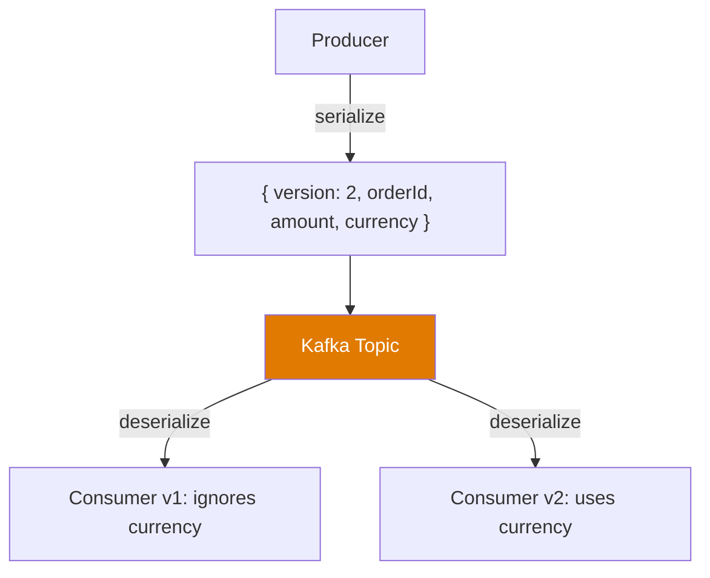
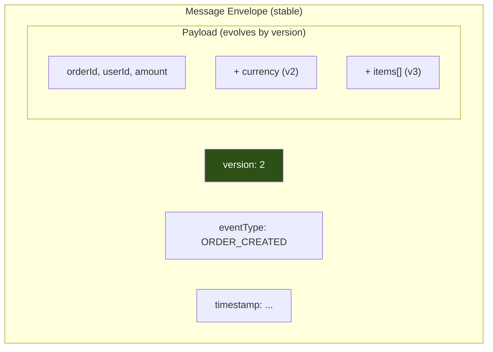

# Phase 6 — Schema & Evolution

## Why This Phase Exists

Your Order Pipeline is growing. Payment, Notification, and Inventory services all consume `ORDER_CREATED` events. Then someone adds a `currency` field. One producer starts sending v2 events. The notification service (still reading v1) crashes.

This is the **schema compatibility problem**, and it hits every Kafka system.

---

## What Goes Wrong Without Schemas

```
Day 1:  { "orderId": "...", "amount": 49.99 }
Day 30: { "orderId": "...", "amount": 49.99, "currency": "USD" }
Day 60: { "order_id": "...", "total": { "amount": 49.99, "currency": "USD" } }
```

Every consumer must handle every version. Nobody tracks which versions exist. Somebody renames a field and breaks three downstream services at 2 AM.

---

## Core Concepts

### 1. Message Schema

A **schema** is a contract: "this is the shape of the data."

```
Schema = what fields exist + their types + which are required
```

At minimum, every Kafka message needs:
- A **type identifier** (eventType, version)
- **Required fields** that never change
- **Optional fields** that can be added safely

### 2. Compatibility Types



| Type | Rule | Deploy Order |
|------|------|-------------|
| **Backward** | New schema can read old data | Consumer first |
| **Forward** | Old schema can read new data | Producer first |
| **Full** | Both directions work | Any order |

### 3. Safe vs Unsafe Changes

```
SAFE (Backward Compatible):
  ✅ Add optional field with default
  ✅ Remove an optional field (consumer ignores it)
  ✅ Add a new event type

UNSAFE (Breaking):
  ❌ Rename a field
  ❌ Change a field's type
  ❌ Remove a required field
  ❌ Change semantics of existing field
```

---

## Schema at the Application Level

We're not introducing Schema Registry yet (that's an infrastructure concern). Instead, we enforce schemas in application code, which is what most teams do initially:



### The Pattern

1. **Add `version` field** to every event
2. **Consumers handle multiple versions** with a switch/match
3. **Producers always send latest version**
4. **Never remove fields** — mark them deprecated
5. **Validate on the consumer side** — defensive parsing

---

## Versioning Strategy

### Envelope Pattern

Every message has a stable envelope:

```json
{
  "version": 2,
  "eventType": "ORDER_CREATED",
  "timestamp": "2024-01-15T10:30:00Z",
  "source": "order-service",
  "payload": {
    "orderId": "ORD-001",
    "userId": "user-1",
    "amount": 49.99,
    "currency": "USD"
  }
}
```

The envelope **never changes**. The payload **evolves** according to `version`.



### Multi-Version Consumer Logic

```
receive message →
  read version field →
    version 1: parse v1 payload, apply defaults for missing v2 fields
    version 2: parse v2 payload directly
    version 3: parse v3 payload directly
    unknown:   log warning, skip (or send to DLT from Phase 5)
```

---

## What You Build in This Phase

### Tools

| Tool | Purpose |
|------|---------|
| `schema-v1-producer` | Sends v1 events (orderId, amount only) |
| `schema-v2-producer` | Sends v2 events with `currency` and envelope pattern |
| `multi-version-consumer` | Consumer that handles v1 and v2 transparently |
| `schema-validator` | Validates events against known schemas, rejects unknowns to DLT |

### What You Observe

1. v1 producer sends old-format events → consumer handles them fine
2. v2 producer sends new-format events → same consumer handles them
3. Mix v1 and v2 on the same topic → consumer processes both in order
4. Bad message with unknown version → routed to DLT (Phase 5 integration)
5. Field rename simulation → see what actually breaks

---

## Exercises

1. **Add a v3 field** (e.g., `items[]` as an array of line items). Update the producer to send v3 and the consumer to handle v1, v2, and v3.
2. **Simulate a breaking change**: rename `amount` to `total` without changing the version. Watch the consumer break on new messages while old ones still work.
3. **Build a schema diff tool**: compare two versions and print what fields were added, removed, or changed.

---

## Key Takeaways

```
1. Every event needs a version number from day one
2. Envelope pattern separates stable metadata from evolving payload
3. Backward compatibility = add optional fields, never rename or remove
4. Consumers must handle ALL versions they might encounter
5. Unknown versions → DLT, not crash
6. Schema enforcement starts in application code
```

→ Next: [TypeScript Implementation](./ts-implementation.md)
