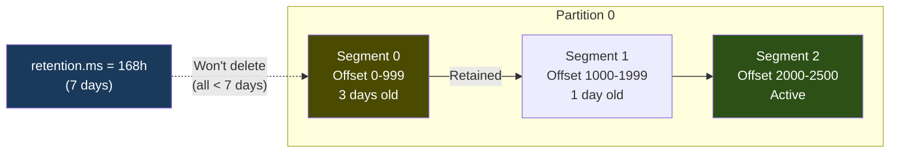
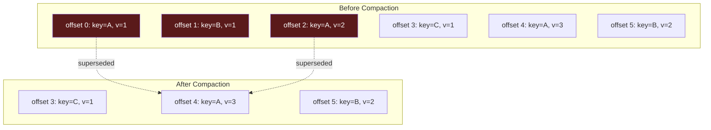
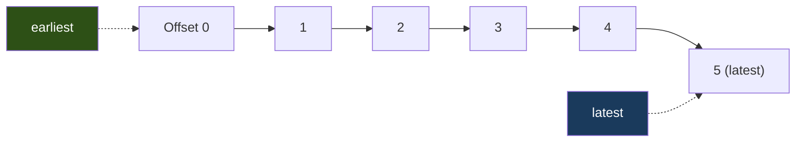
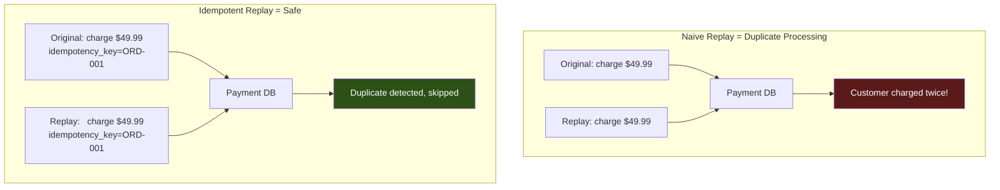

# Phase 7 — Replay & Retention

## Why This Phase Exists

Your Order Pipeline is processing thousands of events daily. Then:

- A bug in the payment consumer charged wrong amounts for 3 hours. You need to **reprocess** those events after fixing the bug.
- The analytics team wants to build a new dashboard from historical order data. They need to **replay** from the beginning.
- Your disk usage is climbing. How long do you keep messages? When is it safe to delete them?

Kafka isn't just a message queue — it's a **durable log**. Understanding retention, replay, and reprocessing is what separates Kafka operators from Kafka users.

---

## Core Concepts

### 1. Retention

Kafka doesn't delete messages after consumption. Messages expire based on **retention policy**.

```
Two retention modes:
  Time-based:   delete messages older than X hours/days  (default: 7 days)
  Size-based:   delete when partition exceeds X bytes
  Both apply:   whichever triggers first wins
```



Key settings:
```
retention.ms      = 604800000    # 7 days (default)
retention.bytes   = -1           # unlimited (default)
segment.bytes     = 1073741824   # 1 GB per segment file
```

### 2. Log Compaction

An alternative to time-based deletion. Instead of deleting old segments, compaction keeps **the latest value for each key**.



Use when:
- You want Kafka as a **state store** (latest order status per orderId)
- New consumers should get the **current state** without processing history
- Combined with tombstones (null value) for deletes

```
cleanup.policy = compact          # enable compaction
cleanup.policy = delete,compact   # both (compact + time-expire)
```

### 3. Consumer Offset Reset

When a new consumer group starts (or its offsets have expired), it needs a starting point:

```
auto.offset.reset = earliest   → Start from offset 0 (replay everything)
auto.offset.reset = latest     → Start from now (skip history)
```



### 4. Replay Strategies

```
Strategy 1: New consumer group
  Create a new group → auto.offset.reset=earliest → reads from 0
  ✅ Simple, no coordination
  ❌ Old group's offsets unaffected

Strategy 2: Reset offsets for existing group
  kafka-consumer-groups --reset-offsets --to-earliest
  ✅ Same group continues
  ❌ Must stop consumers first

Strategy 3: Reset to timestamp
  kafka-consumer-groups --reset-offsets --to-datetime 2024-01-15T00:00:00.000
  ✅ Replay from specific point in time
  ❌ Timestamp → offset mapping is approximate

Strategy 4: Reset to specific offset
  kafka-consumer-groups --reset-offsets --to-offset 1000
  ✅ Precise control
  ❌ Must know exact offset
```

---

## The Replay Problem

Replay is powerful but dangerous:



This is why Phase 4 (idempotency) exists — it makes replay safe.

---

## What You Build in This Phase

### Tools

| Tool | Purpose |
|------|---------|
| `retention-demo` | Creates topics with different retention settings, observes deletion |
| `compaction-demo` | Creates a compacted topic, writes multiple values per key, observes compaction |
| `replay-consumer` | Consumer that replays from beginning with a fresh group |
| `offset-reset` | Programmatic offset reset (to earliest, to timestamp, to offset) |
| `time-travel-consumer` | Consumer that starts from a specific timestamp |

### What You Observe

1. Messages disappear after retention period expires
2. Compacted topics keep only the latest value per key
3. New consumer groups can replay the entire topic
4. Offset reset lets you reprocess from a specific point
5. Timestamp-based reset finds the right offset automatically

---

## CLI Reference

```bash
# ─── Retention ───
# Create topic with 1-minute retention (for demo)
kafka-topics --bootstrap-server localhost:9092 \
  --create --topic orders-short-retention \
  --partitions 3 --replication-factor 1 \
  --config retention.ms=60000

# Check topic config
kafka-configs --bootstrap-server localhost:9092 \
  --entity-type topics --entity-name orders \
  --describe

# Change retention on existing topic
kafka-configs --bootstrap-server localhost:9092 \
  --entity-type topics --entity-name orders \
  --alter --add-config retention.ms=86400000

# ─── Compaction ───
# Create compacted topic
kafka-topics --bootstrap-server localhost:9092 \
  --create --topic order-status \
  --partitions 3 --replication-factor 1 \
  --config cleanup.policy=compact \
  --config min.cleanable.dirty.ratio=0.01 \
  --config segment.ms=1000

# ─── Offset Reset ───
# List current offsets for a group
kafka-consumer-groups --bootstrap-server localhost:9092 \
  --group payment-group --describe

# Reset to earliest (must stop consumers first)
kafka-consumer-groups --bootstrap-server localhost:9092 \
  --group payment-group --topic orders \
  --reset-offsets --to-earliest --execute

# Reset to specific timestamp
kafka-consumer-groups --bootstrap-server localhost:9092 \
  --group payment-group --topic orders \
  --reset-offsets --to-datetime 2024-01-15T10:00:00.000 --execute

# Reset to specific offset
kafka-consumer-groups --bootstrap-server localhost:9092 \
  --group payment-group --topic orders \
  --reset-offsets --to-offset 100 --execute
```

---

## Exercises

1. **Retention countdown**: Create a topic with 60-second retention. Produce 10 messages. Consume them. Wait 90 seconds. Try to consume again with a new group — observe the messages are gone.
2. **Compaction observation**: Write 5 updates for the same orderId to a compacted topic. Wait for compaction. Read from the beginning — only the latest value remains.
3. **Incident replay**: Produce 100 orders, consume them with group A. "Discover a bug." Reset group A's offsets to message 50. Restart consumption — only messages 50-99 are reprocessed.
4. **Time-travel**: Produce messages over 2 minutes. Use timestamp-based reset to replay from 1 minute ago.

---

## Key Takeaways

```
1. Kafka retains messages by time (default 7 days) or size
2. Log compaction keeps latest value per key — useful for state
3. Replay is a first-class operation: new group or offset reset
4. Replay without idempotency = double-processing disasters
5. Timestamp-based reset is approximate but practical for incident recovery
6. retention.ms=0 is NOT instant delete — it means "delete at next cleanup"
```

→ Next: [TypeScript Implementation](./ts-implementation.md)
