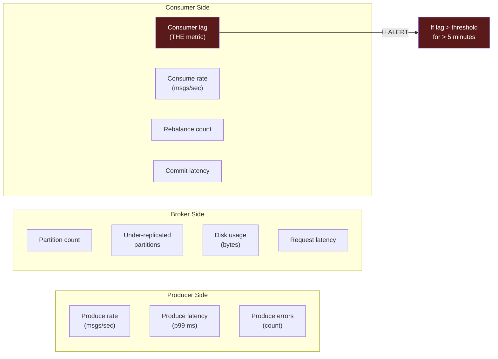
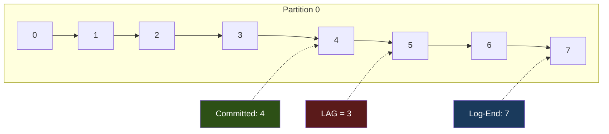

# Phase 8 — Ops & Observability

## Why This Phase Exists

Your Order Pipeline is deployed. Events flow from producer to consumer. But then:

- **Consumer lag climbs to 50,000** and nobody notices for 6 hours.
- A partition leader moves to another broker, and throughput drops 40%.
- A consumer group rebalances every 30 seconds because `session.timeout.ms` is too low.
- Disk fills up on a broker because nobody set retention properly.

You can't operate what you can't observe. This phase teaches the monitoring, alerting, and operational commands that keep Kafka systems alive.

---

## What to Monitor

### The Three Critical Metrics



### Consumer Lag — The Single Most Important Metric

```
Consumer Lag = Latest Offset (log-end) − Consumer's Committed Offset

Lag = 0        → Consumer is caught up
Lag = 100      → 100 messages behind (normal during bursts)
Lag = 10,000+  → Consumer can't keep up (investigate!)
Lag growing    → 🚨 ALERT: consumer is falling behind
```



---

## Operational Commands

### Cluster Health

```bash
# Broker list and controller
kafka-metadata --snapshot /var/kafka-logs/__cluster_metadata-0/00000000000000000000.log --brokers

# Topic details (partitions, replicas, ISR)
kafka-topics --bootstrap-server localhost:9092 --describe --topic orders

# Under-replicated partitions (should be 0)
kafka-topics --bootstrap-server localhost:9092 --describe --under-replicated-partitions

# Broker configs
kafka-configs --bootstrap-server localhost:9092 \
  --entity-type brokers --entity-name 1 --describe
```

### Consumer Group Health

```bash
# Full group status (THE command you'll use most)
kafka-consumer-groups --bootstrap-server localhost:9092 \
  --group payment-group --describe

# Output:
# TOPIC    PARTITION  CURRENT-OFFSET  LOG-END-OFFSET  LAG  CONSUMER-ID  HOST  CLIENT-ID
# orders   0          1500            1523            23   consumer-1   /..   payment-svc
# orders   1          1480            1480            0    consumer-2   /..   payment-svc
# orders   2          1510            1600            90   consumer-1   /..   payment-svc

# List all groups
kafka-consumer-groups --bootstrap-server localhost:9092 --list

# Group state (Stable, Rebalancing, Dead, Empty)
kafka-consumer-groups --bootstrap-server localhost:9092 \
  --group payment-group --describe --state
```

### Performance

```bash
# Producer performance test
kafka-producer-perf-test --topic orders \
  --num-records 10000 --record-size 256 \
  --throughput -1 --producer-props bootstrap.servers=localhost:9092

# Consumer performance test
kafka-consumer-perf-test --bootstrap-server localhost:9092 \
  --topic orders --messages 10000 --group perf-test

# Log dir sizes
kafka-log-dirs --bootstrap-server localhost:9092 --describe
```

---

## Common Failure Patterns

### 1. Consumer Lag Spiral

```
Symptoms:  Lag grows continuously, never recovers
Root Cause: Consumer processing time > produce rate
Fix:
  1. Scale out consumers (add to group, up to partition count)
  2. Optimize processing (batch, async, remove bottlenecks)
  3. Increase partitions (requires producer restart for key distribution)
```

### 2. Rebalance Storm

```
Symptoms:  Group state flips between Stable and Rebalancing
Root Cause: Consumer processing takes longer than session.timeout.ms
Fix:
  1. Increase session.timeout.ms (default 10s → 30s)
  2. Increase max.poll.interval.ms (default 5min)
  3. Reduce max.poll.records to process faster per batch
  4. Check for hung consumers (deadlocks, slow external calls)
```

### 3. Producer Timeout

```
Symptoms:  Producer gets TimeoutException
Root Cause: Broker can't acknowledge within timeout
Fix:
  1. Check broker disk I/O (full disk? slow disk?)
  2. Check network between producer and broker
  3. Increase request.timeout.ms if broker is under load
  4. Check if topic has min.insync.replicas > available brokers
```

### 4. Offset Out of Range

```
Symptoms:  Consumer gets OffsetOutOfRangeException
Root Cause: Consumer's committed offset is older than retained data
Fix:
  1. Increase retention.ms on the topic
  2. Set auto.offset.reset=earliest to recover
  3. Monitor lag to catch falling-behind consumers
```

---

## What You Build in This Phase

### Tools

| Tool | Purpose |
|------|---------|
| `lag-monitor` | Continuously polls consumer group lag, alerts on threshold |
| `throughput-meter` | Measures produce/consume rates in real-time |
| `health-check` | Checks broker, topic, and consumer group health |
| `load-generator` | Sustained load producer for testing consumer capacity |

### What You Observe

1. Lag growing when consumer can't keep up with producer
2. Lag recovering when you add more consumers to the group
3. Rebalance events when consumers join/leave
4. Throughput metrics for producer and consumer
5. Health check reporting on cluster status

---

## Exercises

1. **Lag alert**: Run the lag monitor with a threshold of 100. Start the load generator at 50 msg/s. Start one slow consumer (100ms delay per message). Watch lag grow and trigger alerts. Add a second consumer instance to the same group. Watch lag recover.

2. **Rebalance observation**: Start 3 consumers in a group. Kill one. Watch the rebalance. Start it back. Watch the rebalance again. Measure how long each rebalance takes.

3. **Throughput ceiling**: Use the load generator to find your local cluster's maximum throughput. Start at 100 msg/s, increase to 1000, 5000, 10000. Where does latency spike?

4. **Full health report**: Run the health check tool and interpret every line. Fix any issues it reports.

---

## Key Takeaways

```
1. Consumer lag is THE metric — monitor it, alert on it, never ignore it
2. Lag = log-end-offset − committed-offset (per partition)
3. kafka-consumer-groups --describe is your most-used command
4. Rebalance storms usually mean session.timeout.ms is too low
5. Scale consumers up to partition count, never beyond
6. Monitor disk, not just messages — retention fills disks
7. Producer errors usually mean broker/network problems, not code bugs
```

→ Next: [TypeScript Implementation](./ts-implementation.md)
