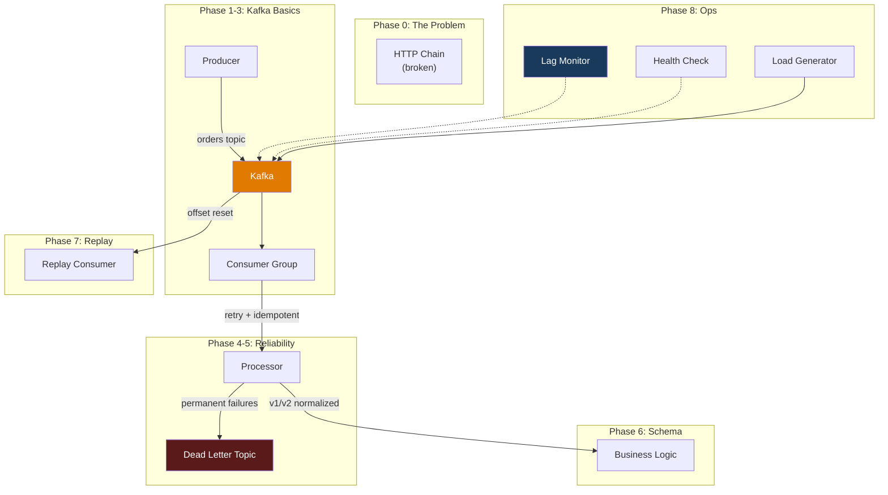

# Phase 8 — Go Implementation

## Setup

### File Structure

```
go/
├── cmd/
│   ├── lag-monitor/main.go
│   ├── throughput-meter/main.go
│   ├── health-check/main.go
│   └── load-generator/main.go
├── go.mod
└── go.sum
```

---

## Tool 1: `cmd/lag-monitor/main.go` — Consumer Lag Alerting

```go
package main

import (
	"context"
	"fmt"
	"log"
	"net"
	"os"
	"os/signal"
	"strconv"
	"strings"
	"syscall"
	"time"

	"github.com/segmentio/kafka-go"
)

type partitionLag struct {
	topic         string
	partition     int
	currentOffset int64
	logEndOffset  int64
	lag           int64
}

func main() {
	groupID := "payment-group-go"
	threshold := int64(100)
	intervalSec := 5

	if len(os.Args) > 1 {
		groupID = os.Args[1]
	}
	if len(os.Args) > 2 {
		threshold, _ = strconv.ParseInt(os.Args[2], 10, 64)
	}
	if len(os.Args) > 3 {
		intervalSec, _ = strconv.Atoi(os.Args[3])
	}

	log.Printf("[Lag Monitor] Watching group: %s", groupID)
	log.Printf("[Lag Monitor] Alert threshold: %d", threshold)
	log.Printf("[Lag Monitor] Poll interval: %ds\n", intervalSec)

	ctx, cancel := context.WithCancel(context.Background())
	sigChan := make(chan os.Signal, 1)
	signal.Notify(sigChan, syscall.SIGINT, syscall.SIGTERM)
	go func() {
		<-sigChan
		cancel()
	}()

	alertActive := false
	consecutiveAlerts := 0

	ticker := time.NewTicker(time.Duration(intervalSec) * time.Second)
	defer ticker.Stop()

	// Immediate first check
	checkLag(ctx, groupID, threshold, &alertActive, &consecutiveAlerts)

	for {
		select {
		case <-ctx.Done():
			return
		case <-ticker.C:
			checkLag(ctx, groupID, threshold, &alertActive, &consecutiveAlerts)
		}
	}
}

func checkLag(ctx context.Context, groupID string, threshold int64, alertActive *bool, consecutiveAlerts *int) {
	topic := "orders"
	now := time.Now().Format("15:04:05")

	// Get partitions
	conn, err := kafka.Dial("tcp", "localhost:9092")
	if err != nil {
		fmt.Printf("[%s] ❌ Connection error: %v\n", now, err)
		return
	}
	defer conn.Close()

	partitions, err := conn.ReadPartitions(topic)
	if err != nil {
		fmt.Printf("[%s] ❌ Partition read error: %v\n", now, err)
		return
	}

	var lags []partitionLag
	var totalLag int64

	// Get consumer group offsets using kafka.Client
	client := &kafka.Client{Addr: kafka.TCP("localhost:9092")}

	partIDs := make([]int, len(partitions))
	for i, p := range partitions {
		partIDs[i] = p.ID
	}

	offsetResp, err := client.OffsetFetch(ctx, &kafka.OffsetFetchRequest{
		GroupID: groupID,
		Topics:  map[string][]int{topic: partIDs},
	})

	for _, p := range partitions {
		// Get log-end offset per partition
		partConn, err := kafka.DialLeader(ctx, "tcp", net.JoinHostPort(p.Leader.Host, strconv.Itoa(p.Leader.Port)), topic, p.ID)
		if err != nil {
			continue
		}
		logEnd, _ := partConn.ReadLastOffset()
		partConn.Close()

		// Get committed offset
		var committed int64
		if err == nil && offsetResp != nil {
			if topicParts, ok := offsetResp.Topics[topic]; ok {
				for _, tp := range topicParts {
					if tp.Partition == p.ID {
						committed = tp.CommittedOffset
						break
					}
				}
			}
		}

		lag := logEnd - committed
		if lag < 0 {
			lag = 0
		}

		lags = append(lags, partitionLag{
			topic:         topic,
			partition:     p.ID,
			currentOffset: committed,
			logEndOffset:  logEnd,
			lag:           lag,
		})
		totalLag += lag
	}

	// Status line
	status := "✅"
	if totalLag > threshold {
		status = "🚨"
		*consecutiveAlerts++
	} else {
		*consecutiveAlerts = 0
	}

	fmt.Printf("[%s] %s %s | total_lag=%d\n", now, status, groupID, totalLag)

	// Per-partition detail
	for _, l := range lags {
		barLen := int(l.lag / 10)
		if barLen > 50 {
			barLen = 50
		}
		bar := strings.Repeat("█", barLen)

		lagStr := fmt.Sprintf("%d", l.lag)
		if l.lag > threshold {
			lagStr = fmt.Sprintf("⚠️  %d", l.lag)
		}
		fmt.Printf("  P%d: %d/%d lag=%s %s\n", l.partition, l.currentOffset, l.logEndOffset, lagStr, bar)
	}

	// Alert logic
	if totalLag > threshold && !*alertActive {
		*alertActive = true
		fmt.Printf("\n  🚨 ALERT: Lag %d exceeds threshold %d!\n", totalLag, threshold)
		fmt.Println("  🚨 Action: Check consumer health, consider scaling out")
	} else if totalLag <= threshold && *alertActive {
		*alertActive = false
		fmt.Printf("\n  ✅ RECOVERED: Lag back to normal (%d)\n", totalLag)
	}

	if *consecutiveAlerts >= 3 {
		fmt.Printf("  🔥 CRITICAL: Lag above threshold for %d consecutive checks\n", *consecutiveAlerts)
	}

	fmt.Println()
}
```

---

## Tool 2: `cmd/throughput-meter/main.go` — Real-time Rates

```go
package main

import (
	"context"
	"fmt"
	"log"
	"os"
	"os/signal"
	"sync/atomic"
	"syscall"
	"time"

	"github.com/segmentio/kafka-go"
)

func main() {
	topic := "orders"
	if len(os.Args) > 1 {
		topic = os.Args[1]
	}

	reader := kafka.NewReader(kafka.ReaderConfig{
		Brokers:     []string{"localhost:9092"},
		Topic:       topic,
		GroupID:     fmt.Sprintf("throughput-meter-%d", time.Now().UnixNano()),
		MinBytes:    1,
		MaxBytes:    10e6,
		StartOffset: kafka.LastOffset,
	})
	defer reader.Close()

	var msgCount int64
	var byteCount int64
	var totalMessages int64

	log.Printf("[Throughput Meter] Measuring consume rate on '%s'", topic)
	log.Println("[Throughput Meter] Start producing messages to see throughput")
	fmt.Println()

	ctx, cancel := context.WithCancel(context.Background())
	sigChan := make(chan os.Signal, 1)
	signal.Notify(sigChan, syscall.SIGINT, syscall.SIGTERM)
	go func() {
		<-sigChan
		cancel()
	}()

	// Consumer goroutine
	go func() {
		for {
			msg, err := reader.FetchMessage(ctx)
			if err != nil {
				return
			}
			size := int64(len(msg.Key) + len(msg.Value))
			atomic.AddInt64(&msgCount, 1)
			atomic.AddInt64(&byteCount, size)
			atomic.AddInt64(&totalMessages, 1)
			reader.CommitMessages(ctx, msg)
		}
	}()

	// Stats reporter
	ticker := time.NewTicker(2 * time.Second)
	defer ticker.Stop()

	for {
		select {
		case <-ctx.Done():
			return
		case <-ticker.C:
			msgs := atomic.SwapInt64(&msgCount, 0)
			bytes := atomic.SwapInt64(&byteCount, 0)
			total := atomic.LoadInt64(&totalMessages)

			rate := float64(msgs) / 2.0
			kbRate := float64(bytes) / 2.0 / 1024.0

			now := time.Now().Format("15:04:05")
			fmt.Printf("[%s] %.0f msg/s | %.1f KB/s | total: %d\n", now, rate, kbRate, total)
		}
	}
}
```

---

## Tool 3: `cmd/health-check/main.go` — Cluster Health Report

```go
package main

import (
	"context"
	"fmt"
	"log"
	"net"
	"strconv"

	"github.com/segmentio/kafka-go"
)

func main() {
	conn, err := kafka.Dial("tcp", "localhost:9092")
	if err != nil {
		log.Fatal("Cannot connect to Kafka:", err)
	}
	defer conn.Close()

	fmt.Println("╔══════════════════════════════════════════════════════")
	fmt.Println("║ KAFKA CLUSTER HEALTH CHECK")
	fmt.Println("╠══════════════════════════════════════════════════════")

	var issues []string

	// ─── Brokers ───
	brokers, err := conn.Brokers()
	if err != nil {
		log.Fatal("Cannot list brokers:", err)
	}

	controller, _ := conn.Controller()

	fmt.Println("║")
	fmt.Printf("║ Controller: Broker %d\n", controller.ID)
	fmt.Printf("║ Brokers: %d\n", len(brokers))
	for _, b := range brokers {
		fmt.Printf("║   ID=%d %s:%d\n", b.ID, b.Host, b.Port)
	}

	// ─── Topics ───
	partitions, err := conn.ReadPartitions()
	if err != nil {
		log.Fatal("Cannot read partitions:", err)
	}

	// Group by topic
	topicPartitions := make(map[string][]kafka.Partition)
	for _, p := range partitions {
		topicPartitions[p.Topic] = append(topicPartitions[p.Topic], p)
	}

	fmt.Println("║")
	fmt.Printf("║ Topics: %d\n", len(topicPartitions))

	totalPartitions := 0
	underReplicated := 0

	for topic, parts := range topicPartitions {
		totalPartitions += len(parts)
		for _, p := range parts {
			if len(p.Isr) < len(p.Replicas) {
				underReplicated++
				issues = append(issues, fmt.Sprintf(
					"%s P%d: ISR=%d/%d",
					topic, p.ID, len(p.Isr), len(p.Replicas),
				))
			}
		}
		fmt.Printf("║   %s: %d partitions\n", topic, len(parts))
	}

	fmt.Println("║")
	fmt.Printf("║ Total partitions: %d\n", totalPartitions)
	fmt.Printf("║ Under-replicated: %d\n", underReplicated)

	// ─── Consumer groups ───
	controllerConn, _ := kafka.Dial("tcp",
		net.JoinHostPort(controller.Host, strconv.Itoa(controller.Port)))
	defer controllerConn.Close()

	client := &kafka.Client{Addr: kafka.TCP("localhost:9092")}
	groupsResp, err := client.ListGroups(context.Background(), &kafka.ListGroupsRequest{})
	if err == nil {
		fmt.Println("║")
		fmt.Printf("║ Consumer Groups: %d\n", len(groupsResp.Groups))

		for _, g := range groupsResp.Groups {
			stateIcon := "✅"

			// Describe group for member count
			descResp, err := client.DescribeGroups(context.Background(), &kafka.DescribeGroupsRequest{
				GroupIDs: []string{g.GroupID},
			})
			memberCount := 0
			state := "Unknown"
			if err == nil && len(descResp.Groups) > 0 {
				memberCount = len(descResp.Groups[0].Members)
				state = descResp.Groups[0].GroupState

				switch state {
				case "Empty":
					stateIcon = "⚪"
				case "PreparingRebalance", "CompletingRebalance":
					stateIcon = "⚠️"
					issues = append(issues, fmt.Sprintf("Group %s is rebalancing", g.GroupID))
				case "Dead":
					stateIcon = "❌"
				}
			}

			fmt.Printf("║   %s %s: %s (%d members)\n", stateIcon, g.GroupID, state, memberCount)
		}
	}

	// ─── Overall ───
	fmt.Println("║")
	fmt.Println("╠══════════════════════════════════════════════════════")

	if len(issues) == 0 {
		fmt.Println("║ ✅ HEALTHY — No issues detected")
	} else {
		fmt.Printf("║ ⚠️  %d ISSUE(S) FOUND:\n", len(issues))
		for _, issue := range issues {
			fmt.Printf("║   - %s\n", issue)
		}
	}

	fmt.Println("╚══════════════════════════════════════════════════════")
}
```

---

## Tool 4: `cmd/load-generator/main.go` — Sustained Load Producer

```go
package main

import (
	"context"
	"encoding/json"
	"fmt"
	"log"
	"math/rand"
	"os"
	"os/signal"
	"strconv"
	"sync/atomic"
	"syscall"
	"time"

	"github.com/segmentio/kafka-go"
)

func main() {
	targetRate := 10 // msg/s
	durationSec := 60
	topic := "orders"

	if len(os.Args) > 1 {
		targetRate, _ = strconv.Atoi(os.Args[1])
	}
	if len(os.Args) > 2 {
		durationSec, _ = strconv.Atoi(os.Args[2])
	}
	if len(os.Args) > 3 {
		topic = os.Args[3]
	}

	writer := &kafka.Writer{
		Addr:     kafka.TCP("localhost:9092"),
		Topic:    topic,
		Balancer: &kafka.Hash{},
	}
	defer writer.Close()

	log.Printf("[Load Generator] Target: %d msg/s for %ds", targetRate, durationSec)
	log.Printf("[Load Generator] Topic: %s", topic)
	log.Printf("[Load Generator] Expected: %d messages\n", targetRate*durationSec)

	ctx, cancel := context.WithCancel(context.Background())
	sigChan := make(chan os.Signal, 1)
	signal.Notify(sigChan, syscall.SIGINT, syscall.SIGTERM)
	go func() {
		<-sigChan
		cancel()
	}()

	var sent int64
	var errors int64
	startTime := time.Now()
	deadline := startTime.Add(time.Duration(durationSec) * time.Second)

	intervalNs := time.Second / time.Duration(targetRate)

	ticker := time.NewTicker(intervalNs)
	defer ticker.Stop()

	// Progress reporter
	go func() {
		progressTicker := time.NewTicker(time.Second)
		defer progressTicker.Stop()
		for {
			select {
			case <-ctx.Done():
				return
			case <-progressTicker.C:
				s := atomic.LoadInt64(&sent)
				elapsed := time.Since(startTime).Seconds()
				if s > 0 && int(s)%100 == 0 {
					rate := float64(s) / elapsed
					fmt.Printf("  [%.0fs] Sent: %d | Rate: %.1f msg/s\n", elapsed, s, rate)
				}
			}
		}
	}()

	for {
		select {
		case <-ctx.Done():
			printSummary(sent, errors, startTime)
			return
		case <-ticker.C:
			if time.Now().After(deadline) {
				cancel()
				printSummary(sent, errors, startTime)
				return
			}

			n := atomic.AddInt64(&sent, 1)
			orderId := fmt.Sprintf("ORD-load-%d", n)

			value, _ := json.Marshal(map[string]interface{}{
				"version":   2,
				"eventType": "ORDER_CREATED",
				"timestamp": time.Now().UTC().Format(time.RFC3339),
				"source":    "load-generator",
				"payload": map[string]interface{}{
					"orderId":  orderId,
					"userId":   fmt.Sprintf("user-%d", (n%100)+1),
					"amount":   float64(rand.Intn(50000)) / 100.0,
					"currency": "USD",
				},
			})

			err := writer.WriteMessages(ctx, kafka.Message{
				Key:   []byte(orderId),
				Value: value,
			})
			if err != nil {
				atomic.AddInt64(&errors, 1)
			}
		}
	}
}

func printSummary(sent, errors int64, startTime time.Time) {
	elapsed := time.Since(startTime).Seconds()
	rate := float64(sent) / elapsed

	fmt.Printf("\n[Load Generator] Done.\n")
	fmt.Printf("  Sent: %d messages\n", sent)
	fmt.Printf("  Errors: %d\n", errors)
	fmt.Printf("  Duration: %.1fs\n", elapsed)
	fmt.Printf("  Actual rate: %.1f msg/s\n", rate)
}
```

**Usage:**

```bash
# 10 msg/s for 60 seconds
go run cmd/load-generator/main.go 10 60

# 100 msg/s for 30 seconds
go run cmd/load-generator/main.go 100 30

# Stress test
go run cmd/load-generator/main.go 500 10
```

---

## Idiomatic Differences: TypeScript vs Go

| Aspect | TypeScript | Go |
|--------|-----------|-----|
| **Admin API** | `admin.describeCluster()`, `admin.fetchOffsets()` — rich API | `kafka.Client{}` + `kafka.Dial` — lower-level, more manual |
| **Atomic counters** | Regular variables (single-threaded event loop) | `sync/atomic` for goroutine-safe counters |
| **Periodic tasks** | `setInterval(fn, ms)` | `time.NewTicker(duration)` + select loop |
| **Signal handling** | `process.on("SIGINT")` | `signal.Notify(sigChan)` + goroutine |
| **Progress output** | Direct console.log in interval | Goroutine with ticker, atomic reads |

Go's admin API via kafka-go is less comprehensive than kafkajs. For production monitoring, you'd typically use JMX metrics exposed by the Kafka broker, combined with tools like Prometheus + Grafana, rather than polling via client libraries.

---

## Running the Full Demo

### Scenario: Watch Lag Grow and Recover

```bash
# Terminal 1: Lag monitor
go run cmd/lag-monitor/main.go payment-group-go 50 3

# Terminal 2: Throughput meter
go run cmd/throughput-meter/main.go orders

# Terminal 3: Health check (one-shot)
go run cmd/health-check/main.go

# Terminal 4: Generate load
go run cmd/load-generator/main.go 50 120

# Terminal 5: Start one consumer (from Phase 4)
go run cmd/consumer-with-dlt/main.go consumer-A

# Watch lag grow → start second consumer → watch lag recover
```

---

## What You've Built: The Complete Pipeline



You've built a production-grade Kafka pipeline from scratch:
1. Started with the problem (synchronous HTTP chain)
2. Introduced Kafka fundamentals (topics, partitions, groups)
3. Added reliability (retries, idempotency, dead letters)
4. Handled evolution (schema versioning, normalization)
5. Mastered operations (replay, retention, monitoring)

→ Back to [README](../README.md) for the full curriculum map
