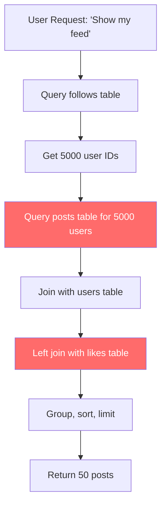
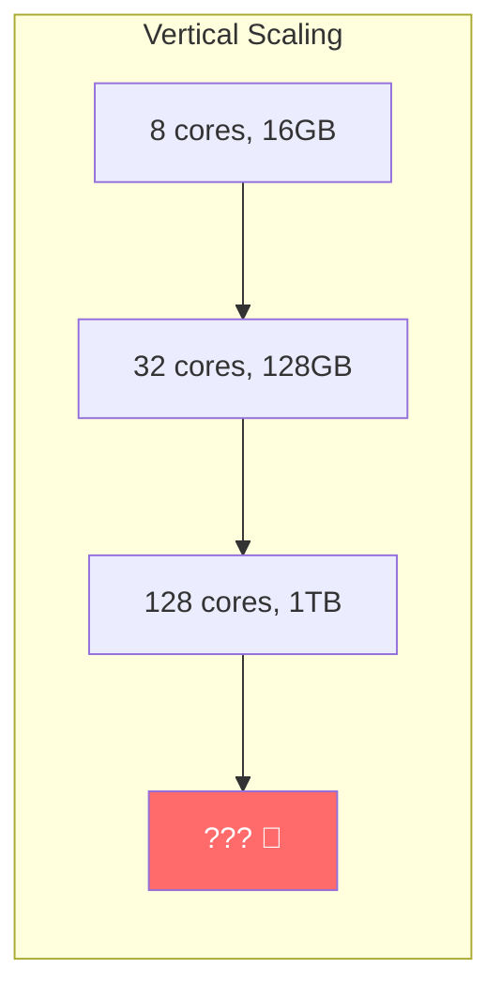
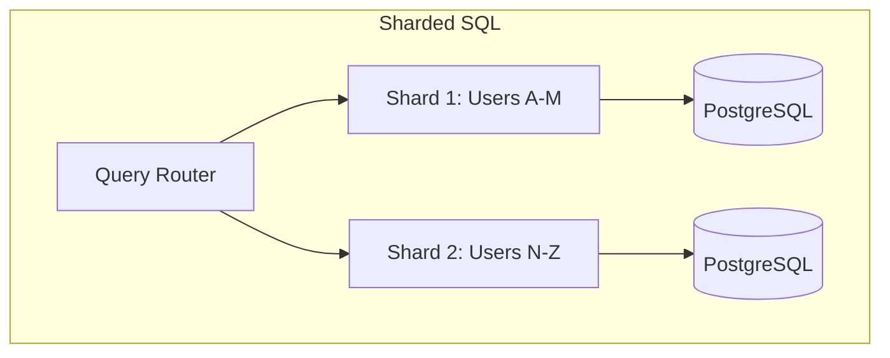
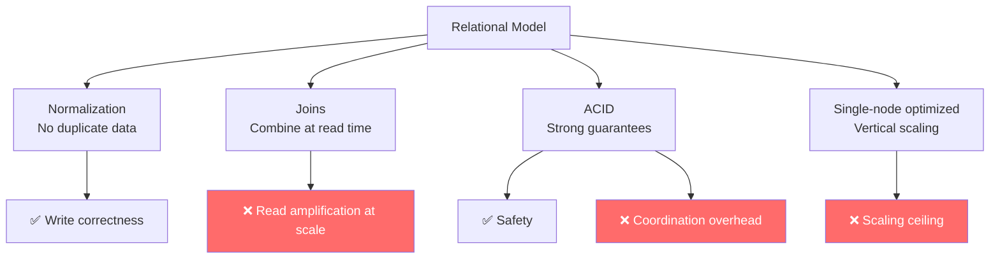
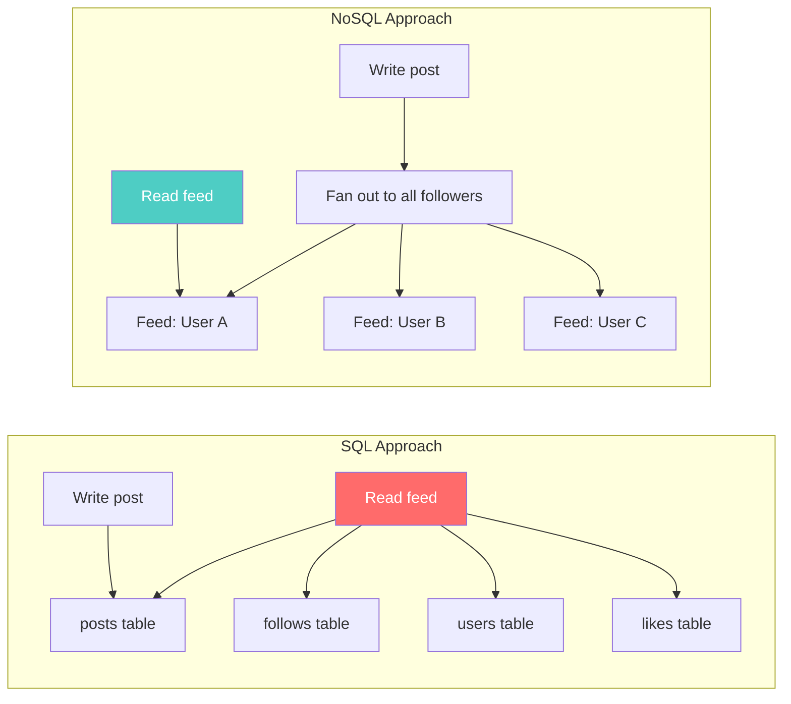

# The Limits of Relational Databases at Scale

---

## The Story That Started It All

It's 2006. You're an engineer at a social media company. Your PostgreSQL database has served you well for three years. Users create posts, follow each other, like things, comment. Classic relational design.

Your schema looks beautiful:

```sql
CREATE TABLE users (
    id SERIAL PRIMARY KEY,
    username VARCHAR(50) UNIQUE,
    email VARCHAR(255),
    created_at TIMESTAMPTZ DEFAULT NOW()
);

CREATE TABLE posts (
    id SERIAL PRIMARY KEY,
    user_id INT REFERENCES users(id),
    content TEXT,
    created_at TIMESTAMPTZ DEFAULT NOW()
);

CREATE TABLE follows (
    follower_id INT REFERENCES users(id),
    following_id INT REFERENCES users(id),
    PRIMARY KEY (follower_id, following_id)
);

CREATE TABLE likes (
    user_id INT REFERENCES users(id),
    post_id INT REFERENCES posts(id),
    PRIMARY KEY (user_id, post_id)
);
```

Clean. Normalized. Third normal form. Your database professor would be proud.

Then the users show up. 10 million of them. And each one wants their home feed — the last 50 posts from everyone they follow — served in under 200ms.

---

## The Query That Breaks Everything

Here's the home feed query:

```sql
SELECT p.*, u.username, u.avatar_url,
       COUNT(l.user_id) as like_count
FROM posts p
JOIN users u ON p.user_id = u.id
LEFT JOIN likes l ON p.id = l.post_id
WHERE p.user_id IN (
    SELECT following_id FROM follows WHERE follower_id = $1
)
GROUP BY p.id, u.id
ORDER BY p.created_at DESC
LIMIT 50;
```

This query does:
1. A subquery on `follows` — could return 5,000 rows (users you follow)
2. A scan on `posts` — filtered by those 5,000 user IDs
3. A JOIN to `users` — to get display names
4. A LEFT JOIN to `likes` — aggregated per post
5. A GROUP BY and ORDER BY — memory-intensive sort

With 10 million users, 500 million posts, and 2 billion likes, this query takes **4 seconds**. Your SLA is 200ms.

---

## Why SQL Struggles Here (It's Not SQL's Fault)

Let's be precise about what's happening:

### 1. Joins Are Expensive at Scale



JOINs require the database to find matching rows across tables. For small tables, this is fast — the optimizer uses hash joins or merge joins effectively. But when one side of the join has millions of rows, even indexed lookups become expensive because:

- Each lookup is a **random disk I/O** (or a B-tree traversal)
- The database must hold intermediate results in memory
- Sorting those results adds CPU and memory pressure

### 2. Normalization Creates Read Amplification

Your data is perfectly normalized — no duplication. But to serve one user request, you're reading from **four tables**. This is called **read amplification**: the ratio of actual disk/memory reads to logical data requests.

```
SQL normalized read amplification:
1 user request → 4 table reads → thousands of row lookups → 1 response
```

Normalization optimizes for **write correctness** (no duplicated data to get out of sync). But reads pay the price.

### 3. Vertical Scaling Hits a Ceiling

Your first instinct: bigger server. More RAM, faster SSDs, more CPU cores.



This works — for a while. But:
- There's a physical limit to how big a single machine can be
- Cost scales **super-linearly** (a machine with 2x the RAM costs 3–4x)
- A single machine is a **single point of failure**
- You can't shard a single PostgreSQL instance trivially

### 4. Horizontal Scaling in SQL Is Painful

"Just add more servers!" In SQL, this means **sharding** — splitting data across multiple databases.



But now:
- **Cross-shard joins become impossible** — if User A (shard 1) follows User Z (shard 2), the feed query must touch both shards
- **Transactions across shards** require 2-phase commit — slow and fragile
- **Foreign keys can't span shards** — referential integrity is now your application's problem
- **Rebalancing** (moving data when you add shards) is an operational nightmare

You've effectively given up core SQL guarantees — but you're still paying the complexity tax of SQL.

---

## The Fundamental Tension

Here's the insight that created NoSQL:



SQL optimizes for:
- **Correctness** — data is consistent, normalized, constrained
- **Flexibility** — any query on any combination of data
- **Single-machine performance** — buffer pools, query planners, statistics

SQL struggles with:
- **Horizontal distribution** — data across many machines
- **Read performance at massive scale** — joins become bottlenecks
- **Availability during failures** — a single master is a single point of failure

---

## What NoSQL Actually Is

NoSQL is not "no SQL." It's "not only SQL" — or more accurately: **different tradeoffs**.

NoSQL databases were born from a specific realization: **if you know your access patterns in advance, you can pre-compute the shape of reads and distribute data across machines cheaply**.

The social media feed problem? NoSQL says: instead of joining at read time, **denormalize at write time**.



The read is now a **single lookup** — no joins. The cost moved to writes (fan-out), but writes can be asynchronous and distributed.

---

## What You Give Up

This is the part that NoSQL marketing skips:

| What SQL gives you | What NoSQL typically sacrifices |
|-------------------|-------------------------------|
| Ad-hoc queries on any data | You must know your queries upfront |
| JOIN across any entities | Data is denormalized — duplicated |
| Strong consistency (ACID) | Usually eventual consistency |
| Schema enforcement | Schema is the application's problem |
| Referential integrity | No foreign keys — orphaned data is your problem |
| Single source of truth | Multiple copies of the same data |

**NoSQL doesn't solve the hard problems — it moves them.** Instead of solving them at the database layer, you solve them in your application code, your data pipeline, or your operational procedures.

---

## The Key Insight

> **SQL: "Store the data correctly. Figure out how to read it later."**
> **NoSQL: "Know how you'll read the data. Store it that way."**

Neither is wrong. They optimize for different things. The rest of this curriculum teaches you when each approach wins.

---

## Next

→ [02-cap-theorem-without-handwaving.md](./02-cap-theorem-without-handwaving.md) — We need to understand the theoretical foundation of *why* distributed databases force tradeoffs.
