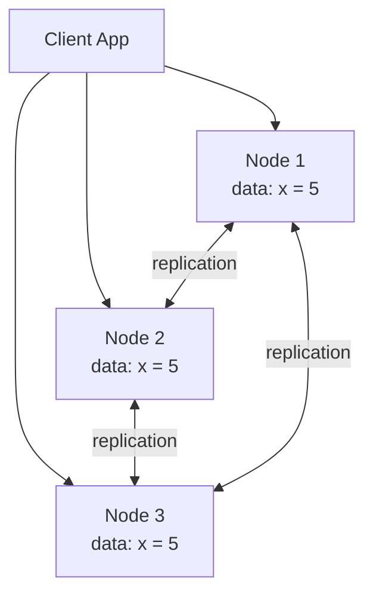
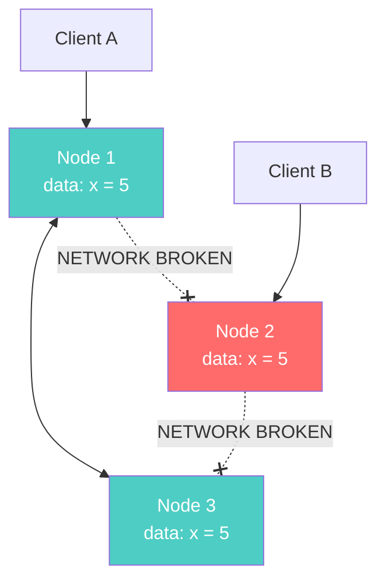
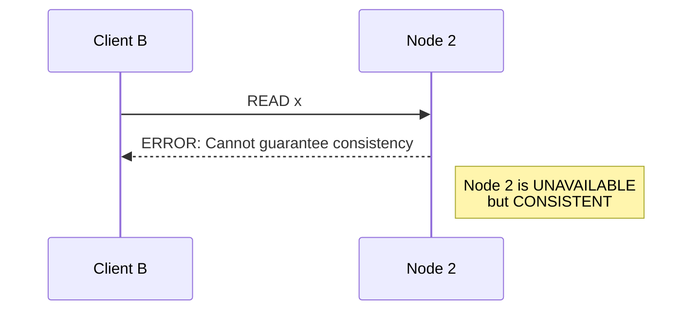
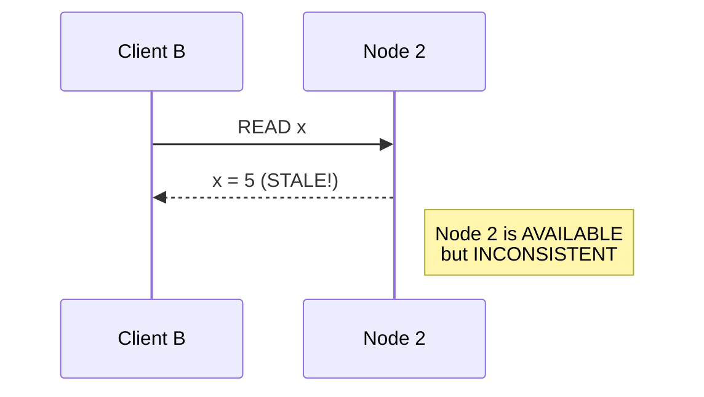
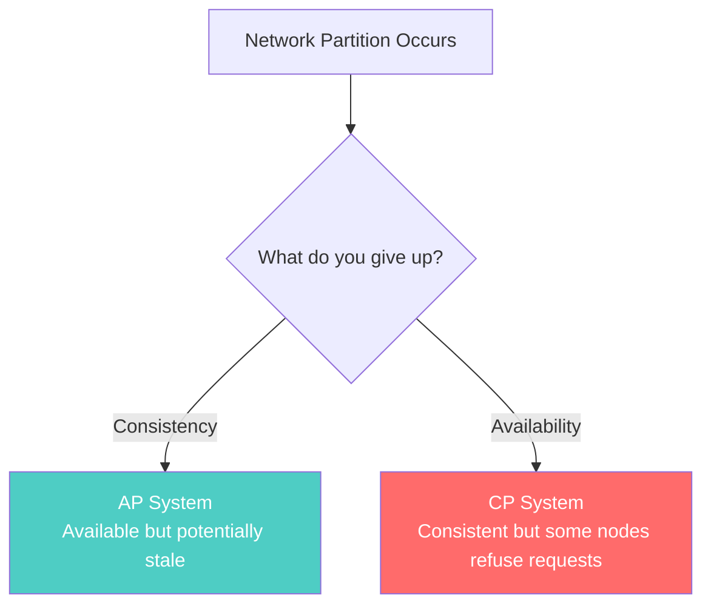
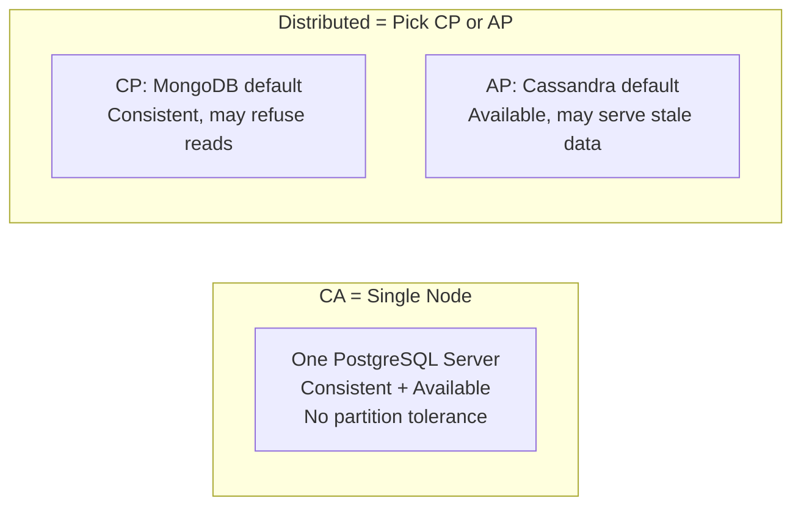
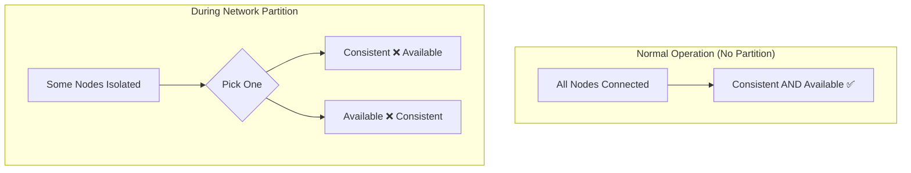
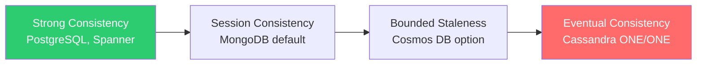

# CAP Theorem — Without the Hand-Waving

---

## Why You Need This

Every NoSQL discussion eventually invokes the CAP theorem. Most of those discussions get it wrong. They say things like "MongoDB is CP" or "Cassandra is AP" as if these are permanent personality traits.

The CAP theorem is more nuanced — and more useful — than that. Let's actually understand it.

---

## The Setup: A Distributed Database

You have three database nodes. They all hold copies of the same data.

Everything works fine. A write goes to Node 1, gets replicated to Nodes 2 and 3. Every node agrees. Life is good.

Then the network between Node 1 and Node 2 breaks.

---

## The Partition

Node 2 is now isolated. It can't talk to Nodes 1 and 3.

Client A writes `x = 10` to Node 1. Node 1 replicates to Node 3. But Node 2 still thinks `x = 5`.

Now Client B reads from Node 2. **What should it get?**

---

## The Two Choices

### Choice 1: Consistency (Refuse to Answer)

Node 2 says: "I'm not sure I have the latest data. I'll refuse to answer until I can talk to the other nodes again."

**Consistency preserved.** No stale reads. But the system is less available — Node 2 is effectively down.

### Choice 2: Availability (Answer with What You Have)

Node 2 says: "I'll give you the data I have. It might be stale, but at least you get an answer."

**Availability preserved.** Every request gets a response. But the data might be wrong.

---

## The Theorem (Formally)

> **In the presence of a network partition, a distributed system must choose between consistency and availability. It cannot guarantee both.**

Three terms:

| Term | Definition |
|------|-----------|
| **Consistency** | Every read returns the most recent write (linearizability) |
| **Availability** | Every request receives a non-error response |
| **Partition Tolerance** | The system continues to operate despite network failures |

Key insight: **You don't choose 2 out of 3.** Partitions happen. They are not optional. The real question answered by CAP is:

> **When a partition occurs, do you sacrifice consistency or availability?**

---

## What About CA?

"Can I choose Consistency + Availability and skip Partition Tolerance?"

No. That would mean your system **cannot tolerate any network failure**. That's a single-node database. Which is... regular PostgreSQL on one machine.

**CA is a single machine.** The moment you distribute, you must tolerate partitions.

---

## Why People Get CAP Wrong

### Mistake 1: "MongoDB is CP, Cassandra is AP"

These are **defaults**, not identities. MongoDB can be configured to serve stale reads from secondaries (AP-like). Cassandra can be configured with `QUORUM` reads/writes to get strong consistency (CP-like).

The CAP category describes the **default behavior during a partition**, not the database's entire personality.

### Mistake 2: "CAP means you lose consistency OR availability all the time"

No. CAP only describes behavior **during a partition**. When the network is healthy, you can have both consistency and availability.

### Mistake 3: "Eventual consistency means data loss"

No. Eventually consistent systems **will** converge to the correct state. The question is **when**, not **if**. We'll cover this in detail in the next section.

---

## CAP in Practice

Here's how real databases handle partitions:

| Database | Default During Partition | What Happens |
|----------|------------------------|--------------|
| PostgreSQL (single) | N/A — no partition possible | CA system |
| PostgreSQL (streaming replication) | Writable primary only | CP — secondaries may lag |
| MongoDB (replica set) | Reads/writes only on primary | CP — secondaries step down |
| Cassandra | Continues serving all nodes | AP — stale reads possible |
| DynamoDB | Continues serving | AP — with conflict resolution |
| Redis Cluster | Depends on config | CP or AP depending on settings |

---

## The Real Spectrum

CAP is actually too simple. In reality, databases exist on a spectrum:

Most modern databases let you tune where you sit on this spectrum. The tradeoff is always the same: **stronger consistency = higher latency and lower availability**.

---

## The SQL Developer's Takeaway

If you come from SQL, you've been living in a CA world without knowing it. Your PostgreSQL instance on one server gives you both consistency and availability because **there's no network to partition**.

The moment you distribute data across machines — for scale, for availability, for geographic proximity — you enter CAP territory. And you must decide what to give up.

This is why NoSQL exists: it was born from the need to distribute data, and it embraces the tradeoffs that come with distribution rather than pretending they don't exist.

---

## Next

→ [03-eventual-consistency-as-feature.md](./03-eventual-consistency-as-feature.md) — If eventual consistency sounds scary, good. Let's explain why it's actually a rational engineering choice.
