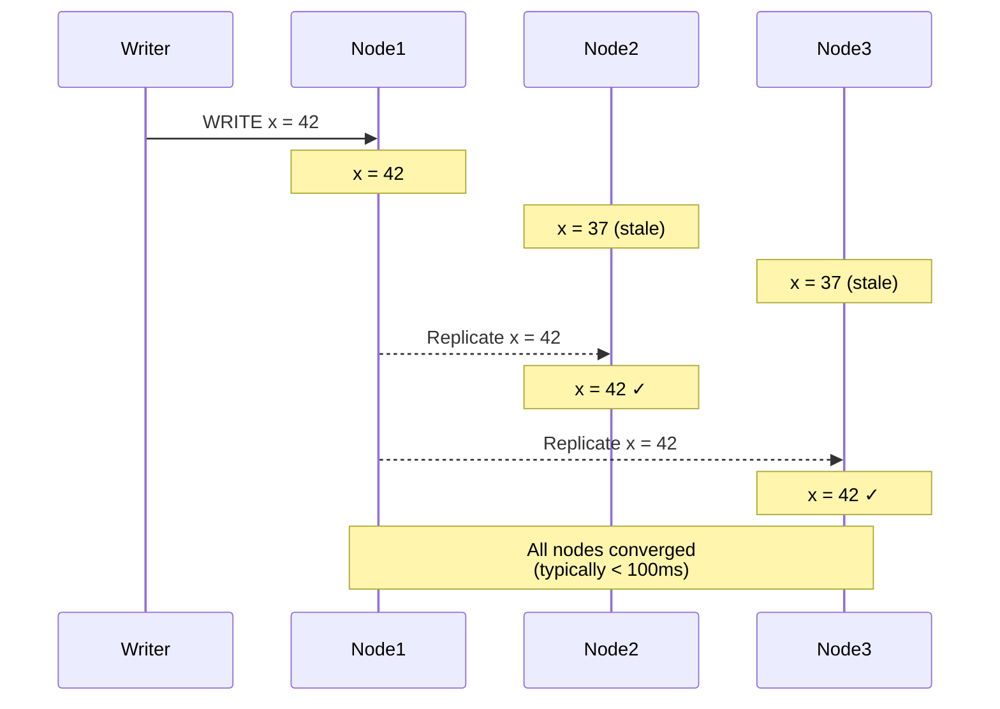
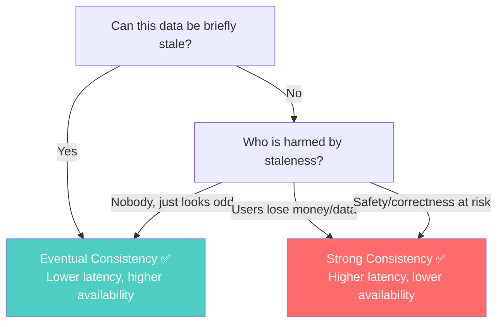
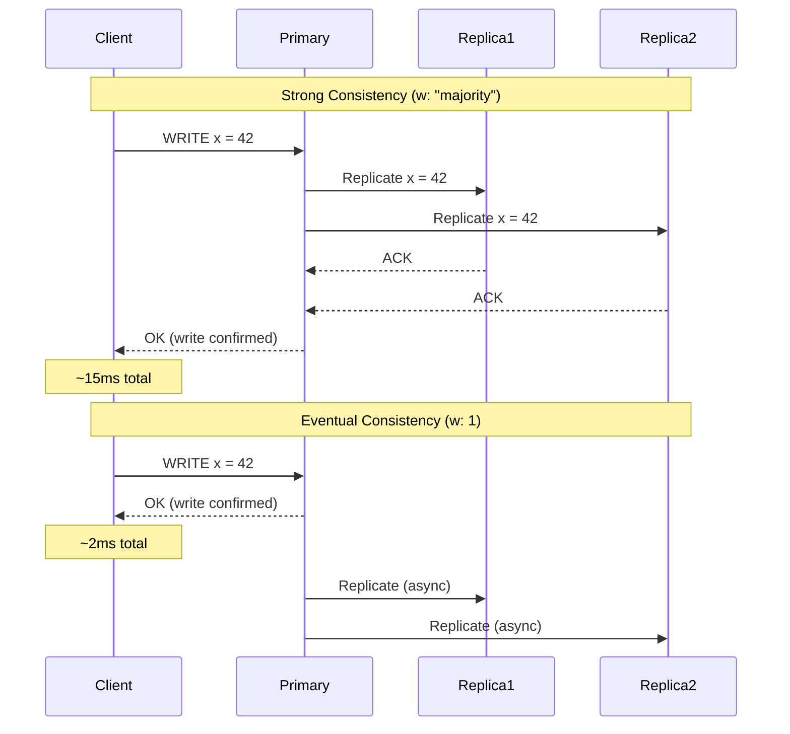
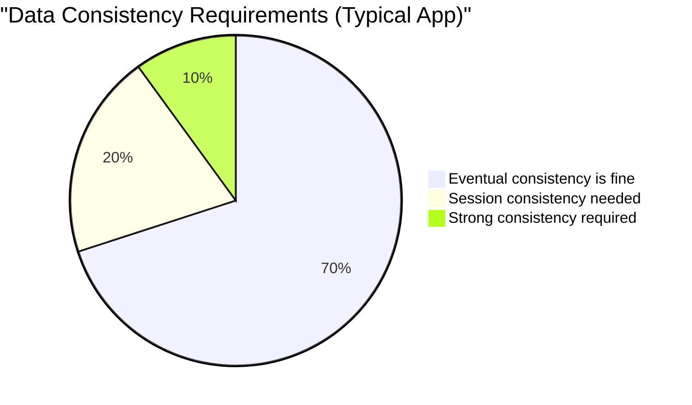

# Eventual Consistency Is a Feature, Not a Bug

---

## The SQL Instinct

When you hear "eventually consistent," your SQL brain screams:

> "So... the data might be WRONG? And you're telling me that's OKAY?!"

That instinct is correct — but only for certain problems. For others, eventual consistency is not just acceptable, it's **the right engineering choice**.

Let's understand why.

---

## What "Eventual" Actually Means

Eventual consistency is a guarantee with two parts:

1. **If no new writes occur**, all replicas **will** converge to the same value
2. The time to converge is **bounded** (usually milliseconds to seconds)

It does NOT mean:

- ❌ Data might be lost
- ❌ Replicas might never agree
- ❌ You'll read garbage forever



The "window of inconsistency" is usually **50–200 milliseconds**. Not seconds. Not hours. Milliseconds.

---

## When Inconsistency Doesn't Matter (And It's More Often Than You Think)

### Example 1: Social Media Feed

You post a photo. Your friend refreshes their feed 50ms later and doesn't see it yet. They refresh again 200ms later — it's there.

Did anyone lose money? No. Was anyone harmed? No. Did the user even notice? Almost certainly not.

**The cost of strong consistency here**: every post must synchronously replicate to all nodes before the write is acknowledged. Latency jumps from 5ms to 50ms. Throughput drops 10x. For what? So a social feed is 100ms more "fresh"?

### Example 2: Product View Counter

An e-commerce product has been viewed 1,247,891 times. A user views it, but for 100ms, some nodes think the count is 1,247,891 while others already show 1,247,892.

Does anyone care if the view count is briefly wrong by one? **No.** Strong consistency here would add latency to every product page load for zero user benefit.

### Example 3: DNS

The entire internet runs on eventual consistency. When you update a DNS record, it takes **minutes to hours** to propagate globally. The world keeps functioning.

---

## When Inconsistency DOES Matter

### Example 1: Bank Account Balance

You have $100. You withdraw $80 from an ATM. Due to replication lag, another ATM still thinks you have $100. You withdraw $80 again.

Now the bank is out $60. **This is not acceptable.**

### Example 2: Inventory Count

You have 1 widget left. Two customers try to buy it simultaneously. If each customer's request hits a different replica that both think "1 widget available," you've sold a widget you don't have.

### Example 3: Unique Constraints

Two users try to register the same username simultaneously. If different replicas accept both, you have duplicate usernames.

---

## The Decision Framework



The key question is: **What is the cost of serving stale data for 100ms?**

If the answer is "nothing meaningful" — eventual consistency buys you massive performance and availability improvements for free.

If the answer is "real harm" — you need strong consistency, and you should pay the latency cost for it.

---

## Strong Consistency Is Expensive

Why would anyone choose eventual consistency? Because strong consistency has real costs:

### Cost 1: Latency

Strong consistency requires **coordination**. Before a write is confirmed, multiple nodes must agree. This adds round trips.



**7x latency difference.** For a social media platform doing millions of writes per second, this is the difference between needing 10 servers and 70 servers.

### Cost 2: Availability

If Node 2 is down and you require majority acknowledgment (2 out of 3):

- **Eventual**: Write succeeds immediately (only Node 1 needed)
- **Strong**: Write might fail or wait (need 2 ACKs, only 2 nodes up — tight margin)

### Cost 3: Throughput

Coordination means **waiting**. While waiting for replica acknowledgments, the primary's write capacity is reduced. Strong consistency fundamentally limits how fast you can write.

---

## The Spectrum in Practice

Real applications don't use one consistency level everywhere. They use **different levels for different operations**:

```typescript
// TypeScript + MongoDB example

import { MongoClient, ReadConcern, WriteConcern } from 'mongodb';

const client = new MongoClient('mongodb://localhost:27017/?replicaSet=rs0');
const db = client.db('ecommerce');

// Social feed post — eventual consistency is fine
async function createPost(userId: string, content: string) {
  await db.collection('posts').insertOne(
    { userId, content, createdAt: new Date() },
    { writeConcern: { w: 1 } }  // Acknowledged by primary only — fast
  );
}

// Inventory decrement — needs strong consistency
async function purchaseItem(itemId: string) {
  const session = client.startSession();
  try {
    session.startTransaction({
      readConcern: { level: 'majority' },    // Read committed data
      writeConcern: { w: 'majority' },        // Write to majority
    });

    const item = await db.collection('inventory').findOne(
      { _id: itemId, quantity: { $gt: 0 } },
      { session }
    );

    if (!item) throw new Error('Out of stock');

    await db.collection('inventory').updateOne(
      { _id: itemId },
      { $inc: { quantity: -1 } },
      { session }
    );

    await session.commitTransaction();
  } finally {
    session.endSession();
  }
}
```

Same database. Same application. Different consistency guarantees for different operations. This is how you think about it in practice.

---

## The Real-World Distribution

In most applications, the data breaks down roughly like this:



- **70%** of data can be eventually consistent (posts, comments, views, analytics, logs, notifications)
- **20%** needs session consistency (user sees their own writes within their session)
- **10%** needs strong consistency (payments, inventory, unique constraints)

The NoSQL insight: **why pay the cost of strong consistency for the 70% that doesn't need it?**

---

## SQL's Hidden Assumption

Here's what SQL developers don't realize: **single-node PostgreSQL is not "choosing strong consistency."** It's bypassing the question entirely.

When all data lives on one machine:
- There's no replication lag (no replicas)
- There's no network partition (no network)
- ACID transactions are cheap (single-machine coordination)

The cost of "strong consistency" only becomes real when you distribute. And at that point, demanding strong consistency for everything means accepting high latency, reduced availability, and lower throughput — for data that might not need those guarantees.

---

## The Mental Model Shift

| SQL instinct | NoSQL reality |
|---|---|
| All data should be consistent | Different data needs different guarantees |
| Inconsistency = bug | Inconsistency = engineering tradeoff |
| The database handles consistency | The application decides what consistency it needs |
| Eventual consistency is dangerous | Eventual consistency is a feature for 70% of your data |

---

## Summary

Eventual consistency is not a weakness. It's an **engineering tradeoff** that buys you:

- Lower latency
- Higher availability
- Better throughput
- Cheaper infrastructure

...in exchange for a brief window where different replicas might disagree.

The skill is knowing **which data** can tolerate that window and which cannot.

---

## What's Next

You now understand:
1. Why relational databases struggle at scale
2. What the CAP theorem actually says
3. Why eventual consistency is a rational choice

Time to build your mental map of the NoSQL landscape.

→ **Phase 1**: [../01-nosql-taxonomy/01-document-stores.md](../01-nosql-taxonomy/01-document-stores.md)
