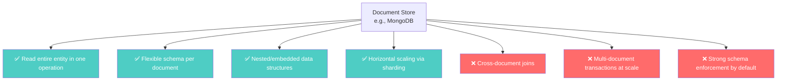
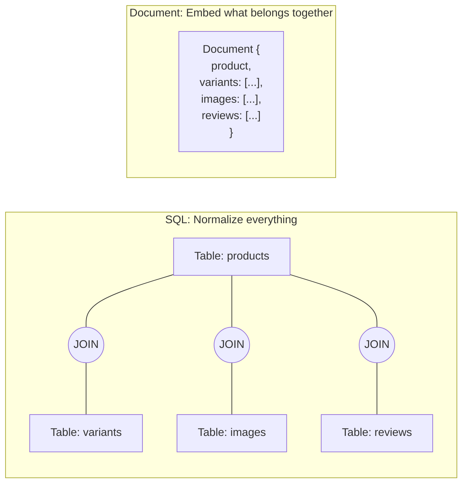

# Document Stores — MongoDB and the Document Model

---

## The Problem Document Stores Solve

You're building an e-commerce platform. In SQL, a product looks like this:

```sql
-- 5 tables for one "product"
products (id, name, description, price, brand_id)
product_images (id, product_id, url, sort_order)
product_variants (id, product_id, size, color, sku, stock)
product_reviews (id, product_id, user_id, rating, text)
product_tags (product_id, tag_id)
```

To display one product page, you JOIN across 5 tables. The data is **normalized** — clean, correct, no duplication. But every product page load costs 5 table lookups and 4 JOINs.

Now imagine you also sell books, which have `isbn`, `author`, and `page_count` — fields that don't apply to shoes. In SQL, you either:

1. Add nullable columns to `products` (messy)
2. Create an EAV pattern (Entity-Attribute-Value) — a disaster for query performance
3. Create separate tables per product type (maintenance nightmare)

Document stores eliminate this tension entirely.

---

## The Document Model

A document store says: **store the entire product as one unit**.

```json
{
  "_id": "prod_12345",
  "name": "Running Shoe X",
  "price": 129.99,
  "brand": {
    "name": "SpeedCo",
    "country": "US"
  },
  "images": [
    { "url": "/img/shoe-front.jpg", "sort": 1 },
    { "url": "/img/shoe-side.jpg", "sort": 2 }
  ],
  "variants": [
    { "size": 10, "color": "black", "sku": "SX-10-BLK", "stock": 42 },
    { "size": 11, "color": "white", "sku": "SX-11-WHT", "stock": 17 }
  ],
  "tags": ["running", "athletic", "lightweight"],
  "reviews": [
    { "userId": "u_789", "rating": 5, "text": "Great shoe!" }
  ]
}
```

One document. One read. No joins. And if books look different from shoes — that's fine. Each document can have different fields.

---

## What Document Stores Optimize For



### What it answers well

- "Give me everything about product X" — single document lookup
- "Find all products where `price < 50` and `tags` includes 'running'" — indexed query on a collection
- "Show me orders for user Y with all line items" — embedded data, single read

### What it actively discourages

- "Show me all users who bought the same products as user X" — requires cross-document traversal
- "Join orders with inventory with shipping" — requires `$lookup` (slow, not distributed)
- "Enforce that every product has at least one variant" — no schema constraint engine (app must enforce)

---

## Document Store vs. SQL — The Mental Model



| Aspect | SQL | Document Store |
|--------|-----|---------------|
| Unit of storage | Row | Document (JSON-like) |
| Relationships | Foreign keys + JOINs | Embedding + references |
| Schema | Enforced by database | Enforced by application |
| Query flexibility | Any ad-hoc query | Best with known access patterns |
| Consistency unit | Transaction across tables | Single document (atomic) |

---

## The Invented-For Problem

Document stores were invented for applications where:

1. **Each "entity" is self-contained** — a product, a user profile, a blog post
2. **You read the whole entity at once** — product page, user dashboard
3. **Different entities have different shapes** — books vs. shoes vs. electronics
4. **Schema evolves frequently** — startups, rapidly changing requirements

If your data is highly relational (many-to-many, cross-entity queries, complex aggregations), a document store is fighting you, not helping you.

---

## The Major Players

| Database | Notes |
|----------|-------|
| **MongoDB** | The dominant document store. Rich query language, aggregation pipeline, transactions. We deep-dive in Phase 2. |
| **Couchbase** | Similar model, different operational profile. Built-in caching. |
| **Amazon DocumentDB** | MongoDB-compatible API on AWS (not actually MongoDB under the hood). |
| **Firestore** | Google's document store for mobile/web apps. Real-time sync. |
| **CouchDB** | Multi-master replication. RESTful API. Smaller community. |

---

## The Trap

The trap with document stores is **thinking schemaless means no design**.

"I'll just throw JSON in there!" is the document store equivalent of never normalizing in SQL. You'll end up with:

- 16MB documents that are 80% stale embedded data
- Queries that scan every document because there's no index
- Inconsistent field names across documents (`userId` vs `user_id` vs `uid`)
- Impossible migrations when you need to restructure

Document stores require **more** upfront design than SQL, not less. You must design your documents around your access patterns — which means you must know your access patterns first.

---

## Next

→ [02-wide-column-stores.md](./02-wide-column-stores.md) — A completely different beast.
