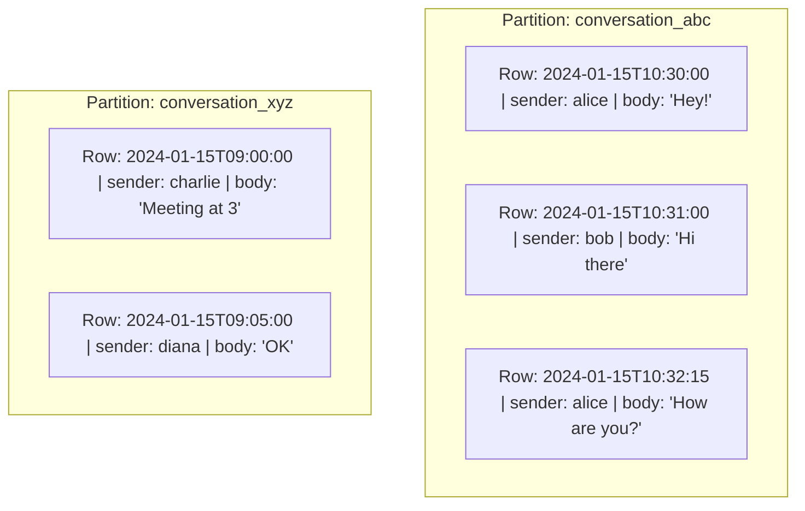
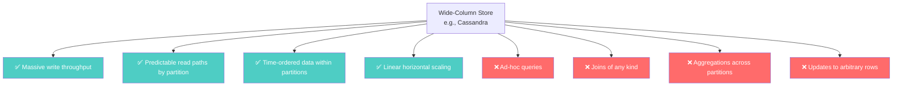

# Wide-Column Stores — Cassandra and the Query-First Model

---

## The Problem Wide-Column Stores Solve

You're building a messaging platform. 500 million users. Each user sends and receives dozens of messages per day. You need to:

1. Store billions of messages per day
2. Retrieve the last 50 messages for any conversation — fast
3. Never lose a message
4. Stay available even when data centers go down

In SQL, the messages table:

```sql
CREATE TABLE messages (
    id BIGSERIAL PRIMARY KEY,
    conversation_id UUID,
    sender_id UUID,
    body TEXT,
    sent_at TIMESTAMPTZ
);

CREATE INDEX idx_conv ON messages(conversation_id, sent_at DESC);
```

At 10 billion messages, this table is enormous. The index is enormous. Inserts slow down as the B-tree grows. Range scans on `conversation_id` hit random disk locations because rows are scattered.

You can shard by `conversation_id` — but now some shards are hot (group chats with 1000s of members) and others are cold.

Wide-column stores were designed for **exactly this pattern**: high-throughput writes with predictable read patterns.

---

## The Wide-Column Model

A wide-column store organizes data into **rows** within **partitions**, sorted by **clustering columns**.

Think of it as a sorted map of sorted maps:

```
Partition Key → { Clustering Key → { Column → Value } }
```

For messages:



Key concepts:

- **Partition key** (`conversation_id`): determines which node stores the data. All rows with the same partition key live together on the same node.
- **Clustering key** (`sent_at`): determines the sort order within the partition. Rows are stored **sorted on disk**.
- **Reading "last 50 messages"**: one sequential disk read. No index lookup. No join. Just read the last 50 sorted rows from the partition.

---

## What Wide-Column Stores Optimize For



### What it answers well

- "Give me the last 50 messages in conversation X" — sequential partition read
- "Give me all sensor readings for device Y between 2pm and 3pm" — range scan within partition
- "Write 100,000 events per second" — append-optimized, distributed writes

### What it actively discourages

- "Find all conversations where Alice is a participant" — full cluster scan (unless you model for it separately)
- "Count total messages across all conversations" — scans every partition on every node
- "Update message #47 in conversation X" — read-before-write, expensive

---

## Wide-Column vs. SQL vs. Document

| Aspect | SQL | Document | Wide-Column |
|--------|-----|----------|-------------|
| Schema | Rigid, enforced | Flexible per document | Rigid per table |
| Query model | Any query, optimizer decides | Known patterns, indexes help | Partition key required |
| Write speed | Moderate | Moderate | Extremely fast |
| Read pattern | Any combination | Full entity lookup | Partition + range |
| Joins | Native | Limited ($lookup) | None |
| Scaling | Vertical (mostly) | Horizontal (sharding) | Horizontal (native) |

---

## The Invented-For Problem

Wide-column stores were invented at **Google (Bigtable, 2006)** and **Facebook (Cassandra, 2008)** for:

1. **Time-series data** — sensor readings, metrics, logs
2. **Activity feeds** — user timelines, notification inboxes
3. **Messaging** — conversation histories
4. **IoT** — millions of devices writing constantly

The common pattern: **high write volume, reads scoped to a known partition, time-ordered data**.

If your queries are "give me the last N items for entity X, sorted by time" — a wide-column store is built for you.

If your queries are "find all entities where field Y has value Z" — you're fighting the model.

---

## The Major Players

| Database | Origin | Notes |
|----------|--------|-------|
| **Cassandra** | Facebook (open source) | No single point of failure. Tunable consistency. We deep-dive in Phase 3. |
| **HBase** | Apache (Hadoop ecosystem) | Built on HDFS. Strong consistency. Heavy operational burden. |
| **ScyllaDB** | Drop-in Cassandra replacement | Written in C++ instead of Java. Better performance. Same data model. |
| **Google Bigtable** | Google Cloud | Managed. The original wide-column store. |
| **Azure Cosmos DB (Table API)** | Microsoft | Multi-model with wide-column option. |

---

## The Trap

The trap with wide-column stores is **trying to use them like SQL**.

```
❌ "I'll create one table and run different queries on it"
   → Cassandra requires you to create a TABLE PER QUERY

❌ "I'll just add WHERE clauses as needed"
   → Without the partition key in your WHERE, Cassandra scans the entire cluster

❌ "I'll normalize my data to avoid duplication"
   → Wide-column stores require denormalization. Duplication is the design.
```

If you can't list your queries before designing your tables, a wide-column store will fight you at every turn.

---

## Next

→ [03-key-value-stores.md](./03-key-value-stores.md) — The simplest (and most misunderstood) NoSQL family.
