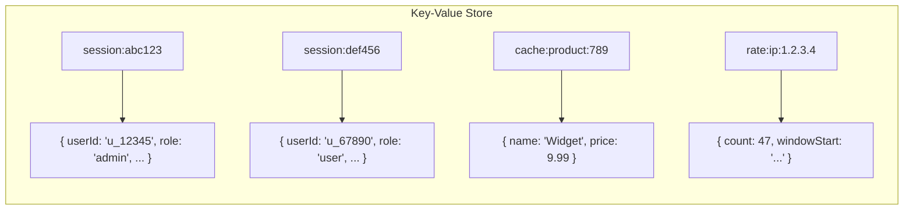
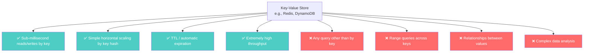
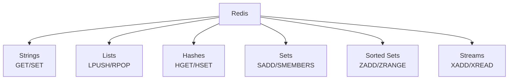

# Key-Value Stores — The Simplest Data Model

---

## The Problem Key-Value Stores Solve

You have a web application. Every request needs the logged-in user's session data. The session contains:

```json
{
  "userId": "u_12345",
  "role": "admin",
  "preferences": { "theme": "dark", "lang": "en" },
  "cart": ["item_1", "item_2"],
  "expiresAt": "2024-01-15T10:00:00Z"
}
```

In SQL, you'd store this in a `sessions` table and query by session ID. It works, but:

- You're paying for SQL's query planner, transaction manager, and buffer pool — for a **single lookup by key**
- At 100,000 requests per second, PostgreSQL's overhead becomes noticeable
- Sessions are ephemeral — they expire. SQL's B-tree deletions are expensive for short-lived data

A key-value store says: **if all you need is "get by key" and "set by key," why pay for anything else?**

---

## The Key-Value Model

The simplest data model possible:

```
Key → Value
```

That's it. No schema. No columns. No relations. No indexes (except the key). No query language (beyond GET and SET).



Operations:

```
GET key           → returns value (or null)
SET key value     → stores value
SET key value EX 3600  → stores value, expires in 1 hour
DEL key           → removes value
EXISTS key        → check existence
```

---

## What Key-Value Stores Optimize For



### What it answers well

- "Get the session for session ID X" — O(1) lookup
- "Is this IP rate-limited?" — O(1) check with TTL
- "What's the cached product page for product Y?" — cache hit

### What it actively discourages

- "Find all sessions for user U" — impossible without a secondary index (which KV stores don't have)
- "List all keys matching a pattern" — possible in Redis (`SCAN`), but O(N) and not distributed
- "Aggregate values across keys" — not a thing

---

## Redis: More Than Just Key-Value

Redis is technically a **data structure server**. Beyond simple GET/SET, it supports:



This makes Redis useful for:

```typescript
import { createClient } from 'redis';

const redis = createClient();
await redis.connect();

// Session storage (String with TTL)
await redis.set('session:abc', JSON.stringify(sessionData), { EX: 3600 });
const session = JSON.parse(await redis.get('session:abc') || '{}');

// Rate limiting (Increment with TTL)
const count = await redis.incr('rate:ip:1.2.3.4');
if (count === 1) await redis.expire('rate:ip:1.2.3.4', 60);

// Leaderboard (Sorted Set)
await redis.zAdd('leaderboard', { score: 1500, value: 'player:alice' });
await redis.zAdd('leaderboard', { score: 1200, value: 'player:bob' });
const topPlayers = await redis.zRange('leaderboard', 0, 9, { REV: true });

// Task queue (List as queue)
await redis.lPush('tasks', JSON.stringify({ type: 'email', to: 'user@x.com' }));
const task = await redis.rPop('tasks');
```

But Redis is **in-memory**. Your data must fit in RAM. If it doesn't, you need a different database.

---

## DynamoDB: Key-Value at AWS Scale

DynamoDB is AWS's managed key-value store (with optional secondary indexes):

| Feature | Redis | DynamoDB |
|---------|-------|----------|
| Storage | In-memory | On disk (SSD) |
| Capacity | Limited by RAM | Virtually unlimited |
| Latency | < 1ms | < 10ms |
| Persistence | Optional (RDB/AOF) | Built-in |
| Query | Key only | Key + sort key + secondary indexes |
| Cost model | Server-based | Per-request pricing |

DynamoDB is actually a **hybrid** — it has partition keys and sort keys (like Cassandra) while being marketed as key-value. It sits between pure KV and wide-column stores.

---

## The Invented-For Problem

Key-value stores were invented for:

1. **Caching** — avoid hitting the primary database for repeated reads
2. **Session storage** — fast, ephemeral, per-user state
3. **Rate limiting** — counters that expire
4. **Feature flags** — fast boolean lookups
5. **Pub/sub messaging** — Redis pub/sub for real-time events

The pattern: **simple lookups by a known key, high throughput, low latency, often temporary data**.

---

## The Trap

The trap with key-value stores is **using them as a primary database**.

```
❌ "I'll store everything in Redis — it's so fast!"
   → Your server crashes. Did you enable persistence? Is it consistent?

❌ "I'll model relationships by encoding them in key names"
   → `user:123:follows:456` — now you need pattern scanning, which is O(N)

❌ "I'll use Redis as a queue"
   → Redis lists work for simple cases, but lack acknowledgment, retry, 
     dead-letter queues. Use a real queue (RabbitMQ, Kafka).
```

Key-value stores are **accelerators**, not foundations. Use them in front of your primary database, not instead of it.

---

## Next

→ [04-graph-databases.md](./04-graph-databases.md) — When relationships ARE the data.
