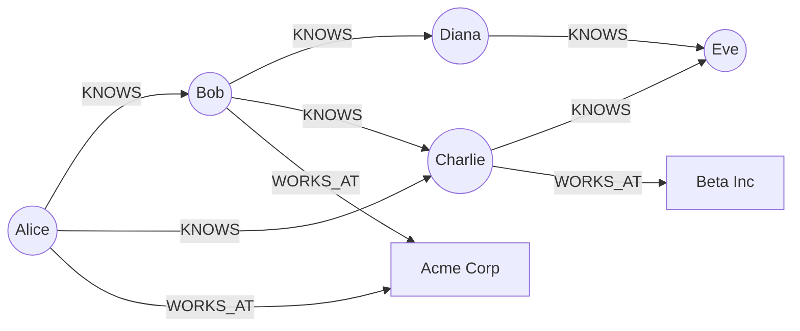
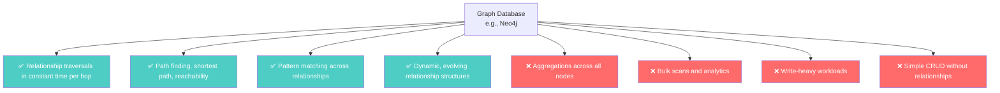

# Graph Databases — When Relationships Are the Data

---

## The Problem Graph Databases Solve

You're building a professional network (think LinkedIn). The core questions are:

- "Who does Alice know?"
- "Who are Alice's 2nd-degree connections?" (friends of friends)
- "What's the shortest path between Alice and Bob?"
- "Who should Alice connect with?" (mutual connections)

In SQL:

```sql
CREATE TABLE connections (
    user_a INT REFERENCES users(id),
    user_b INT REFERENCES users(id),
    connected_at TIMESTAMPTZ,
    PRIMARY KEY (user_a, user_b)
);

-- 2nd degree connections: friends of friends
SELECT DISTINCT c2.user_b
FROM connections c1
JOIN connections c2 ON c1.user_b = c2.user_a
WHERE c1.user_a = $alice_id
  AND c2.user_b != $alice_id
  AND c2.user_b NOT IN (
    SELECT user_b FROM connections WHERE user_a = $alice_id
  );
```

For 2nd-degree connections, this is a self-join. For 3rd-degree, it's two self-joins. For "shortest path between Alice and Bob" — it's a recursive CTE that might scan millions of rows.

With 500 million users and 50 billion connections, these queries take **minutes in SQL**. Graph databases answer them in milliseconds.

---

## The Graph Model

A graph database stores **nodes** (entities) and **edges** (relationships) as first-class citizens. Traversing a relationship is a constant-time pointer lookup, not a JOIN.



Key difference from SQL:

| Operation | SQL | Graph DB |
|-----------|-----|----------|
| "Alice's friends" | Index lookup on connections | Traverse Alice's edges — O(degree) |
| "Friends of friends" | Self-JOIN | 2-hop traversal — O(degree²) |
| "Shortest path Alice→Eve" | Recursive CTE (expensive) | BFS/Dijkstra — native |
| "Mutual friends" | Nested subqueries | Set intersection of edge lists |

The critical insight: **in SQL, the cost of relationship queries grows with table size. In graph DBs, it grows with the local neighborhood size.** If Alice has 500 friends, traversing 2 hops touches at most ~250,000 nodes — regardless of whether the graph has 1 million or 1 billion total nodes.

---

## What Graph Databases Optimize For



### What it answers well

- "What's the shortest path between X and Y?" — native graph algorithms
- "Who are the most connected nodes?" (influencers) — centrality algorithms
- "Find all fraud rings" — cycle detection, pattern matching
- "Recommend products similar to what X's friends bought" — collaborative filtering

### What it actively discourages

- "Count all users" — full graph scan, no indexes help
- "Find all users where `age > 25`" — property lookup without traversal, SQL is better
- "Write 100,000 new nodes per second" — graph DBs are typically not write-optimized
- "Simple key-value lookups" — massive overhead for a simple problem

---

## Where Graph Databases Shine (Real Use Cases)

| Use Case | Why Graph? |
|----------|-----------|
| Social networks | Connections ARE the product |
| Fraud detection | Detecting suspicious relationship patterns |
| Recommendation engines | "People who know X also know Y" |
| Knowledge graphs | Entities connected by semantic relationships |
| Network/IT infrastructure | "Which servers depend on this router?" |
| Supply chain | "If this factory goes down, what's affected?" |

---

## The Major Players

| Database | Notes |
|----------|-------|
| **Neo4j** | Most popular. Cypher query language. ACID transactions. |
| **Amazon Neptune** | Managed, supports both property graphs and RDF |
| **ArangoDB** | Multi-model (document + graph) |
| **TigerGraph** | Focused on analytics at scale |
| **Dgraph** | GraphQL-native, distributed |

---

## The Trap

```
❌ "Everything is a graph if you think about it!"
   → True, but SQL handles most relationship queries just fine at normal scale.
     Graph DBs win only when traversal depth and graph size make JOINs infeasible.

❌ "I'll use a graph DB for my blog's user system"
   → If your relationships are simple (user → posts, posts → comments),
     SQL or a document store is simpler and cheaper.

❌ "Graph DBs scale horizontally"
   → Most don't. Neo4j clustering is for HA, not sharding.
     Distributed graph processing is extremely hard.
```

**Use a graph database when the questions you ask are about relationships between entities, not about the entities themselves.**

---

## Next

→ [05-time-series-databases.md](./05-time-series-databases.md) — When time IS the primary dimension.
