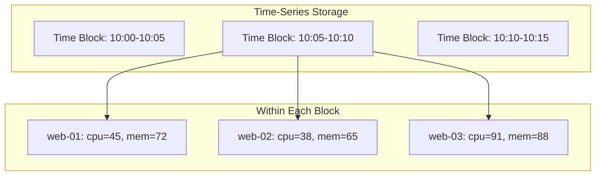
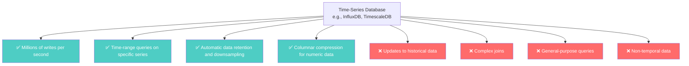
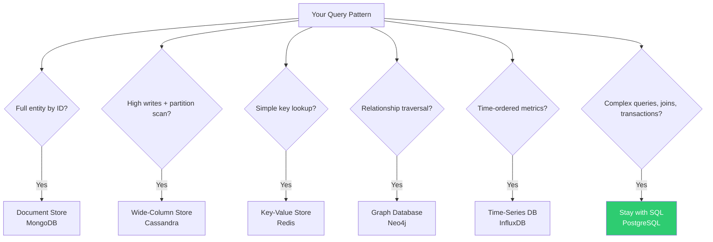

# Time-Series Databases — When Time Is Everything

---

## The Problem Time-Series Databases Solve

You're running a monitoring platform. 10,000 servers each report CPU, memory, disk, and network metrics every 10 seconds. That's:

- 4 metrics × 10,000 servers × 6 per minute × 60 minutes = **14.4 million data points per hour**
- **~345 million per day**
- **~126 billion per year**

Each data point is tiny:

```
{ timestamp: "2024-01-15T10:30:00Z", server: "web-42", metric: "cpu", value: 73.2 }
```

You need to:
1. Write all of these without falling behind
2. Query "CPU for server web-42 from 2pm to 3pm today" — fast
3. Query "average CPU across all web servers for the last 24 hours" — fast
4. Automatically delete data older than 90 days
5. Downsample old data (keep 1-minute averages instead of 10-second)

In PostgreSQL, a table with 126 billion rows will grind to a halt. B-tree indexes on `(server, timestamp)` will be enormous. Deleting old data (WHERE `timestamp < NOW() - '90 days'`) triggers massive vacuum operations.

---

## The Time-Series Model

Time-series databases are purpose-built for **append-heavy, time-ordered, immutable data**.



Key optimizations:

1. **Time-based partitioning**: Data is stored in time blocks. Dropping old data = dropping entire blocks (instant, no vacuum)
2. **Columnar compression**: Values for the same metric are stored together and compressed (CPU values compress ~10:1)
3. **Append-only writes**: No updates or deletes during normal operation. Write path is heavily optimized
4. **Downsampling**: Automatic aggregation of old data (10-second → 1-minute → 1-hour)

---

## What Time-Series Databases Optimize For



### What it answers well

- "CPU usage for server X over the last 6 hours" — single series, time range
- "Average response time across all API servers, per minute" — aggregate across series
- "When did disk usage first exceed 90%?" — threshold queries
- "Show me the 95th percentile latency for the past week" — statistical aggregation

### What it actively discourages

- "Update a metric value from last Tuesday" — immutable by design
- "Join metrics with user data" — no relationship model
- "Find all servers where the hostname contains 'prod'" — not a search engine
- "Store user profiles alongside metrics" — wrong tool entirely

---

## The Major Players

| Database | Architecture | Notes |
|----------|-------------|-------|
| **InfluxDB** | Custom time-series engine | Purpose-built. Flux query language. Popular in DevOps. |
| **TimescaleDB** | PostgreSQL extension | SQL interface on time-series optimized storage. Best of both worlds. |
| **Prometheus** | Pull-based metrics collector | Paired with Grafana. Not a general TSDB — focused on monitoring. |
| **QuestDB** | Column-oriented | SQL-compatible. Very fast ingestion. |
| **Amazon Timestream** | Managed AWS service | Automatic tiering (memory → SSD → S3). |

---

## TimescaleDB: The Interesting Hybrid

TimescaleDB deserves special mention because it's **PostgreSQL with time-series superpowers**:

```sql
-- It's just PostgreSQL!
CREATE TABLE metrics (
    time        TIMESTAMPTZ NOT NULL,
    server_id   TEXT NOT NULL,
    cpu         DOUBLE PRECISION,
    memory      DOUBLE PRECISION
);

-- Convert to hypertable (automatic time partitioning)
SELECT create_hypertable('metrics', 'time');

-- Queries are standard SQL
SELECT time_bucket('5 minutes', time) AS bucket,
       server_id,
       AVG(cpu) as avg_cpu
FROM metrics
WHERE time > NOW() - INTERVAL '1 hour'
  AND server_id = 'web-42'
GROUP BY bucket, server_id
ORDER BY bucket;

-- Data retention
SELECT add_retention_policy('metrics', INTERVAL '90 days');

-- Continuous aggregates (materialized rollups)
CREATE MATERIALIZED VIEW metrics_hourly
WITH (timescaledb.continuous) AS
SELECT time_bucket('1 hour', time) AS hour,
       server_id,
       AVG(cpu) as avg_cpu,
       MAX(cpu) as max_cpu
FROM metrics
GROUP BY hour, server_id;
```

If you already know SQL and your time-series needs aren't extreme, TimescaleDB lets you avoid learning a new query language.

---

## The Trap

```
❌ "I'll store everything time-stamped in a TSDB"
   → Log data? Use Elasticsearch. Event sourcing? Use Kafka + a store.
     TSDBs excel at numeric metrics, not arbitrary timestamped data.

❌ "I'll use InfluxDB as my primary database"
   → TSDBs have no concept of transactions, foreign keys, or complex queries.
     They complement your primary database, not replace it.

❌ "I need a TSDB because I have timestamps"
   → Having timestamps doesn't mean you have time-series data.
     PostgreSQL with proper indexing handles timestamped queries well
     until you hit millions of writes per day.
```

---

## The NoSQL Taxonomy — Summary



Every NoSQL family exists because SQL handles their specific use case poorly at scale. But for most general-purpose applications, **SQL is still the right default**.

---

## What's Next

You now have a mental map of the NoSQL landscape. Time to go deep.

→ **Phase 2**: [../02-mongodb-deep-dive/01-document-vs-relational-modeling.md](../02-mongodb-deep-dive/01-document-vs-relational-modeling.md) — Document thinking, done properly.
