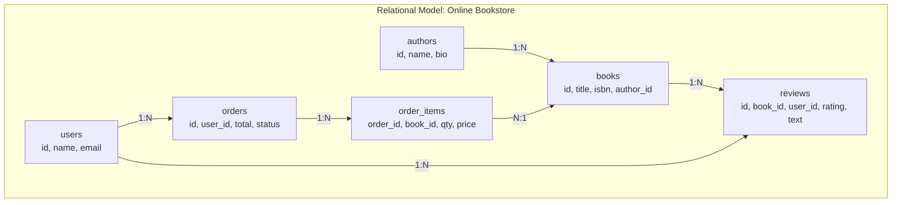
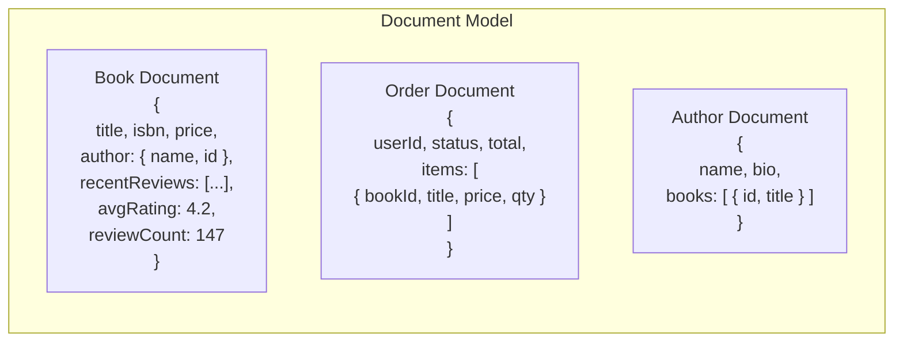
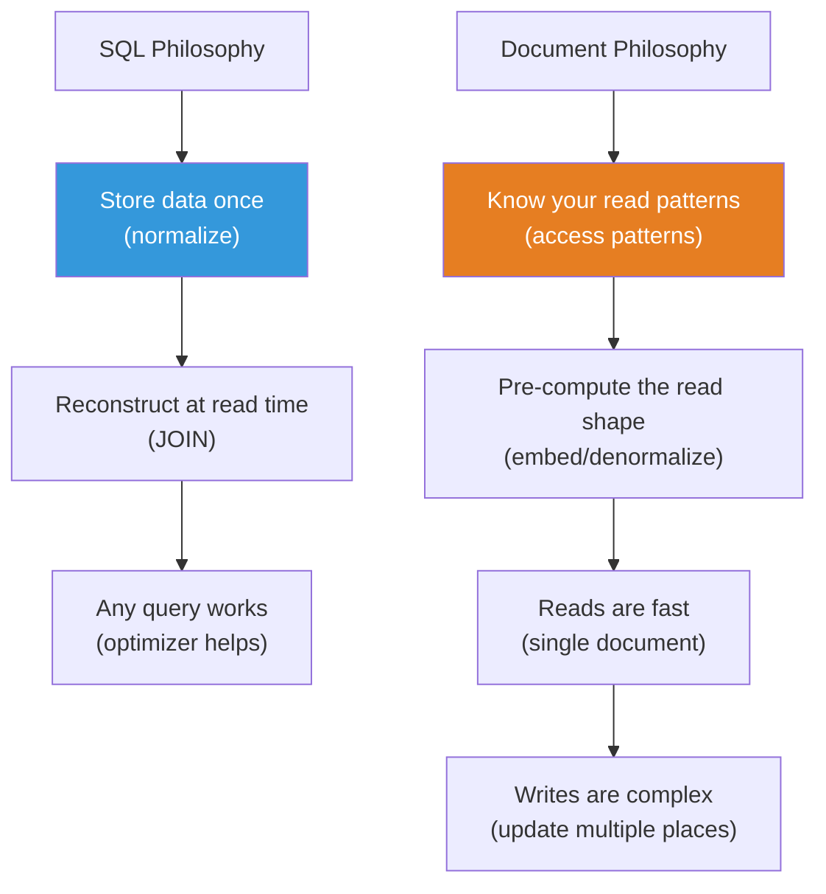
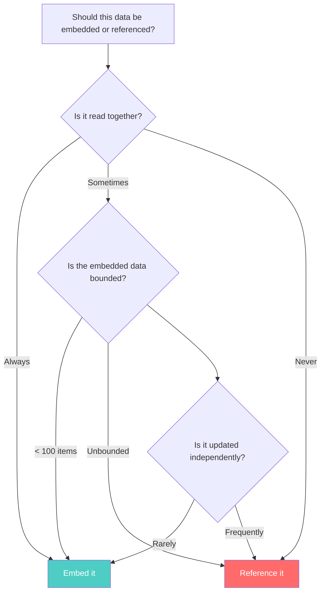

# Document vs. Relational Modeling — The Fundamental Shift

---

## The SQL Way: Normalize First, Query Later

In relational databases, you model data based on **what it IS** — entities and their relationships. You normalize to eliminate redundancy. Queries are an afterthought: the optimizer figures out how to execute them efficiently.



Every piece of data appears **exactly once**. To display a book page, you JOIN across 3–4 tables. The cost is read amplification. The benefit is write simplicity — update an author's name in one place.

---

## The Document Way: Query First, Model Around It

In MongoDB, you model data based on **how you'll read it**. What data does the application screen/API endpoint need? Put that data in one document.

The first question is not "What are my entities?" — it's **"What are my access patterns?"**

### Access Pattern Analysis

For our bookstore, the access patterns are:

| # | Access Pattern | Frequency | Data Needed |
|---|---------------|-----------|-------------|
| 1 | Display book page | Very high | Book details, author name, recent reviews, avg rating |
| 2 | User's order history | High | Order details with book titles, prices |
| 3 | Author page | Medium | Author info, list of books |
| 4 | Search by title/ISBN | High | Book title, author, price, cover image |
| 5 | Admin: update book metadata | Low | Book fields |
| 6 | Admin: update author bio | Very low | Author bio |

Now we model:



Notice:
- The author's name is **duplicated** in every book document — because every book page read needs it
- Book title and price are **copied** into order items — because the order page needs them without a JOIN
- Recent reviews are **embedded** in the book — because the book page shows them together
- Full review history stays in a **separate collection** — because it's paginated and unbounded

---

## The Key Principle: Optimize for the Common Read Path



The tradeoff:

| | SQL (Normalized) | Document (Denormalized) |
|---|---|---|
| Read performance | Slower (JOINs) | Faster (single document) |
| Write simplicity | Simpler (one place) | Complex (multiple copies) |
| Data consistency | Guaranteed (single source) | Application responsibility |
| Query flexibility | Any query, any time | Optimized for planned queries |
| Schema changes | ALTER TABLE | Application migration logic |

---

## Worked Example: Modeling a Book

### The SQL Way

```sql
-- Book page requires: book → author → reviews → users
SELECT b.title, b.isbn, b.price,
       a.name AS author_name,
       r.rating, r.text, u.name AS reviewer_name
FROM books b
JOIN authors a ON b.author_id = a.id
LEFT JOIN reviews r ON r.book_id = b.id
LEFT JOIN users u ON r.user_id = u.id
WHERE b.id = $1
ORDER BY r.created_at DESC
LIMIT 10;
-- 4 tables, 3 JOINs, 1 request
```

### The Document Way

```typescript
// Book document — designed for the book page read path
interface BookDocument {
  _id: string;
  title: string;
  isbn: string;
  price: number;
  coverUrl: string;
  
  // Embedded: author basic info (denormalized)
  author: {
    _id: string;
    name: string;
  };
  
  // Embedded: pre-computed review summary
  reviewSummary: {
    avgRating: number;
    count: number;
  };
  
  // Embedded: last 5 reviews (bounded)
  recentReviews: Array<{
    userId: string;
    userName: string;   // Denormalized!
    rating: number;
    text: string;
    createdAt: Date;
  }>;
  
  // Metadata
  createdAt: Date;
  updatedAt: Date;
}

// Reading the book page: ONE query, ZERO joins
const book = await db.collection('books').findOne({ _id: bookId });
// Done. Everything the book page needs is in this document.
```

```go
// Go equivalent
type BookDocument struct {
    ID            string         `bson:"_id"`
    Title         string         `bson:"title"`
    ISBN          string         `bson:"isbn"`
    Price         float64        `bson:"price"`
    CoverURL      string         `bson:"coverUrl"`
    Author        EmbeddedAuthor `bson:"author"`
    ReviewSummary ReviewSummary  `bson:"reviewSummary"`
    RecentReviews []EmbedReview  `bson:"recentReviews"`
    CreatedAt     time.Time      `bson:"createdAt"`
    UpdatedAt     time.Time      `bson:"updatedAt"`
}

type EmbeddedAuthor struct {
    ID   string `bson:"_id"`
    Name string `bson:"name"`
}

type ReviewSummary struct {
    AvgRating float64 `bson:"avgRating"`
    Count     int     `bson:"count"`
}

type EmbedReview struct {
    UserID    string    `bson:"userId"`
    UserName  string    `bson:"userName"`
    Rating    int       `bson:"rating"`
    Text      string    `bson:"text"`
    CreatedAt time.Time `bson:"createdAt"`
}

// One query, zero joins
var book BookDocument
err := collection.FindOne(ctx, bson.M{"_id": bookID}).Decode(&book)
```

---

## The Write Path Cost

The book page read is now a single document fetch. But what happens when the author changes their name?

### SQL

```sql
UPDATE authors SET name = 'New Name' WHERE id = $1;
-- Done. One row updated. All JOINs automatically pick up the new name.
```

### MongoDB

```typescript
// 1. Update the author document
await db.collection('authors').updateOne(
  { _id: authorId },
  { $set: { name: 'New Name' } }
);

// 2. Update the author name in ALL their books
await db.collection('books').updateMany(
  { 'author._id': authorId },
  { $set: { 'author.name': 'New Name' } }
);

// 3. Update the author name in ALL reviews they wrote 
// (if reviewer name is denormalized in book.recentReviews)
// ... this gets complicated fast
```

This is the **write amplification** cost of denormalization. You're paying for fast reads with complex writes.

**The question you must ask:** How often does an author change their name vs. how often is a book page loaded?

- Author name changes: maybe once in the lifetime of the application
- Book page loads: millions per day

Optimizing for the common path (reads) at the cost of the rare path (author name change) is the right engineering tradeoff.

---

## When Document Modeling Goes Wrong

### Anti-Pattern: Embedding Everything

```json
{
  "_id": "book_1",
  "title": "MongoDB in Action",
  "reviews": [
    // ... 50,000 reviews embedded here
  ]
}
```

Problems:
- MongoDB documents max out at **16MB**
- Loading 50,000 reviews when you only show 5 wastes bandwidth
- Adding a review means rewriting the entire document

### Anti-Pattern: Normalizing Everything

```json
// books collection
{ "_id": "book_1", "title": "...", "author_id": "auth_1" }

// authors collection
{ "_id": "auth_1", "name": "..." }

// reviews collection
{ "_id": "rev_1", "book_id": "book_1", "user_id": "user_1" }
```

This is just SQL with JSON syntax. You're paying the costs of MongoDB (no JOINs, no foreign keys) without getting any of its benefits (fast single-document reads).

---

## The Decision Framework



We'll go much deeper into this decision in the next section.

---

## Next

→ [02-embedding-vs-referencing.md](./02-embedding-vs-referencing.md) — The most important decision in document modeling.
