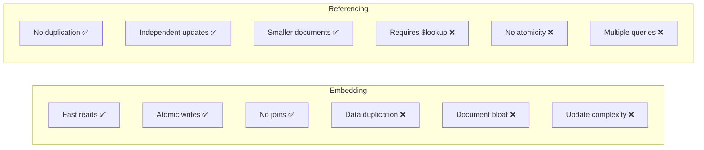
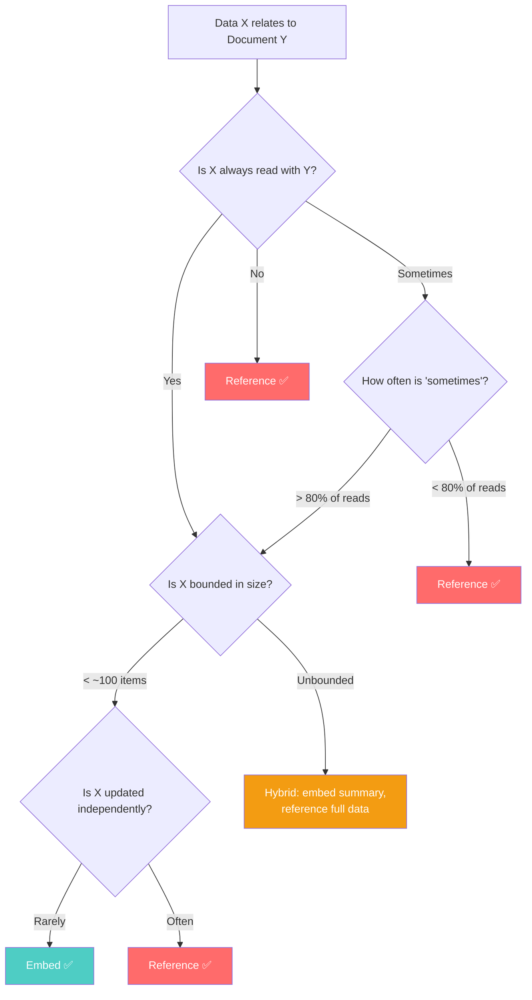

# Embedding vs. Referencing — The Core Decision

---

## Why This Matters

In SQL, you don't choose between embedding and referencing. You normalize. Period.

In MongoDB, **every relationship** forces a decision: do you embed the related data inside the parent document, or reference it by ID and look it up separately?

This decision affects:
- Read performance
- Write complexity
- Data consistency
- Document size
- Query patterns

There is no universal answer. The right choice depends on your access patterns.

---

## The Two Approaches

### Embedding (Denormalization)

The related data lives **inside** the parent document:

```json
{
  "_id": "order_123",
  "userId": "user_456",
  "status": "shipped",
  "items": [
    { "bookId": "book_1", "title": "Clean Code", "price": 39.99, "qty": 1 },
    { "bookId": "book_2", "title": "DDIA", "price": 45.00, "qty": 2 }
  ],
  "shippingAddress": {
    "street": "123 Main St",
    "city": "Portland",
    "state": "OR",
    "zip": "97201"
  },
  "total": 129.99
}
```

### Referencing (Normalization)

The related data lives in a **separate collection**, linked by ID:

```json
// orders collection
{
  "_id": "order_123",
  "userId": "user_456",
  "status": "shipped",
  "itemIds": ["item_1", "item_2"],
  "shippingAddressId": "addr_789",
  "total": 129.99
}

// order_items collection
{ "_id": "item_1", "orderId": "order_123", "bookId": "book_1", "qty": 1, "price": 39.99 }
{ "_id": "item_2", "orderId": "order_123", "bookId": "book_2", "qty": 2, "price": 45.00 }

// addresses collection
{ "_id": "addr_789", "street": "123 Main St", "city": "Portland", ... }
```

---

## The Tradeoff Matrix



| Factor | Embed | Reference |
|--------|-------|-----------|
| Read performance | Single document read | Multiple reads or $lookup |
| Write simplicity | One write, but nested updates | Multiple simple writes |
| Atomicity | Automatic (single doc) | Requires transactions |
| Data size | Document grows | Fixed document size |
| Data freshness | Might be stale (copy) | Always current (source of truth) |
| 16MB limit risk | Increases | Avoids |

---

## Decision Framework (With Real Analysis)

### Pattern 1: One-to-Few → Embed

**Example**: User has a few addresses (home, work, shipping)

```json
{
  "_id": "user_123",
  "name": "Alice",
  "addresses": [
    { "label": "home", "street": "123 Main", "city": "Portland" },
    { "label": "work", "street": "456 Oak", "city": "Portland" }
  ]
}
```

Why embed:
- A user has at most 3–5 addresses
- Addresses are always read with the user profile
- Addresses rarely change
- No independent access pattern for addresses

### Pattern 2: One-to-Many (Bounded) → Embed (Usually)

**Example**: A blog post has comments (but we cap displayed comments)

```json
{
  "_id": "post_123",
  "title": "Understanding NoSQL",
  "content": "...",
  "recentComments": [
    { "userId": "u1", "text": "Great post!", "at": "2024-01-15T10:00:00Z" },
    { "userId": "u2", "text": "Very helpful", "at": "2024-01-15T11:00:00Z" }
  ],
  "commentCount": 247
}
```

Why embed (recent comments only):
- The post page shows the last 5–10 comments
- We embed only those, with a count
- Full comment history is a separate collection (unbounded data → reference)
- Common read path only needs recent comments

### Pattern 3: One-to-Many (Unbounded) → Reference

**Example**: An author has published many books (could be hundreds)

```json
// authors collection
{ "_id": "author_1", "name": "Martin Kleppmann", "bio": "..." }

// books collection  
{ "_id": "book_1", "authorId": "author_1", "title": "DDIA", ... }
{ "_id": "book_2", "authorId": "author_1", "title": "Another Book", ... }
```

Why reference:
- Author could have unbounded number of books
- Books have their own complex document with reviews, variants, etc.
- Books are accessed independently (book page doesn't need all author's books)
- Author page paginates through books — embedding all would waste bandwidth

### Pattern 4: Many-to-Many → Reference (Always)

**Example**: Students enrolled in courses

```json
// students collection
{ "_id": "student_1", "name": "Alice", "enrolledCourseIds": ["course_1", "course_2"] }

// courses collection  
{ "_id": "course_1", "title": "Database Systems", "enrolledStudentIds": ["student_1", "student_3"] }
```

Why reference:
- Both sides need independent access
- Both sides can be large
- Embedding either direction creates massive duplication

---

## The Access Pattern Test

For every piece of related data, ask:



---

## The Hybrid Pattern (Most Common in Practice)

Real applications rarely use pure embedding or pure referencing. The most common pattern is **embedding a summary and referencing the full data**.

```typescript
// Order document — hybrid approach
interface OrderDocument {
  _id: string;
  userId: string;
  
  // Embedded: summary of user (read with order)
  user: {
    _id: string;
    name: string;       // Denormalized for display
    email: string;      // Denormalized for notifications
  };
  
  // Embedded: order items (always read with order, bounded)
  items: Array<{
    productId: string;
    title: string;      // Denormalized — product title at time of purchase
    price: number;      // Denormalized — price at time of purchase (IMPORTANT!)
    quantity: number;
    imageUrl: string;   // Denormalized for display
  }>;
  
  // Embedded: shipping address (snapshot at time of order)
  shippingAddress: {
    street: string;
    city: string;
    state: string;
    zip: string;
  };
  
  total: number;
  status: 'pending' | 'paid' | 'shipped' | 'delivered';
  createdAt: Date;
}
```

Notice the subtlety: the **price** in each order item is the price **at the time of purchase**. Even if the product price changes later, this order should reflect what the customer actually paid. Denormalization here isn't just a performance optimization — it's **semantically correct**.

---

## When Embedding Goes Wrong: A Case Study

### The Disaster

A team builds a project management app. They embed tasks inside projects:

```json
{
  "_id": "project_1",
  "name": "Website Redesign",
  "tasks": [
    { "id": "t1", "title": "Design mockups", "assignee": "alice", "status": "done", "comments": [...] },
    { "id": "t2", "title": "Build frontend", "assignee": "bob", "status": "in-progress", "comments": [...] },
    // ... 500 more tasks, each with nested comments
  ]
}
```

What goes wrong:
1. **Document size**: 500 tasks with comments → document exceeds 16MB
2. **Update performance**: Updating one task's status rewrites the entire document
3. **Concurrency**: Two users updating different tasks in the same project → write conflicts
4. **Query performance**: "Find all tasks assigned to Alice across all projects" → scans every project document

### The Fix

```json
// projects collection — lightweight
{ "_id": "project_1", "name": "Website Redesign", "taskCount": 502 }

// tasks collection — separate, indexed by project and assignee
{
  "_id": "task_t1",
  "projectId": "project_1",
  "projectName": "Website Redesign",  // Denormalized for display
  "title": "Design mockups",
  "assignee": "alice",
  "status": "done",
  "commentCount": 12
}

// comments collection — separate, for unbounded data
{ "_id": "c1", "taskId": "task_t1", "author": "bob", "text": "Looks great!", ... }
```

**Indexes**:
- `tasks: { projectId: 1, status: 1 }` — project board view
- `tasks: { assignee: 1, status: 1 }` — "my tasks" view
- `comments: { taskId: 1, createdAt: 1 }` — comment loading

---

## Summary: The Rules

1. **Embed** data that is always read together, bounded in size, and rarely updated independently
2. **Reference** data that is unbounded, accessed independently, or updated frequently
3. **Hybrid** (embed summary, reference detail) is the most common real-world pattern
4. **Denormalized data = your responsibility to keep in sync** — accept this cost
5. When in doubt, **reference**. You can always denormalize later; un-embedding is painful

---

## Next

→ [03-schema-design-for-reads.md](./03-schema-design-for-reads.md) — How to design schemas that serve your read paths perfectly.
