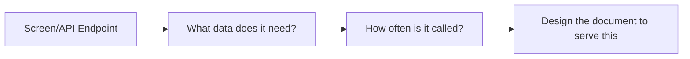
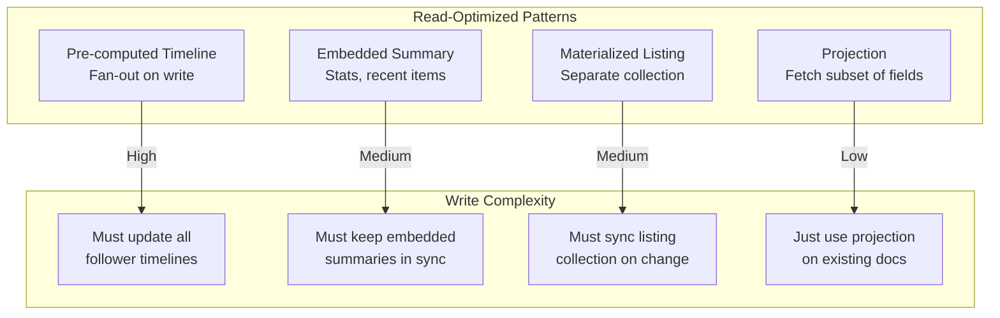

# Schema Design for Read Paths

---

## The First Commandment of MongoDB Modeling

> **Design your schema for the screens your users see.**

Not for how the data "really is." Not for third normal form. Not for theoretical correctness. For the actual read paths your application executes thousands of times per second.

---

## Methodology: Screen → Query → Schema



### Step 1: List every screen and API endpoint

For an e-commerce app:

| Screen | Data Needed | Frequency |
|--------|-------------|-----------|
| Product listing page | Title, price, image, rating | Very High |
| Product detail page | Full product + reviews + author | Very High |
| Shopping cart | Item titles, prices, quantities | High |
| Order history | Orders with item summaries | Medium |
| Admin: product edit | All product fields | Low |
| Admin: analytics dashboard | Aggregated sales data | Low |

### Step 2: Design documents around high-frequency reads

The product listing page is your highest-frequency read. It needs a **subset** of product data. Two approaches:

**Approach A: One collection, project what you need**

```typescript
// Product document (full)
interface Product {
  _id: string;
  title: string;
  slug: string;
  description: string;       // Long text — not needed for listing
  price: number;
  images: string[];
  category: string;
  rating: { avg: number; count: number };
  variants: Variant[];        // Complex — not needed for listing
  specifications: Record<string, string>;  // Not needed for listing
}

// Listing page query — use projection
const products = await db.collection<Product>('products')
  .find({ category: 'electronics' })
  .project({ title: 1, price: 1, 'images.0': 1, rating: 1, slug: 1 })
  .sort({ 'rating.avg': -1 })
  .limit(20)
  .toArray();
```

**Approach B: Separate collection for listings (materialized view)**

```typescript
// product_listings collection — optimized for the listing page
interface ProductListing {
  _id: string;
  productId: string;
  title: string;
  slug: string;
  price: number;
  thumbnailUrl: string;
  ratingAvg: number;
  ratingCount: number;
  category: string;
}

// Full products collection — for the detail page
interface ProductDetail {
  _id: string;
  title: string;
  // ... everything
}
```

When to use Approach B:
- The listing page is hit **100x more** than the detail page
- The full product document is large (> 10KB)
- The listing query needs different indexes than the detail query

---

## Real-World Schema: Social Media Platform

Let's design a Twitter-like platform's schema, starting from screens:

### Screen 1: Home Timeline (Highest Priority)

Users see posts from people they follow, with author info, like count, and comments preview.

```typescript
// timeline_entries collection
// Each document is a pre-computed entry for a specific user's timeline
interface TimelineEntry {
  _id: ObjectId;
  userId: string;          // Whose timeline this appears on
  postId: string;          // Reference to full post
  
  // Denormalized for display (no joins needed)
  author: {
    id: string;
    name: string;
    handle: string;
    avatarUrl: string;
  };
  
  content: string;
  mediaUrls: string[];
  
  stats: {
    likes: number;
    comments: number;
    reposts: number;
  };
  
  // Pre-computed for the viewing user
  viewerHasLiked: boolean;
  
  createdAt: Date;
}

// Index for timeline reads — THE most important index in the system
// Compound index: find by userId, sort by recency
db.collection('timeline_entries').createIndex(
  { userId: 1, createdAt: -1 }
);
```

The timeline read is now:

```typescript
const timeline = await db.collection('timeline_entries')
  .find({ userId: currentUserId })
  .sort({ createdAt: -1 })
  .limit(50)
  .toArray();
// One query. One index scan. No joins. < 5ms.
```

### Screen 2: Post Detail (Reply Thread)

```typescript
// posts collection — the full post with metadata
interface Post {
  _id: string;
  authorId: string;
  author: {
    name: string;
    handle: string;
    avatarUrl: string;
  };
  content: string;
  mediaUrls: string[];
  stats: {
    likes: number;
    comments: number;
    reposts: number;
  };
  
  // Recent replies embedded (bounded to 3-5)
  recentReplies: Array<{
    authorId: string;
    authorName: string;
    authorHandle: string;
    content: string;
    createdAt: Date;
  }>;
  
  createdAt: Date;
}

// replies collection — full reply thread
interface Reply {
  _id: string;
  postId: string;
  authorId: string;
  author: { name: string; handle: string; avatarUrl: string };
  content: string;
  createdAt: Date;
}
```

### Screen 3: User Profile

```typescript
// users collection
interface User {
  _id: string;
  name: string;
  handle: string;
  bio: string;
  avatarUrl: string;
  
  stats: {
    posts: number;
    followers: number;
    following: number;
  };
  
  // NOT embedded: follower/following lists (unbounded)
  // NOT embedded: user's posts (unbounded)
  
  createdAt: Date;
}
```

---

## Schema Design Patterns Summary



---

## The Anti-Patterns

### Anti-Pattern 1: Designing for "flexibility"

```json
// "We don't know our queries yet, so let's keep it flexible"
{
  "_id": "entity_123",
  "type": "product",
  "attributes": [
    { "key": "title", "value": "Widget" },
    { "key": "price", "value": "9.99" },
    { "key": "category", "value": "electronics" }
  ]
}
```

This is an Entity-Attribute-Value (EAV) pattern. It is **terrible** in MongoDB too:
- Can't create useful indexes
- Can't validate types
- Queries become nightmarish (`attributes.key == "price" AND attributes.value > 10`)
- Defeats the purpose of a document store

### Anti-Pattern 2: One collection for everything

```json
// "Everything is a document, right?"
{ "type": "user", "name": "Alice", ... }
{ "type": "post", "content": "Hello", ... }
{ "type": "comment", "text": "Nice", ... }
```

Every query now needs `type` in the filter. Indexes must include `type`. The collection is a dumping ground with no semantic meaning.

### Anti-Pattern 3: Ignoring read frequency

Designing a beautiful normalized schema and then adding `$lookup` (MongoDB's JOIN) everywhere. If your most common query requires 3 `$lookup` stages, you've built SQL with extra steps.

---

## The Test: Can You Serve Your Top 5 Reads With One Query Each?

If yes, your schema is well-designed.

If no, you need to restructure. Either:
1. **Embed** more data into the primary document
2. **Denormalize** frequently-needed fields
3. **Create a materialized collection** for a specific read path
4. **Accept the multi-query cost** (if the read is rare)

---

## Next

→ [04-schema-versioning.md](./04-schema-versioning.md) — Your schema will change. Here's how to handle that without downtime.
