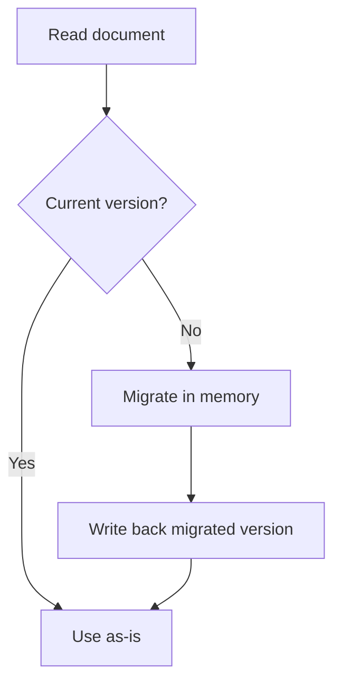
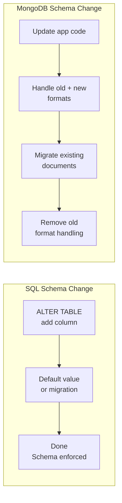

# Schema Versioning — Your Schema Will Change

---

## The Myth of "Schemaless"

MongoDB is marketed as "schemaless." This is **misleading**.

Your application absolutely has a schema — it's just enforced in your code, not in the database. Every line of code that reads `document.email` is assuming the field `email` exists and is a string.

The real statement is: **MongoDB doesn't prevent schema changes, but it doesn't help you manage them either.** That's your job.

---

## The Problem

It's month 6. Your `users` collection started like this:

```json
// v1: Launch day
{ "name": "Alice", "email": "alice@example.com" }
```

Then you needed separate first/last names:

```json
// v2: Month 2
{ "firstName": "Bob", "lastName": "Smith", "email": "bob@example.com" }
```

Then you added email verification:

```json
// v3: Month 4
{ "firstName": "Charlie", "lastName": "Johnson", "email": "charlie@example.com", "emailVerified": true }
```

Now your database has THREE different document shapes in the same collection. Your code needs to handle all of them.

---

## Strategy 1: Schema Version Field

Add an explicit version number to every document:

```typescript
interface UserV1 {
  _id: string;
  schemaVersion: 1;
  name: string;
  email: string;
}

interface UserV2 {
  _id: string;
  schemaVersion: 2;
  firstName: string;
  lastName: string;
  email: string;
}

interface UserV3 {
  _id: string;
  schemaVersion: 3;
  firstName: string;
  lastName: string;
  email: string;
  emailVerified: boolean;
}

type UserDocument = UserV1 | UserV2 | UserV3;

// Migration function — converts any version to current
function migrateUser(doc: UserDocument): UserV3 {
  let user = doc;
  
  if (user.schemaVersion === 1) {
    const [firstName, ...rest] = (user as UserV1).name.split(' ');
    user = {
      _id: user._id,
      schemaVersion: 2,
      firstName,
      lastName: rest.join(' ') || 'Unknown',
      email: user.email,
    } as UserV2;
  }
  
  if (user.schemaVersion === 2) {
    user = {
      ...(user as UserV2),
      schemaVersion: 3,
      emailVerified: false,  // Default for old users
    } as UserV3;
  }
  
  return user as UserV3;
}
```

```go
// Go equivalent
type UserDocument struct {
    ID            string `bson:"_id"`
    SchemaVersion int    `bson:"schemaVersion"`
    
    // V1 fields
    Name string `bson:"name,omitempty"`
    
    // V2+ fields
    FirstName string `bson:"firstName,omitempty"`
    LastName  string `bson:"lastName,omitempty"`
    
    // Universal
    Email         string `bson:"email"`
    EmailVerified *bool  `bson:"emailVerified,omitempty"`  // Pointer to distinguish unset from false
}

func migrateUser(doc *UserDocument) {
    if doc.SchemaVersion < 2 {
        parts := strings.SplitN(doc.Name, " ", 2)
        doc.FirstName = parts[0]
        if len(parts) > 1 {
            doc.LastName = parts[1]
        } else {
            doc.LastName = "Unknown"
        }
        doc.Name = ""
        doc.SchemaVersion = 2
    }
    
    if doc.SchemaVersion < 3 {
        verified := false
        doc.EmailVerified = &verified
        doc.SchemaVersion = 3
    }
}
```

---

## Strategy 2: Lazy Migration (Migrate on Read)

Don't migrate all documents at once. Migrate each document when it's read:



```typescript
async function getUser(userId: string): Promise<UserV3> {
  const doc = await db.collection('users').findOne({ _id: userId });
  if (!doc) throw new Error('User not found');
  
  const migrated = migrateUser(doc as UserDocument);
  
  // Write back if it was an old version (lazy migration)
  if (doc.schemaVersion !== 3) {
    await db.collection('users').replaceOne(
      { _id: userId, schemaVersion: doc.schemaVersion },  // Optimistic check
      migrated
    );
  }
  
  return migrated;
}
```

**Advantages**:
- No downtime migration
- No big-bang batch operation
- Documents migrate gradually as they're accessed
- Unreached documents stay in old format (fine if never read)

**Disadvantages**:
- Old documents persist until accessed
- Code must handle all versions forever (or until batch migration runs)
- Queries against old-format fields may miss documents

---

## Strategy 3: Background Migration (Batch)

Run a migration script that updates all documents:

```typescript
async function migrateAllUsers() {
  const cursor = db.collection('users').find({
    schemaVersion: { $lt: 3 }
  });
  
  let batch: any[] = [];
  const BATCH_SIZE = 500;
  
  for await (const doc of cursor) {
    const migrated = migrateUser(doc as UserDocument);
    batch.push({
      updateOne: {
        filter: { _id: doc._id, schemaVersion: doc.schemaVersion },
        update: { $set: migrated },
      }
    });
    
    if (batch.length >= BATCH_SIZE) {
      await db.collection('users').bulkWrite(batch, { ordered: false });
      batch = [];
    }
  }
  
  if (batch.length > 0) {
    await db.collection('users').bulkWrite(batch, { ordered: false });
  }
}
```

**Key safeguards**:
- `schemaVersion: doc.schemaVersion` in filter prevents double-migration
- `ordered: false` allows independent operations to succeed even if some fail
- `BATCH_SIZE` prevents memory pressure
- Run during low-traffic periods

---

## Strategy 4: MongoDB Schema Validation

MongoDB supports JSON Schema validation (since 3.6):

```typescript
await db.command({
  collMod: 'users',
  validator: {
    $jsonSchema: {
      bsonType: 'object',
      required: ['firstName', 'lastName', 'email', 'schemaVersion'],
      properties: {
        schemaVersion: { bsonType: 'int', minimum: 3 },
        firstName: { bsonType: 'string' },
        lastName: { bsonType: 'string' },
        email: { bsonType: 'string' },
        emailVerified: { bsonType: 'bool' },
      }
    }
  },
  validationLevel: 'moderate',  // Only validate inserts and updates, not existing docs
  validationAction: 'warn'     // Log warnings, don't reject (start here)
});
```

`validationLevel: 'moderate'` is critical — it validates new writes without breaking reads of old documents. Once you've migrated all old documents, switch to `strict`.

---

## Comparison: SQL vs. MongoDB Schema Changes



| Aspect | SQL | MongoDB |
|--------|-----|---------|
| Adding a field | `ALTER TABLE ADD COLUMN` | Just start writing the field |
| Renaming a field | `ALTER TABLE RENAME COLUMN` | Application must handle both names |
| Changing a type | `ALTER TABLE ALTER COLUMN` | Application must cast/convert |
| Removing a field | `ALTER TABLE DROP COLUMN` | Just stop writing it (old docs keep it) |
| Validation | Always enforced | Optional, configurable |
| Downtime for changes | Sometimes (large tables) | Never (if done right) |
| Migration complexity | Simple (SQL handles it) | Application responsibility |

---

## Best Practices

1. **Always include `schemaVersion`** in your documents from day one
2. **Write migration functions** that convert from any version to the current version
3. **Start with lazy migration**, add batch migration for completeness
4. **Use `validationLevel: 'moderate'`** to catch new bad writes without breaking old docs
5. **Test migrations** on a copy of production data before running them
6. **Never assume a field exists** — always use defaults or type guards

```typescript
// Bad — crashes on old documents without firstName
function displayName(user: any): string {
  return `${user.firstName} ${user.lastName}`;
}

// Good — handles all versions
function displayName(user: any): string {
  if (user.firstName) return `${user.firstName} ${user.lastName || ''}`.trim();
  if (user.name) return user.name;
  return 'Unknown User';
}
```

---

## Next

→ [05-index-design.md](./05-index-design.md) — The most important performance tool in MongoDB.
