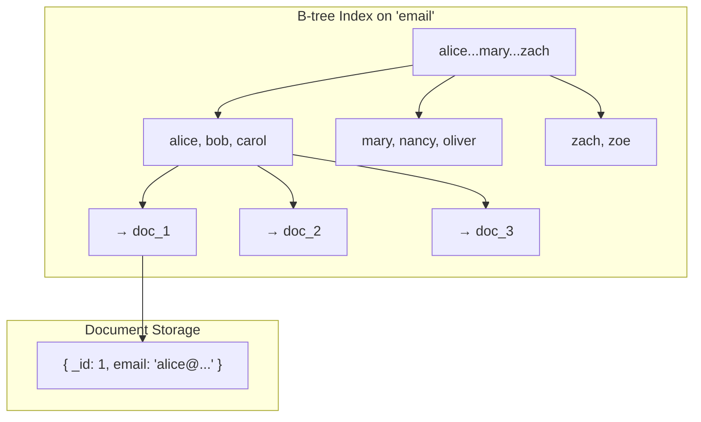
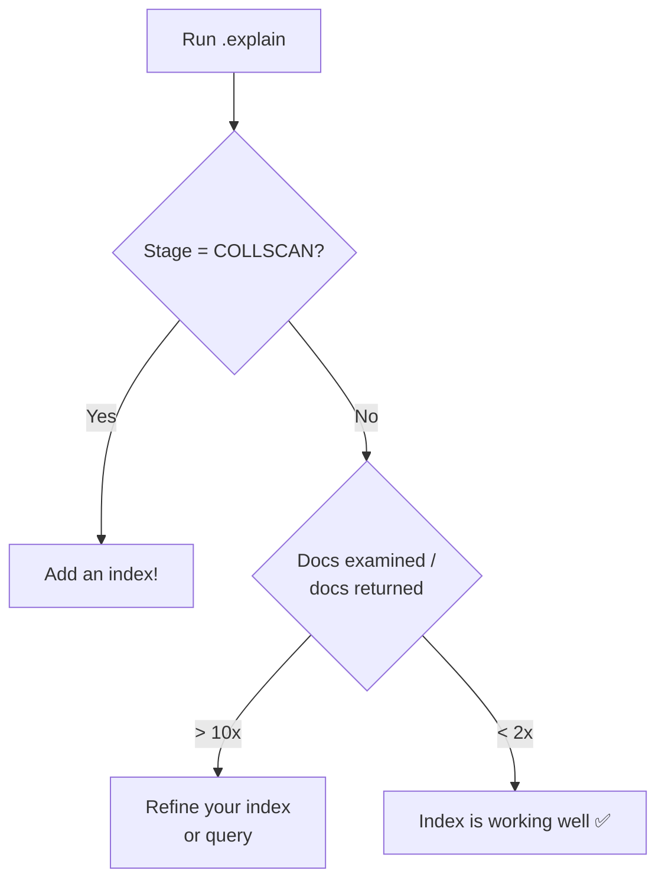

# Index Design — The Performance Lever

---

## Why Indexes Are Critical

Without an index, MongoDB scans **every document** in the collection to answer a query. This is a `COLLSCAN` — the MongoDB equivalent of a full table scan in SQL.

With 10 million documents, a COLLSCAN takes seconds. With a proper index, the same query takes **milliseconds**.

If you take one thing from this module: **your index strategy matters more than your schema**.

---

## How MongoDB Indexes Work

MongoDB uses **B-tree indexes** (technically B+ trees), just like SQL databases. The index stores field values in sorted order, with pointers to the full document.



Finding `email: 'bob@...'` is O(log n) — the index narrows the search to the exact document, no scanning required.

---

## Index Types Deep Dive

### 1. Single Field Index

```typescript
// Index on one field
db.collection('users').createIndex({ email: 1 });   // Ascending
db.collection('users').createIndex({ createdAt: -1 }); // Descending

// Queries that use this index:
db.collection('users').find({ email: 'alice@example.com' });  // ✅ Equality
db.collection('users').find({ createdAt: { $gt: someDate } }); // ✅ Range
db.collection('users').find({}).sort({ email: 1 });             // ✅ Sort
```

### 2. Compound Index (Most Important)

A compound index indexes multiple fields **in order**. The order matters enormously.

```typescript
// Compound index on { category: 1, price: -1 }
db.collection('products').createIndex({ category: 1, price: -1 });
```

This index supports:

```typescript
// ✅ Uses index — equality on first field
db.collection('products').find({ category: 'electronics' });

// ✅ Uses index — equality on first, range on second
db.collection('products').find({ category: 'electronics', price: { $lt: 100 } });

// ✅ Uses index — equality on first, sort on second
db.collection('products').find({ category: 'electronics' }).sort({ price: -1 });

// ❌ CANNOT use index — skips the first field
db.collection('products').find({ price: { $lt: 100 } });

// ⚠️ Partially uses index — only the category part
db.collection('products').find({ category: 'electronics', rating: { $gt: 4 } });
```

**The ESR Rule** (Equality, Sort, Range):


```typescript
// Query: Find electronics, sorted by price, where rating > 4
db.collection('products').find({ 
  category: 'electronics',     // Equality
  rating: { $gt: 4 }           // Range
}).sort({ price: -1 });         // Sort

// Best index (ESR):
db.collection('products').createIndex({ 
  category: 1,   // E: Equality
  price: -1,     // S: Sort
  rating: 1      // R: Range
});
```

### 3. Multikey Index (Arrays)

MongoDB automatically creates multikey indexes when the indexed field is an array:

```typescript
// Document with array field
{ _id: 1, title: 'MongoDB Guide', tags: ['database', 'nosql', 'tutorial'] }

// Index on array field
db.collection('articles').createIndex({ tags: 1 });

// Queries that use this index:
db.collection('articles').find({ tags: 'nosql' });           // ✅ Match any element
db.collection('articles').find({ tags: { $in: ['nosql', 'sql'] } }); // ✅ Match any of
```

**Limitation**: A compound index can have at most **one** array field.

### 4. Text Index

```typescript
// Full-text search
db.collection('articles').createIndex({ title: 'text', content: 'text' });

db.collection('articles').find({ $text: { $search: 'mongodb performance tuning' } });
```

**Limitation**: One text index per collection. For serious full-text search, use Elasticsearch or Atlas Search.

### 5. TTL Index (Time To Live)

```typescript
// Automatically delete documents after expiration
db.collection('sessions').createIndex(
  { createdAt: 1 },
  { expireAfterSeconds: 3600 }  // Delete after 1 hour
);
```

TTL indexes run a background process every 60 seconds to delete expired documents. Perfect for sessions, temporary tokens, rate-limit counters.

### 6. Partial Index

Index only documents that match a filter — saves storage and improves performance:

```typescript
// Only index active users
db.collection('users').createIndex(
  { email: 1 },
  { partialFilterExpression: { status: 'active' } }
);

// ✅ Uses partial index (query matches filter)
db.collection('users').find({ email: 'alice@...', status: 'active' });

// ❌ Cannot use partial index (query doesn't include status: 'active')
db.collection('users').find({ email: 'alice@...' });
```

### 7. Unique Index

```typescript
// Enforce uniqueness
db.collection('users').createIndex({ email: 1 }, { unique: true });

// Combined: unique + partial (unique among active users only)
db.collection('users').createIndex(
  { email: 1 },
  { unique: true, partialFilterExpression: { status: 'active' } }
);
```

---

## The Explain Plan — Your Diagnostic Tool

```typescript
const explain = await db.collection('products')
  .find({ category: 'electronics', price: { $lt: 100 } })
  .explain('executionStats');

console.log(JSON.stringify(explain.executionStats, null, 2));
```

Key fields to look at:

```json
{
  "executionStats": {
    "nReturned": 42,                    // Documents matching your query
    "totalKeysExamined": 150,           // Index entries scanned
    "totalDocsExamined": 42,            // Documents loaded from disk
    "executionTimeMillis": 3,           // Total time
    "executionStages": {
      "stage": "IXSCAN",               // Using index (good!)
      "indexName": "category_1_price_-1"
    }
  }
}
```

**What to look for:**

| Metric | Good | Bad |
|--------|------|-----|
| `stage` | `IXSCAN` | `COLLSCAN` |
| `totalDocsExamined` / `nReturned` | Close to 1 | Much larger (scanning too many) |
| `totalKeysExamined` / `nReturned` | Close to 1 | Much larger (index not selective) |
| `executionTimeMillis` | < 10ms | > 100ms |



---

## Common Index Mistakes

### Mistake 1: Too many indexes

Every index:
- Slows down writes (must update all indexes)
- Uses RAM (indexes should fit in memory)
- Adds storage

```
✅ 5-10 indexes per collection: normal
⚠️ 15-20 indexes: review for redundancy
❌ 30+ indexes: something is wrong
```

### Mistake 2: Redundant indexes

```typescript
// These two indexes:
{ category: 1 }
{ category: 1, price: 1 }

// The compound index covers both use cases!
// The single-field index on category is redundant — drop it.
```

A compound index `{ a: 1, b: 1 }` covers queries on `{ a: 1 }` (prefix). But `{ b: 1 }` does NOT cover `{ a: 1, b: 1 }`.

### Mistake 3: Wrong field order in compound index

```typescript
// Query: find by status (3 values) and sort by createdAt
db.collection('orders').find({ status: 'pending' }).sort({ createdAt: -1 });

// ❌ Wrong order — poor index utilization
db.collection('orders').createIndex({ createdAt: -1, status: 1 });

// ✅ Right order — equality first, then sort
db.collection('orders').createIndex({ status: 1, createdAt: -1 });
```

### Mistake 4: Indexing low-cardinality fields alone

```typescript
// Boolean field — only 2 values. Nearly useless as sole index.
db.collection('users').createIndex({ isActive: 1 }); // ❌

// Better: compound with a selective field
db.collection('users').createIndex({ isActive: 1, lastLogin: -1 }); // ✅
// Or use a partial index:
db.collection('users').createIndex(
  { lastLogin: -1 },
  { partialFilterExpression: { isActive: true } }
);
```

---

## Covered Queries (The Gold Standard)

A **covered query** is answered entirely from the index — MongoDB never loads the full document from disk.

```typescript
// Index: { email: 1, name: 1 }
// Query returns only indexed fields + excludes _id
const result = await db.collection('users')
  .find({ email: 'alice@example.com' })
  .project({ email: 1, name: 1, _id: 0 })  // Only indexed fields!
  .toArray();

// explain will show: totalDocsExamined: 0 ← document never loaded
```

Covered queries are the fastest possible reads. Design your most frequent queries to be covered.

---

## Summary

1. **Every frequent query must have an index** — COLLSCAN is unacceptable in production
2. **Follow ESR** — Equality, Sort, Range for compound index field order
3. **Use `explain()`** — verify your indexes are actually being used
4. **Prefer compound indexes** — they cover multiple query patterns
5. **Watch index count** — every index costs write performance and RAM
6. **Aim for covered queries** on your hottest read paths

---

## Next

→ [06-aggregation-pipeline.md](./06-aggregation-pipeline.md) — MongoDB's most powerful (and most misunderstood) feature.
