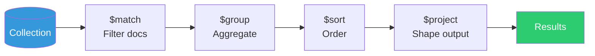
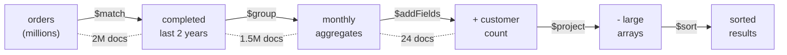

# Aggregation Pipeline — MongoDB's Query Language

---

## What It Is

The aggregation pipeline is MongoDB's most powerful query mechanism. It's a sequence of **stages**, where each stage transforms the data and passes results to the next stage.

Think of it as Unix pipes for data:

```
documents | $match | $group | $sort | $project → results
```

If `find()` is MongoDB's `SELECT ... WHERE`, the aggregation pipeline is its `SELECT ... JOIN ... GROUP BY ... HAVING ... ORDER BY ... WINDOW FUNCTIONS`.

---

## The Pipeline Model



Each stage:
1. Receives documents from the previous stage
2. Transforms them
3. Passes results to the next stage

**Critical rule**: Put `$match` as early as possible. It's the only stage that can use indexes, and it reduces the document count for all subsequent stages.

---

## Essential Stages

### `$match` — Filter Documents (Use First!)

```typescript
// Equivalent to find({ status: 'active', age: { $gte: 18 } })
db.collection('users').aggregate([
  { $match: { status: 'active', age: { $gte: 18 } } }
]);
```

### `$group` — Aggregate by Key

```typescript
// Total sales per product category
db.collection('orders').aggregate([
  { $match: { status: 'completed' } },
  { $unwind: '$items' },
  { $group: {
      _id: '$items.category',
      totalRevenue: { $sum: { $multiply: ['$items.price', '$items.quantity'] } },
      orderCount: { $sum: 1 },
      avgOrderValue: { $avg: '$total' }
    }
  },
  { $sort: { totalRevenue: -1 } }
]);
```

SQL equivalent:
```sql
SELECT items.category, 
       SUM(items.price * items.quantity) AS total_revenue,
       COUNT(*) AS order_count,
       AVG(total) AS avg_order_value
FROM orders 
CROSS JOIN LATERAL unnest(items) AS items
WHERE status = 'completed'
GROUP BY items.category
ORDER BY total_revenue DESC;
```

### `$project` / `$addFields` — Shape Output

```typescript
// Transform document shape
db.collection('users').aggregate([
  { $project: {
      fullName: { $concat: ['$firstName', ' ', '$lastName'] },
      email: 1,
      accountAge: {
        $dateDiff: {
          startDate: '$createdAt',
          endDate: '$$NOW',
          unit: 'day'
        }
      }
    }
  }
]);

// $addFields keeps existing fields and adds new ones
db.collection('users').aggregate([
  { $addFields: {
      fullName: { $concat: ['$firstName', ' ', '$lastName'] }
    }
  }
]);
```

### `$unwind` — Flatten Arrays

```typescript
// Before: { _id: 1, tags: ['a', 'b', 'c'] }
// After $unwind:
// { _id: 1, tags: 'a' }
// { _id: 1, tags: 'b' }
// { _id: 1, tags: 'c' }

db.collection('articles').aggregate([
  { $unwind: '$tags' },
  { $group: { _id: '$tags', count: { $sum: 1 } } },
  { $sort: { count: -1 } },
  { $limit: 10 }
]);
// → Top 10 most used tags
```

### `$lookup` — The "JOIN" (Use With Caution)

```typescript
// "Join" orders with user details
db.collection('orders').aggregate([
  { $match: { status: 'pending' } },
  { $lookup: {
      from: 'users',
      localField: 'userId',
      foreignField: '_id',
      as: 'user'
    }
  },
  { $unwind: '$user' },  // Convert array to single object
  { $project: {
      orderId: '$_id',
      total: 1,
      userName: '$user.name',
      userEmail: '$user.email'
    }
  }
]);
```

**⚠️ `$lookup` warnings:**
- Not distributed — won't work across shards efficiently
- No index pushdown on the foreign collection in older versions
- If you're using `$lookup` heavily, you should probably embed or denormalize
- Use it for reports and admin queries, not for user-facing hot paths

### `$facet` — Multiple Pipelines in Parallel

```typescript
// Get results AND metadata in one query
db.collection('products').aggregate([
  { $match: { category: 'electronics' } },
  { $facet: {
      results: [
        { $sort: { price: 1 } },
        { $skip: 20 },
        { $limit: 10 },
        { $project: { title: 1, price: 1 } }
      ],
      totalCount: [
        { $count: 'count' }
      ],
      priceRange: [
        { $group: {
            _id: null,
            minPrice: { $min: '$price' },
            maxPrice: { $max: '$price' },
            avgPrice: { $avg: '$price' }
          }
        }
      ]
    }
  }
]);
// Returns: { results: [...], totalCount: [{ count: 150 }], priceRange: [{ min, max, avg }] }
```

---

## Real-World Pipeline: Analytics Dashboard

```typescript
// Monthly revenue report with year-over-year comparison
const pipeline = [
  // Stage 1: Filter to completed orders in the last 2 years
  { $match: {
      status: 'completed',
      completedAt: { $gte: new Date('2023-01-01') }
    }
  },
  
  // Stage 2: Group by year and month
  { $group: {
      _id: {
        year: { $year: '$completedAt' },
        month: { $month: '$completedAt' }
      },
      revenue: { $sum: '$total' },
      orderCount: { $sum: 1 },
      avgOrderValue: { $avg: '$total' },
      uniqueCustomers: { $addToSet: '$userId' }
    }
  },
  
  // Stage 3: Calculate customer count (sets can't be counted in $group)
  { $addFields: {
      customerCount: { $size: '$uniqueCustomers' }
    }
  },
  
  // Stage 4: Remove the large set, keep the count
  { $project: { uniqueCustomers: 0 } },
  
  // Stage 5: Sort by date
  { $sort: { '_id.year': 1, '_id.month': 1 } }
];

const report = await db.collection('orders').aggregate(pipeline).toArray();
```



Notice how 2 million documents become 24 results. The `$match` stage is critical — it uses indexes and eliminates documents early.

---

## Pipeline Performance Rules

### Rule 1: `$match` first, always

```typescript
// ❌ Bad — processes ALL documents before filtering
[
  { $group: { _id: '$category', total: { $sum: '$price' } } },
  { $match: { total: { $gt: 1000 } } }  // This filters groups, not input
]

// ✅ Good — filter input documents first
[
  { $match: { status: 'active' } },      // Reduce input set
  { $group: { _id: '$category', total: { $sum: '$price' } } },
  { $match: { total: { $gt: 1000 } } }   // Then filter groups
]
```

### Rule 2: `$project` before `$lookup`

```typescript
// ❌ Bad — lookup carries all fields
[
  { $lookup: { from: 'users', localField: 'userId', foreignField: '_id', as: 'user' } },
  { $project: { total: 1, 'user.name': 1 } }
]

// ✅ Good — reduce document size before lookup
[
  { $project: { userId: 1, total: 1 } },
  { $lookup: { from: 'users', localField: 'userId', foreignField: '_id', as: 'user' } }
]
```

### Rule 3: Use `$limit` early when possible

```typescript
// ✅ Limit reduces work for all subsequent stages
[
  { $match: { category: 'electronics' } },
  { $sort: { rating: -1 } },
  { $limit: 10 },                        // Stop processing after 10
  { $lookup: { ... } }                   // Only 10 lookups instead of thousands
]
```

### Rule 4: `allowDiskUse` for large aggregations

```typescript
// When aggregation exceeds 100MB RAM limit
db.collection('orders').aggregate(pipeline, { allowDiskUse: true });
```

---

## When to Use Aggregation vs. Application Code

| Use Case | Aggregation | App Code |
|----------|------------|----------|
| Filter + sort + paginate | ✅ | ❌ |
| Group + aggregate (sum, avg) | ✅ | ❌ |
| Complex transformations | Depends | ✅ if readability matters |
| Cross-collection joins | ⚠️ ($lookup) | ✅ (two queries) |
| Real-time user requests | ⚠️ (keep simple) | ✅ for complex logic |
| Reports and analytics | ✅ | ❌ |

---

## Next

→ [07-joins-and-lookups.md](./07-joins-and-lookups.md) — Why MongoDB has JOINs and why you should be careful with them.
