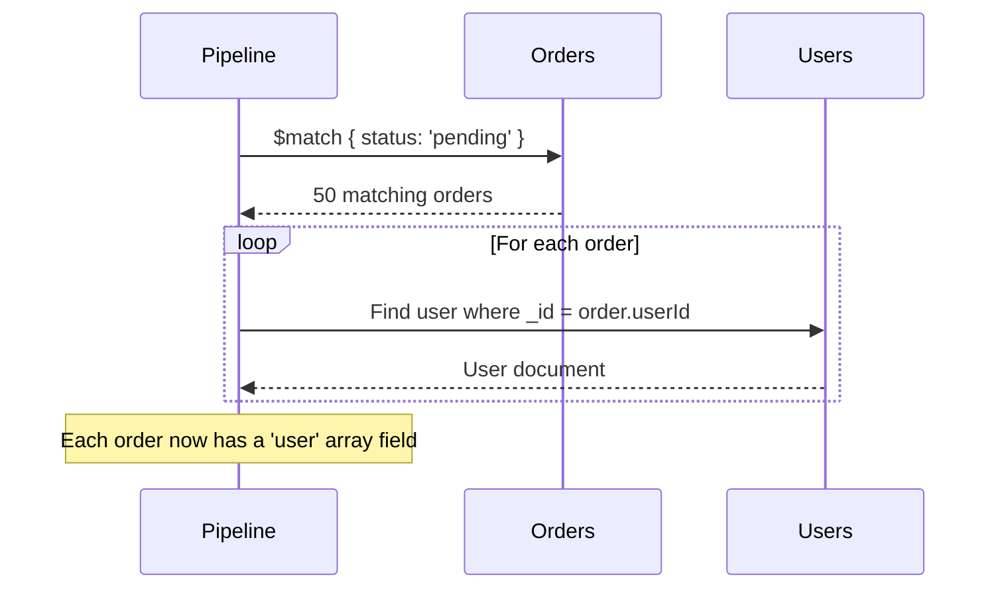
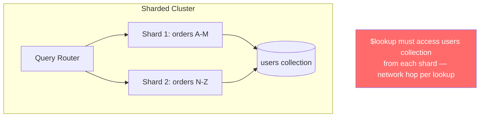
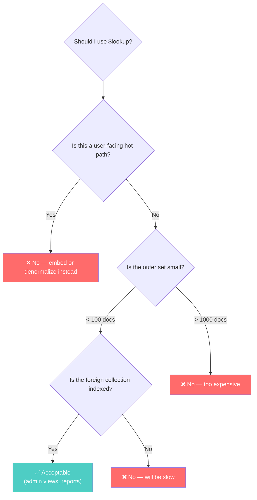

# Joins and $lookup — Why MongoDB Has Them (And Why You Should Be Careful)

---

## The Irony

MongoDB was created to **avoid joins**. The whole point of document modeling is to embed related data so you never need to combine data from multiple collections.

Then MongoDB added `$lookup`. Why?

Because real applications aren't pure. Even with the best document modeling, you'll have data that **shouldn't** be embedded (unbounded lists, independently accessed entities, many-to-many relationships). When you reference instead of embed, you need a way to recombine the data.

`$lookup` exists for this purpose. But it's a **compromise**, not a feature to celebrate.

---

## How `$lookup` Works

### Basic Lookup (Equality Join)

```typescript
// orders has userId, we want user details
const orders = await db.collection('orders').aggregate([
  { $match: { status: 'pending' } },
  { $lookup: {
      from: 'users',              // Foreign collection
      localField: 'userId',       // Field in orders
      foreignField: '_id',        // Field in users
      as: 'user'                  // Output array field name
    }
  },
  { $unwind: '$user' }            // Convert single-element array to object
]).toArray();
```



### Pipeline Lookup (Correlated Subquery)

More powerful — you can run a full sub-pipeline on the foreign collection:

```typescript
// Get orders with their most recent 3 status updates
db.collection('orders').aggregate([
  { $lookup: {
      from: 'order_status_history',
      let: { orderId: '$_id' },           // Variables from outer doc
      pipeline: [
        { $match: { $expr: { $eq: ['$orderId', '$$orderId'] } } },
        { $sort: { timestamp: -1 } },
        { $limit: 3 },
        { $project: { status: 1, timestamp: 1, _id: 0 } }
      ],
      as: 'recentUpdates'
    }
  }
]);
```

---

## Why `$lookup` Is Expensive

### Problem 1: No Distributed Joins

In a sharded cluster, `$lookup` **only works on the primary shard** of the "from" collection, or requires all matching data to be sent there. This means:



### Problem 2: N+1 Query Pattern

A basic `$lookup` is essentially an N+1 query: for each document in the outer collection, MongoDB executes a query on the inner collection.

50 orders → 50 individual lookups to users. Not 1 batched query. 50.

### Problem 3: Memory Pressure

`$lookup` results are held in memory. If your foreign collection returns large documents, you'll hit the 100MB aggregation memory limit quickly.

---

## When `$lookup` Is Acceptable



| Scenario | Use $lookup? |
|----------|-------------|
| Admin dashboard showing orders with user names | ✅ Yes (low frequency, small result set) |
| API endpoint returning product with reviews | ❌ No (embed recent reviews in product) |
| Report: revenue by user segment | ✅ Yes (batch job, not real-time) |
| User's home feed with author details | ❌ No (denormalize author info into posts) |
| Backfill migration script | ✅ Yes (one-time operation) |

---

## Alternatives to `$lookup`

### Alternative 1: Embed at Write Time

Instead of looking up user data when reading orders, embed the needed user data when creating the order:

```typescript
// At order creation time
const user = await db.collection('users').findOne({ _id: userId });
await db.collection('orders').insertOne({
  userId: user._id,
  userName: user.name,          // Denormalized
  userEmail: user.email,        // Denormalized
  items: [...],
  total: 99.99,
  createdAt: new Date()
});

// Reading: no $lookup needed
const orders = await db.collection('orders')
  .find({ userId })
  .sort({ createdAt: -1 })
  .toArray();
// userName and userEmail are already there
```

### Alternative 2: Application-Level Join

Two queries are often faster than one `$lookup`:

```typescript
// Instead of $lookup:
async function getOrdersWithUsers(status: string) {
  // Query 1: Get orders
  const orders = await db.collection('orders')
    .find({ status })
    .limit(50)
    .toArray();
  
  // Query 2: Batch get unique users
  const userIds = [...new Set(orders.map(o => o.userId))];
  const users = await db.collection('users')
    .find({ _id: { $in: userIds } })
    .toArray();
  
  // Merge in application
  const userMap = new Map(users.map(u => [u._id.toString(), u]));
  return orders.map(order => ({
    ...order,
    user: userMap.get(order.userId.toString())
  }));
}
```

```go
// Go equivalent — application-level join
func getOrdersWithUsers(ctx context.Context, status string) ([]OrderWithUser, error) {
    // Query 1: Get orders
    cursor, err := ordersCol.Find(ctx, bson.M{"status": status}, 
        options.Find().SetLimit(50))
    if err != nil { return nil, err }
    
    var orders []Order
    if err := cursor.All(ctx, &orders); err != nil { return nil, err }
    
    // Collect unique user IDs
    userIDSet := make(map[string]bool)
    for _, o := range orders {
        userIDSet[o.UserID] = true
    }
    userIDs := make([]string, 0, len(userIDSet))
    for id := range userIDSet {
        userIDs = append(userIDs, id)
    }
    
    // Query 2: Batch get users
    cursor, err = usersCol.Find(ctx, bson.M{"_id": bson.M{"$in": userIDs}})
    if err != nil { return nil, err }
    
    var users []User
    if err := cursor.All(ctx, &users); err != nil { return nil, err }
    
    // Build map and merge
    userMap := make(map[string]User)
    for _, u := range users {
        userMap[u.ID] = u
    }
    
    results := make([]OrderWithUser, len(orders))
    for i, o := range orders {
        results[i] = OrderWithUser{Order: o, User: userMap[o.UserID]}
    }
    return results, nil
}
```

This is **2 queries instead of 1**, but:
- Each query uses indexes efficiently
- No N+1 pattern
- Works across shards
- Application has full control over batching

---

## The Rule of Thumb

> **If you need `$lookup` more than twice in a collection's common read paths, your schema needs redesigning.**

`$lookup` is a band-aid. It means your data is organized for writes (normalized) but read in a way that requires combining (joins). That's a SQL pattern. If you're doing SQL patterns in MongoDB, you're getting the worst of both worlds.

---

## Next

→ [08-transactions-when-they-matter.md](./08-transactions-when-they-matter.md) — MongoDB has transactions. Here's when they're necessary and when they're a code smell.
