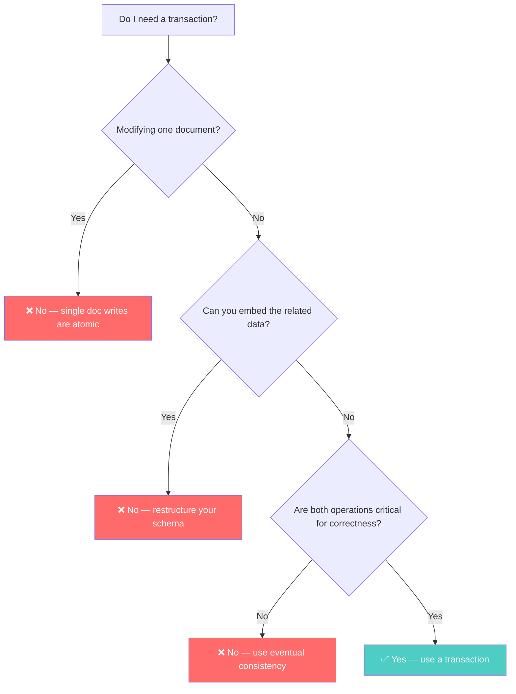
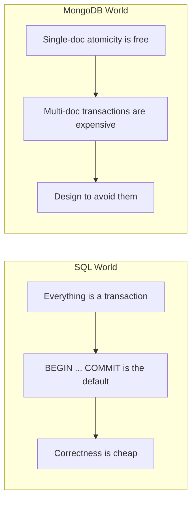

# Transactions — When They Matter and When They're a Smell

---

## The Background

MongoDB didn't support multi-document transactions until version 4.0 (2018). For the first 9 years of its existence, the only atomic operation was a **single document write**.

This wasn't an oversight — it was a design choice. MongoDB's philosophy: if you need atomicity, put all related data in one document.

But reality is messy. Sometimes you CAN'T put everything in one document. That's when transactions matter.

---

## Single-Document Atomicity (MongoDB's First-Class Citizen)

Every write to a single document is atomic — guaranteed. No transactions needed.

```typescript
// This is atomic — all fields update together or none do
await db.collection('accounts').updateOne(
  { _id: accountId, balance: { $gte: amount } },
  {
    $inc: { balance: -amount },
    $push: {
      transactions: {
        type: 'withdrawal',
        amount,
        at: new Date()
      }
    },
    $set: { lastActivity: new Date() }
  }
);
```

If your data model puts related data in the same document, you rarely need multi-document transactions. This is why schema design is so important in MongoDB.

---

## When Multi-Document Transactions Are Necessary

### Scenario: Transfer Between Accounts

Two separate account documents must update atomically — debit one, credit another:

```typescript
const session = client.startSession();

try {
  await session.withTransaction(async () => {
    // Debit source account
    const source = await db.collection('accounts').findOneAndUpdate(
      { _id: sourceId, balance: { $gte: amount } },
      { $inc: { balance: -amount } },
      { session, returnDocument: 'after' }
    );
    
    if (!source) {
      throw new Error('Insufficient funds');
    }
    
    // Credit destination account
    await db.collection('accounts').updateOne(
      { _id: destId },
      { $inc: { balance: amount } },
      { session }
    );
    
    // Record the transfer
    await db.collection('transfers').insertOne({
      from: sourceId,
      to: destId,
      amount,
      completedAt: new Date()
    }, { session });
  });
} finally {
  await session.endSession();
}
```

```go
// Go equivalent
func transferFunds(ctx context.Context, client *mongo.Client, from, to string, amount float64) error {
    session, err := client.StartSession()
    if err != nil { return err }
    defer session.EndSession(ctx)
    
    _, err = session.WithTransaction(ctx, func(sessCtx mongo.SessionContext) (interface{}, error) {
        accounts := client.Database("bank").Collection("accounts")
        
        // Debit
        result := accounts.FindOneAndUpdate(sessCtx,
            bson.M{"_id": from, "balance": bson.M{"$gte": amount}},
            bson.M{"$inc": bson.M{"balance": -amount}},
        )
        if result.Err() != nil {
            return nil, fmt.Errorf("insufficient funds: %w", result.Err())
        }
        
        // Credit
        _, err := accounts.UpdateOne(sessCtx,
            bson.M{"_id": to},
            bson.M{"$inc": bson.M{"balance": amount}},
        )
        if err != nil { return nil, err }
        
        // Record transfer
        transfers := client.Database("bank").Collection("transfers")
        _, err = transfers.InsertOne(sessCtx, bson.M{
            "from": from, "to": to, "amount": amount,
            "completedAt": time.Now(),
        })
        return nil, err
    })
    return err
}
```

---

## When Transactions Are a Code Smell

### Smell 1: Transactions Everywhere

```typescript
// ❌ SMELL — this should be a single document write
const session = client.startSession();
await session.withTransaction(async () => {
  await db.collection('users').updateOne(
    { _id: userId },
    { $set: { name: 'New Name' } },
    { session }
  );
  await db.collection('users').updateOne(     // Same collection! Same document!
    { _id: userId },
    { $set: { email: 'new@email.com' } },
    { session }
  );
});

// ✅ CORRECT — one atomic update
await db.collection('users').updateOne(
  { _id: userId },
  { $set: { name: 'New Name', email: 'new@email.com' } }
);
```

If you're wrapping single-document operations in transactions, you don't need transactions — you need a `$set` with multiple fields.

### Smell 2: Transaction as a schema crutch

```typescript
// ❌ SMELL — order + items should be ONE document
const session = client.startSession();
await session.withTransaction(async () => {
  const order = await db.collection('orders').insertOne(
    { userId, total, status: 'created' },
    { session }
  );
  
  for (const item of items) {
    await db.collection('order_items').insertOne(
      { orderId: order.insertedId, ...item },
      { session }
    );
  }
});

// ✅ CORRECT — embed items in the order document
await db.collection('orders').insertOne({
  userId,
  total,
  status: 'created',
  items: items.map(i => ({ productId: i.id, title: i.title, price: i.price, qty: i.qty })),
  createdAt: new Date()
});
```

If you're using transactions to keep related data consistent across collections, consider whether embedding would eliminate the need entirely.

### Smell 3: Long-running transactions

```typescript
// ❌ SMELL — transaction holds locks for external API call
await session.withTransaction(async () => {
  const order = await db.collection('orders').findOne({ _id: orderId }, { session });
  const result = await paymentGateway.charge(order.total);  // External API call!
  await db.collection('orders').updateOne(
    { _id: orderId },
    { $set: { paymentId: result.id, status: 'paid' } },
    { session }
  );
});
```

MongoDB transactions have a **60-second timeout** by default. External API calls can take seconds. Don't mix them.

```typescript
// ✅ CORRECT — handle externally, then use transaction only for DB update
const order = await db.collection('orders').findOne({ _id: orderId });
const paymentResult = await paymentGateway.charge(order.total);

if (paymentResult.success) {
  await db.collection('orders').updateOne(
    { _id: orderId, status: 'pending' },  // Optimistic check
    { $set: { paymentId: paymentResult.id, status: 'paid' } }
  );
}
```

---

## The Decision Framework



**Legitimate transaction use cases:**
- Financial transfers between accounts
- Inventory reservation + order creation (when can't embed)
- Creating records across collections that MUST exist together
- Any operation where partial completion means data corruption

**NOT transaction use cases:**
- Multi-field updates on a single document
- Denormalized data sync (use change streams or background workers)
- Operations where brief inconsistency is acceptable

---

## Transaction Performance Reality

| Aspect | No Transaction | With Transaction |
|--------|---------------|-----------------|
| Latency | ~2ms per op | ~10-20ms total (coordination overhead) |
| Throughput | Full | Reduced (lock contention) |
| Failure mode | Single op fails | Entire transaction aborts |
| Retry cost | Retry one op | Retry everything |

Transactions are **5-10x slower** than individual operations. At high concurrency, lock contention can become the primary bottleneck. This is why "use transactions for everything" is a recipe for production problems.

---

## The Comparison with SQL



In SQL, transactions are so fundamental that every single statement runs inside one (implicit transactions). They're cheap because the database is optimized for them.

In MongoDB, transactions are an added layer that fights against the distributed architecture. They work. They're correct. But reaching for them should be your **last resort, not your first instinct**.

---

## Next

→ [09-write-read-concerns.md](./09-write-read-concerns.md) — The fine-grained consistency controls that most developers ignore (and shouldn't).
