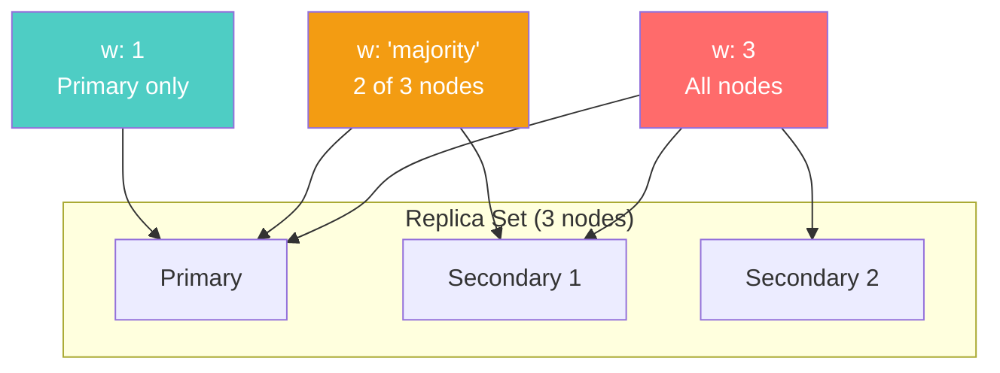
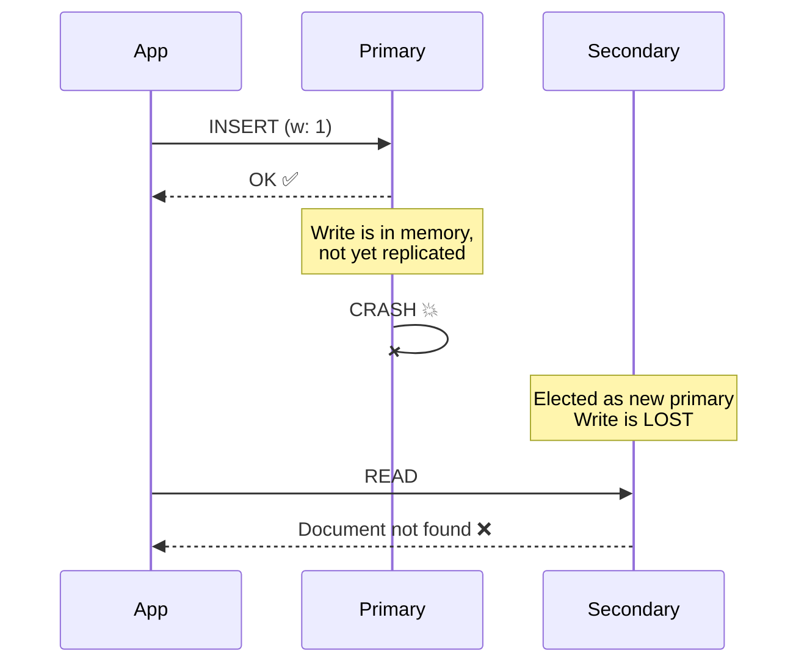
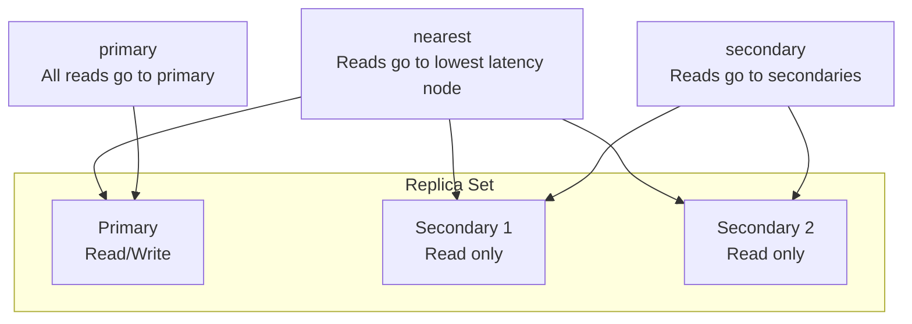
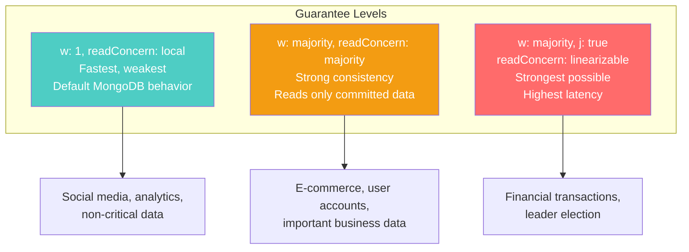

# Write Concern & Read Concern — MongoDB's Consistency Knobs

---

## The Problem

You write data to MongoDB. Is it safe? That depends on what "safe" means to you:

- "The primary acknowledged it" — but it could crash before replicating
- "A majority of replicas have it" — now it survives individual node failures
- "It's on disk" — now it survives power loss

MongoDB doesn't make this choice for you. You configure it per-operation via **write concern** and **read concern**.

---

## Write Concern

Write concern controls **how many replicas must acknowledge a write** before MongoDB tells your application "OK."



| Write Concern | Meaning | Latency | Safety |
|--------------|---------|---------|--------|
| `w: 0` | Fire and forget — no acknowledgment | ~0ms | ❌ May be lost |
| `w: 1` | Primary acknowledged | ~2ms | ⚠️ Lost if primary crashes before replication |
| `w: "majority"` | Majority of replicas | ~5-15ms | ✅ Survives any single node failure |
| `w: 3` (all) | All replicas | ~10-30ms | ✅✅ Maximum durability |
| `j: true` | Written to journal (on-disk WAL) | +2-5ms | Survives power loss |

```typescript
// Social media post — speed matters, brief loss is acceptable
await db.collection('posts').insertOne(post, {
  writeConcern: { w: 1 }
});

// Financial transaction — must survive node failure
await db.collection('transactions').insertOne(txn, {
  writeConcern: { w: 'majority', j: true }
});

// Analytics event — fire and forget
await db.collection('events').insertOne(event, {
  writeConcern: { w: 0 }
});
```

### What happens with `w: 1` and a primary crash?



This is why `w: "majority"` exists — it ensures the write reaches enough replicas that no single failure loses it.

---

## Read Concern

Read concern controls **what data a read operation can see**.

| Read Concern | Meaning | Use Case |
|-------------|---------|----------|
| `"local"` | Returns the most recent data on this node (may be uncommitted on secondaries) | Default. Fast. |
| `"available"` | Like local, but works during sharding migrations (may return orphaned data) | Sharded collections |
| `"majority"` | Returns only data committed on a majority of replicas | Strong reads |
| `"linearizable"` | Strongest — ensures you see the most recent majority-committed write | Financial, leader election |
| `"snapshot"` | Consistent point-in-time snapshot (used with transactions) | Multi-statement transactions |

```typescript
// Default read — fast, may read uncommitted data
const user = await db.collection('users').findOne(
  { _id: userId },
  { readConcern: { level: 'local' } }
);

// Strong read — only see committed data
const balance = await db.collection('accounts').findOne(
  { _id: accountId },
  { readConcern: { level: 'majority' } }
);

// Causal consistency (session-level)
const session = client.startSession({ causalConsistency: true });
await db.collection('users').updateOne(
  { _id: userId },
  { $set: { name: 'New Name' } },
  { session, writeConcern: { w: 'majority' } }
);
// This read WILL see the write above (causal ordering)
const updated = await db.collection('users').findOne(
  { _id: userId },
  { session, readConcern: { level: 'majority' } }
);
```

---

## Read Preference

Separate from read concern, **read preference** controls **which node** serves reads:



| Read Preference | When to Use | Warning |
|----------------|-------------|---------|
| `primary` (default) | Consistency required | All read load on primary |
| `primaryPreferred` | Prefer primary, fallback to secondary | Brief staleness during failover |
| `secondary` | Offload read traffic | Data may be stale by replication lag |
| `secondaryPreferred` | Read scaling, tolerate staleness | Usually milliseconds stale |
| `nearest` | Minimize latency (multi-region) | Any node, any staleness |

---

## Combining Write Concern + Read Concern for Guarantees



### The "Read Your Own Writes" Problem

```typescript
// Without causal consistency:
await db.collection('users').updateOne(
  { _id: userId },
  { $set: { name: 'New Name' } },
  { writeConcern: { w: 1 } }
);

// If this read goes to a secondary (readPreference: secondary)...
const user = await db.collection('users').findOne({ _id: userId });
// ...it might return the OLD name (secondary hasn't replicated yet!)
```

**Fix: Use causal sessions**

```typescript
const session = client.startSession({ causalConsistency: true });

await db.collection('users').updateOne(
  { _id: userId },
  { $set: { name: 'New Name' } },
  { session, writeConcern: { w: 'majority' } }
);

// Guaranteed to see the write above, even from a secondary
const user = await db.collection('users').findOne(
  { _id: userId },
  { session, readConcern: { level: 'majority' } }
);
await session.endSession();
```

---

## Per-Operation Configuration

The most important insight: **you don't choose one consistency level for your entire application.** Different operations need different guarantees.

```typescript
// Configuration at the collection level (defaults)
const postsCollection = db.collection('posts', {
  writeConcern: { w: 1 },
  readConcern: { level: 'local' }
});

const accountsCollection = db.collection('accounts', {
  writeConcern: { w: 'majority', j: true },
  readConcern: { level: 'majority' }
});

// Or override per-operation
await postsCollection.insertOne(post);  // Uses w: 1 (default)
await accountsCollection.updateOne(     // Uses w: majority (default)
  { _id: accountId },
  { $inc: { balance: -amount } }
);
```

---

## Summary

| Question | Answer With |
|----------|------------|
| Can this write be lost if one node crashes? | Write concern (`w: "majority"`) |
| Can this write be lost on power failure? | Journal (`j: true`) |
| Can this read return uncommitted data? | Read concern (`"majority"`) |
| Can this read see stale data? | Read preference (`primary`) |
| Must I see my own writes? | Causal sessions |

**Default MongoDB is `w: 1`, `readConcern: "local"`, `readPreference: primary`.** This is fast but provides weaker guarantees than SQL's ACID defaults. Tune accordingly.

---

## Next

→ [10-performance-debugging.md](./10-performance-debugging.md) — How to find and fix slow queries in production.
