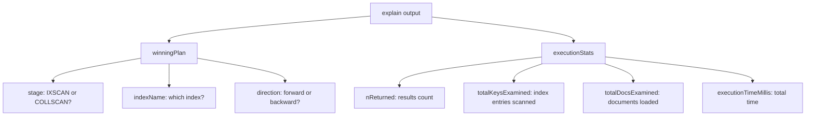
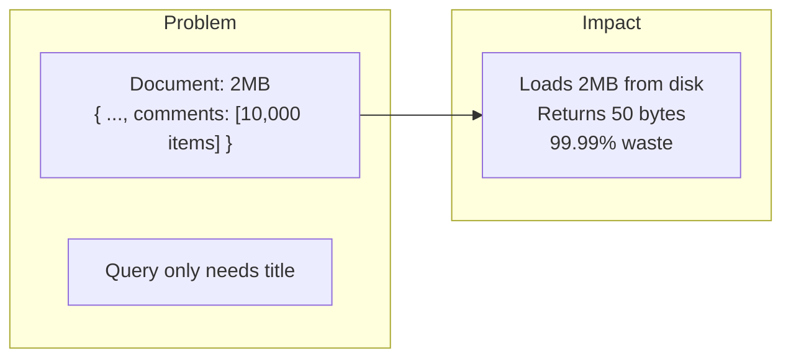
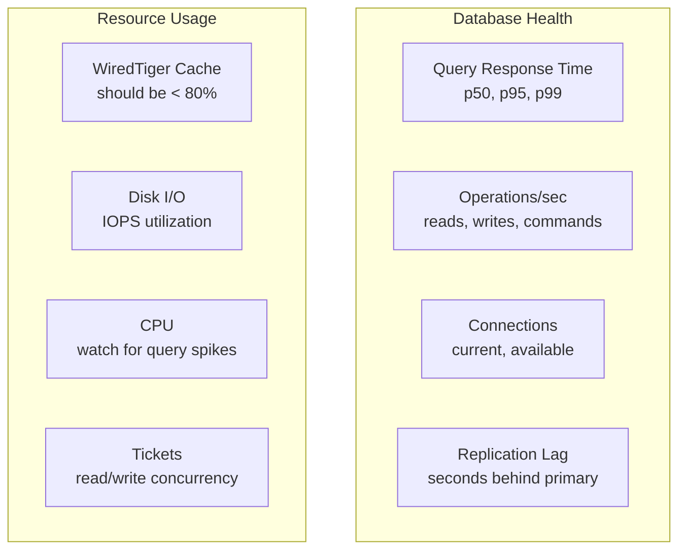

# Performance Debugging — Finding and Fixing Slow Queries

---

## The Scenario

It's 2 AM. Your MongoDB-backed API's p99 latency just spiked from 50ms to 3 seconds. Users are complaining. Your on-call engineer opens the MongoDB logs and sees:

```
2024-01-15T02:14:33.456 I COMMAND  [conn12345] command mydb.orders
  command: find { filter: { userId: "u_123", status: "pending" } }
  planSummary: COLLSCAN
  keysExamined: 0 docsExamined: 1247832 ... 2847ms
```

`COLLSCAN`. `docsExamined: 1,247,832`. `2847ms`. 

The database scanned every document in the collection because there's no index on `{ userId, status }`.

---

## The Profiler

MongoDB's profiler logs slow queries. Enable it:

```typescript
// Profile queries slower than 100ms
await db.command({ profile: 1, slowms: 100 });

// Check profiled queries
const slowQueries = await db.collection('system.profile')
  .find()
  .sort({ ts: -1 })
  .limit(10)
  .toArray();
```

Or set it in your MongoDB config:

```yaml
# mongod.conf
operationProfiling:
  mode: slowOp
  slowOpThresholdMs: 100
```

---

## The `explain()` Tool

```typescript
const explain = await db.collection('orders')
  .find({ userId: 'u_123', status: 'pending' })
  .explain('executionStats');
```

### What to Read in explain Output



**The key ratios:**

```
Ratio 1: totalDocsExamined / nReturned
   Ideal: 1.0 (every doc examined was returned)
   Bad:   > 10 (scanning 10 docs to return 1)

Ratio 2: totalKeysExamined / nReturned  
   Ideal: 1.0 (every index key led to a result)
   Bad:   > 10 (index isn't selective enough)

Ratio 3: totalDocsExamined should be 0 for covered queries
```

### Example: Diagnosing a Slow Query

```typescript
// The slow query
const explain = await db.collection('orders')
  .find({ status: 'pending', createdAt: { $gt: lastWeek } })
  .sort({ createdAt: -1 })
  .limit(20)
  .explain('executionStats');

console.log({
  stage: explain.queryPlanner.winningPlan.stage,
  nReturned: explain.executionStats.nReturned,
  totalKeysExamined: explain.executionStats.totalKeysExamined,
  totalDocsExamined: explain.executionStats.totalDocsExamined,
  executionTimeMillis: explain.executionStats.executionTimeMillis,
});

// Output (before fix):
// { stage: 'COLLSCAN', nReturned: 20, totalKeysExamined: 0, 
//   totalDocsExamined: 2000000, executionTimeMillis: 3200 }
```

**Diagnosis**: COLLSCAN, scanning 2M documents to return 20. No usable index.

**Fix** (apply ESR rule — Equality, Sort, Range):

```typescript
// Create the right index
await db.collection('orders').createIndex({ 
  status: 1,       // Equality: exact match
  createdAt: -1     // Sort + Range: sort descending, range filter
});

// After fix:
// { stage: 'IXSCAN', nReturned: 20, totalKeysExamined: 20, 
//   totalDocsExamined: 20, executionTimeMillis: 1 }
```

From 3,200ms to 1ms. That's what an index does.

---

## Common Performance Problems

### Problem 1: Missing Index

**Symptoms**: COLLSCAN in explain, high `docsExamined`

**Fix**: Create an index matching the query fields

### Problem 2: Wrong Index Order

```typescript
// Query
db.collection('products').find({ category: 'books', price: { $lt: 20 } }).sort({ rating: -1 });

// ❌ Wrong index
{ price: 1, category: 1, rating: -1 }
// Equality field (category) should come first!

// ✅ Right index (ESR: Equality, Sort, Range)
{ category: 1, rating: -1, price: 1 }
```

### Problem 3: Unbounded Queries

```typescript
// ❌ Returns potentially millions of documents
const allOrders = await db.collection('orders').find({ status: 'completed' }).toArray();

// ✅ Always paginate
const page = await db.collection('orders')
  .find({ status: 'completed' })
  .sort({ createdAt: -1 })
  .skip(offset)
  .limit(20)
  .toArray();

// ✅ Even better: cursor-based pagination (avoids skip performance issues)
const page = await db.collection('orders')
  .find({ 
    status: 'completed',
    createdAt: { $lt: lastSeenDate }  // Start from where we left off
  })
  .sort({ createdAt: -1 })
  .limit(20)
  .toArray();
```

### Problem 4: Large Documents



**Fix**: Use projection to return only needed fields, or restructure to keep documents small.

```typescript
// ❌ Loads entire 2MB document
const post = await db.collection('posts').findOne({ _id: postId });

// ✅ Load only what you need
const post = await db.collection('posts').findOne(
  { _id: postId },
  { projection: { title: 1, author: 1, createdAt: 1 } }
);
```

### Problem 5: High Write Amplification from Too Many Indexes

Every index must be updated on every write. Monitor with:

```typescript
const stats = await db.collection('orders').stats();
console.log({
  documentCount: stats.count,
  indexCount: stats.nindexes,
  totalIndexSize: stats.totalIndexSize,  // Must fit in RAM!
  avgDocSize: stats.avgObjSize
});
```

---

## Monitoring in Production

### Key Metrics to Watch



### The `currentOp` Command

See what's happening right now:

```typescript
// Find long-running operations
const ops = await db.admin().command({
  currentOp: 1,
  secs_running: { $gt: 5 },  // Running for more than 5 seconds
  op: { $ne: 'none' }
});

// Kill a problematic operation
await db.admin().command({ killOp: 1, op: operationId });
```

### The `serverStatus` Command

```typescript
const status = await db.admin().command({ serverStatus: 1 });

// Key metrics
console.log({
  connections: status.connections,
  opcounters: status.opcounters,       // reads, writes, deletes, inserts
  wiredTiger: {
    cacheUsed: status.wiredTiger.cache['bytes currently in the cache'],
    cacheMax: status.wiredTiger.cache['maximum bytes configured'],
    evictions: status.wiredTiger.cache['pages evicted by application threads']
  }
});
```

---

## The Performance Debugging Checklist

```
1. Is there a COLLSCAN? → Add an index
2. Is the index order wrong? → Apply ESR rule
3. Are documents too large? → Use projection or restructure
4. Is there a $lookup on a hot path? → Embed or denormalize
5. Are indexes fitting in RAM? → Check WiredTiger cache stats
6. Is there lock contention? → Check currentOp, reduce transaction scope
7. Is there replication lag? → Check secondaries, review write load
8. Is the query unbounded? → Add .limit(), use cursor pagination
```

---

## Phase 2 Summary

You've now covered the core of MongoDB:

1. ✅ Document vs. relational modeling
2. ✅ Embedding vs. referencing decisions
3. ✅ Schema design for read paths
4. ✅ Schema versioning strategies
5. ✅ Index design (ESR rule, types, explain)
6. ✅ Aggregation pipeline
7. ✅ Joins and $lookup (and alternatives)
8. ✅ Transactions (when necessary, when a smell)
9. ✅ Write/read concerns
10. ✅ Performance debugging

**The key insight from Phase 2**: MongoDB is a database that optimizes for **reads you can predict**. Design your schema around your access patterns, create indexes that serve your queries, and configure consistency per-operation.

---

## Next

→ **Phase 3**: [../03-cassandra-deep-dive/01-partition-and-clustering-keys.md](../03-cassandra-deep-dive/01-partition-and-clustering-keys.md) — A radically different beast.
