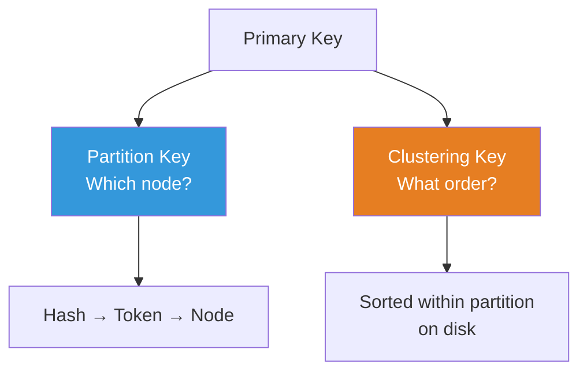
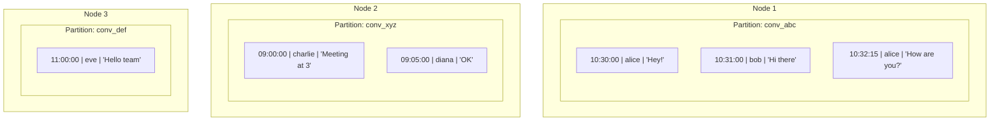
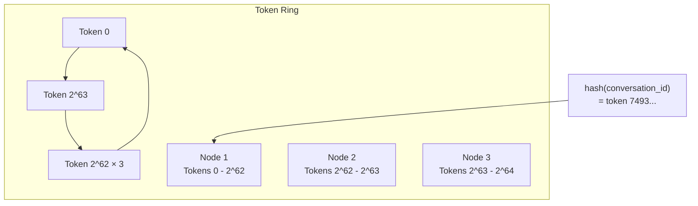
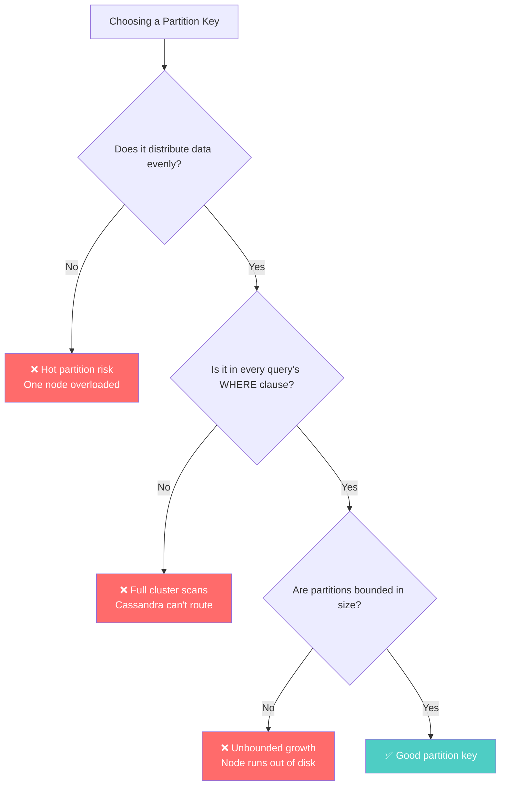

# Partition Keys and Clustering Keys — Cassandra's DNA

---

## Forget Everything You Know About Primary Keys

In SQL, a primary key uniquely identifies a row. It's that simple.

In Cassandra, the primary key does **three things**:
1. Uniquely identifies a row
2. **Determines which node stores the data** (partition key)
3. **Determines the sort order on disk** (clustering key)

This isn't a minor detail. It's the **entire foundation** of Cassandra data modeling. Get this wrong, and your cluster is either slow, broken, or both.

---

## The Primary Key Structure

```
PRIMARY KEY ((partition_key_fields), clustering_key_fields)
              ↑                       ↑
              Which NODE stores it    How it's SORTED on that node
```



### Example: Messages Table

```sql
CREATE TABLE messages (
    conversation_id UUID,
    sent_at TIMESTAMP,
    sender_id UUID,
    body TEXT,
    PRIMARY KEY ((conversation_id), sent_at)
);
--                ↑                 ↑
--         partition key      clustering key
```

How this works:
1. **Partition key** = `conversation_id` — all messages for the same conversation live on the **same node**
2. **Clustering key** = `sent_at` — within that partition, messages are sorted by timestamp **on disk**



Reading "last 50 messages in conversation ABC" is:
1. Hash `conv_abc` → find the node (O(1))
2. Seek to partition → sequential read of sorted data (O(log N + 50))
3. Done. One node. One disk seek. No join.

---

## How the Partition Key Routes Data

Cassandra uses a **consistent hash ring**. Each node owns a range of token values.



```
partition_key → hash(partition_key) → token → node that owns token range
```

This is why the partition key choice is critical: it determines **data distribution** across the cluster.

---

## Compound Partition Keys

Sometimes one field isn't enough for even distribution:

```sql
-- Bad: all US users on one node
CREATE TABLE users_by_country (
    country TEXT,
    user_id UUID,
    name TEXT,
    PRIMARY KEY ((country), user_id)
);
-- Partition: "US" has 200M users, "LI" (Liechtenstein) has 3,000. Massively unbalanced.

-- Better: compound partition key for finer distribution
CREATE TABLE users_by_country (
    country TEXT,
    bucket INT,        -- 0-99, computed as hash(user_id) % 100
    user_id UUID,
    name TEXT,
    PRIMARY KEY ((country, bucket), user_id)
);
-- Now "US" is split across 100 partitions: (US, 0), (US, 1), ... (US, 99)
```

---

## Clustering Key Ordering

Clustering keys define the **sort order within a partition**:

```sql
CREATE TABLE messages (
    conversation_id UUID,
    sent_at TIMESTAMP,
    sender_id UUID,
    body TEXT,
    PRIMARY KEY ((conversation_id), sent_at)
) WITH CLUSTERING ORDER BY (sent_at DESC);
--                                    ↑
--     Most recent messages first on disk (efficient for "latest messages")
```

Multiple clustering keys create a **nested sort**:

```sql
CREATE TABLE sensor_data (
    device_id UUID,
    date DATE,
    reading_time TIMESTAMP,
    metric_name TEXT,
    value DOUBLE,
    PRIMARY KEY ((device_id, date), reading_time, metric_name)
) WITH CLUSTERING ORDER BY (reading_time DESC, metric_name ASC);
```

On disk for one partition:
```
reading_time=10:30 | metric=cpu    | value=73.2
reading_time=10:30 | metric=memory | value=85.1
reading_time=10:30 | metric=disk   | value=42.0
reading_time=10:25 | metric=cpu    | value=71.8
reading_time=10:25 | metric=memory | value=84.3
...
```

---

## What Makes a GOOD Partition Key



| Partition Key | Good? | Why |
|--------------|-------|-----|
| `user_id` | ✅ | High cardinality, even distribution |
| `conversation_id` | ✅ | Good cardinality, bounded size (messages are finite) |
| `country` | ❌ | Low cardinality, massive skew (US vs Liechtenstein) |
| `status` | ❌ | 3-5 values, terrible distribution |
| `(device_id, date)` | ✅ | Bounded daily partitions, queries always include device+date |
| `timestamp` | ❌ | All writes hit the same partition (the current one) |

---

## The SQL Developer's Confusion

```
SQL thinking:   "I define my data, then query it however I want"
Cassandra truth: "I define my queries, then build tables to serve them"
```

In SQL, the primary key is about **identity**. In Cassandra, it's about **distribution and access patterns**.

| SQL Primary Key | Cassandra Primary Key |
|----------------|----------------------|
| Uniquely identifies a row | Uniquely identifies AND routes a row |
| Doesn't affect query performance much | **Determines** query performance |
| One table serves many queries | Each query may need its own table |
| Can query any column with WHERE | Can ONLY efficiently query by partition key |

---

## Next

→ [02-no-adhoc-queries.md](./02-no-adhoc-queries.md) — Why Cassandra refuses to answer questions it wasn't designed for.
