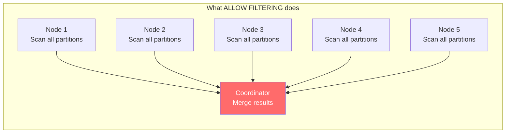
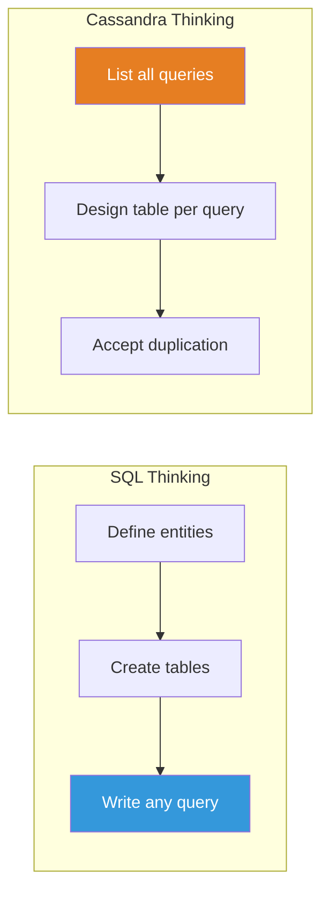
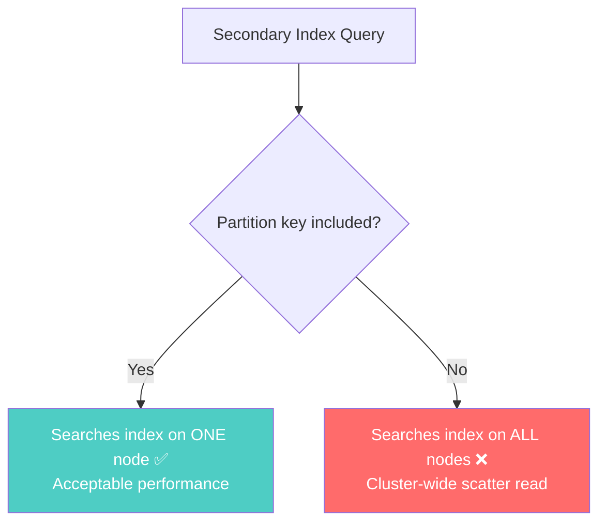

# No Ad-Hoc Queries — Cassandra's Biggest Constraint

---

## The Shock

You come from SQL. You write queries like:

```sql
SELECT * FROM orders WHERE customer_email = 'alice@example.com';
SELECT * FROM orders WHERE total > 100 ORDER BY created_at DESC;
SELECT * FROM orders WHERE status = 'pending' AND region = 'us-west';
```

In PostgreSQL, if there's no index, it does a sequential scan — slow but works. You can add an index later.

In Cassandra, these queries **will not work at all** (or will be extremely dangerous):

```sql
-- Cassandra
SELECT * FROM orders WHERE customer_email = 'alice@example.com';
-- ERROR: Cannot execute this query, customer_email is not a partition key

SELECT * FROM orders WHERE total > 100;
-- ERROR: Cannot execute this query without partition key

-- Unless you add ALLOW FILTERING...
SELECT * FROM orders WHERE customer_email = 'alice@example.com' ALLOW FILTERING;
-- "Works" but scans THE ENTIRE CLUSTER. On a 10-node cluster, this touches every node, every partition.
```

---

## Why Cassandra Refuses

Cassandra is designed for **predictable, fast queries at massive scale**. It achieves this by requiring every query to specify the partition key.

```mermaid
graph TD
    Q[Query arrives]
    Q --> PK{Partition key<br/>in WHERE clause?}
    PK -->|Yes| ROUTE[Route to specific node<br/>O(1) lookup]
    PK -->|No| SCAN["Full cluster scan ❌<br/>Touch every node, every partition"]
    
    ROUTE --> FAST[< 5ms response ✅]
    SCAN --> SLOW[Could take minutes ❌<br/>Crushes cluster performance]
    
    style FAST fill:#4ecdc4,color:#fff
    style SLOW fill:#ff6b6b,color:#fff
```

Without the partition key, Cassandra doesn't know **which node** holds the data. It would have to ask **every node** to scan **every partition**. That's a distributed full table scan — the most expensive operation possible.

SQL databases tolerate this because they're typically on one machine (or a few shards). Cassandra clusters have dozens or hundreds of nodes. A full scan on 100 nodes is catastrophic.

---

## What Queries ARE Allowed

```sql
-- Table definition
CREATE TABLE orders (
    customer_id UUID,
    order_date TIMESTAMP,
    order_id UUID,
    total DECIMAL,
    status TEXT,
    PRIMARY KEY ((customer_id), order_date, order_id)
) WITH CLUSTERING ORDER BY (order_date DESC, order_id ASC);
```

### Allowed Queries

```sql
-- ✅ Full partition key
SELECT * FROM orders WHERE customer_id = ?;

-- ✅ Partition key + clustering key prefix
SELECT * FROM orders WHERE customer_id = ? AND order_date > '2024-01-01';

-- ✅ Partition key + exact clustering keys
SELECT * FROM orders WHERE customer_id = ? AND order_date = '2024-01-15' AND order_id = ?;

-- ✅ Partition key + clustering range
SELECT * FROM orders WHERE customer_id = ? AND order_date >= '2024-01-01' AND order_date <= '2024-01-31';
```

### NOT Allowed (Without ALLOW FILTERING)

```sql
-- ❌ No partition key
SELECT * FROM orders WHERE status = 'pending';

-- ❌ Clustering key without partition key
SELECT * FROM orders WHERE order_date > '2024-01-01';

-- ❌ Skipping clustering key prefix
SELECT * FROM orders WHERE customer_id = ? AND order_id = ?;
-- (order_date is the first clustering key — can't skip it)

-- ❌ Non-key columns in WHERE
SELECT * FROM orders WHERE total > 100;
```

---

## ALLOW FILTERING — The Trap

```sql
SELECT * FROM orders WHERE status = 'pending' ALLOW FILTERING;
```

`ALLOW FILTERING` tells Cassandra: "I know this will scan everything. Do it anyway."



**Never use `ALLOW FILTERING` in production.** It will:
- Read every partition on every node
- Generate massive network traffic
- Consume all available I/O
- Time out on large datasets
- Degrade performance for ALL queries, not just this one

It exists for development and debugging only.

---

## The Mindset Shift



In SQL, you design tables first and queries second.

In Cassandra, **you design queries first and tables second.**

If you don't know all your queries at design time, Cassandra is the wrong database.

---

## Secondary Indexes — A Half-Solution

Cassandra supports secondary indexes on non-key columns:

```sql
CREATE INDEX ON orders (status);

-- Now this works:
SELECT * FROM orders WHERE customer_id = ? AND status = 'pending';
```

But secondary indexes in Cassandra are **not like SQL indexes**:

| Feature | SQL Index | Cassandra Secondary Index |
|---------|-----------|--------------------------|
| Implementation | B-tree, global | Local to each node |
| Querying without partition key | Works (full index scan) | Works but scans ALL nodes |
| Performance at scale | Good | Degrades badly |
| Cardinality | Any | Best for low-to-medium |
| Recommended use | General purpose | Rare, specific cases |



**Rule**: Only use secondary indexes when you also provide the partition key. Without it, it's just ALLOW FILTERING with extra steps.

---

## Materialized Views — Another Half-Solution

Cassandra materialized views automatically maintain a second table:

```sql
-- Base table
CREATE TABLE orders (
    customer_id UUID,
    order_date TIMESTAMP,
    order_id UUID,
    status TEXT,
    total DECIMAL,
    PRIMARY KEY ((customer_id), order_date, order_id)
);

-- Materialized view: orders by status
CREATE MATERIALIZED VIEW orders_by_status AS
    SELECT * FROM orders
    WHERE status IS NOT NULL AND customer_id IS NOT NULL
      AND order_date IS NOT NULL AND order_id IS NOT NULL
    PRIMARY KEY ((status), order_date, order_id, customer_id);
```

**Problems**:
- Performance overhead on writes (every write to `orders` also writes to the view)
- Consistency issues (view may lag behind base table)
- Limited to a subset of base table columns as new partition key
- Cassandra team has called them "experimental" and "not production-ready" for years

**Recommendation**: Create the second table manually and write to both in your application. More work, but reliable.

---

## The Comparison Table

| | SQL | MongoDB | Cassandra |
|---|---|---|---|
| "Find X by email" | ✅ Add index anytime | ✅ Create index | ❌ Need a table for that query |
| "Find all WHERE status = Y" | ✅ WHERE clause | ✅ find() with index | ❌ Need partition key or separate table |
| Ad-hoc analytics | ✅ Any query, optimizer decides | ⚠️ Aggregation pipeline | ❌ Export to Spark/analytics |
| Query flexibility | Total | High | Almost none |

---

## Next

→ [03-table-per-query.md](./03-table-per-query.md) — How to actually model data in Cassandra by designing a table for each query.
