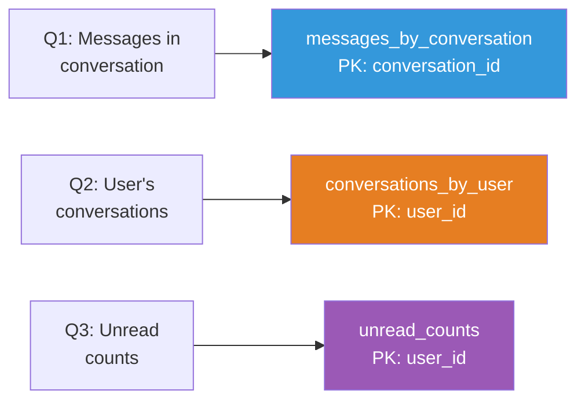
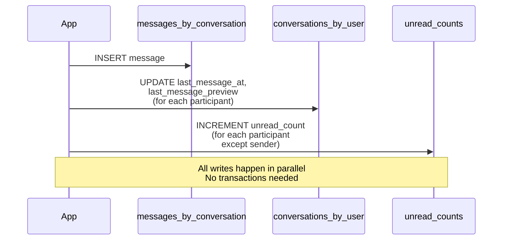
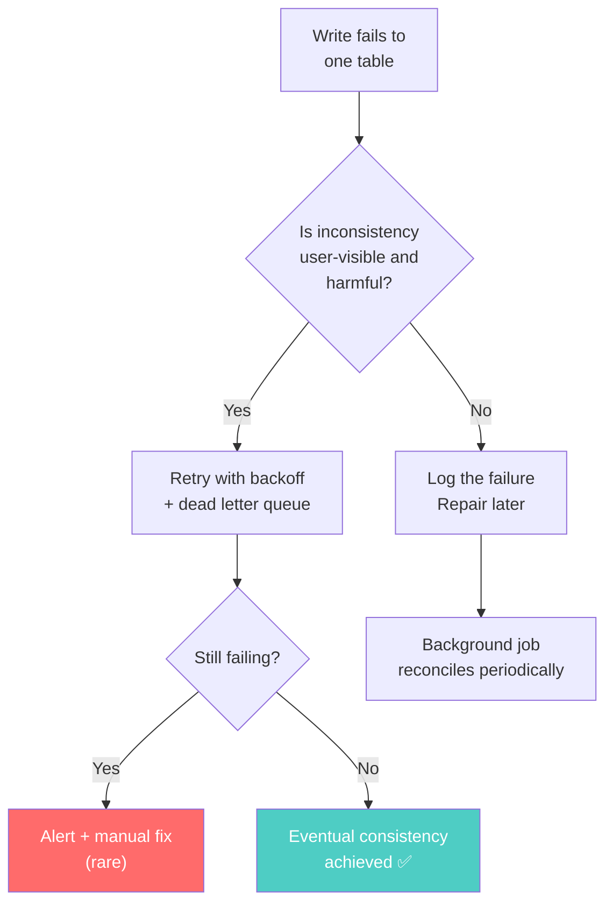

# Table Per Query — The Cassandra Data Modeling Rule

---

## The Rule That Sounds Wrong

In SQL, you'd never create a separate table just to answer a different query. That would be insane — duplication, consistency issues, wasted storage.

In Cassandra, **one table per query is the standard pattern**. Not a hack. Not a compromise. The intended design.

---

## The Problem

Your messaging app needs to:
1. Show all messages in a conversation (ordered by time)
2. Show all conversations for a user (ordered by last activity)
3. Show unread message count per conversation for a user

In SQL, that's one `messages` table, one `conversations` table, a few JOINs, and you're done.

In Cassandra, you need **three tables**.

---

## Designing Query-First

### Step 1: List Every Query

Before touching CQL, write down every read query your application will make:

```
Q1: Get messages in conversation X, ordered by timestamp DESC, limit 50
Q2: Get conversations for user X, ordered by last_message_at DESC
Q3: Get unread count for user X in conversation Y
```

### Step 2: Design a Table for Each Query

```sql
-- Table for Q1: Messages by conversation
CREATE TABLE messages_by_conversation (
    conversation_id UUID,
    message_ts TIMESTAMP,
    message_id UUID,
    sender_id UUID,
    body TEXT,
    PRIMARY KEY ((conversation_id), message_ts, message_id)
) WITH CLUSTERING ORDER BY (message_ts DESC, message_id DESC);

-- Table for Q2: Conversations by user
CREATE TABLE conversations_by_user (
    user_id UUID,
    last_message_at TIMESTAMP,
    conversation_id UUID,
    conversation_name TEXT,
    last_message_preview TEXT,
    PRIMARY KEY ((user_id), last_message_at, conversation_id)
) WITH CLUSTERING ORDER BY (last_message_at DESC, conversation_id ASC);

-- Table for Q3: Unread counts
CREATE TABLE unread_counts (
    user_id UUID,
    conversation_id UUID,
    unread_count COUNTER,
    PRIMARY KEY ((user_id), conversation_id)
);
```

### Step 3: Map Each Query to Its Table



Each query hits exactly one table. Each table read is a single-partition lookup. **O(1) to find the node, O(log n) within the partition.**

---

## The Write Path — Where Duplication Happens

When a user sends a message, your application writes to **multiple tables**:



### TypeScript — Writing to Multiple Tables

```typescript
import { Client, types } from 'cassandra-driver';

interface Message {
  conversationId: string;
  senderId: string;
  body: string;
  participantIds: string[];
}

async function sendMessage(client: Client, msg: Message): Promise<void> {
  const messageId = types.Uuid.random();
  const now = new Date();

  // Write 1: Store the message
  const insertMessage = client.execute(
    `INSERT INTO messages_by_conversation 
     (conversation_id, message_ts, message_id, sender_id, body) 
     VALUES (?, ?, ?, ?, ?)`,
    [msg.conversationId, now, messageId, msg.senderId, msg.body],
    { prepare: true }
  );

  // Write 2: Update conversation list for each participant
  const updateConversations = msg.participantIds.map(userId =>
    client.execute(
      `INSERT INTO conversations_by_user 
       (user_id, last_message_at, conversation_id, last_message_preview) 
       VALUES (?, ?, ?, ?)`,
      [userId, now, msg.conversationId, msg.body.substring(0, 100)],
      { prepare: true }
    )
  );

  // Write 3: Increment unread counts for recipients
  const updateUnread = msg.participantIds
    .filter(id => id !== msg.senderId)
    .map(userId =>
      client.execute(
        `UPDATE unread_counts SET unread_count = unread_count + 1 
         WHERE user_id = ? AND conversation_id = ?`,
        [userId, msg.conversationId],
        { prepare: true }
      )
    );

  // Execute all writes in parallel — no transaction needed
  await Promise.all([insertMessage, ...updateConversations, ...updateUnread]);
}
```

### Go — Writing to Multiple Tables

```go
package messaging

import (
	"context"
	"time"

	"github.com/gocql/gocql"
)

type Message struct {
	ConversationID gocql.UUID
	SenderID       gocql.UUID
	Body           string
	ParticipantIDs []gocql.UUID
}

func SendMessage(session *gocql.Session, msg Message) error {
	messageID := gocql.TimeUUID()
	now := time.Now()

	// Use a batch for the core message insert + conversation updates
	// Note: Cassandra BATCH != SQL transaction. It's about atomicity, not isolation.
	// UNLOGGED batch is fine here — these are going to different partitions anyway.

	// Write 1: Store the message
	if err := session.Query(
		`INSERT INTO messages_by_conversation 
		 (conversation_id, message_ts, message_id, sender_id, body)
		 VALUES (?, ?, ?, ?, ?)`,
		msg.ConversationID, now, messageID, msg.SenderID, msg.Body,
	).Exec(); err != nil {
		return err
	}

	// Write 2: Update conversations for each participant
	for _, userID := range msg.ParticipantIDs {
		preview := msg.Body
		if len(preview) > 100 {
			preview = preview[:100]
		}
		if err := session.Query(
			`INSERT INTO conversations_by_user
			 (user_id, last_message_at, conversation_id, last_message_preview)
			 VALUES (?, ?, ?, ?)`,
			userID, now, msg.ConversationID, preview,
		).Exec(); err != nil {
			return err
		}
	}

	// Write 3: Increment unread counts
	for _, userID := range msg.ParticipantIDs {
		if userID == msg.SenderID {
			continue
		}
		if err := session.Query(
			`UPDATE unread_counts SET unread_count = unread_count + 1
			 WHERE user_id = ? AND conversation_id = ?`,
			userID, msg.ConversationID,
		).Exec(); err != nil {
			return err
		}
	}

	return nil
}
```

---

## "But What About Data Consistency?"

This is the question every SQL developer asks. If you write to three tables and the third write fails, your data is inconsistent.

**Cassandra's answer**: Yes. That can happen. Deal with it.

Strategies:
1. **Retry failed writes** — Most failures are transient (network blip, node restart)
2. **Accept temporary inconsistency** — Unread count wrong by 1? User won't notice.
3. **Background repair** — Periodically reconcile data between tables
4. **Use logged batches sparingly** — For writes to the same partition only



---

## Common Mistake: Trying to Normalize

```sql
-- ❌ SQL developer instinct: one table, multiple queries
CREATE TABLE messages (
    message_id UUID PRIMARY KEY,
    conversation_id UUID,
    sender_id UUID,
    body TEXT,
    created_at TIMESTAMP
);

-- "I'll just query by conversation_id"
SELECT * FROM messages WHERE conversation_id = ? ORDER BY created_at DESC;
-- FAILS: conversation_id is not the partition key
```

You just built a SQL table in Cassandra. Every query except `WHERE message_id = ?` requires `ALLOW FILTERING` — which means full cluster scan.

---

## The Storage Tradeoff

| Approach | Storage Used | Read Latency | Write Latency | Query Flexibility |
|----------|-------------|--------------|---------------|-------------------|
| SQL (normalized) | 1x (single source) | High (JOINs) | Low (one write) | Unlimited |
| Cassandra (table-per-query) | 3-5x (duplicated) | Ultra-low (partition lookup) | Medium (multi-write) | Fixed at design time |

Cassandra trades **storage** (cheap) for **read latency** (critical at scale). A million messages stored three times is still just a few GB. A million messages JOINed across three tables at 50k requests/second is a dead database.

---

## When This Model Breaks Down

This pattern struggles when:
- **Queries keep changing** — You have to create new tables and backfill data
- **Too many access patterns** — 20 different queries means 20 tables. Manageable but complex.
- **Complex aggregations** — "Average order value by region by month" doesn't map to a single partition
- **You need ad-hoc reporting** — Use Spark + Cassandra connector, not Cassandra directly

If more than 30% of your queries are analytical or ad-hoc, **Cassandra is the wrong choice**.

---

## Next

→ [04-denormalization-as-requirement.md](./04-denormalization-as-requirement.md) — Why denormalization isn't a compromise in Cassandra — it's the only way.
