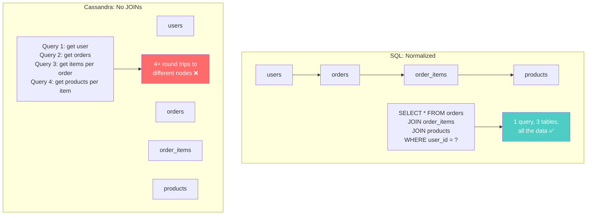
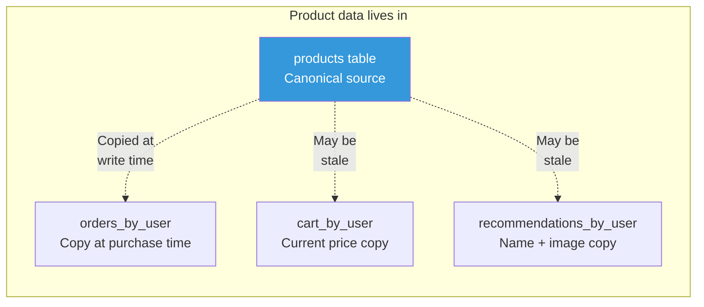
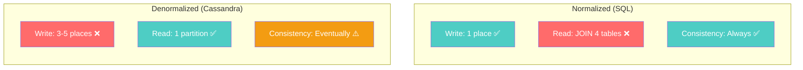
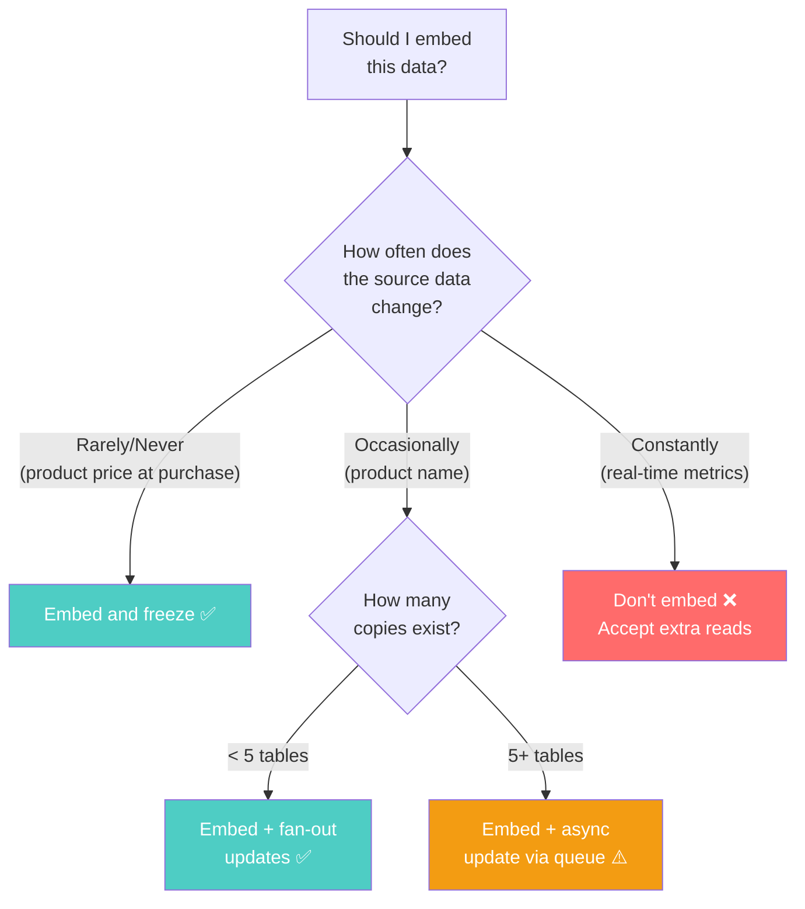

# Denormalization as a Requirement

---

## The SQL Developer's Discomfort

Every database course teaches normalization: eliminate redundancy, enforce single source of truth, use foreign keys and JOINs. Breaking these rules is called "denormalization" — spoken with the same tone as "technical debt."

In Cassandra, **denormalization is not debt. It's the architecture.**

If you normalize Cassandra data, your application will not work at scale. Period.

---

## Why Cassandra Requires Denormalization

Cassandra has no JOINs. Not "JOINs are slow." Not "avoid JOINs when possible." **JOINs do not exist.**



If you normalize in Cassandra, every "page load" becomes 4+ sequential queries to different nodes. At 10ms per query, that's 40ms+ before rendering. At 50k concurrent users, that's 200k queries per second instead of 50k.

**The solution**: Store everything a query needs in one table. Yes, duplicate data.

---

## The Denormalized Design

### E-Commerce Order History

**What the user sees**: "My orders" page showing order date, items, product names, prices, order total.

**The normalized way (SQL)**:
```sql
-- 4 tables, clean, no duplication
SELECT o.order_id, o.order_date, o.total,
       oi.quantity, oi.unit_price,
       p.name, p.image_url
FROM orders o
JOIN order_items oi ON o.id = oi.order_id
JOIN products p ON oi.product_id = p.id
WHERE o.user_id = ?
ORDER BY o.order_date DESC;
```

**The Cassandra way**:
```sql
-- 1 table, everything embedded
CREATE TABLE orders_by_user (
    user_id UUID,
    order_date TIMESTAMP,
    order_id UUID,
    order_total DECIMAL,
    order_status TEXT,
    -- Denormalized: product info stored WITH the order
    items LIST<FROZEN<order_item>>,
    PRIMARY KEY ((user_id), order_date, order_id)
) WITH CLUSTERING ORDER BY (order_date DESC, order_id ASC);

CREATE TYPE order_item (
    product_id UUID,
    product_name TEXT,      -- duplicated from products
    product_image_url TEXT, -- duplicated from products
    quantity INT,
    unit_price DECIMAL      -- frozen at time of purchase
);
```

One query, one partition, one network hop: done.

---

## What Gets Duplicated and Why



| Data | Where Duplicated | Staleness Tolerance | Why |
|------|-----------------|---------------------|-----|
| Product name | orders, cart, recommendations | Orders: never stale (frozen at purchase). Cart: hours OK. | Name at purchase time is a historical fact |
| Product price | orders, cart | Orders: never update (purchase price is frozen). Cart: minutes OK. | Purchase price must never change |
| User name | messages, comments, reviews | Minutes to hours OK | Minor — user can handle seeing old name briefly |
| Profile image URL | messages, activity feed | Minutes OK | Visual only, no business logic impact |

---

## Managing Denormalized Data

### Pattern 1: Frozen at Write Time (Best Case)

Some denormalized data **should never update**. An order's product name and price reflect what the user bought, not what the product is called now.

```typescript
// When user places order, freeze the product data
async function placeOrder(
  client: Client,
  userId: string,
  cartItems: CartItem[]
): Promise<void> {
  // Fetch current product info
  const products = await Promise.all(
    cartItems.map(item =>
      client.execute(
        'SELECT name, image_url, price FROM products WHERE product_id = ?',
        [item.productId],
        { prepare: true }
      )
    )
  );

  // Build frozen order items — these never change
  const orderItems = cartItems.map((item, i) => ({
    product_id: item.productId,
    product_name: products[i].rows[0].name,        // frozen
    product_image_url: products[i].rows[0].image_url, // frozen
    quantity: item.quantity,
    unit_price: products[i].rows[0].price,          // frozen
  }));

  const total = orderItems.reduce(
    (sum, item) => sum + item.unit_price * item.quantity, 0
  );

  await client.execute(
    `INSERT INTO orders_by_user 
     (user_id, order_date, order_id, order_total, order_status, items) 
     VALUES (?, ?, ?, ?, ?, ?)`,
    [userId, new Date(), types.Uuid.random(), total, 'confirmed', orderItems],
    { prepare: true }
  );
}
```

### Pattern 2: Update on Write (Fan-Out)

When data changes, update all copies. This is the "fan-out on write" pattern.

```go
package catalog

import (
	"github.com/gocql/gocql"
)

// When a product name changes, update all places it's stored
func UpdateProductName(session *gocql.Session, productID gocql.UUID, newName string) error {
	// 1. Update canonical source
	if err := session.Query(
		`UPDATE products SET name = ? WHERE product_id = ?`,
		newName, productID,
	).Exec(); err != nil {
		return err
	}

	// 2. Update in cart (if users have this product in cart)
	// This requires knowing which carts contain this product
	// — you'd need a reverse lookup table: carts_by_product
	iter := session.Query(
		`SELECT user_id FROM carts_containing_product WHERE product_id = ?`,
		productID,
	).Iter()

	var userID gocql.UUID
	for iter.Scan(&userID) {
		// Update the product name in each user's cart
		// This is expensive — but product renames are rare
		session.Query(
			`UPDATE cart_by_user SET product_name = ? 
			 WHERE user_id = ? AND product_id = ?`,
			newName, userID, productID,
		).Exec()
	}

	return iter.Close()
}
```

### Pattern 3: Accept Staleness (Best Effort)

Some data just doesn't matter enough to update everywhere.

```
User changes profile picture:
1. Update users table ✅
2. Update profile picture in recent messages? ❌ Skip it.
   Old messages keeping old picture is fine.
3. Update profile picture in activity feed? Maybe.
   Next time feed refreshes, it'll pull the new URL.
```

Not every piece of denormalized data needs active maintenance.

---

## The Consistency Cost



The real question isn't "should I denormalize?" — in Cassandra the answer is always yes. The question is **"how do I manage the copies?"**

---

## Anti-Pattern: Partial Denormalization

The worst approach is half-way denormalization — some data embedded, some requiring additional lookups:

```sql
-- ❌ Storing product_id but not product_name
CREATE TABLE orders_by_user (
    user_id UUID,
    order_date TIMESTAMP,
    order_id UUID,
    product_ids LIST<UUID>,  -- still need a second query to get names!
    PRIMARY KEY ((user_id), order_date, order_id)
);

-- Now every "My Orders" page requires:
-- Query 1: Get orders for user
-- Query 2-N: Get product names for each order's product_ids
-- You've gained nothing.
```

**Rule**: If a query needs data from another entity, embed ALL the fields that query needs. Don't store just the foreign key.

---

## When Denormalization Gets Dangerous

| Scenario | Risk | Mitigation |
|----------|------|------------|
| Data changes frequently | Many tables to update per change | Limit denormalization to read-heavy, write-rare data |
| Too many copies (10+) | Write amplification, hard to track | Question whether Cassandra is the right choice |
| Business-critical accuracy | Stale data causes financial errors | Use a relational DB for that data |
| Unbounded fan-out | One product in 1M carts → 1M updates | Use async queue (Kafka) for fan-out |

---

## Decision Framework



---

## Next

→ [05-tunable-consistency.md](./05-tunable-consistency.md) — How Cassandra lets you choose consistency per-query, not per-database.
