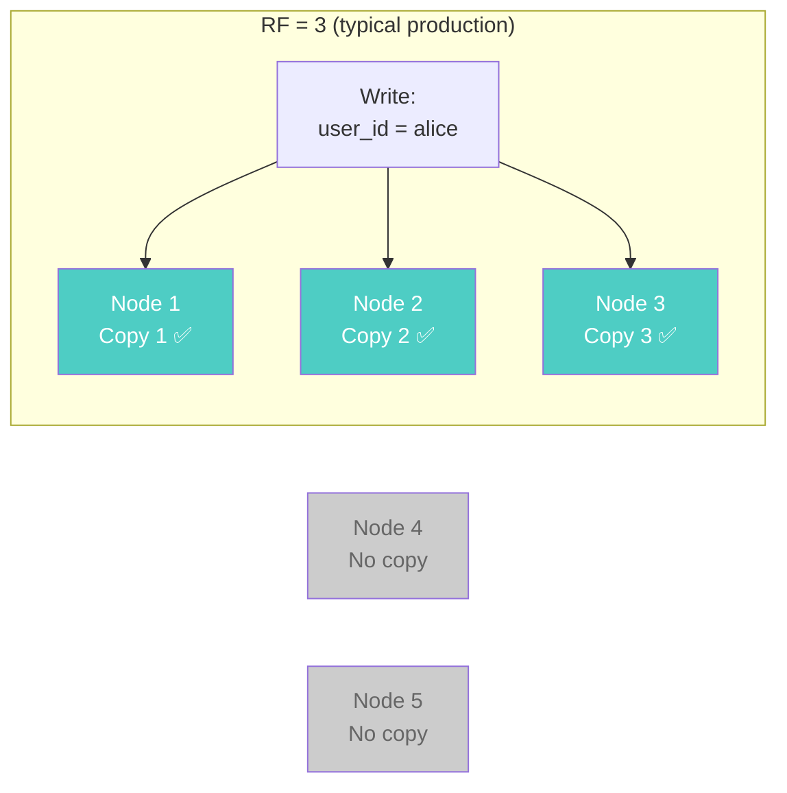
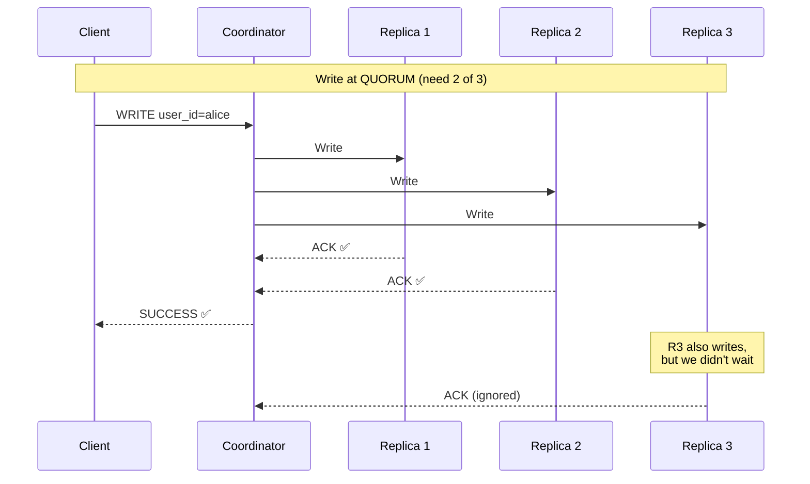
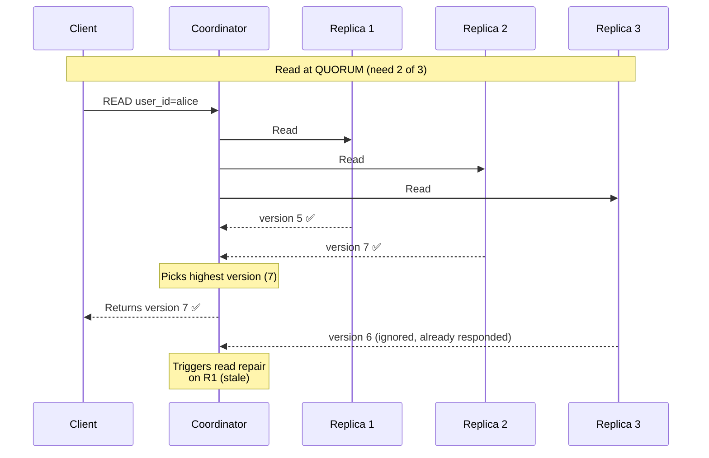
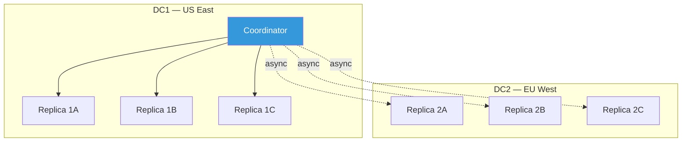
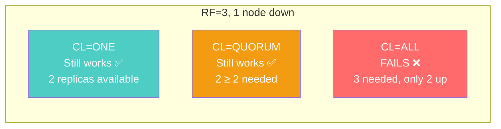

# Tunable Consistency — Cassandra's Superpower

---

## The Big Idea

Most databases give you one consistency model. PostgreSQL: strong consistency everywhere. MongoDB: configurable per-operation but defaults to strong. DynamoDB: strong or eventual, pick one.

Cassandra lets you **choose consistency per query**. Not per table. Not per database. **Per individual read or write.**

```sql
-- Same table, different consistency for different queries
-- User login: need latest password hash — strong consistency
SELECT * FROM users WHERE user_id = ? -- at QUORUM

-- Activity feed: OK if slightly stale — weak consistency  
SELECT * FROM activity_feed WHERE user_id = ? -- at ONE
```

This is what "tunable consistency" means.

---

## How Replication Works

Every piece of data in Cassandra is replicated across multiple nodes. The replication factor (RF) determines how many copies:



With RF=3, three nodes hold a copy of each piece of data. The **consistency level** determines how many of those copies must respond before a read or write is considered successful.

---

## Write Consistency Levels

When you write data, the consistency level determines how many replicas must acknowledge the write:

| Consistency Level | Replicas that must ACK | Behavior |
|---|---|---|
| `ANY` | 1 (including hints) | Write succeeds even if all replicas are down (hinted handoff) |
| `ONE` | 1 replica | Fast, minimal durability guarantee |
| `TWO` | 2 replicas | Moderate durability |
| `THREE` | 3 replicas | High durability |
| `QUORUM` | ⌊RF/2⌋ + 1 | Majority must ACK. With RF=3, that's 2. |
| `LOCAL_QUORUM` | Quorum within local datacenter | For multi-DC: strong in local DC, async to remote |
| `EACH_QUORUM` | Quorum in every datacenter | Strongest multi-DC guarantee |
| `ALL` | All replicas | Maximum durability, minimum availability |



---

## Read Consistency Levels

When you read, the consistency level determines how many replicas must respond:

| Consistency Level | Replicas Consulted | What You Get |
|---|---|---|
| `ONE` | 1 replica | Fastest, might read stale data |
| `QUORUM` | ⌊RF/2⌋ + 1 | Guaranteed to include at least one node with latest write (if written at QUORUM) |
| `LOCAL_QUORUM` | Quorum in local DC | Strong consistency within your datacenter |
| `ALL` | All replicas | Always latest, but if ANY replica is down → failure |



---

## The QUORUM Formula

The key insight: **you get strong consistency when overlapping replicas exist between reads and writes.**

$$R + W > RF \implies \text{strong consistency}$$

Where:
- $R$ = number of replicas read
- $W$ = number of replicas written
- $RF$ = replication factor

With RF=3:

| Write CL | Read CL | W + R | > RF? | Consistent? |
|----------|---------|-------|-------|-------------|
| ONE (1) | ONE (1) | 2 | No | ❌ Eventual |
| ONE (1) | QUORUM (2) | 3 | No | ❌ Eventual |
| QUORUM (2) | ONE (1) | 3 | No | ❌ Eventual |
| **QUORUM (2)** | **QUORUM (2)** | **4** | **Yes** | **✅ Strong** |
| ALL (3) | ONE (1) | 4 | Yes | ✅ Strong |
| ONE (1) | ALL (3) | 4 | Yes | ✅ Strong |

**The most common production setup**: Write at QUORUM, Read at QUORUM. You get strong consistency while tolerating 1 node failure (out of 3).

---

## Choosing Consistency Per Query

### TypeScript — Per-Query Consistency

```typescript
import { Client, types } from 'cassandra-driver';

const client = new Client({
  contactPoints: ['cassandra-1', 'cassandra-2', 'cassandra-3'],
  localDataCenter: 'dc1',
  keyspace: 'myapp',
});

// Authentication: MUST be consistent — stale password hash = security hole
async function authenticateUser(email: string, passwordHash: string): Promise<boolean> {
  const result = await client.execute(
    'SELECT password_hash FROM users WHERE email = ?',
    [email],
    { 
      prepare: true, 
      consistency: types.consistencies.quorum  // Strong
    }
  );
  return result.rows[0]?.password_hash === passwordHash;
}

// Activity feed: stale by a few seconds is fine
async function getActivityFeed(userId: string): Promise<any[]> {
  const result = await client.execute(
    'SELECT * FROM activity_feed WHERE user_id = ? LIMIT 50',
    [userId],
    { 
      prepare: true, 
      consistency: types.consistencies.one  // Fast, might be slightly stale
    }
  );
  return result.rows;
}

// Financial transaction: maximum consistency
async function recordPayment(userId: string, amount: number): Promise<void> {
  await client.execute(
    `INSERT INTO payments (user_id, payment_ts, payment_id, amount, status) 
     VALUES (?, ?, ?, ?, ?)`,
    [userId, new Date(), types.Uuid.random(), amount, 'completed'],
    { 
      prepare: true, 
      consistency: types.consistencies.localQuorum  // Strong within DC
    }
  );
}
```

### Go — Per-Query Consistency

```go
package main

import (
	"github.com/gocql/gocql"
)

func authenticateUser(session *gocql.Session, email, passwordHash string) (bool, error) {
	var storedHash string
	query := session.Query(
		`SELECT password_hash FROM users WHERE email = ?`, email,
	).Consistency(gocql.Quorum) // Strong consistency for auth

	if err := query.Scan(&storedHash); err != nil {
		return false, err
	}
	return storedHash == passwordHash, nil
}

func getActivityFeed(session *gocql.Session, userID gocql.UUID) ([]map[string]interface{}, error) {
	query := session.Query(
		`SELECT * FROM activity_feed WHERE user_id = ? LIMIT 50`, userID,
	).Consistency(gocql.One) // Fast, eventual consistency OK

	iter := query.Iter()
	var results []map[string]interface{}
	for {
		row := make(map[string]interface{})
		if !iter.MapScan(row) {
			break
		}
		results = append(results, row)
	}
	return results, iter.Close()
}

func recordPayment(session *gocql.Session, userID gocql.UUID, amount float64) error {
	return session.Query(
		`INSERT INTO payments (user_id, payment_ts, payment_id, amount, status)
		 VALUES (?, ?, ?, ?, ?)`,
		userID, gocql.TimeUUID(), gocql.TimeUUID(), amount, "completed",
	).Consistency(gocql.LocalQuorum).Exec() // Strong within local DC
}
```

---

## Multi-Datacenter Consistency



| Level | What Happens | Use When |
|-------|-------------|----------|
| `LOCAL_QUORUM` | Quorum in the coordinator's DC only. Remote DC gets async replication. | Default for most queries. Low latency, strong locally. |
| `EACH_QUORUM` | Quorum in EVERY DC before responding. | Rare. Only for data that must be immediately consistent globally. |
| `LOCAL_ONE` | One node in local DC. | Least-critical reads (metrics, logs). |

**In practice**: Almost everyone uses `LOCAL_QUORUM` for writes and reads. It gives strong consistency in your datacenter with ~5ms latency, while remote DCs catch up asynchronously.

---

## The Availability Tradeoff

Higher consistency = lower availability:



| Nodes Down | ONE works? | QUORUM works? | ALL works? |
|-----------|-----------|---------------|-----------|
| 0 of 3 | ✅ | ✅ | ✅ |
| 1 of 3 | ✅ | ✅ | ❌ |
| 2 of 3 | ✅ | ❌ | ❌ |
| 3 of 3 | ❌ | ❌ | ❌ |

**QUORUM with RF=3 is the sweet spot**: strong consistency + tolerates 1 node failure.

---

## Common Mistakes

### Mistake 1: Using ALL for "Safety"

```sql
-- Don't do this
INSERT INTO users (...) VALUES (...) USING CONSISTENCY ALL;
```

ALL means "if any single replica is down, this write fails." During rolling upgrades, maintenance, or any node issue, your writes stop. Use QUORUM instead.

### Mistake 2: Mismatched Read/Write Levels

```
Write at ONE, Read at ONE → no consistency guarantee
Write at QUORUM, Read at ONE → stale reads possible
```

If you need consistency, both read AND write must be at QUORUM (or the combination must satisfy $R + W > RF$).

### Mistake 3: Ignoring LOCAL_ Variants

If you have multiple datacenters, `QUORUM` means quorum across ALL datacenters. A write from US East waits for a node in EU West to respond — adding 80-150ms latency. Use `LOCAL_QUORUM` instead.

---

## Next

→ [06-read-write-paths.md](./06-read-write-paths.md) — How data actually flows through Cassandra during reads and writes.
