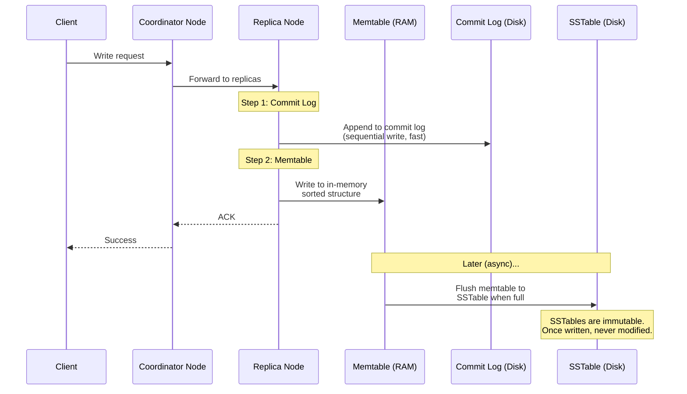
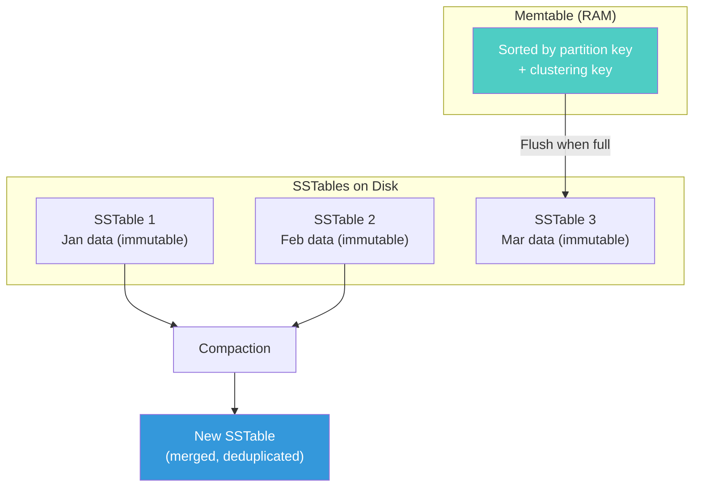
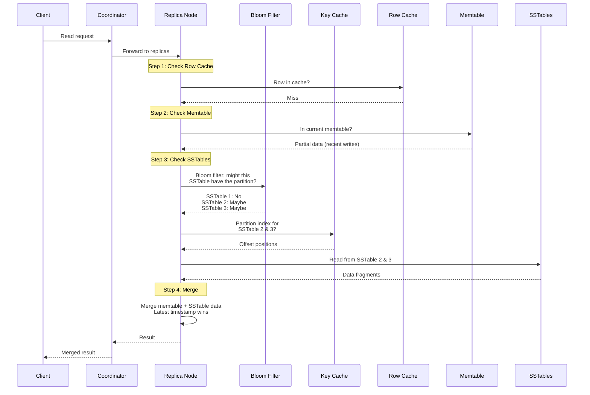
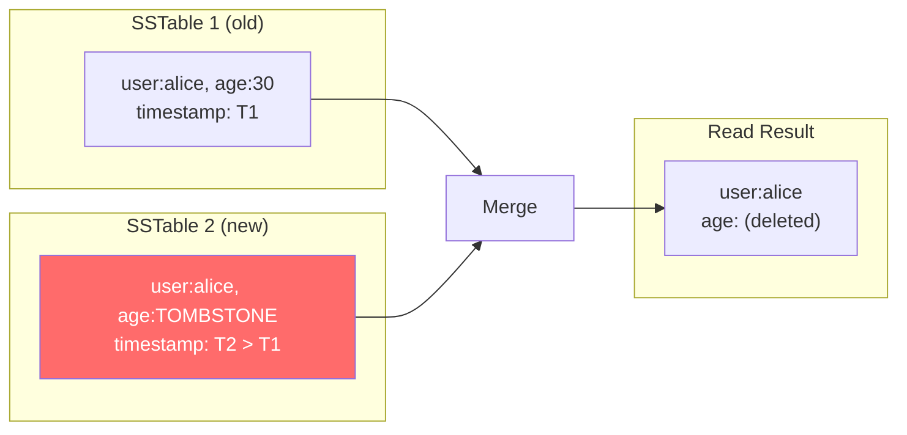
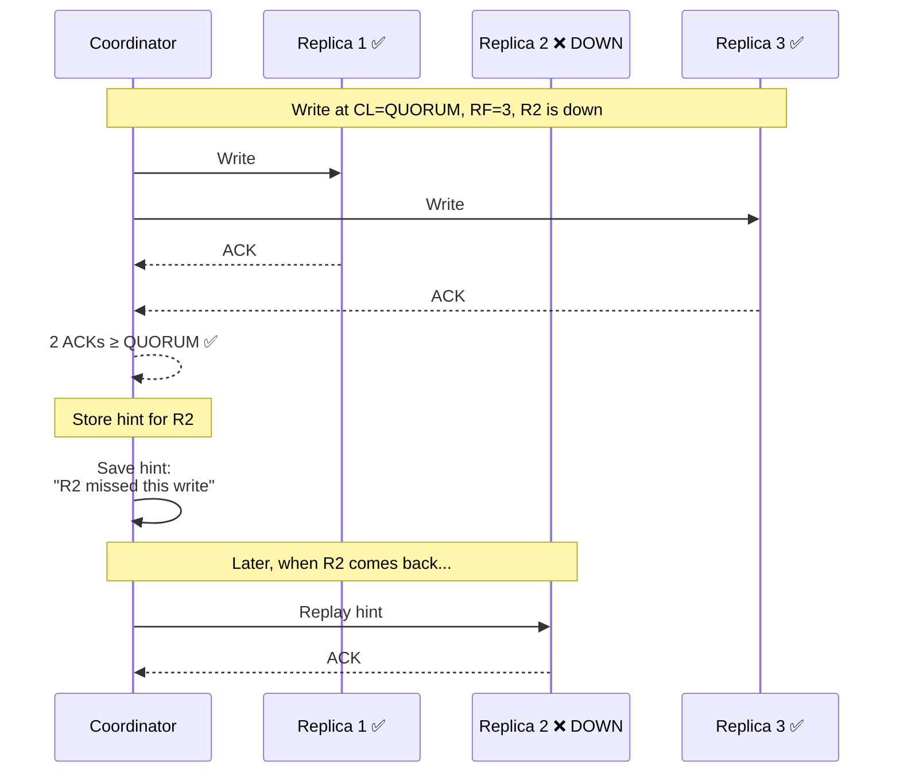
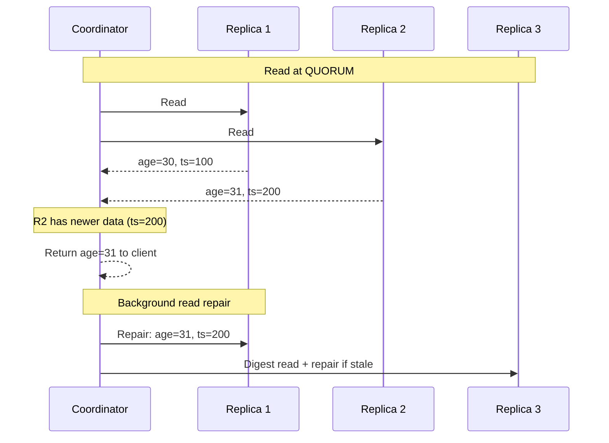

# Read and Write Paths — How Cassandra Actually Works

---

## Why This Matters

Every Cassandra performance problem, every tuning decision, every "why is my query slow?" traces back to how reads and writes physically flow through the system. Understanding the paths turns vague intuition into precise debugging.

---

## The Write Path

Cassandra writes are designed to be **absurdly fast**. A write never requires a disk read. It never updates data in-place. It just appends.



### Step by Step

1. **Client sends write to any node** (the coordinator)
2. **Coordinator forwards to replica nodes** based on partition key's token
3. **Each replica**:
   - Appends to **commit log** (sequential disk write — fastest possible I/O)
   - Writes to **memtable** (in-memory sorted data structure)
   - Returns ACK
4. **Later (async)**: When memtable is full, it's flushed to an **SSTable** on disk
5. **SSTables are immutable** — once written, never modified

### Why This Is Fast

| SQL Database Write | Cassandra Write |
|---|---|
| Find the row on disk | No disk read needed |
| Update the row in-place | Append-only (no seek) |
| Update B-tree indexes | No index update on write path |
| Possibly write WAL + data page | Only commit log (sequential) |
| Random I/O | Sequential I/O only |

Cassandra achieves **tens of thousands of writes per second per node** because it converts random writes into sequential appends.

---

## What Is an SSTable?

SSTable = **Sorted String Table**. An immutable, sorted file on disk.



Key properties:
- **Immutable**: Once written, never modified. Updates create new entries in new SSTables.
- **Sorted**: Data is sorted by partition key, then clustering key. Range scans within a partition are efficient.
- **Merged via compaction**: Background process merges SSTables, removing duplicates and tombstones.

---

## The Read Path

Reads are **more complex** than writes. Cassandra must check multiple places to find the latest version of data.



### Step by Step

1. **Row cache** (if enabled): In-memory cache of recently-read rows. Hit = instant return.
2. **Memtable**: Check current in-memory data for recent writes.
3. **Bloom filters**: Per-SSTable probabilistic filter. Quickly eliminates SSTables that definitely don't contain the partition. False positives possible, false negatives impossible.
4. **Partition key cache**: Maps partition keys to file offsets, avoiding index lookups.
5. **SSTable reads**: Read from SSTables that might contain the partition.
6. **Merge**: Combine all fragments. **Latest timestamp wins** for each column.

### Why Reads Can Be Slower

| Factor | Impact |
|--------|--------|
| Many SSTables | More files to check per read (compaction helps) |
| Large partitions | More data to scan within partition |
| Bloom filter false positives | Unnecessary SSTable reads |
| Cold data (not in cache) | Requires disk I/O |
| Tombstones | Must read deleted markers to confirm deletion |

---

## Tombstones — How Deletes Work

Cassandra doesn't delete data immediately. It writes a **tombstone** — a marker that says "this data is deleted."



Tombstones are kept for `gc_grace_seconds` (default: 10 days) to ensure all replicas learn about the deletion. After that, compaction removes them.

**The tombstone trap**: If you delete lots of data frequently, reads slow down because Cassandra must read through thousands of tombstones to reconstruct the live data. This is the #1 cause of "my reads got slow" in Cassandra.

```sql
-- Anti-pattern: deleting individual messages in a conversation
DELETE FROM messages WHERE conversation_id = ? AND message_ts = ?;
-- After 10,000 deletes, reading this partition scans 10,000 tombstones

-- Better: Use TTL for data with natural expiration
INSERT INTO messages (...) VALUES (...) USING TTL 2592000; -- 30 days
```

---

## Hinted Handoff — When a Replica Is Down



When a replica is down, the coordinator stores a "hint" — a note about what the node missed. When the node comes back, hints are replayed. This ensures **eventual convergence** without requiring all nodes to be up for writes.

---

## Read Repair

When Cassandra reads from multiple replicas and discovers they disagree, it **automatically repairs** the stale replicas:



This is how Cassandra **self-heals** without external tools (though `nodetool repair` should still run periodically as a safety net).

---

## Performance Implications

### Writes Are (Almost) Always Fast

Write latency is dominated by commit log append (~0.1ms) + memtable write (~0.01ms). Total: **sub-millisecond** per node.

The only things that slow writes:
- High consistency level (waiting for more ACKs)
- Commit log on slow disk (use SSDs)
- Memtable flush pressure (not enough RAM)

### Reads Vary Widely

| Scenario | Expected Latency |
|----------|-----------------|
| Row cache hit | < 0.1ms |
| Memtable hit | < 0.5ms |
| Single SSTable, key cached | 1-2ms |
| Multiple SSTables | 5-20ms |
| Large partition (>100MB) | 50-500ms |
| Partition with many tombstones | 100ms+ (can timeout) |

### The Golden Rule

> Cassandra is **write-optimized**. Reads pay the cost of write flexibility. Design your data model to minimize read complexity — small partitions, few SSTables per partition, minimal tombstones.

---

## Next

→ [07-compaction-strategies.md](./07-compaction-strategies.md) — How Cassandra maintains SSTable files over time, and why your choice of compaction strategy matters enormously.
