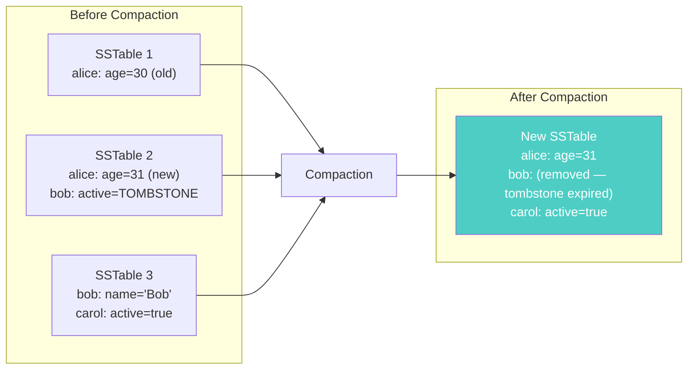
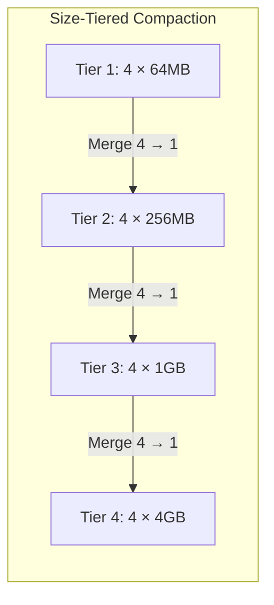
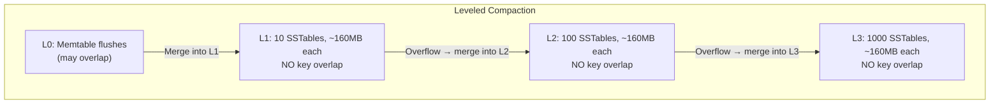
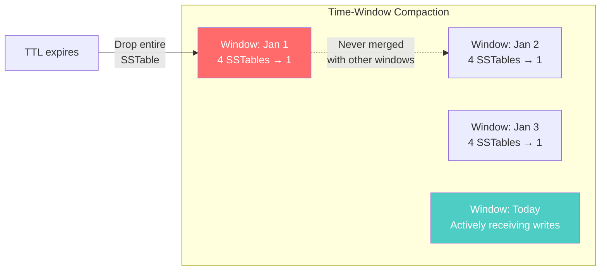
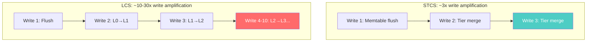
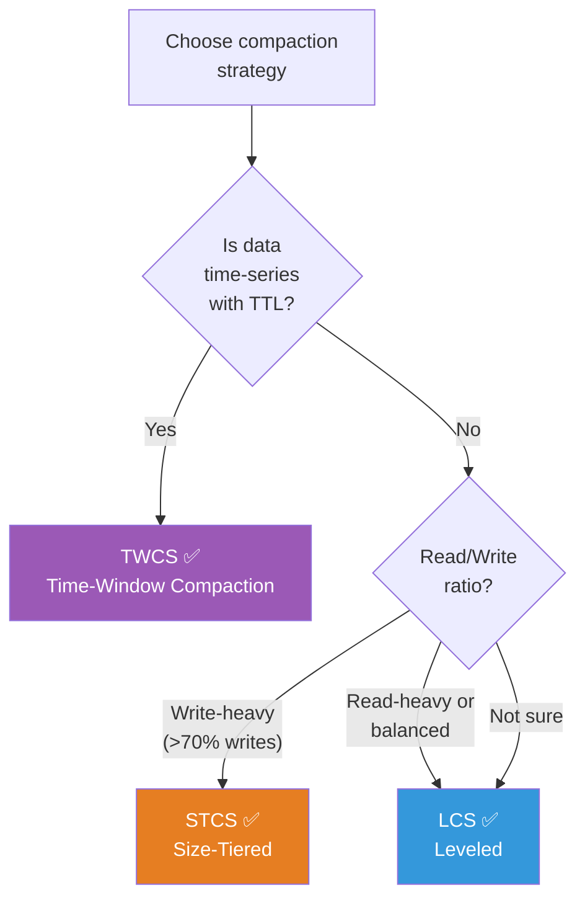

# Compaction Strategies — Managing the SSTable Lifecycle

---

## The Problem Compaction Solves

As Cassandra writes data, it accumulates SSTables on disk. Without maintenance, you'd end up with thousands of small files:

- Each read checks **every** SSTable for the requested partition
- Deleted data (tombstones) accumulates forever
- Updated rows have old versions scattered across many files
- Disk usage grows unbounded

**Compaction** is Cassandra's background process that merges SSTables: combining data, removing tombstones, and eliminating obsolete row versions.



---

## Three Compaction Strategies

Cassandra provides three built-in compaction strategies. Choosing the right one is a **critical** data modeling decision — get it wrong and your cluster slows down or runs out of disk.

### 1. Size-Tiered Compaction (STCS) — Default

**How it works**: Groups SSTables of similar size together. When enough similar-sized SSTables accumulate (default: 4), they merge into one larger SSTable.



**Pros**:
- Write-optimized: minimal I/O overhead during writes
- Good for write-heavy workloads (logging, time-series ingestion)
- Low write amplification

**Cons**:
- **Temporary space requirement**: Needs up to 2x disk space during compaction (old + new SSTables exist simultaneously)
- Read performance degrades with many SSTables
- Tombstone cleanup is delayed (tombstones persist until SSTables of matching size merge)

**Use when**: Write-heavy, read-light workloads. Bulk data loading. Time-series data that's rarely queried.

```sql
CREATE TABLE sensor_data (
    sensor_id UUID,
    reading_ts TIMESTAMP,
    value DOUBLE,
    PRIMARY KEY ((sensor_id), reading_ts)
) WITH compaction = {
    'class': 'SizeTieredCompactionStrategy',
    'min_threshold': 4,
    'max_threshold': 32
};
```

---

### 2. Leveled Compaction (LCS) — Read-Optimized

**How it works**: Organizes SSTables into levels. Each level is 10x the size of the previous. Within each level, SSTables have **non-overlapping** key ranges.



The key insight: because SSTables within a level don't overlap, a read only needs to check **one SSTable per level**. With 3 levels, that's 3 SSTables max per read — compared to potentially dozens with STCS.

**Pros**:
- **Predictable read performance**: bounded number of SSTables to check
- Better space efficiency: only 10% temporary overhead (vs 100% for STCS)
- Faster tombstone cleanup

**Cons**:
- **Higher write amplification**: data gets rewritten as it moves through levels. A piece of data might be written 10-30x over its lifetime.
- More I/O bandwidth consumed by background compaction
- Can struggle with write-heavy workloads

**Use when**: Read-heavy workloads. Data that's frequently updated. When read latency predictability matters.

```sql
CREATE TABLE user_profiles (
    user_id UUID PRIMARY KEY,
    name TEXT,
    email TEXT,
    last_login TIMESTAMP
) WITH compaction = {
    'class': 'LeveledCompactionStrategy',
    'sstable_size_in_mb': 160
};
```

---

### 3. Time-Window Compaction (TWCS) — Time-Series Optimized

**How it works**: Groups SSTables by time windows (e.g., 1 hour, 1 day). SSTables within the same window are compacted using STCS. Windows are never merged with each other.



The killer feature: when all data in a time window expires (via TTL), Cassandra **drops the entire SSTable file** — no compaction needed. Just delete the file.

**Pros**:
- Perfect for time-series data with TTL
- Minimal write amplification (STCS within windows)
- Efficient deletion of expired data (entire files dropped)
- Predictable disk usage

**Cons**:
- **Do not update or delete data** within old windows. This creates tombstones that span windows and prevents efficient file drops.
- Not suitable for non-time-series data

**Use when**: Time-series data. Logs. Metrics. Any data with natural expiration (TTL).

```sql
CREATE TABLE application_logs (
    app_id TEXT,
    log_date DATE,
    log_ts TIMESTAMP,
    level TEXT,
    message TEXT,
    PRIMARY KEY ((app_id, log_date), log_ts)
) WITH compaction = {
    'class': 'TimeWindowCompactionStrategy',
    'compaction_window_unit': 'DAYS',
    'compaction_window_size': 1
}
AND default_time_to_live = 2592000; -- 30 days TTL
```

---

## Comparison Table

| | STCS | LCS | TWCS |
|---|---|---|---|
| **Optimized for** | Writes | Reads | Time-series |
| **Write amplification** | Low (1-3x) | High (10-30x) | Low (1-3x) |
| **Read amplification** | High (many SSTables) | Low (1 per level) | Medium |
| **Space amplification** | High (2x during compaction) | Low (10% overhead) | Low |
| **Tombstone handling** | Delayed | Efficient | Very efficient (TTL drops) |
| **Best use case** | Write-heavy ingestion | Read-heavy CRUD | Logs, metrics, IoT |
| **Worst use case** | Read-heavy with updates | Write-heavy ingestion | Data without TTL |

---

## Write Amplification Explained

Write amplification = how many times data is physically written to disk over its lifetime.



LCS writes data many more times, but each level has clean, non-overlapping SSTables. The trade-off: more disk I/O for better read performance.

---

## How to Choose



### Rules of Thumb

1. **Time-series data with TTLs** → TWCS. Always. No exceptions.
2. **Write-heavy ingestion** (logging, analytics events) → STCS
3. **User-facing CRUD** (profiles, settings, carts) → LCS
4. **Mixed workload** → Start with LCS, switch to STCS if write latency is a problem
5. **Not sure** → Default (STCS) is usually safe, but monitor SSTable count

### Monitoring Compaction Health

Key metrics to watch:
- `PendingCompactions`: How many compaction tasks are queued. >50 means compaction is falling behind.
- `SSTableCount` per table: LCS should have few per level. STCS with >32 SSTables per table needs attention.
- `TotalDiskSpaceUsed` vs `LiveDiskSpaceUsed`: Large gap means lots of tombstones/old data awaiting compaction.

---

## Next

→ [08-when-cassandra-is-wrong.md](./08-when-cassandra-is-wrong.md) — When Cassandra is the wrong choice, and how to recognize the signs before it's too late.
