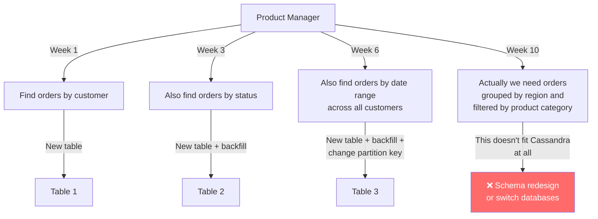
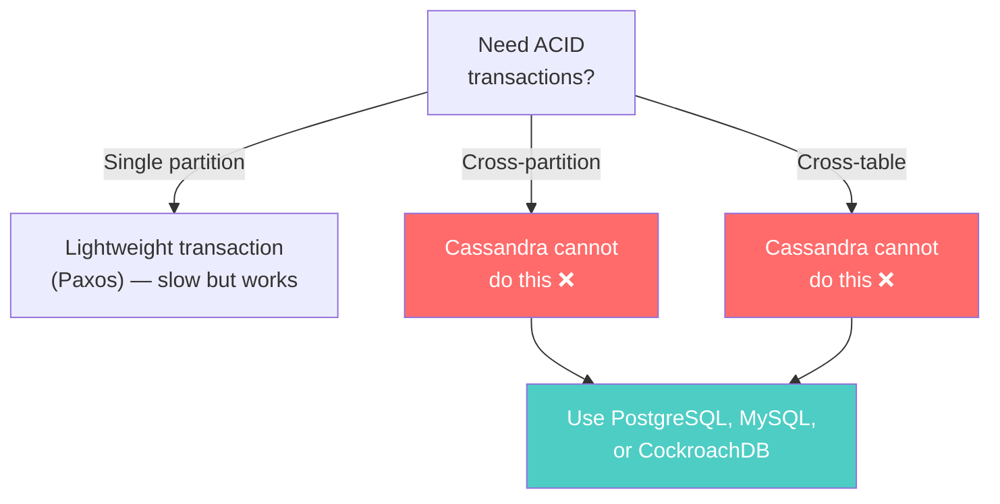
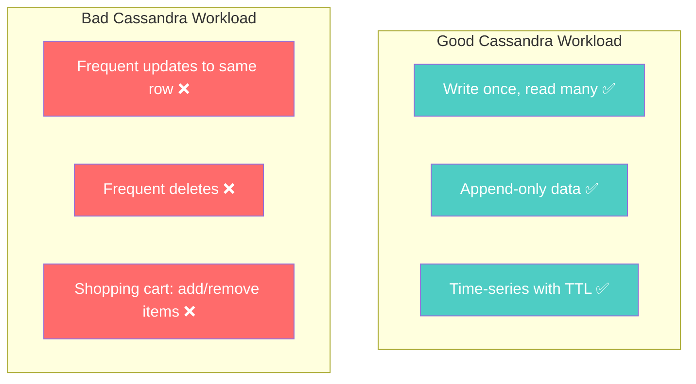

# When Cassandra Is Wrong — Knowing the Exit Signs

---

## The Uncomfortable Truth

Cassandra is exceptional at what it does. It's also terrible at everything else. The difference between a successful Cassandra deployment and a painful one is **knowing which category your problem falls into before you commit.**

---

## Red Flag 1: Your Queries Keep Changing

Cassandra requires you to know **every query** at schema design time. Each query needs its own table.



**In SQL**: You add an index. Takes minutes. No data model change.

**In Cassandra**: You create a new table, backfill historical data from existing tables, update your application to write to both tables, and deploy.

If your business requirements change quarterly — or worse, weekly — you'll spend more time managing Cassandra schemas than building features.

**Better choice**: MongoDB (flexible schema, ad-hoc queries), PostgreSQL (add indexes anytime).

---

## Red Flag 2: You Need Ad-Hoc Analytics

"How many users signed up last month by referral source by country?"

This is a simple SQL query:

```sql
SELECT country, referral_source, COUNT(*)
FROM users
WHERE created_at >= '2024-01-01'
GROUP BY country, referral_source;
```

In Cassandra, this question is **unanswerable without a pre-built table** designed for exactly this query. And the next analytical question will need another pre-built table.

If your team asks questions like:
- "What's our revenue by product category this quarter?"
- "Show me users who haven't logged in for 30 days"
- "What's the average order value by region?"

These are analytical/OLAP queries. Cassandra is OLTP — it answers pre-defined questions fast, not ad-hoc questions at all.

**Better choice**: PostgreSQL, ClickHouse, BigQuery, or Spark + Cassandra connector for analytics on Cassandra data.

---

## Red Flag 3: You Need Complex Transactions

```
Transfer $100 from Account A to Account B:
1. Check A has ≥ $100
2. Debit A by $100
3. Credit B by $100
4. If any step fails, undo everything
```

Cassandra has **lightweight transactions** (LWT) using Paxos, but they're:
- 4-10x slower than regular writes
- Limited to a single partition
- Cannot span multiple partitions (Account A and B are in different partitions)



If your application's correctness depends on multi-row or multi-table transactions, Cassandra will cause data corruption or require complex compensation logic in your application.

**Better choice**: PostgreSQL, CockroachDB, Spanner (distributed SQL with real transactions).

---

## Red Flag 4: Small Data, Low Traffic

Cassandra's architecture adds significant operational complexity:
- Minimum 3 nodes for production (RF=3)
- Token ring management
- Compaction tuning
- Repair scheduling
- JVM garbage collection tuning

If your dataset is 50GB and your traffic is 1,000 requests/second, PostgreSQL on a single machine handles this effortlessly with zero operational overhead.

| Scale | Best Fit |
|-------|----------|
| < 100GB, < 10k req/s | PostgreSQL (single node) |
| 100GB - 1TB, 10k-50k req/s | PostgreSQL (replicas) or MongoDB |
| > 1TB, > 50k req/s | Cassandra makes sense |
| > 10TB, > 500k req/s | Cassandra shines |

Cassandra's per-node minimum is ~8GB RAM, 4 cores, SSDs. A 3-node cluster costs ~$500-1500/month in cloud hosting. PostgreSQL on a single instance costs ~$100-200/month and is simpler to operate.

---

## Red Flag 5: Strong Consistency Is Non-Negotiable

With QUORUM reads and writes, Cassandra provides strong consistency for individual partitions. But it **cannot provide**:

- **Globally sequential consistency**: "User A's write is visible to User B immediately, worldwide"
- **Cross-partition consistency**: "These two rows in different partitions are always in sync"
- **Serializable isolation**: "No transaction sees intermediate states of another transaction"

If your requirements include phrases like "must never show stale data," "zero-tolerance for inconsistency," or "payment amounts must always be exactly correct," you need:
- PostgreSQL (single-machine strong consistency)
- CockroachDB or Spanner (distributed strong consistency)

---

## Red Flag 6: Heavy Updates and Deletes

Cassandra handles updates and deletes through tombstones and SSTables. Heavy update/delete workloads cause:

1. **Tombstone accumulation**: Slows reads, increases disk usage
2. **Write amplification**: Updates create new SSTable entries, not in-place modifications
3. **Compaction pressure**: More compaction I/O to clean up



A shopping cart with items added and removed 20 times before checkout generates 20+ tombstones per cart. At scale, this destroys read performance.

**Better choice**: Redis (for mutable, short-lived data), MongoDB (for documents that change shape frequently).

---

## Red Flag 7: Secondary Access Patterns Are Critical

If a significant portion (>30%) of your queries don't align with your partition key, you'll end up with:
- Multiple denormalized tables for every access pattern
- Complex write fan-out logic
- Consistency management between tables
- Secondary indexes that don't scale

```
Primary: "Get user by ID" → Great for Cassandra
Secondary: "Find users by email" → Need another table
Tertiary: "Search users by name prefix" → Cassandra can't do this well
Quaternary: "Filter users by age range and location" → Wrong database
```

MongoDB handles multiple access patterns with secondary indexes. PostgreSQL handles them with any combination of B-tree, hash, and GIN indexes. Cassandra requires a new table for each.

---

## The Decision Checklist

Before choosing Cassandra, answer these honestly:

| Question | "Yes" suggests Cassandra | "No" suggests alternatives |
|----------|------------------------|--------------------------|
| Is data > 1TB? | ✅ | Consider simpler options |
| Is traffic > 50k req/s? | ✅ | Single-node DB might suffice |
| Are queries known at design time? | ✅ | MongoDB or PostgreSQL |
| Is workload primarily writes? | ✅ | LCS can help, but consider if SQL works |
| Can you tolerate eventual consistency? | ✅ | PostgreSQL, CockroachDB |
| Is data append-mostly (few updates/deletes)? | ✅ | MongoDB, PostgreSQL for mutable data |
| Do you need multi-DC replication? | ✅ | Cassandra is excellent here |
| Do you have ops capacity for 3+ nodes? | ✅ | Managed Cassandra (Astra) or simpler DB |

**Score**: 6+ "Yes" → Cassandra is likely a good fit. 4-5 → Consider carefully. <4 → Use something else.

---

## What Cassandra IS Perfect For

Despite all the warnings, Cassandra is **the best choice** for:

- **Messaging/chat systems** (append-only, partition by conversation)
- **IoT sensor data** (time-series, massive write volume, TTL)
- **Activity feeds** (write-heavy, partition by user)
- **Logging and event storage** (append-only, time-windowed)
- **Recommendation systems** (pre-computed, partition by user)
- **Multi-region applications** (native multi-DC replication)

These workloads share common traits: known query patterns, write-heavy, append-mostly, natural partition keys, tolerance for eventual consistency.

---

## Next Phase

→ [../04-consistency-replication-failure/01-eventual-vs-strong-consistency.md](../04-consistency-replication-failure/01-eventual-vs-strong-consistency.md) — Deep dive into consistency models across all NoSQL databases: what "eventual" really means, and how different databases handle conflicts.
