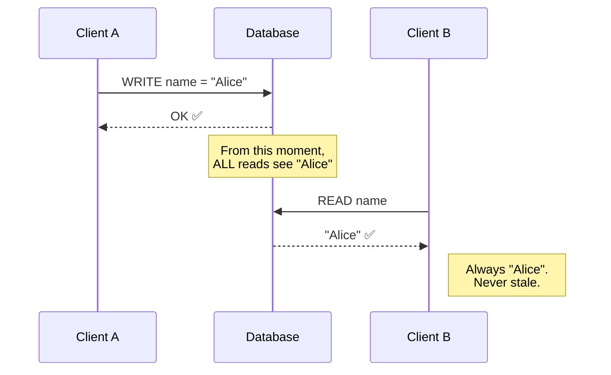
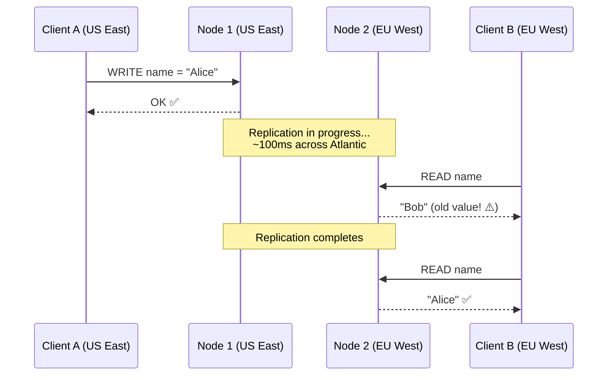
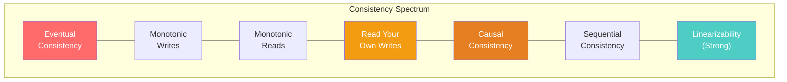
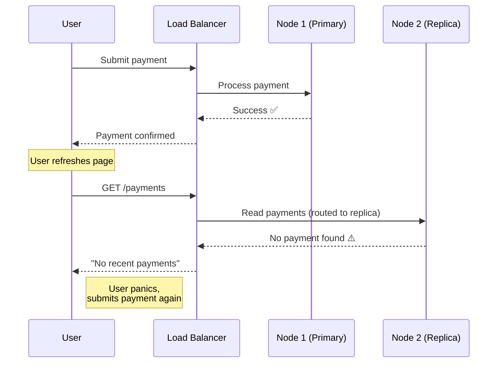
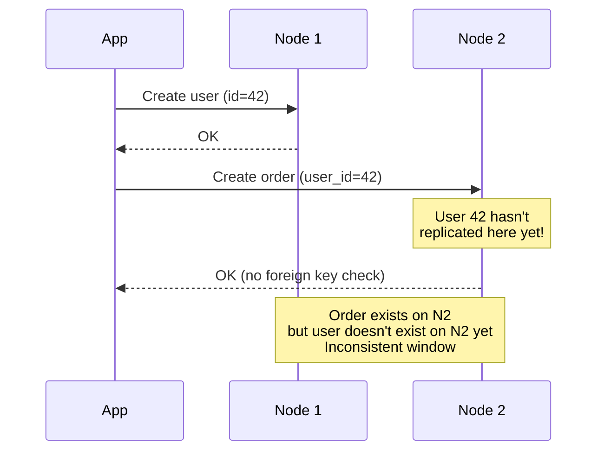
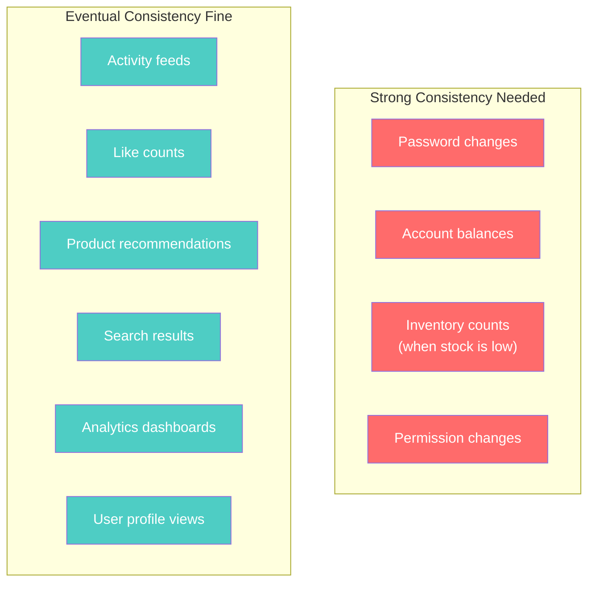

# Eventual vs Strong Consistency — What the Words Actually Mean

---

## The Confusion

"Eventual consistency" is the most misunderstood term in distributed databases. People hear "eventual" and think "unreliable." That's wrong — but the reality is nuanced.

---

## Strong Consistency

**Definition**: After a write completes, every subsequent read — from any client, on any node, anywhere — returns that write or a later one. Always. No exceptions.



PostgreSQL, MySQL (single-machine), CockroachDB, and Spanner provide this. The write isn't acknowledged until all replicas (or a quorum in distributed systems) have the data.

**Cost**: Latency. Every write waits for replication. Every read might wait for coordination. In a multi-region setup, strong consistency adds 50-200ms per operation.

---

## Eventual Consistency

**Definition**: After a write completes, replicas **will converge** to the same value — but not immediately. For some window of time, different clients may read different values.



For a window (milliseconds to seconds), Client B sees stale data. After convergence, everyone sees the same value.

"Eventual" means:
- **Not "never"** — convergence happens, typically within milliseconds
- **Not "random"** — there are formal guarantees about convergence
- **Not "wrong"** — the data was correct at the time it was written; it just hasn't propagated everywhere yet

---

## The Spectrum Between Them

Consistency isn't binary. It's a spectrum:



### Key Levels

**Read Your Own Writes**: After you write, YOUR reads always see that write. Other clients might not (yet). Most applications need at least this.

**Monotonic Reads**: If you read version 5, you'll never subsequently read version 4. Time doesn't go backward for you.

**Causal Consistency**: If operation A caused operation B (A happened-before B), everyone sees A before B. Example: if I post a message, then you reply, nobody sees the reply without the original message.

**Linearizability (Strong)**: All operations appear to execute atomically, in a single total order. The gold standard — and the most expensive.

---

## How Each Database Handles It

| Database | Default Consistency | Strongest Available | How to Get Strong |
|----------|-------------------|--------------------|--------------------|
| PostgreSQL | Strong (linearizable) | Linearizable | It's the default |
| MongoDB | Read-your-own-writes | Linearizable | `readConcern: "linearizable"` |
| Cassandra | Tunable (per-query) | Linearizable (single partition) | Read + Write at QUORUM; or LWT |
| DynamoDB | Eventual | Strong (per-table) | `ConsistentRead: true` |
| Redis | Eventual (replicas) | Strong (single node) | Don't use replicas for reads |
| CockroachDB | Serializable | Serializable | It's the default |

---

## When Eventual Consistency Causes Real Problems

### Problem 1: The Double-Submit



The user sees "no payment" because the replica hasn't caught up. They submit again → duplicate charge.

**Fix**: Read-your-own-writes guarantee. After writing, read from the primary (or use a session token to ensure routing).

### Problem 2: The Counter Race

```
User A reads counter: 100
User B reads counter: 100
User A writes counter: 101
User B writes counter: 101  ← Should be 102!
```

With eventual consistency, concurrent increments can lose updates.

**Fix**: Use actual counters (Cassandra `COUNTER` type), atomic increment operations (Redis `INCR`), or transactions.

### Problem 3: Referential Integrity Violation



NoSQL databases generally don't enforce foreign keys. In eventually consistent systems, referencing another entity can fail even in the brief inconsistency window.

**Fix**: Application-level validation, or accept that NoSQL databases don't provide referential integrity.

---

## When Eventual Consistency Is Fine

The majority of operations don't need strong consistency. Ask: "If the user sees data that's 2 seconds stale, what happens?"



For most applications, fewer than 20% of operations need strong consistency. The other 80% can tolerate seconds of staleness with no user-visible impact.

---

## Per-Operation Consistency in Practice

### TypeScript — Choosing Consistency Per Query

```typescript
import { MongoClient, ReadConcern, WriteConcern, ReadPreference } from 'mongodb';

const client = new MongoClient('mongodb://localhost:27017', {
  replicaSet: 'rs0',
});

const db = client.db('myapp');

// Strong: Password update — must be immediately visible
async function updatePassword(userId: string, newHash: string): Promise<void> {
  await db.collection('users').updateOne(
    { _id: userId },
    { $set: { passwordHash: newHash } },
    { 
      writeConcern: new WriteConcern('majority', 5000, true), // majority + journal
    }
  );
}

// Strong: Read password for authentication
async function getPasswordHash(userId: string): Promise<string | null> {
  const user = await db.collection('users').findOne(
    { _id: userId },
    { 
      readConcern: new ReadConcern('majority'),
      readPreference: ReadPreference.primary, // always read from primary
    }
  );
  return user?.passwordHash ?? null;
}

// Eventual: Activity feed — stale by seconds is fine
async function getActivityFeed(userId: string): Promise<any[]> {
  return db.collection('activity_feed')
    .find(
      { userId },
      {
        readConcern: new ReadConcern('local'), // fast, might be slightly stale
        readPreference: ReadPreference.secondaryPreferred, // read from replicas
      }
    )
    .sort({ timestamp: -1 })
    .limit(50)
    .toArray();
}
```

---

## The Consistency Tax

Strong consistency has real costs:

| Metric | Eventual (ONE/local) | Strong (QUORUM/majority) | Difference |
|--------|---------------------|-------------------------|------------|
| Write latency | 1-3ms | 5-15ms | 3-5x slower |
| Read latency | 1-3ms | 3-10ms | 2-3x slower |
| Availability during failure | High | Reduced | Can't write if majority down |
| Throughput | Higher | Lower | ~50% fewer ops/sec |

Every operation you mark as "must be strong" costs performance. Don't make everything strong out of fear — make it strong only when staleness causes actual harm.

---

## Next

→ [02-quorum-and-consensus.md](./02-quorum-and-consensus.md) — How distributed databases actually agree on the state of data: quorum voting, Paxos, and Raft.
