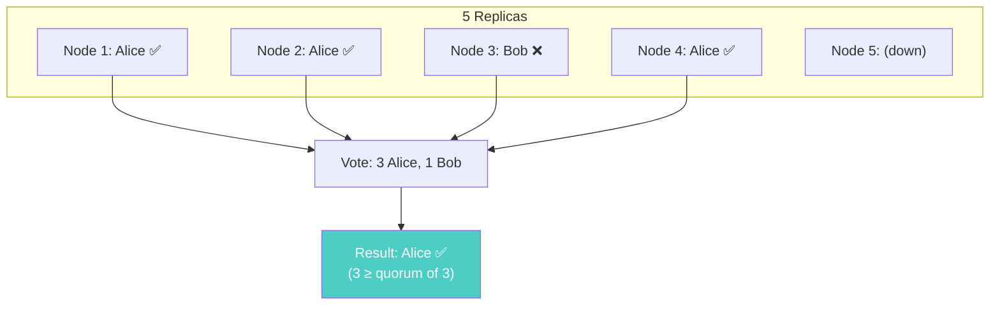
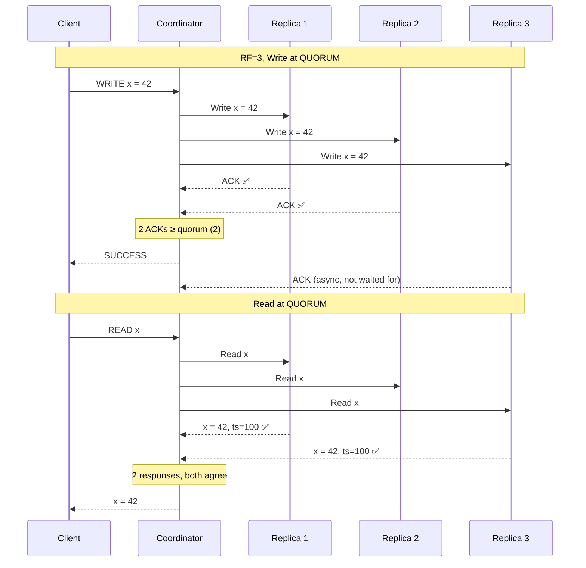
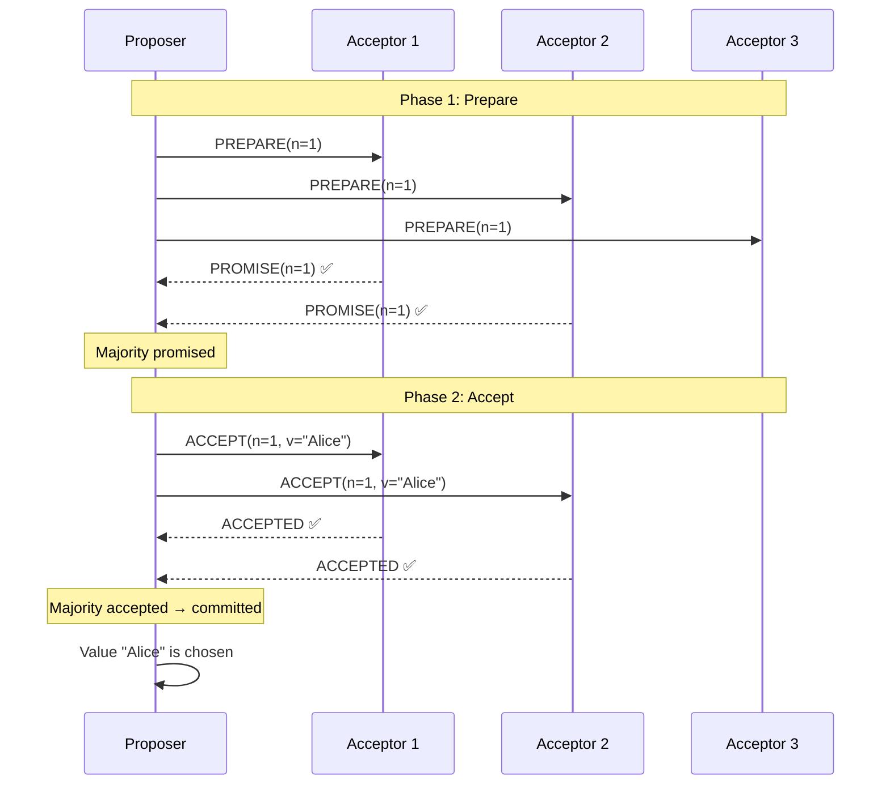
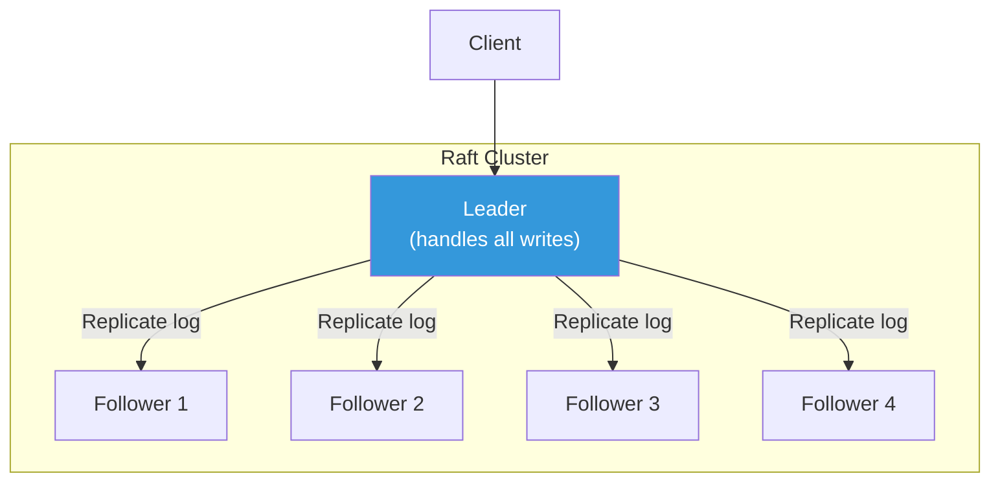
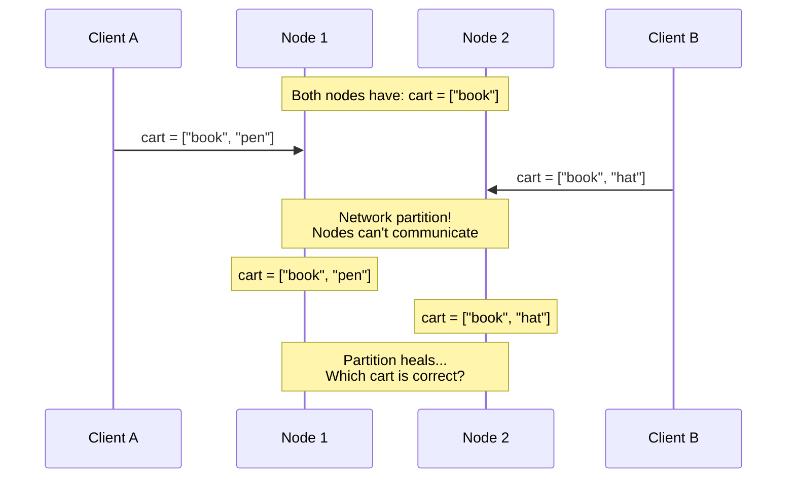
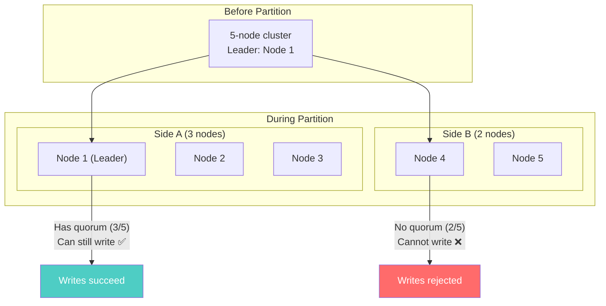

# Quorum and Consensus — How Distributed Databases Agree

---

## The Core Problem

You have 5 copies of data on 5 nodes. Node 1 says the value is "Alice." Node 3 says it's "Bob." Which is correct?

This is the **consensus problem** — getting distributed nodes to agree on the current state of data. It's the foundation of every distributed database.

---

## Quorum: The Simple Version

A quorum is a **majority vote**. If more than half the replicas agree, that value wins.

With 5 replicas:
- Quorum = ⌊5/2⌋ + 1 = **3**
- If 3+ replicas say "Alice," the answer is "Alice"



**Why quorum works**: If you write to a quorum and read from a quorum, at least one node in your read set must have the latest write. The overlapping node guarantees you see the latest data.

$$W + R > N \implies \text{at least one node has both read and latest write}$$

Where $W$ = write quorum, $R$ = read quorum, $N$ = total replicas.

---

## Quorum in Practice: Cassandra

Cassandra uses quorum directly — no leader, no log replication. Every node is equal.



**Cassandra's approach**: No consensus protocol. Just timestamp-based conflict resolution (last-write-wins). Simple, fast, but can lose concurrent writes silently.

---

## Consensus Protocols: When Quorum Isn't Enough

Simple quorum voting handles reads and writes. But what about operations that need **serialization** — "increment this counter" or "only insert if not exists"?

For these, databases use consensus protocols: algorithms that guarantee agreement even during failures.

### Paxos — The Academic Standard

Paxos was the first practical consensus algorithm (Lamport, 1998). Cassandra uses it for lightweight transactions (LWT).



**Paxos guarantees**: Only one value is chosen per round, even if multiple nodes propose simultaneously. Even if nodes crash mid-protocol, the result is consistent.

**The cost**: Two round trips (Prepare + Accept) = ~4 network hops. Cassandra LWT queries take **4-10x longer** than regular queries because of this.

### Raft — The Understandable Version

Raft (2013) achieves the same guarantees as Paxos but with a clearer design. Used by etcd, CockroachDB, and TiKV (the storage engine behind TiDB).



Key concepts:
1. **Leader election**: One node is elected leader. All writes go through the leader.
2. **Log replication**: Leader appends write to its log, replicates to followers.
3. **Commitment**: When a majority of followers have the entry, it's committed.
4. **Leader failure**: Followers detect missing heartbeats, elect a new leader.

**Raft vs Paxos**: Same guarantees. Raft is easier to implement and reason about. Paxos is more flexible for multi-decree scenarios.

---

## How Different Databases Use Consensus

| Database | Consensus Mechanism | When Used |
|----------|-------------------|-----------|
| Cassandra | Paxos (LWT only) | `IF NOT EXISTS`, `IF column = value` |
| MongoDB | Raft-like (replica set elections) | Leader election, oplog replication |
| CockroachDB | Raft | Every write (all writes go through Raft) |
| etcd | Raft | Every write |
| DynamoDB | Paxos-variant | Internal replication |
| Redis (Sentinel) | Raft-like | Leader election only |

---

## Vector Clocks and Conflict Detection

When two nodes independently write different values, how do you detect and resolve the conflict?

### The Problem: Concurrent Writes



**Last-Write-Wins (LWW)**: Cassandra's approach. The write with the highest timestamp wins. Simple but **loses data** — one of the carts is discarded.

**Vector Clocks**: Track causality, not just time. Each node maintains a counter. When values diverge, the system detects the conflict.

```
Initial:    cart = ["book"],     vc = {N1:0, N2:0}

Client A → N1: cart = ["book","pen"],  vc = {N1:1, N2:0}
Client B → N2: cart = ["book","hat"],  vc = {N1:0, N2:1}

On merge: {N1:1, N2:0} and {N1:0, N2:1} are CONCURRENT
— neither dominates the other. This is a conflict.

Resolution options:
1. Return both to client, let app merge (Riak)
2. Merge automatically (CRDTs)
3. Pick one arbitrarily (LWW — loses data)
```

### Database Approaches to Conflicts

| Database | Conflict Resolution | Data Loss Risk |
|----------|-------------------|---------------|
| Cassandra | Last-write-wins (timestamp) | **Yes** — concurrent writes lose one value |
| DynamoDB | Last-write-wins (version) | **Yes** — but conditional writes prevent it |
| Riak | Vector clocks → sibling values | **No** — but application must resolve |
| CouchDB | Revision tree → deterministic winner | **Minimal** — losing revision is kept |
| MongoDB | Write to primary only | **No** — single writer prevents conflicts |

---

## Split-Brain: The Nightmare Scenario

When a network partition splits a cluster, nodes on both sides might accept writes independently. When the partition heals, you have conflicting data.



**With quorum-based systems**: The side with a majority (3 of 5) continues operating. The minority side (2 of 5) rejects writes. No split-brain.

**Without quorum (Cassandra at CL=ONE)**: Both sides accept writes. When the partition heals, conflicting data is resolved via LWW — potentially losing writes.

**MongoDB**: Only the side with the primary continues writes. If the primary is on the minority side, it steps down and a new primary is elected on the majority side. Writes on the old primary are rolled back.

---

## Read Repair and Anti-Entropy

Even with quorum, replicas can drift. Databases use background processes to detect and fix inconsistencies:

### Read Repair (Cassandra)
When a read reveals a stale replica, the coordinator sends the correct data to the stale node:

```
Read from 3 replicas:
  Replica 1: x = 42, ts=100
  Replica 2: x = 42, ts=100
  Replica 3: x = 40, ts=90  ← stale!

Coordinator returns x=42, then sends repair to Replica 3
```

### Anti-Entropy Repair (Cassandra)
Periodic full-cluster consistency check using Merkle trees. Compares data across all replicas and repairs inconsistencies.

```bash
# Run manually (should be scheduled weekly)
nodetool repair --full
```

### Oplog Catchup (MongoDB)
Secondaries continuously replay the primary's operation log. If a secondary falls behind, it catches up by replaying missed operations.

---

## Next

→ [03-vector-clocks-and-conflict-resolution.md](./03-vector-clocks-and-conflict-resolution.md) — Deeper dive into how concurrent writes are detected and resolved across different NoSQL databases.
