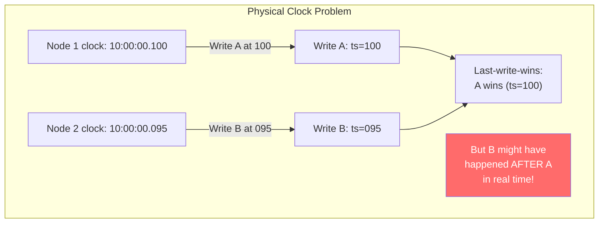
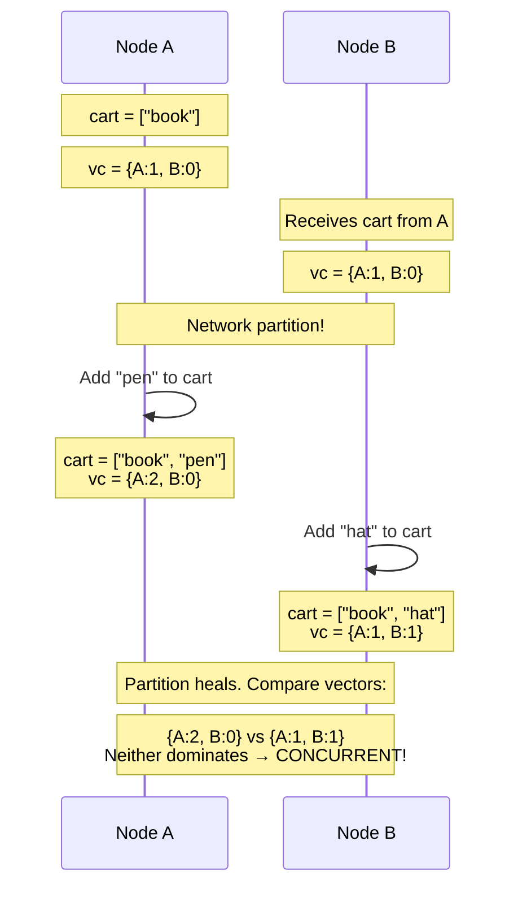
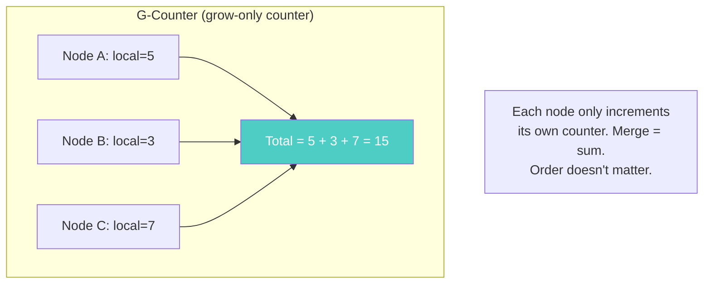
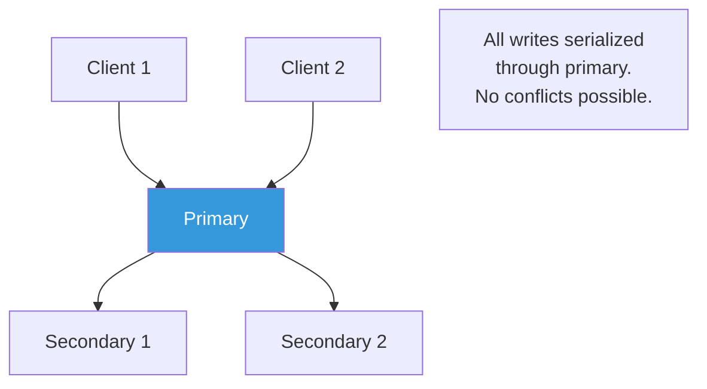
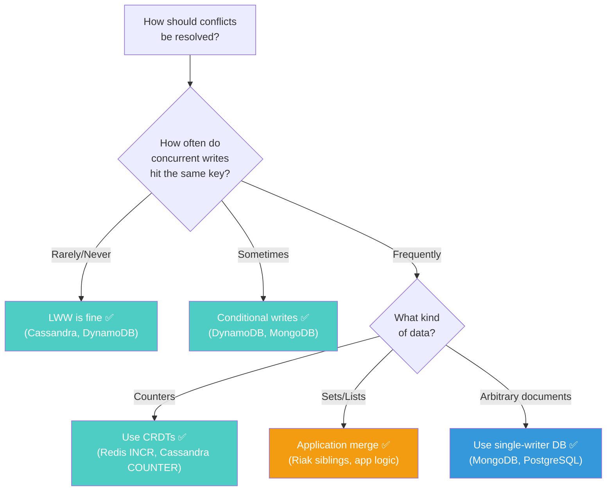

# Vector Clocks and Conflict Resolution

---

## The Fundamental Problem

Two users edit the same document at the same time. Both edits are valid. Both should (ideally) be preserved.

In SQL, locking prevents this. In distributed NoSQL, locking across nodes is too expensive. So databases must **detect** and **resolve** conflicts after they happen.

---

## Physical Clocks Are Not Enough

Your first instinct: use timestamps. Higher timestamp wins.

```
Time 10:00:00.001 — US East: set price = $99
Time 10:00:00.002 — EU West: set price = $79
```

US East node and EU West node disagree on which happened first. Why? Because:

1. **Clock skew**: Network Time Protocol (NTP) keeps clocks synchronized within ~10ms. But 10ms is enough for thousands of operations to interleave.
2. **No global clock**: There is no single clock that all machines agree on. Each machine has its own oscillator drifting at its own rate.
3. **Timestamp ties**: When two events have the same timestamp, which one wins?



Cassandra uses LWW with timestamps. It works in practice (clock skew is small) but can silently lose writes in concurrent scenarios.

---

## Logical Clocks — Getting Causality Right

### Lamport Clocks

A Lamport clock is a simple counter that tracks **causal order** — which events could have influenced which other events.

Rules:
1. Before each event, increment your counter
2. When sending a message, include your counter
3. When receiving a message, set your counter = max(yours, received) + 1

```
Node A: counter = 0
Node B: counter = 0

A does local write → A.counter = 1
A sends message to B (includes counter=1)
B receives message → B.counter = max(0, 1) + 1 = 2
B does local write → B.counter = 3
```

**Lamport clocks tell you**: If event X has a lower counter than event Y, X **might have** happened before Y. If they have equal counters, **they're concurrent**.

**Limitation**: Lamport clocks can't distinguish "X happened before Y" from "X and Y are independent but X has a lower counter."

---

### Vector Clocks — The Full Solution

A vector clock is one counter **per node**. It tracks causality precisely.

```
Node A:  {A:0, B:0, C:0}
Node B:  {A:0, B:0, C:0}
Node C:  {A:0, B:0, C:0}
```

Rules:
1. Before each event, increment your own counter in your vector
2. When sending, include your full vector
3. When receiving, merge: take element-wise max, then increment yours

### Example: Detecting Concurrent Writes



**Comparing vector clocks**:
- `{A:2, B:0}` vs `{A:1, B:1}`
- A has: A:2 > A:1 ✅, but B:0 < B:1 ❌
- Neither vector is ≥ the other in all positions
- **Therefore: concurrent writes detected**

If the vectors were `{A:2, B:1}` vs `{A:1, B:1}`, the first dominates (A:2 > A:1, B:1 = B:1). That means the first happened **after** the second — no conflict.

---

## Conflict Resolution Strategies

Once you detect concurrent writes, how do you resolve them?

### Strategy 1: Last-Write-Wins (LWW)

Pick the write with the highest timestamp. Simple. Lossy.

```
Write 1: price = $99, ts = 1000
Write 2: price = $79, ts = 1001

Winner: $79 (higher timestamp)
Loser: $99 is permanently lost
```

**Used by**: Cassandra, DynamoDB (default)

**When it's OK**: Idempotent operations, user profile updates (last save wins), metrics/counters where occasional loss is tolerable.

**When it's dangerous**: Shopping carts (items disappear), collaborative editing (changes lost), financial data.

### Strategy 2: Sibling Resolution (Application-Level Merge)

Return both conflicting values to the application. Let developer code merge them.

```typescript
// Riak-style: database returns both versions
interface ConflictResult<T> {
  siblings: Array<{
    value: T;
    vectorClock: Record<string, number>;
  }>;
}

function mergeShoppingCarts(conflict: ConflictResult<string[]>): string[] {
  // Merge strategy: union of all items
  const allItems = new Set<string>();
  for (const sibling of conflict.siblings) {
    for (const item of sibling.value) {
      allItems.add(item);
    }
  }
  return Array.from(allItems);
  // Result: ["book", "pen", "hat"] — nothing lost!
}
```

**Used by**: Riak (returns siblings to application)

**Pros**: No data loss. Application can implement domain-specific merge logic.

**Cons**: Application complexity. Every read must handle potential conflicts. If not handled, siblings accumulate ("sibling explosion").

### Strategy 3: CRDTs — Conflict-Free by Design

Conflict-free Replicated Data Types (CRDTs) are data structures that **can't conflict**. Any order of operations produces the same result.



Common CRDTs:
| CRDT | Type | Use Case |
|------|------|----------|
| G-Counter | Counter (grow-only) | Page views, like counts |
| PN-Counter | Counter (grow/shrink) | Upvote/downvote |
| G-Set | Set (add-only) | Tags, labels |
| OR-Set | Set (add/remove) | Shopping cart items |
| LWW-Register | Single value | Last-updated profile fields |

**Used by**: Riak (built-in CRDTs), Redis (CRDT-based sets), Cassandra counters (limited CRDT)

**Pros**: Zero conflicts. Mathematically guaranteed convergence. No coordination needed.

**Cons**: Limited to specific data structures. Not every operation maps to a CRDT. Can be memory-intensive (OR-Sets grow with tombstones).

### Strategy 4: Operational Transform / CRDT-Based Merging

For document editing (Google Docs style), track individual operations rather than final state.

```
User A: insert "hello" at position 0
User B: insert "world" at position 0

Transform: B's insert position shifts right because A's insert happened at the same position
Result: "helloworld" (both preserved)
```

This is highly specialized — used in collaborative editing, not general databases.

---

## What Each Database Actually Does

### MongoDB: Single-Writer Prevents Conflicts

MongoDB routes all writes to the primary. No concurrent writes to the same document → no conflicts.



**Trade-off**: Single point of write throughput. If primary fails, brief unavailability during election.

### Cassandra: Last-Write-Wins

```sql
-- Two concurrent writes to the same row
-- Node 1 receives: UPDATE users SET name = 'Alice' WHERE id = 1 (ts=1000)
-- Node 2 receives: UPDATE users SET name = 'Bob'   WHERE id = 1 (ts=1001)

-- After replication, all nodes agree: name = 'Bob' (higher timestamp)
-- 'Alice' is permanently lost
```

For column-level resolution, Cassandra applies LWW per column:
```sql
-- Write 1: SET name = 'Alice', age = 30 (ts=1000)
-- Write 2: SET name = 'Bob' (ts=1001)

-- Result: name = 'Bob' (ts=1001), age = 30 (ts=1000)
-- Column-level LWW preserves non-conflicting columns
```

### DynamoDB: Conditional Writes for Safety

```typescript
import { DynamoDBClient, PutItemCommand } from '@aws-sdk/client-dynamodb';

// Optimistic concurrency: only write if version matches
const command = new PutItemCommand({
  TableName: 'products',
  Item: {
    productId: { S: 'prod-123' },
    price: { N: '79' },
    version: { N: '2' },
  },
  ConditionExpression: 'version = :expectedVersion',
  ExpressionAttributeValues: {
    ':expectedVersion': { N: '1' },
  },
});

// If another write changed version to 2 first, this fails
// Application retries: read latest version, reapply change
```

---

## Choosing Your Conflict Strategy



---

## Next

→ [04-read-repair-and-anti-entropy.md](./04-read-repair-and-anti-entropy.md) — How databases heal themselves after failures: read repair, anti-entropy, and the self-healing mechanisms that make distributed systems work.
