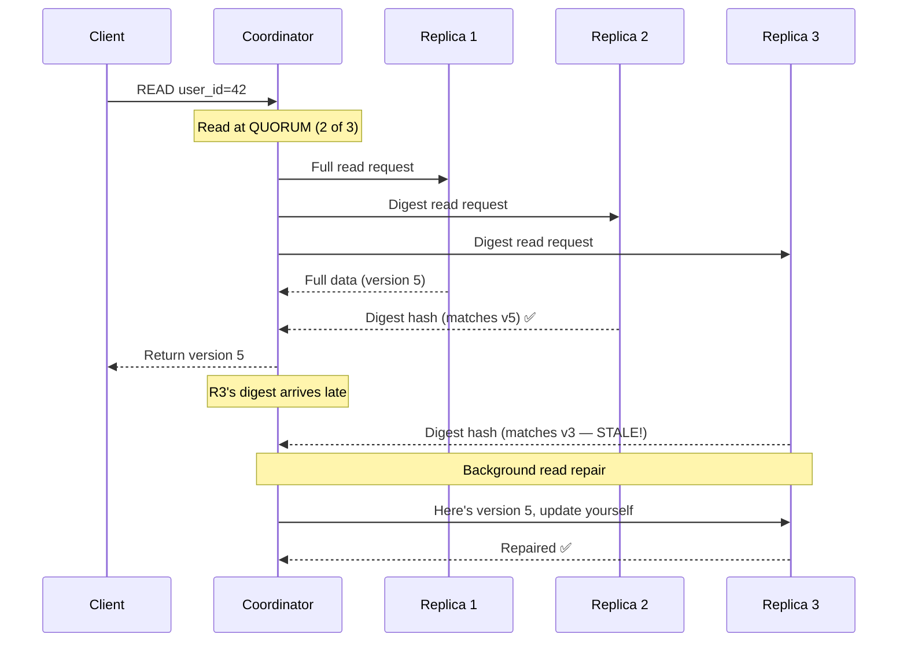
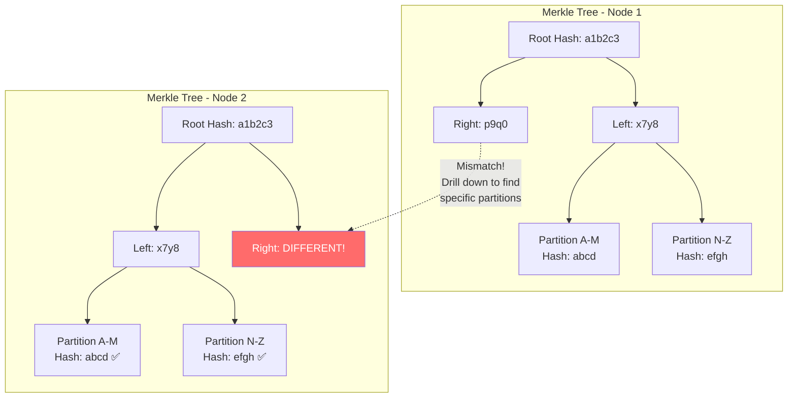
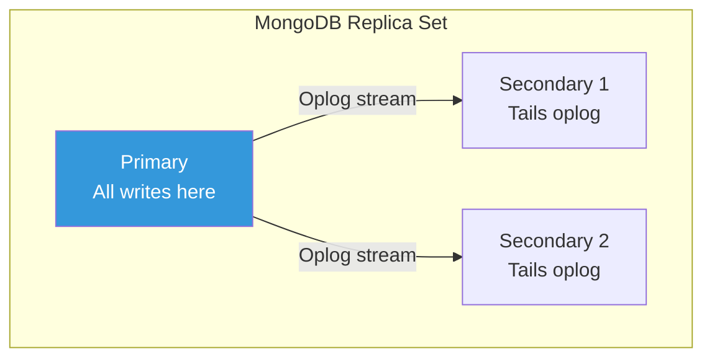
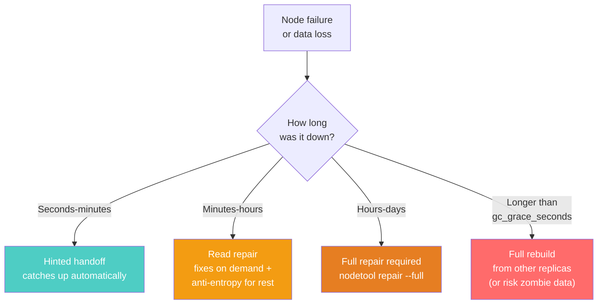
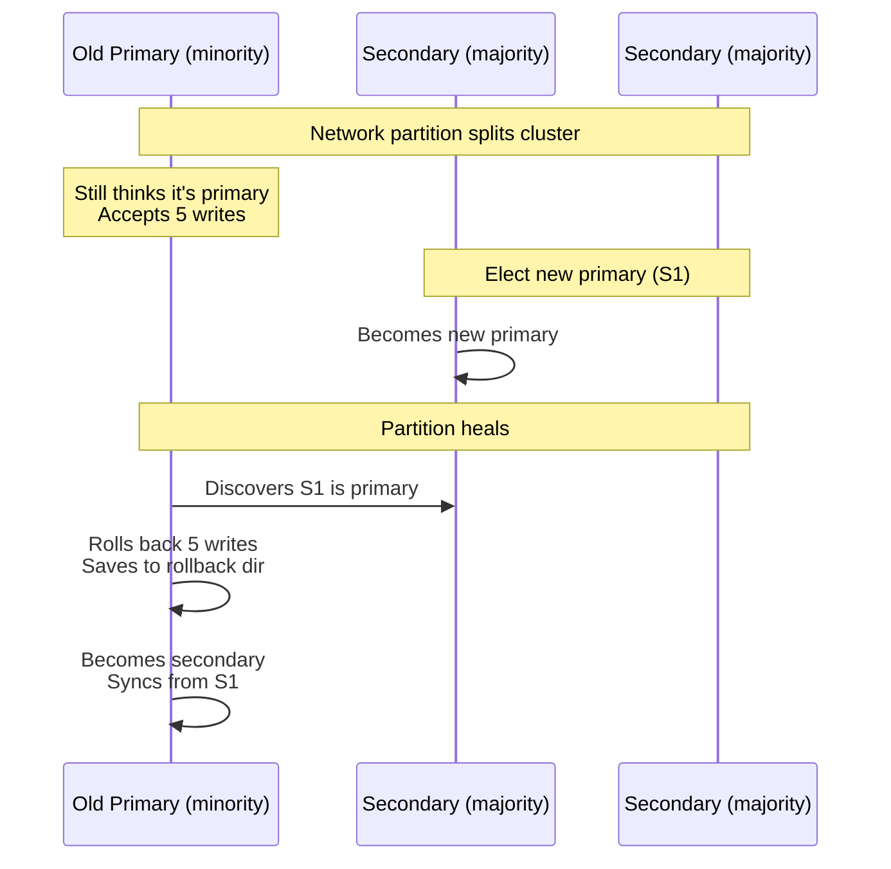

# Read Repair and Anti-Entropy — Self-Healing Distributed Systems

---

## The Reality: Replicas Drift

Even in a healthy cluster, data diverges across replicas:
- Network dropped a packet during replication
- A node restarted and missed some writes
- A disk had a silent corruption (bit flip)
- Hinted handoff didn't fully catch up after a node outage

Distributed databases address this with two mechanisms: **read repair** (on-demand) and **anti-entropy repair** (scheduled).

---

## Read Repair

When you read from multiple replicas and they disagree, the coordinator fixes the stale replicas in the background.



### How Cassandra Read Repair Works

Cassandra sends the full data request to one replica and a **digest request** (hash of the data) to the others.

- If all digests match → data is consistent, return immediately
- If digests differ → fetch full data from all disagreeing replicas, determine the latest version (highest timestamp), return it to the client, and send corrections to stale replicas

### Types of Read Repair in Cassandra

| Type | When | Performance Impact |
|------|------|-------------------|
| Blocking read repair | Digest mismatch during a QUORUM read | Adds ~1-5ms to the read (must fetch full data from disagreeing replica) |
| Background read repair | After returning to client, based on `read_repair_chance` | None to client — happens asynchronously |

```sql
-- Configure read repair probability
ALTER TABLE users WITH read_repair_chance = 0.1;
-- 10% of reads trigger background read repair
-- (In Cassandra 4.0+, this is deprecated in favor of full repair)
```

### Read Repair Limitations

1. **Only repairs data that's read** — Data nobody reads stays inconsistent
2. **Per-partition only** — Won't fix inconsistencies in partitions that aren't queried
3. **Doesn't handle all failure modes** — Can't fix data that's been lost on all replicas

---

## Anti-Entropy Repair

A scheduled, full-cluster consistency check that repairs ALL data, not just data that's read.

### How It Works: Merkle Trees

Cassandra builds a **Merkle tree** (hash tree) for each table on each node. Nodes exchange tree roots and compare:



1. **Build**: Each node hashes its data into a Merkle tree
2. **Compare**: Nodes exchange root hashes. If roots match → data is consistent.
3. **Drill down**: If roots differ, compare child hashes to identify exactly which partitions diverge.
4. **Stream**: Send only the divergent data to the node with the stale version.

This is efficient — instead of comparing every row, you compare hashes. A single root hash comparison tells you if billions of rows are consistent.

### Running Repairs

```bash
# Full repair — compares all data with replicas
# Run this weekly per node (not all nodes simultaneously)
nodetool repair --full

# Incremental repair — only repairs data written since last repair
# Faster, can run more frequently
nodetool repair

# Repair a specific keyspace and table
nodetool repair myapp users
```

### Repair Schedule

| Repair Type | Frequency | Duration | Impact |
|-------------|-----------|----------|--------|
| Full repair | Every `gc_grace_seconds` (default 10 days) | Hours on large datasets | High I/O, high network |
| Incremental repair | Daily or every few days | Minutes to an hour | Moderate I/O |
| Subrange repair | Rotate through token ranges | Varies | Low per-run impact |

**Critical rule**: You MUST run repair at least once within `gc_grace_seconds` (10 days default). Otherwise, deleted data (tombstones) that have been garbage-collected on some nodes may **resurrect** on others — zombie data.

---

## MongoDB's Approach: Oplog-Based Replication

MongoDB doesn't need read repair or anti-entropy because it uses a fundamentally different architecture:



**Single writer (primary)** means no write conflicts. Secondaries **tail the oplog** — an ordered log of all operations on the primary. If a secondary falls behind, it replays missed oplog entries.

If a secondary falls too far behind (oplog has been overwritten), it does an **initial sync** — copies the entire dataset from the primary.

### MongoDB's Repair Equivalent

```javascript
// Check replica lag
rs.status().members.forEach(m => {
  if (m.stateStr === 'SECONDARY') {
    console.log(`${m.name}: lag = ${m.optimeDate - rs.status().date}ms`);
  }
});

// If a secondary is severely out of sync, force initial sync:
// 1. Stop the mongod on the secondary
// 2. Delete its data directory
// 3. Restart — it will initial sync from the primary
```

---

## DynamoDB's Approach: Managed Anti-Entropy

DynamoDB handles all repair internally. As a managed service, you don't run repair tools. Amazon's infrastructure:
- Detects inconsistent replicas automatically
- Repairs them in the background
- Provides no visibility into this process (it's fully abstracted)

This is the trade-off of managed services: less control, less operational burden.

---

## Failure Recovery Flow



---

## Split-Brain Recovery

The hardest recovery scenario: a network partition splits the cluster and both sides accepted writes.

### Cassandra Split-Brain Recovery

Cassandra is leaderless — both sides can accept writes at CL=ONE during a partition. When the partition heals:

1. Read repair and anti-entropy detect divergent data
2. LWW (last-write-wins by timestamp) resolves conflicts
3. **Data loss is possible** — if both sides wrote to the same row, the lower-timestamp write is silently discarded

### MongoDB Split-Brain Recovery

MongoDB's primary-based architecture prevents true split-brain:

1. Primary is on one side of the partition
2. If the primary is on the minority side, it steps down
3. Majority side elects a new primary
4. When partition heals, old primary rolls back any writes that weren't replicated to the majority
5. Rolled-back writes are saved to a `rollback/` directory for manual recovery



---

## Practical Monitoring

### What to Monitor

| Metric | Healthy | Warning | Critical |
|--------|---------|---------|----------|
| Read repair rate | < 1% of reads | 1-5% | > 5% (data diverging frequently) |
| Pending repairs | 0 | 1-5 | > 10 (repair falling behind) |
| Hinted handoff queue | < 100 hints | 100-1000 | > 1000 (nodes not recovering) |
| Replica lag (MongoDB) | < 1 second | 1-10 seconds | > 10 seconds |

---

## Next

→ [05-split-brain-and-partition-tolerance.md](./05-split-brain-and-partition-tolerance.md) — A deeper look at network partitions: what actually happens when your cluster splits, and how different databases handle the impossible choices.
