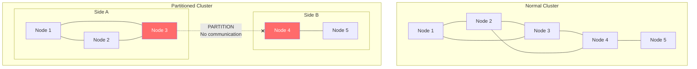
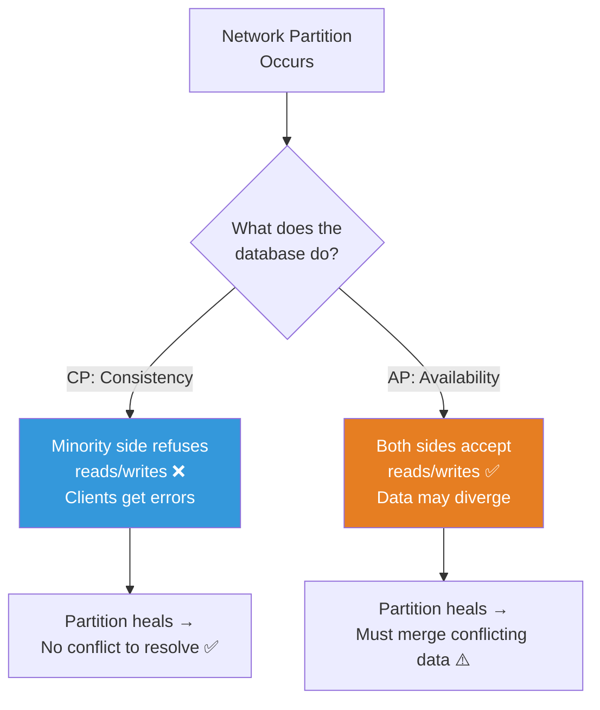
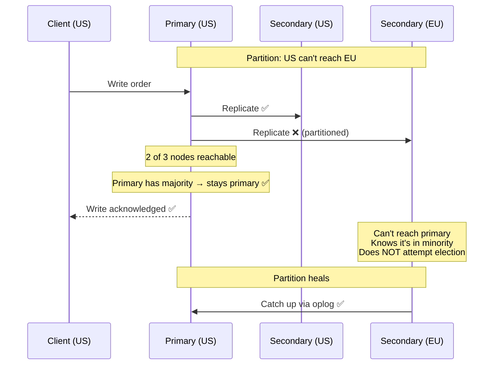
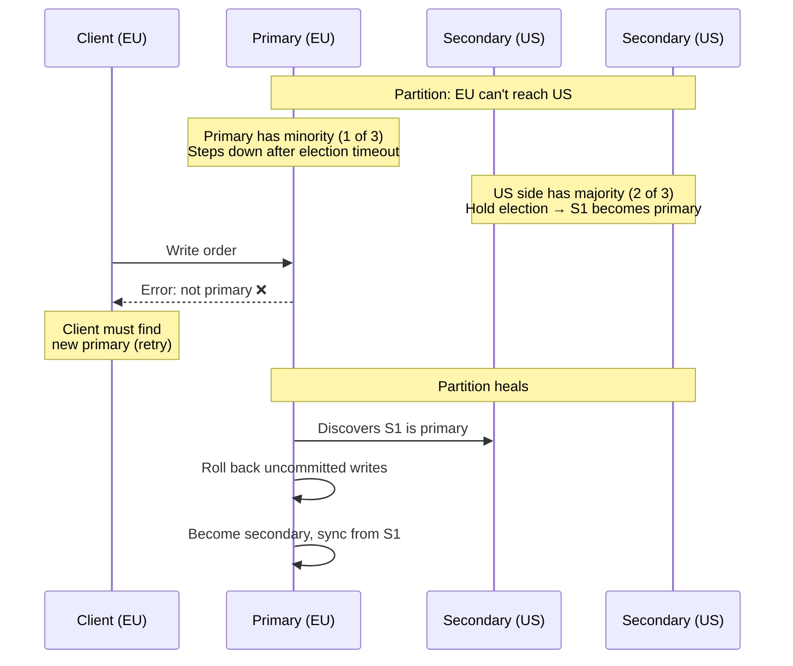
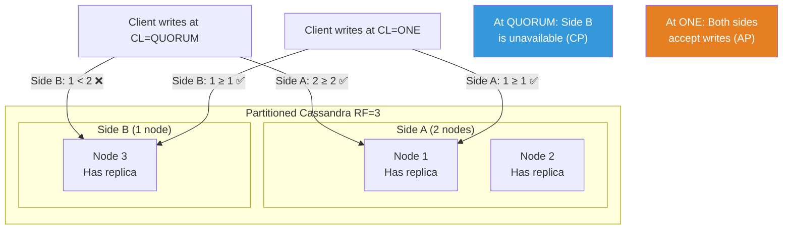
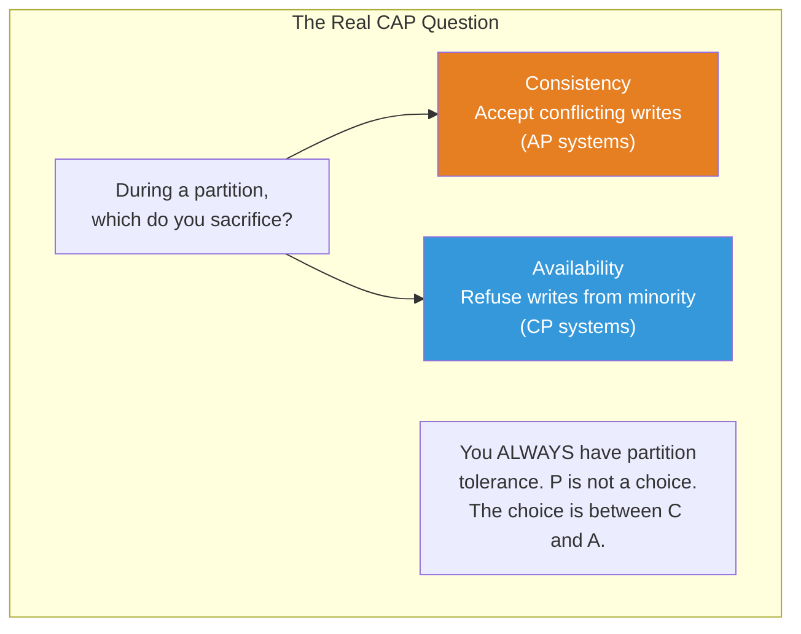
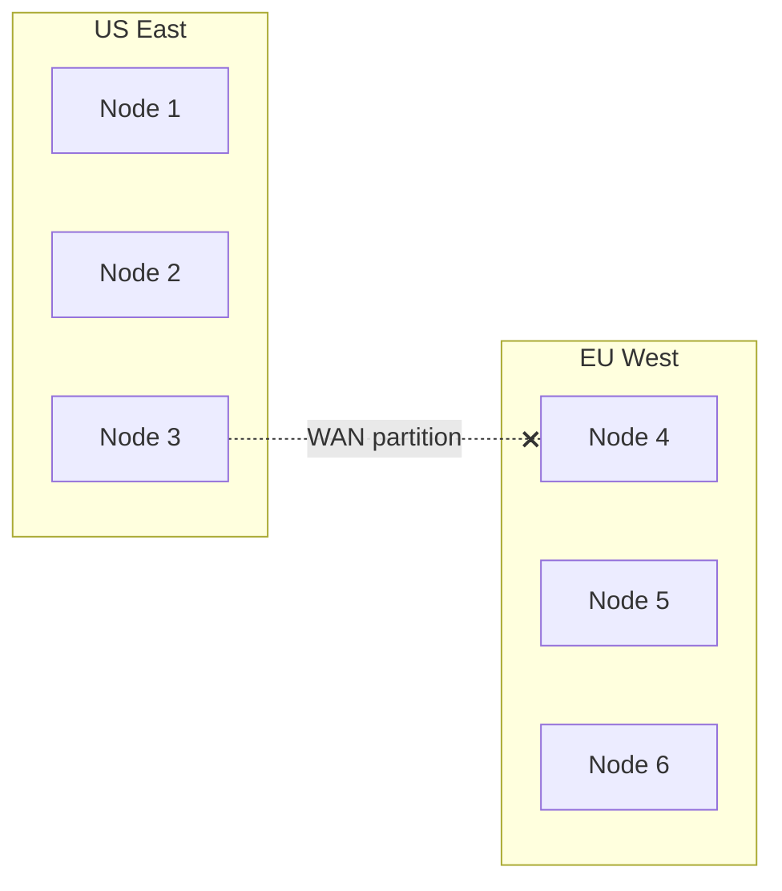

# Split-Brain and Partition Tolerance — The Impossible Choices

---

## What a Network Partition Really Is

A network partition isn't "the network is down." It's **"the network is partially down."** Nodes can talk to some nodes but not others. The cluster splits into disconnected groups, each believing the other side has failed.



Partitions happen because of:
- Switch failure between racks
- Firewall rule change
- Cloud provider network issues
- DNS failures
- GC pauses so long that heartbeats time out (Cassandra JVM)
- Overloaded network links dropping packets

Partitions are **not rare**. Any production system running long enough will experience them.

---

## The CAP Theorem Choice — In Practice

During a partition, a database must choose:

1. **Stay consistent (CP)**: Refuse writes on the minority side. Some clients can't write. Availability drops.
2. **Stay available (AP)**: Accept writes on both sides. Data diverges. Consistency drops.



### What Each Database Chooses

| Database | During Partition | Choice | What Happens |
|----------|-----------------|--------|--------------|
| PostgreSQL (single) | N/A — no partition possible | CP | One machine, always consistent |
| MongoDB | Primary on minority side steps down | CP | Minority can't write; majority elects new primary |
| Cassandra (CL=QUORUM) | Minority can't reach quorum | CP for that query | Write fails, client retries |
| Cassandra (CL=ONE) | Both sides accept writes | AP | Conflicts resolved by LWW after partition heals |
| DynamoDB | AWS handles internally | Depends on configuration | Strong reads may fail; eventual reads continue |
| CockroachDB | Minority ranges become unavailable | CP | Majority side continues; minority halts |
| Redis Sentinel | Old primary steps down eventually | CP (with brief confusion) | Possible data loss during failover |

---

## Scenario: MongoDB During a Partition



**If the primary were on the minority side**:



**Key trade-off**: During the partition, clients near the old primary can't write. But no data conflicts occur.

---

## Scenario: Cassandra During a Partition



**At CL=QUORUM**: Cassandra behaves CP. The minority side rejects writes because it can't reach quorum. No conflicts.

**At CL=ONE**: Cassandra behaves AP. Both sides accept writes. When the partition heals, conflicting writes are resolved by LWW (last-write-wins). Data can be silently lost.

This is why Cassandra's consistency is "tunable" — you choose CP or AP per query.

---

## The Split-Brain Problem

True split-brain: both sides of a partitioned cluster believe they are the rightful authority and accept writes.

### When Split-Brain Causes Real Damage

```
User has $100 in their account.

Side A: User withdraws $80 → balance = $20
Side B: User withdraws $60 → balance = $40

Partition heals → LWW picks one:
Result: balance = $40 (Side B wins by timestamp)

Problem: User withdrew $80 + $60 = $140 from $100 account
The $80 withdrawal is lost. Bank is out $80.
```

This is why financial systems don't use AP databases (or if they do, they add external coordination).

### Preventing Split-Brain

| Technique | How It Works | Used By |
|-----------|-------------|---------|
| Quorum writes | Minority can't reach quorum → writes fail | Cassandra (QUORUM), MongoDB |
| Leader election | Only leader accepts writes; minority has no leader | MongoDB, etcd, CockroachDB |
| Fencing tokens | Old leader's writes are rejected by storage | ZooKeeper, etcd |
| STONITH | "Shoot The Other Node In The Head" — power off the misbehaving node | Pacemaker, VMware HA |

---

## What "Partition Tolerance" Means

Every distributed system is partition-tolerant — it's not optional. Networks WILL partition. The question is what the system does when it happens.

"Partition-tolerant" just means "the system has a defined behavior during partitions." It might refuse writes (CP). It might accept conflicting writes (AP). But it doesn't crash or corrupt data silently.



---

## Multi-Region Partition Strategies

In multi-DC deployments, inter-DC partitions are the most common (undersea cables, WAN issues):



### Strategy 1: Active-Passive (MongoDB, PostgreSQL)

One DC is primary. Other DC has read replicas only. During partition:
- Primary DC continues normally
- Passive DC serves stale reads
- No write conflicts possible

### Strategy 2: Active-Active with LOCAL_QUORUM (Cassandra)

Both DCs accept writes, but only require local quorum:
- Each DC operates independently during partition
- Cross-DC replication catches up when partition heals
- Same-key conflicts resolved by LWW

### Strategy 3: Global Consensus (CockroachDB, Spanner)

Every write goes through consensus across DCs:
- Strong consistency globally
- High latency (50-200ms per write for cross-DC consensus)
- During partition, ranges on the minority side become unavailable

| Strategy | Consistency | Latency | Partition Behavior |
|----------|------------|---------|-------------------|
| Active-Passive | Strong | Low (local reads) | Passive can't write |
| Active-Active LOCAL_QUORUM | Eventual (cross-DC) | Low | Both DCs write, LWW merge |
| Global Consensus | Strong | High | Minority unavailable |

---

## The Practical Decision

For most applications:

1. **Single region**: Use MongoDB or CockroachDB. Partitions within a region are rare and brief. CP behavior during partitions is acceptable.
2. **Multi-region, read-heavy**: Active-passive. Route reads to nearest DC. Writes go to primary DC.
3. **Multi-region, write-heavy**: Cassandra with LOCAL_QUORUM. Accept eventual consistency across DCs. Design data model to avoid cross-DC conflicts.
4. **Multi-region, strong consistency**: CockroachDB or Spanner. Pay the latency cost.

---

## Next Phase

→ [../05-data-modeling-patterns/01-embedding-patterns.md](../05-data-modeling-patterns/01-embedding-patterns.md) — Practical data modeling patterns for NoSQL databases: embedding, fan-out, bucketing, and more.
