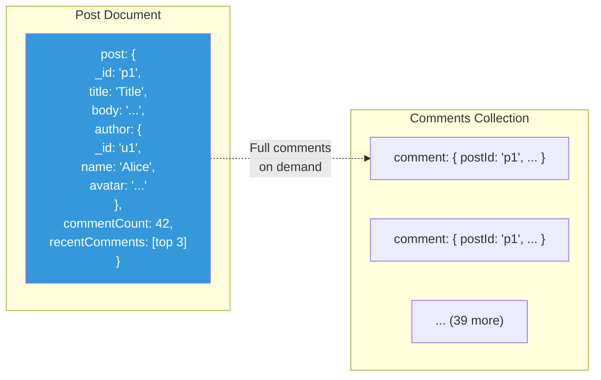
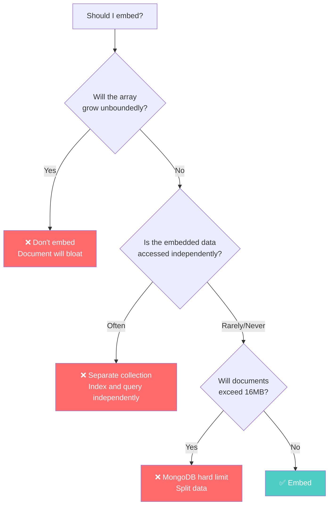

# Embedding Patterns — When and How to Nest Data

---

## The Core Idea

In relational databases, related data lives in separate tables and is joined at query time. In document databases, related data can be **embedded** — stored directly inside the parent document.

Embedding trades storage for read speed. Instead of multiple queries and joins, you read one document and have everything.

---

## Pattern 1: One-to-One Embedding

The simplest case. An entity has exactly one related sub-entity.

### Example: User with Address

**SQL approach (2 tables)**:
```sql
SELECT u.*, a.* FROM users u JOIN addresses a ON u.id = a.user_id WHERE u.id = ?;
```

**Document approach (embedded)**:
```typescript
interface User {
  _id: string;
  name: string;
  email: string;
  address: {                // Embedded — always fetched with user
    street: string;
    city: string;
    state: string;
    zip: string;
    country: string;
  };
}
```

**When to embed**: The sub-document is always read with the parent. There's no use case for querying addresses independently.

---

## Pattern 2: One-to-Few Embedding

A parent has a small, bounded number of children.

### Example: Blog Post with Tags

```typescript
interface BlogPost {
  _id: string;
  title: string;
  body: string;
  author: string;
  tags: string[];           // Embedded — always < 20 items
  metadata: {
    readTimeMinutes: number;
    wordCount: number;
  };
}
```

### Example: Product with Variants

```go
type Product struct {
    ID          string    `bson:"_id"`
    Name        string    `bson:"name"`
    Description string    `bson:"description"`
    Variants    []Variant `bson:"variants"` // Typically 2-10 per product
}

type Variant struct {
    SKU    string  `bson:"sku"`
    Color  string  `bson:"color"`
    Size   string  `bson:"size"`
    Price  float64 `bson:"price"`
    Stock  int     `bson:"stock"`
}
```

**Bound**: Up to ~50 items. Beyond that, the document grows large and updates to individual items become inefficient.

---

## Pattern 3: One-to-Many with Bounded Growth

More items, but still bounded and predictable.

### Example: Order with Line Items

```typescript
interface Order {
  _id: string;
  customerId: string;
  orderDate: Date;
  status: 'pending' | 'shipped' | 'delivered';
  items: OrderItem[];        // 1-50 items per order, never grows after placement
  shippingAddress: Address;
  total: number;
}

interface OrderItem {
  productId: string;
  productName: string;      // Denormalized — frozen at purchase
  quantity: number;
  unitPrice: number;        // Frozen at purchase
}
```

**Why this works**: An order's items don't change after creation. The array is bounded (nobody orders 10,000 items). The document size stays manageable.

---

## Pattern 4: Partial Embedding (Hybrid)

Embed summary data, reference full data.



```typescript
interface Post {
  _id: string;
  title: string;
  body: string;
  author: {                     // Partial embed: just what we need for display
    _id: string;
    name: string;
    avatarUrl: string;
  };
  commentCount: number;
  recentComments: Comment[];    // Embed only the top 3
}

// Full comments live in their own collection
interface Comment {
  _id: string;
  postId: string;
  authorId: string;
  authorName: string;           // Denormalized
  body: string;
  createdAt: Date;
}
```

**The principle**: Embed what you display immediately. Reference what you load on demand.

---

## When NOT to Embed



### Anti-Pattern: Embedding Comments on a Viral Post

```typescript
// ❌ What happens when a post gets 50,000 comments?
interface Post {
  _id: string;
  title: string;
  comments: Comment[];  // Array grows to 50,000 items
                         // Document size: 10-50MB
                         // Every read loads ALL comments
                         // Adding one comment rewrites the entire document
}
```

### Anti-Pattern: Embedding When You Need Independent Queries

```typescript
// ❌ If you need "find all orders with product X", embedding makes this hard
interface Customer {
  _id: string;
  name: string;
  orders: Order[];  // To find all orders with product X,
                     // you'd scan every customer document
}

// ✅ Separate collection: orders can be indexed and queried independently
// db.orders.find({ "items.productId": "prod-123" })
```

---

## Embedding in Cassandra

Cassandra supports embedding via User-Defined Types (UDTs) and collections:

```sql
-- UDT for embedded sub-documents
CREATE TYPE address (
    street TEXT,
    city TEXT,
    state TEXT,
    zip TEXT
);

-- Embedding UDT in a table
CREATE TABLE users (
    user_id UUID PRIMARY KEY,
    name TEXT,
    home_address FROZEN<address>,    -- Embedded, immutable
    work_address FROZEN<address>
);

-- Collections for one-to-few
CREATE TABLE products (
    product_id UUID PRIMARY KEY,
    name TEXT,
    tags SET<TEXT>,                    -- Embedded set
    prices MAP<TEXT, DECIMAL>,        -- Embedded map (currency → price)
    reviews LIST<FROZEN<review>>     -- Embedded list of UDTs
);
```

**Important**: `FROZEN` means the entire UDT is treated as a blob — you can't update individual fields. You must rewrite the whole UDT. For frequently-updated embedded data, this is a problem.

---

## The Embedding Spectrum

| Level | When | Example |
|-------|------|---------|
| Full embed | Data always read together, bounded, immutable | Order + line items |
| Partial embed | Summary always needed, details on demand | Post + top 3 comments |
| Reference only | Data accessed independently, unbounded | User → orders (by reference) |
| Hybrid | Some fields embedded, some referenced | Product with embedded variants + separate reviews |

---

## Next

→ [02-fan-out-patterns.md](./02-fan-out-patterns.md) — Fan-out on write vs fan-out on read: the architectural decision that defines social media backends.
