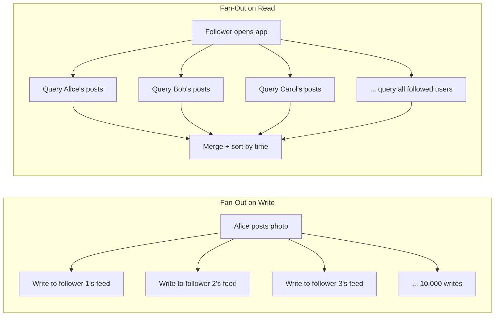
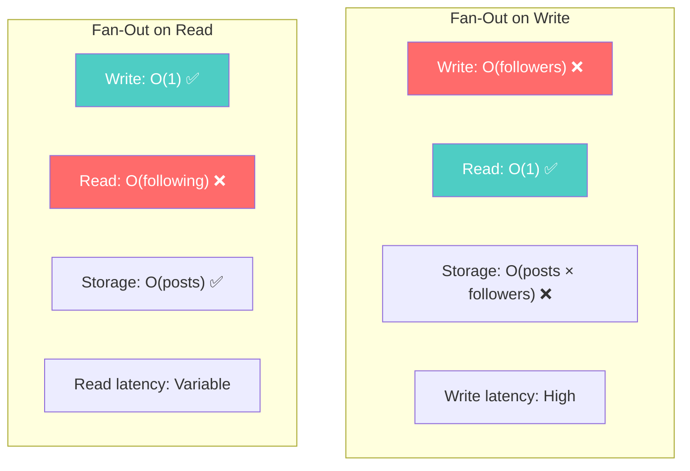
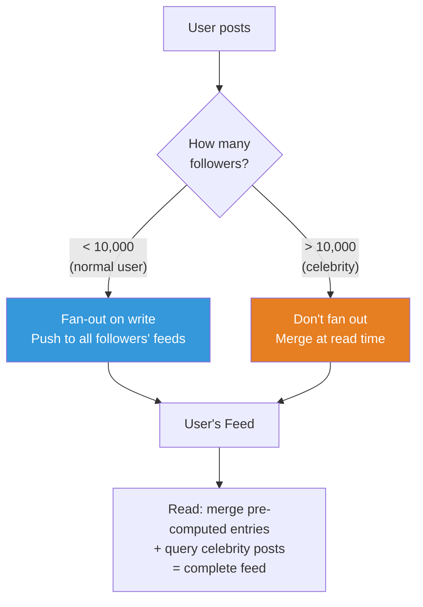
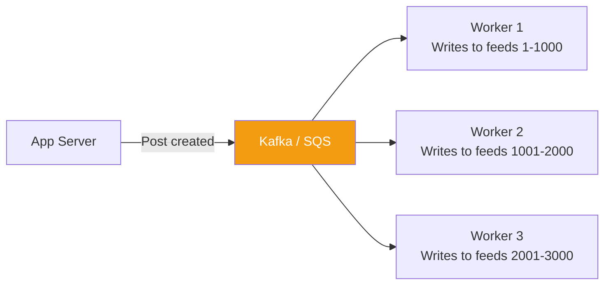

# Fan-Out Patterns — Write-Time vs Read-Time Distribution

---

## The Problem: Activity Feeds

Alice posts a photo. She has 10,000 followers. How do each of them see it in their feed?

Two approaches:



---

## Fan-Out on Write (Push Model)

When a user creates content, **copy it to every follower's feed immediately**.

### The Schema

```typescript
// MongoDB collections
interface Post {
  _id: string;
  authorId: string;
  content: string;
  imageUrl?: string;
  createdAt: Date;
}

// Pre-computed feed: one document per feed entry
interface FeedEntry {
  _id: string;
  feedOwnerId: string;        // Whose feed this appears in
  postId: string;
  authorId: string;
  authorName: string;          // Denormalized
  authorAvatar: string;        // Denormalized
  contentPreview: string;      // First 200 chars
  imageUrl?: string;
  postedAt: Date;
}
```

### The Write Path

```typescript
async function createPost(
  db: Db,
  authorId: string,
  content: string,
): Promise<void> {
  // 1. Save the post
  const post = {
    _id: new ObjectId().toString(),
    authorId,
    content,
    createdAt: new Date(),
  };
  await db.collection('posts').insertOne(post);

  // 2. Get all followers
  const followers = await db.collection('follows')
    .find({ followedId: authorId })
    .project({ followerId: 1 })
    .toArray();

  // 3. Fan out: write to each follower's feed
  const author = await db.collection('users').findOne({ _id: authorId });
  
  const feedEntries = followers.map(f => ({
    feedOwnerId: f.followerId,
    postId: post._id,
    authorId,
    authorName: author!.name,
    authorAvatar: author!.avatarUrl,
    contentPreview: content.substring(0, 200),
    postedAt: post.createdAt,
  }));

  // Bulk insert — for 10,000 followers, this is 10,000 writes
  if (feedEntries.length > 0) {
    await db.collection('feed').insertMany(feedEntries);
  }
}
```

### The Read Path (Trivial)

```typescript
async function getFeed(db: Db, userId: string, limit = 50): Promise<FeedEntry[]> {
  // One query, one collection, indexed by (feedOwnerId, postedAt DESC)
  return db.collection<FeedEntry>('feed')
    .find({ feedOwnerId: userId })
    .sort({ postedAt: -1 })
    .limit(limit)
    .toArray();
}
```

### Cassandra Version

```sql
-- Perfect for Cassandra: partition by feed owner, cluster by time
CREATE TABLE user_feed (
    user_id UUID,
    posted_at TIMESTAMP,
    post_id UUID,
    author_name TEXT,
    content_preview TEXT,
    PRIMARY KEY ((user_id), posted_at, post_id)
) WITH CLUSTERING ORDER BY (posted_at DESC, post_id ASC);

-- Read: single partition, pre-sorted
SELECT * FROM user_feed WHERE user_id = ? LIMIT 50;
```

---

## Fan-Out on Read (Pull Model)

When a user opens their feed, **query all followed users' posts and merge in real-time**.

### The Schema (Simpler)

```typescript
// Just the posts collection — no pre-computed feeds
interface Post {
  _id: string;
  authorId: string;
  content: string;
  createdAt: Date;
}

interface Follow {
  followerId: string;
  followedId: string;
}
```

### The Read Path (Complex)

```typescript
async function getFeed(db: Db, userId: string, limit = 50): Promise<Post[]> {
  // 1. Get all users I follow
  const following = await db.collection('follows')
    .find({ followerId: userId })
    .project({ followedId: 1 })
    .toArray();

  const followedIds = following.map(f => f.followedId);

  // 2. Query posts from all followed users, merge and sort
  // This is the expensive part— $in with 500 IDs + sort
  return db.collection<Post>('posts')
    .find({ authorId: { $in: followedIds } })
    .sort({ createdAt: -1 })
    .limit(limit)
    .toArray();
}
```

**The cost**: If you follow 500 people, this query scans posts across 500 different authors and merges them. With proper indexing, it's manageable at low scale. At high scale, it becomes a performance problem.

---

## Comparison



| | Fan-Out on Write | Fan-Out on Read |
|---|---|---|
| Write cost | High (N writes per post) | Low (1 write) |
| Read cost | Low (1 query) | High (N queries + merge) |
| Storage | High (N copies) | Low (1 copy) |
| Latency to see post | High (fan-out takes time) | Instant (when you read) |
| Celebrity problem | 10M followers = 10M writes | No problem |
| Stale data | Possible (if fan-out fails partway) | Always fresh |
| Complexity | Write pipeline, workers, queues | Complex read query, caching |

---

## The Hybrid Approach (What Twitter/X Actually Does)



- **Normal users** (< 10K followers): Fan-out on write. Pre-compute feeds.
- **Celebrities** (> 10K followers): Don't fan out. At read time, merge the pre-computed feed with a real-time query of celebrity posts.

This avoids the celebrity problem (Taylor Swift posting = 400M writes) while keeping reads fast for the common case.

### Go — Hybrid Feed

```go
const celebrityThreshold = 10_000

func GetFeed(ctx context.Context, db *mongo.Database, userID string, limit int) ([]FeedEntry, error) {
	// 1. Get pre-computed feed entries (from fan-out on write)
	cursor, err := db.Collection("feed").Find(ctx,
		bson.M{"feedOwnerId": userID},
		options.Find().SetSort(bson.D{{Key: "postedAt", Value: -1}}).SetLimit(int64(limit)),
	)
	if err != nil {
		return nil, err
	}
	var entries []FeedEntry
	if err := cursor.All(ctx, &entries); err != nil {
		return nil, err
	}

	// 2. Get celebrity accounts I follow
	celebCursor, err := db.Collection("follows").Find(ctx,
		bson.M{"followerId": userID, "followedIsCelebrity": true},
	)
	if err != nil {
		return nil, err
	}
	var celebFollows []Follow
	if err := celebCursor.All(ctx, &celebFollows); err != nil {
		return nil, err
	}

	celebIDs := make([]string, len(celebFollows))
	for i, f := range celebFollows {
		celebIDs[i] = f.FollowedID
	}

	// 3. Query celebrity posts directly (fan-out on read for celebs only)
	if len(celebIDs) > 0 {
		celebCursor, err := db.Collection("posts").Find(ctx,
			bson.M{"authorId": bson.M{"$in": celebIDs}},
			options.Find().SetSort(bson.D{{Key: "createdAt", Value: -1}}).SetLimit(int64(limit)),
		)
		if err != nil {
			return nil, err
		}
		var celebPosts []FeedEntry
		if err := celebCursor.All(ctx, &celebPosts); err != nil {
			return nil, err
		}
		entries = append(entries, celebPosts...)
	}

	// 4. Sort merged results, take top N
	sort.Slice(entries, func(i, j int) bool {
		return entries[i].PostedAt.After(entries[j].PostedAt)
	})
	if len(entries) > limit {
		entries = entries[:limit]
	}

	return entries, nil
}
```

---

## Fan-Out with Message Queues

In production, fan-out on write uses async workers:



The post is saved immediately and the user gets a response. Fan-out happens asynchronously — followers see the post within seconds, not milliseconds. This is acceptable for social feeds.

---

## Next

→ [03-bucket-pattern.md](./03-bucket-pattern.md) — The bucket pattern: how to store time-series and event data efficiently by grouping related items into fixed-size documents.
