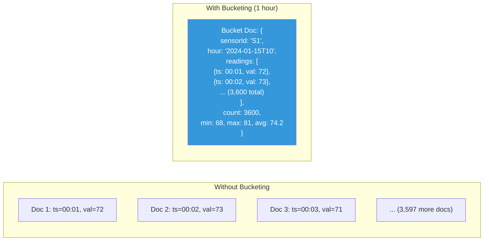
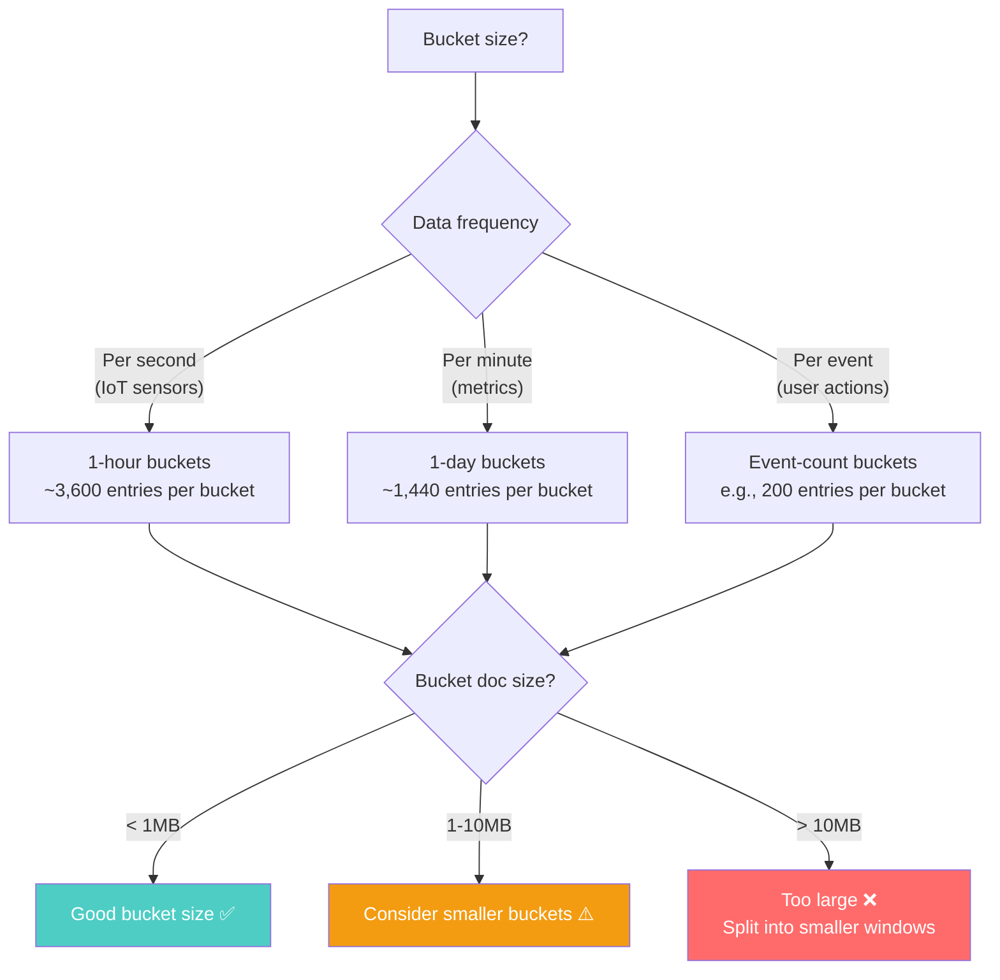

# The Bucket Pattern — Grouping Data for Efficiency

---

## The Problem

You're storing IoT sensor readings. One sensor sends a reading every second. That's 86,400 documents per sensor per day — 2.6 million per month. With 10,000 sensors, you have **26 billion documents per month**.

Each document:
```typescript
interface SensorReading {
  _id: ObjectId;
  sensorId: string;
  timestamp: Date;
  value: number;
}
// ~100 bytes per document
// + 16 bytes _id index entry
// + ~50 bytes overhead
// ≈ 166 bytes per reading
```

At 26B documents: ~4TB of data plus ~400GB of index. Every time you query "last hour of readings for sensor X," MongoDB scans 3,600 individual documents.

---

## The Solution: Bucketing

Instead of one document per reading, group readings into **buckets** — fixed-size containers that hold multiple related data points.



### The Bucketed Schema

```typescript
interface SensorBucket {
  _id: string;                  // "sensor-001_2024-01-15T10" — predictable ID
  sensorId: string;
  bucketStart: Date;            // Start of the hour
  bucketEnd: Date;              // End of the hour
  readings: {
    timestamp: Date;
    value: number;
  }[];
  count: number;                // How many readings in this bucket
  // Pre-computed aggregates
  stats: {
    min: number;
    max: number;
    sum: number;
    avg: number;
  };
}
```

### Writing to Buckets

```typescript
async function addReading(
  db: Db,
  sensorId: string,
  timestamp: Date,
  value: number
): Promise<void> {
  // Round to the hour to compute bucket ID
  const hour = new Date(timestamp);
  hour.setMinutes(0, 0, 0);
  const bucketId = `${sensorId}_${hour.toISOString()}`;

  await db.collection('sensor_buckets').updateOne(
    { _id: bucketId },
    {
      $push: { readings: { timestamp, value } },
      $inc: { count: 1, 'stats.sum': value },
      $min: { 'stats.min': value },
      $max: { 'stats.max': value },
      $setOnInsert: {
        sensorId,
        bucketStart: hour,
        bucketEnd: new Date(hour.getTime() + 3600000),
      },
    },
    { upsert: true }
  );

  // Update average (requires a second operation or compute on read)
  // Alternative: compute avg from sum/count on read
}
```

### Go — Bucket Writer

```go
func AddReading(ctx context.Context, col *mongo.Collection, sensorID string, ts time.Time, value float64) error {
	hour := ts.Truncate(time.Hour)
	bucketID := fmt.Sprintf("%s_%s", sensorID, hour.Format(time.RFC3339))

	_, err := col.UpdateOne(ctx,
		bson.M{"_id": bucketID},
		bson.M{
			"$push": bson.M{"readings": bson.M{"timestamp": ts, "value": value}},
			"$inc":  bson.M{"count": 1, "stats.sum": value},
			"$min":  bson.M{"stats.min": value},
			"$max":  bson.M{"stats.max": value},
			"$setOnInsert": bson.M{
				"sensorId":    sensorID,
				"bucketStart": hour,
				"bucketEnd":   hour.Add(time.Hour),
			},
		},
		options.Update().SetUpsert(true),
	)
	return err
}
```

---

## The Numbers

| Metric | Per-Document | Bucketed (1 hour) | Improvement |
|--------|-------------|-------------------|-------------|
| Documents per sensor/day | 86,400 | 24 | 3,600x fewer |
| Index entries per sensor/day | 86,400 | 24 | 3,600x fewer |
| Storage per sensor/day | ~14MB | ~4MB | ~3.5x less |
| Queries for "last hour" | Scan 3,600 docs | Read 1 doc | 3,600x fewer I/Os |
| Pre-computed aggregates | Compute on 3,600 docs | Already stored | Near-instant |

---

## Choosing Bucket Size



**Guidelines**:
- Keep bucket documents under **1MB** for optimal performance
- Target **100-5,000 entries** per bucket
- Align bucket boundaries with natural query patterns (hourly, daily)
- In Cassandra, keep partitions under **100MB** (wide partitions are slow to read)

---

## Bucket Pattern in Cassandra

Cassandra uses partition keys as natural buckets:

```sql
-- Bucket = (sensor_id, date) partition
CREATE TABLE sensor_readings (
    sensor_id TEXT,
    reading_date DATE,           -- 1-day bucket boundary
    reading_ts TIMESTAMP,
    value DOUBLE,
    PRIMARY KEY ((sensor_id, reading_date), reading_ts)
) WITH CLUSTERING ORDER BY (reading_ts DESC);

-- Query: last hour of readings
-- Hits a single partition, pre-sorted by timestamp
SELECT * FROM sensor_readings
WHERE sensor_id = 'S1' AND reading_date = '2024-01-15'
  AND reading_ts >= '2024-01-15T09:00:00'
  AND reading_ts < '2024-01-15T10:00:00';
```

Here, the bucket is implicit — the `(sensor_id, reading_date)` partition key groups one day's readings together.

---

## Pre-Computed Aggregates

The bucket pattern's real power: compute statistics at write time.

```typescript
interface HourlyStats {
  _id: string;                // "sensor-001_2024-01-15T10"
  sensorId: string;
  hour: Date;
  min: number;
  max: number;
  avg: number;
  count: number;
  p95: number;
  p99: number;
}
```

Instead of running `$group` aggregation on 86,400 documents to get daily stats, you query 24 pre-computed hourly summaries. Instead of scanning 2.6M documents for monthly stats, you query 720 hourly summaries.

```typescript
// Dashboard: "Show hourly min/max/avg for this sensor this week"
async function getWeeklyHourlyStats(db: Db, sensorId: string): Promise<HourlyStats[]> {
  const weekAgo = new Date(Date.now() - 7 * 24 * 60 * 60 * 1000);
  return db.collection<HourlyStats>('sensor_hourly_stats')
    .find({
      sensorId,
      hour: { $gte: weekAgo },
    })
    .sort({ hour: 1 })
    .toArray();
  // Returns 168 documents (7 days × 24 hours) — instant
}
```

---

## When to Use the Bucket Pattern

| Use Case | Bucket By | Bucket Size |
|----------|-----------|-------------|
| IoT sensor data | Time (hourly) | 3,600 readings |
| Application logs | Time (10 min) | ~1,000 log entries |
| User activity/events | Count (200 per bucket) | 200 events |
| Stock tick data | Time (1 min) | ~60 ticks per bucket |
| Chat messages | Time (daily per conversation) | Variable |

---

## Anti-Pattern: Unbounded Buckets

```typescript
// ❌ Chat messages bucketed per conversation (no time bound)
interface ConversationBucket {
  _id: string;
  conversationId: string;
  messages: Message[];  // Grows forever! 
                         // A 5-year conversation = millions of messages
                         // Document exceeds 16MB limit
}

// ✅ Chat messages bucketed per conversation per day
interface ConversationDayBucket {
  _id: string;          // "conv-123_2024-01-15"
  conversationId: string;
  date: Date;
  messages: Message[];  // Bounded: ~100-1000 messages per day
}
```

---

## Next

→ [04-time-series-patterns.md](./04-time-series-patterns.md) — Specialized patterns for time-series data: TTL, roll-ups, downsampling, and hot/cold storage.
